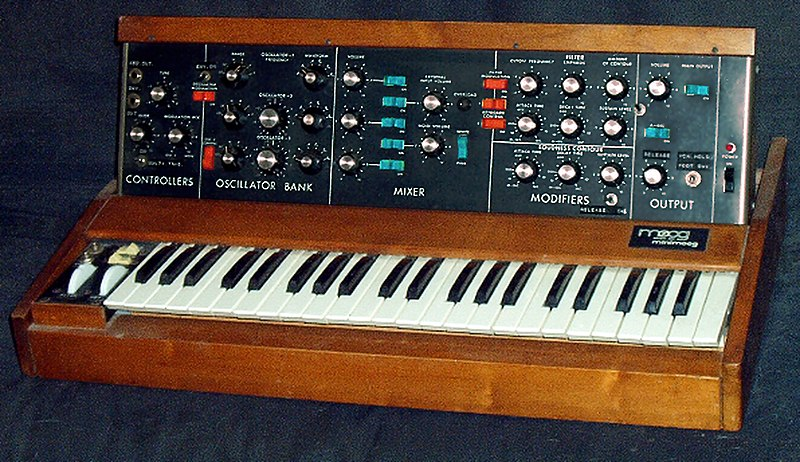

# Introduction

## Why this book?

Let's start with why I'm writing it.
<!-- that may help justify why you might want to read it.  -->
I got into electronic music in the 1990s when I lived in London but never transitioned from DJing to making music, though several of my friends did. 
A few years ago, they started talking about modular, and in talking to them and trying to find out more about it, I realized a few things:

- The best books (to me) were from the 1970s and 1980s^[Old books that I like are @Crombie1982 and @Strange1983. Newer books of note are @Bjoern2018, which gives a great overview of module hardware and history, @Eliraz2022, which gives a broader overview of issues related to musical equipment and production, and @Dusha2020, which gives a modern but briefer introduction to modular than the older books. There are also some online courses (paid), but since I haven't taken them, I'm not listing them here.]
- Modular synthesis is really well aligned with *computational thinking* 

If you've never heard of computational thinking and/or modular, that last point won't make a lot of sense, so let's break it down.

Modular sound synthesis (modular) creates sound by connecting modules that each perform some function on sound.
Different sounds are created by combining modules in different ways.

Computational thinking creates runnable models to solve a problem or answer a question. 
Models can be scientific models (e.g. meteorology), statistical models (e.g. statistics/data science), computation models (computer science), and perhaps other kinds of models.

How are they connected? 
Modular involves computational thinking when we:

- Simulate an instrument by reverse engineering its sound
- Create new sounds based on models of signal processing

**Why should you read this book?**
This book is about modular, but it approaches modular in a way that highlights computational thinking. 
I believe this deeper approach to modular will help you do more with modular, other synthesizers, and studio production tools.
Additionally, the computational thinking approach should help accelerate your learning of computational-thinking domains in the future.
Since computational thinking involves problem solving, this book is full of interactive activities that will let you hone your modular skills - something you won't find in most books!

The next sections give some background on computational thinking and modular to better explain where this book is coming from.
<!-- Don't worry if this doesn't make a lot of sense yet. -->

## Computational thinking

@Tedre2016 present a nice overview of the history of computational thinking.
Here's a brief summary.

When the field of computing was taking off in the 1950s, there was interest and discussion about how it was different from other fields (e.g. math).
One argument was that computing involved *algorithmic thinking*, which is designing algorithms to solve problems (cf. programming), and this kind of thinking was unique to computing.
Some even thought that this kind of thinking could improve thinking generally.

*Computational thinking* appears to have been coined in the 1980s by Seymour Papert and popularized in his book *Mindstorms* [@Papert1980].
Papert was a mathematician by training, and his approach was much broader than the algorithmic thinking approach that came before.
Papert's approach was empirical and embraced model building, which he implemented using simulated microworlds containing robots (LEGO Mindstorms takes its name from this work).
It was revolutionary in its time and received a lot of attention from educators and policy makers of widely different backgrounds.

Unfortunately, today it's very hard to get agreement on what computational thinking is, so definitions tend to be squishy.
This is likely due to the widespread use of computers and the tendency for everyone to frame computational thinking in terms of what *they* do with computers. 
Some want to reduce it to computer literacy, others to basic programming, and yet others to discovery learning with computers, etc.

I take a more unified view of computational thinking based on model building and problem solving. 
I define computational thinking as building a *runnable* model to solve a problem:

- For an algorithmic problem, this is a [model of computation](https://en.wikipedia.org/wiki/Model_of_computation) (the original computer science view)
- For data science/statistics, this is a [statistical model](https://en.wikipedia.org/wiki/Statistical_model)
- For general scientific fields, this is a [scientific model](https://en.wikipedia.org/wiki/Scientific_modelling) of a phenomenon or process

The model doesn't need to run on a computer, but to be a runnable model, it needs to be mechanistic.
One of my favorite examples of a non-computer model is MENACE [@Michie1963], which plays tic-tac-toe (AKA noughts and crosses).
MENACE plays tic-tac-toe using matchboxes full of colored beads as shown in Figure \@ref(fig:menace).
Each possible board position (starting with a blank board) is represented by a matchbox, and each move is represented by one of nine colored beads.
To make a move, a human assistant selects the correct box for the current board position and randomly samples a colored bead, which determines where MENACE makes its move.
If MENACE wins the game, the chosen bead from each box is replaced along with extra beads of the same color, and if MENACE loses, the chosen bead is removed.
Over time, these bead adjustments make winning moves more likely and losing moves less likely.

(ref:menace) Machine Educable Noughts and Crosses Engine (MENACE). Each matchbox corresponds to a possible board position and is full of colored beads corresponding to moves. The color key in the foreground shows the board location indicated by each colored bead. Image [© Matthew Scroggs/CC-BY-SA-4.0](https://commons.wikimedia.org/wiki/File:Mscroggs-MENACE-cropped.jpg).

<!-- See credit line guidance https://commons.wikimedia.org/wiki/Commons:Credit_line -->

```{r menace, echo=F, out.width="100%", fig.cap="(ref:menace)"}
 knitr::include_graphics("images/800px-Mscroggs-MENACE-cropped.jpg")
```

MENACE is a nice example of computational thinking without computers because algorithmic game playing has a long history in computer science and AI.
However MENACE is not "an exception to the rule" - teaching computer science without computers has been part of the model curriculum for almost 20 years [@Tucker2003;@Bell2021].
We really don't need computers for computational thinking!

So how do we *learn* to build runnable models to solve problems (i.e., how do we learn computational thinking)?
Well, models are made of interacting elements, so we need to learn those elements, and we need to learn how the elements interact.

Once we know those things, we can customize general problem solving, which has the same basic steps [@Polya2004]:

- Understand the problem
- Make a plan
- Implement the plan
- Evaluate the solution

For any new domain, the big things to learn are the "understand the problem" and the "make a plan" steps of problem solving.
That's the approach of this book - for the domain of modular synthesis.

## Modular synthesis

<!-- <iframe width="560" height="315" src="https://www.youtube.com/embed/aseMAEctM1s?start=21" title="YouTube video player" frameborder="0" allow="accelerometer; autoplay; clipboard-write; encrypted-media; gyroscope; picture-in-picture" ></iframe> -->

While we can pinpoint the invention of modular synthesis with some precision, it is useful to consider it in a broader context.
This section briefly overviews the history of synthesis and how modular fits into it.

Humans have long been interested in musical instruments that incorporate automation or in reproducing sounds by mechanical means.
Wind chimes, which play a series of notes when disturbed by wind, appeared in the historical record thousands of years ago. 
Even before the complete electrification of instruments (synthesizers are electric by definition), there were numerous attempts to partially automate or model sounds, such as barrel organs, player pianos, or speech synthesis using bellows [@Dudley1950] as shown in Figure \@ref(fig:kemplen-machine).

(ref:kemplen-machine) [YouTube video](https://youtu.be/k_YUB_S6Gpo?start=21) of Wolfgang von Kempelen's speaking machine circa 1780. Image [© Fabian Brackhane](https://www.youtube.com/user/Quintatoen).

```{r kemplen-machine, fig.cap="(ref:kemplen-machine)", echo = F}
embed_youtube("k_YUB_S6Gpo",78)
```

Consider the difference between wind chimes or a player piano and this speaking machine.
Neither of the former is a model of the sound but rather uses mechanical means to trigger the sound (later we will refer to this as sequencing).
In contrast, the speaking machine is a well-considered model of the human speech mechanism.

Synthesizers using electricity appeared in the late 19th century.^[There is some difference of opinion on what qualifies as usage of electricity in this context. For a fuller history of synthesizers, see https://120years.net/wordpress/]
Patents were awarded just a few years apart to Elisha Gray, whose synthesizer comprised simple single note oscillators and transmitted over the telegraph, and Thaddeus Cahill, whose larger Telharmonium could sound like an organ or various wood instruments but weighed 210 tons!

The modular synthesizer was developed by Harald Bode from 1959-1960 [@Bode1984], and this innovation quickly spread to other electronic music pioneers like Moog and Buchla.
The key idea of modular is flexibility. 
This is achieved by refactoring aspects of synthesis (i.e. functions on sound) into a collection of modules.
These modules may then be combined to create a certain sound by patching them together and adjusting module parameters (e.g. by turning knobs or adjusting sliders).
An example modular synthesizer is shown in Figure \@ref(fig:serge-modular).

(ref:serge-modular) A Serge modular system based on a 1970s design. Each module is labeled at the top edge, e.g. "Wave Multiplier," and extends down to the bottom edge in a column. Note that although the modules have the same height, they have different widths. Image [© mikael altemark/CC-BY-2.0](https://commons.wikimedia.org/wiki/File:Serge_Modular,_Norbergfestival_2007.jpg).

<!-- See credit line guidance https://commons.wikimedia.org/wiki/Commons:Credit_line -->

```{r serge-modular, echo=F, out.width="100%", fig.cap="(ref:serge-modular)"}
 knitr::include_graphics("images/Serge_Modular,_Norbergfestival_2007_cropped.jpg")
```

In the 1970s, *semi-modular* synthesizers were developed that did not require patching to make a sound.
Instead, semi-modulars were pre-set with an invisible default patch, meaning that the default patch wiring was internal and not visible to the user.
Users could then override this default patch by plugging in patch cables.
Most semi-modulars from this period also included an integrated keyboard.
Arguably, theses changes made semi-modulars more approachable to typical musicians.
An example semi-modular synthesizer is shown in Figure \@ref(fig:semi-modular).

(ref:semi-modular) A Minimoog semi-modular system from the 1970s. Patch points are primarily on the top edge and hidden from view. Image [public domain](https://commons.wikimedia.org/wiki/File:Minimoog.JPG).

```{r semi-modular, echo=F, out.width="100%", fig.cap="(ref:semi-modular)"}
 
```

Digital technology began replacing the analog technology of synthesizers in the 1980s.
As a result, synthesizers got smaller and cheaper.
<!-- Since the patches used by modular synthesizers are fundamentally analog, modular synthesizers of this time tended to be all-analog. -->
Digital synthesizers made increasing use of preset sounds so that most users never needed to create custom sounds.
In comparison to digital synthesizers, modular synthesizers were more expensive and harder to use.
An example digital synthesizer is shown in Figure \@ref(fig:dx7).

(ref:dx7) A Yamaha DX7 from the 1980s. Note the menu-based interface and relative lack of controls compared to modular and semi-modular synthesizers. Image [public domain](https://commons.wikimedia.org/wiki/File:YAMAHA_DX7.jpg).

```{r dx7, echo=F, out.width="100%", fig.cap="(ref:dx7)"}
 
```

By the 1990s the digital transformation was complete, such that computers could be used to create and produce music in software.
Although computers were still relatively expensive at this time, they provided an all-in-one solution that included editing, mixing, and other production aspects.
Over the next few decades as personal computers and portable computing devices became common household items, the costs associated with computer-based music making became dominated by the cost of software and associated audio and [MIDI](https://en.wikipedia.org/wiki/MIDI) interfaces.
Figure \@ref(fig:logic) shows digital audio workstation (DAW) software commonly used in music production.

(ref:logic) Logic Pro digital audio workstation software. Additional functionality is provided by 3rd-party plugins showing as additional windows on the screen. In the foreground are an audio interface and a MIDI keyboard used for recording/playing audio and entering note information respectively. Image [© Musicianonamission/CC-BY-SA-4.0](https://commons.wikimedia.org/wiki/File:Logic_PRO_X_Tutorial.png).


```{r logic, echo=F, out.width="100%", fig.cap="(ref:logic)"}
 
```

The computer-centric approach dominated synthesis for a decade or more, but by the 2010s, improved electronics manufacturing, smartphone technology, and the open-source movement led to lower cost modular synthesizers.
Additionally, the Eurorack standard [@DoepferMusikelektronik2022;@DoepferMusikelektronik2022a] was widely adopted, leading to +10,000 interoperable modules.^[https://www.modulargrid.net/]
As a result, modular synthesis saw a resurgence in popularity.
Figure \@ref(fig:eurorack) shows a Eurorack modular synthesizer.

(ref:eurorack) A Eurorack modular synthesizer. The different modules designs and logos reflect the adoption of the Eurorack standard which makes modules from different manufacturers interoperable. Image [© Paul Anthony/CC-BY-SA-4.0](https://commons.wikimedia.org/wiki/File:Eurorack_Modular_Synthesizer.jpg).


```{r eurorack, echo=F, out.width="100%", fig.cap="(ref:eurorack)"}
 knitr::include_graphics("images/Eurorack_Modular_Synthesizer-cropped.jpg")
```

It is perhaps surprising that some 60 years after its creation, modular synthesis is more popular than ever.
One possible reason is the reduction in price over time, shown in Table \@ref(tab:price).
However, other trends seem to be at work.
While the modular synthesizer was simplified for wider adoption early in its history, first with semi-modular and later with digital synthesizers, the culmination of this trend led to large preset and sample banks that transformed the task of creating a specific sound to searching for a pre-made sound.
It's plausible that as the search for sounds became more intensive, the time savings of presets diminished, making the modular approach more attractive.
An intersecting trend is a commonly-expressed dissatisfaction with using computers for every aspect of music making and a corresponding return to hardware instruments, including modular.

Table: (\#tab:price) The cost of modular, semi-modular, and computer synthesizers over time. Prices are in 2022 dollars.

| Decade | Synthesizer                  | Cost |
|--------|------------------------------|----------------------|
| 1960s  | Moog modular synthesiser     | $96,000              |
| 1970s  | Minimoog semi-modular        | $10,000              |
| 1980s  | Yamaha DX7                   | $6,000               |
| 1990s  | Gateway computer with Cubase | $8,000               |
| 2010s  | ALM System Coupe modular     | $2,400               |
| ...    | VCVRack virtual modular      | Free                 |

Earlier in this chapter, I argued that a computational thinking approach to modular could help with other synthesizers and studio production tools.
Hopefully this brief history helps explain why: modular represents the building blocks of synthesis that later approaches have appropriated and presented in their own way.
A square wave oscillator in modular is fundamentally the same as that in another hardware synth or DAW software. 
If you understand these building blocks in modular, you should understand them everywhere.


