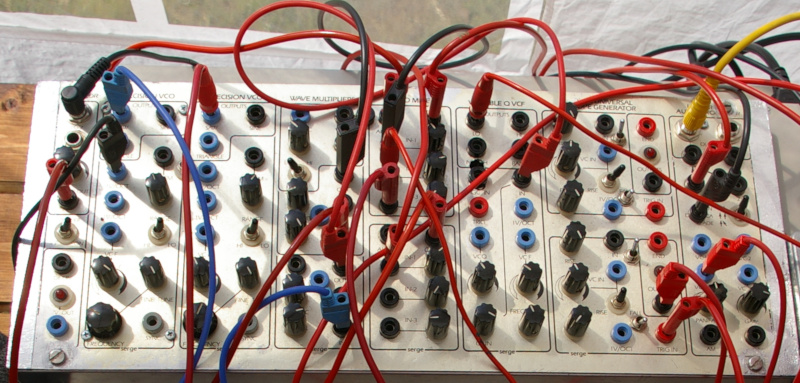
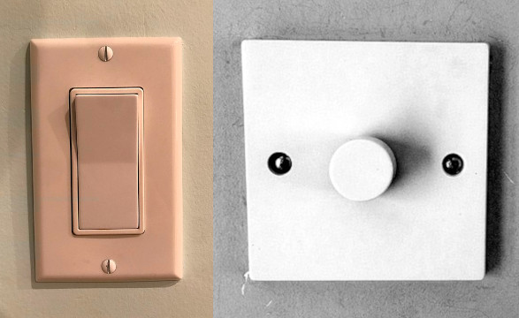
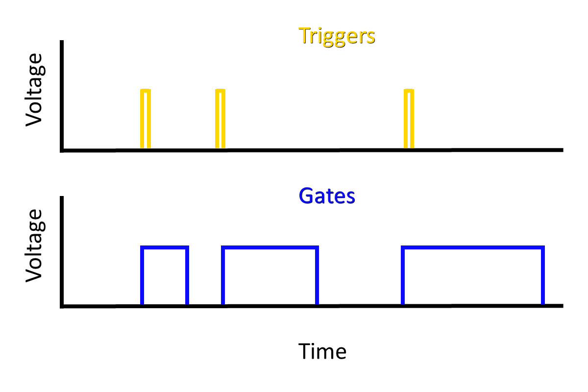
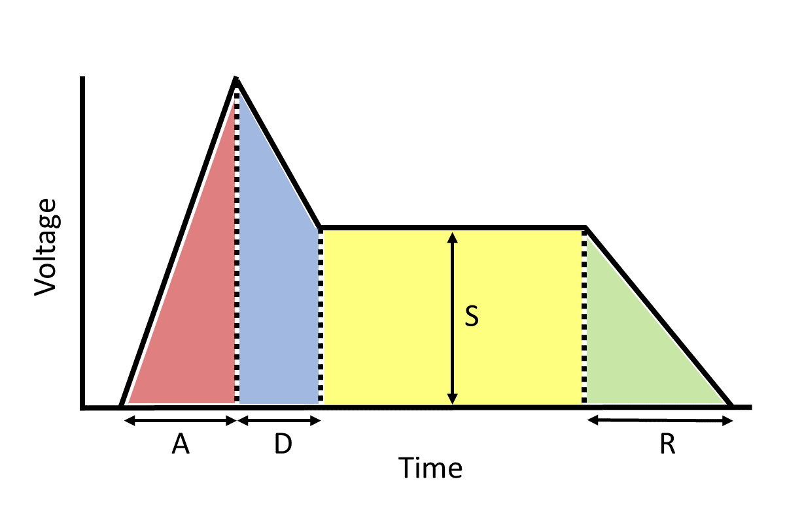
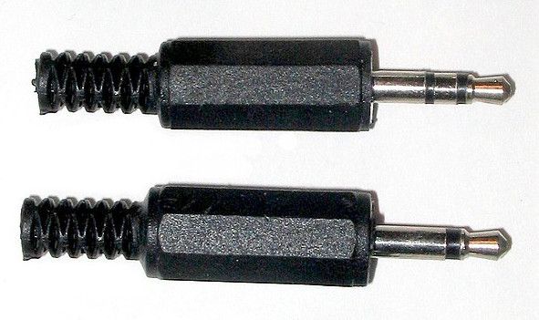
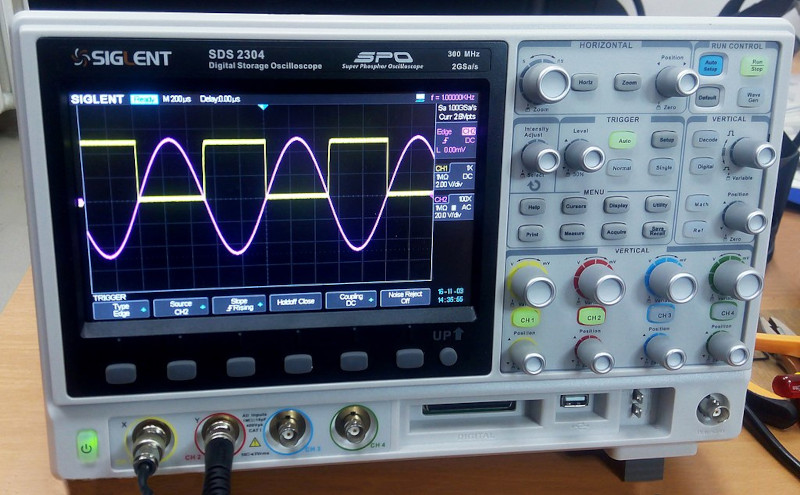

# (PART) Fundamental Techniques {-}

# Basic Modeling Concepts

Chapters \@ref(physics-and-perception-of-sound) and \@ref(harmonic-and-inharmonic-sounds) focused on the "understand the problem" stage of problem solving, and they introduced both the basic concepts and terminology of modeling sound.
The present chapter pivots to the make/implement a plan stages of problem solving by introducing the model elements and how they interact.
Since we are building models for modular synthesis, the model elements are the modules, and their interactions are driven by how they are connected together in a patch.
Figure \@ref(fig:serge-modular-2) shows an example patch on a real modular synthesizer from Chapter \@ref(introduction).

(ref:serge-modular-2) A Serge modular system based on a 1970s design. Each module is labeled at the top edge, e.g. `Wave Multiplier`, and extends down to the bottom edge in a column. Note that although the modules have the same height, they have different widths. Image [© mikael altemark/CC-BY-2.0](https://commons.wikimedia.org/wiki/File:Serge_Modular,_Norbergfestival_2007.jpg).

```{r serge-modular-2, echo=F, out.width="100%", fig.cap="(ref:serge-modular-2)"}
# current <- knitr::opts_current$get()
# options = knitr::opts_chunk$get()
# browser()

```

Here and throughout the book, we will use open source modular software called VCVRack [@VCVRack2022] that has been ported to the web [@Cardinal2022].
This version is integrated with the the web version of the book so you can read about modular and solve sound design problems within the same environment.
VCVRack is widely used in practice and has emulations of many hardware modules, so any details you learn about specific modules here could be useful down the road. 

## Modules are the model elements

The universe of modules is rather vast, which can make learning about modules overwhelming.
For example, [ModularGrid](https://www.modulargrid.net/) lists over 10,000 modules and classifies them according to 56 categories based on their function.
While those 56 categories are certainly real and useful, you can get the main idea with only three categories: controllers, generators, and modifiers.
You might think of these as "categories of categories."

**Controllers** initiate musical events.
An example controller is a module that waits for key presses and, on receiving them, sends a signal to initiate a musical event.
Another example is a sequencer, which you can think of as way of emulating timed key presses to initiate musical events.

**Generators** create audible sound.
An example generator is an oscillator that generates one or more of the four basic waveshapes discussed in Section \@ref(waveshape-and-timbre).
Another example is a noise generator that generates one or more colors of noise described in Section \@ref(inharmonic-standing-waves-and-noise).

**Modifiers** modify incoming signals that may be either audio or some kind of control signal.
An example audio modifier is a reverb, which adds diffuse echoes to sound, giving it the feel of being played in a room.
An example control signal modifier is an envelope, which we can use to control the amplitude of a sound over time, as discussed in Section \@ref(dynamics-and-envelopes).

## Signals are how the  model elements interact

Modules interact with each other through signals sent via patch cables.
Starting with the signals, we can broadly separate them into two types: audio and control signals.
Audio signals are a voltage representation of sound.
Recall that sound is a pressure wave with high and low phases of pressure.
It's perhaps not surprising that audio signals use corresponding positive and negative voltage to represent a sound wave.
This kind of voltage is [AC voltage](https://en.wikipedia.org/wiki/Alternating_current#Mathematics_of_AC_voltages). 
Anytime a signal is bipolar, i.e. it crosses zero, you can assume the voltage is AC.

Control signals represent everything besides audio.
Unlike audio signals, control signals are unipolar voltage representations, i.e. they don't cross zero, and thus use [DC voltage](https://en.wikipedia.org/wiki/Direct_current#Various_definitions).^[Under this definition, low frequency oscillators are audio signals, not control signals.]
There are two main types of control signals in modular synthesis.
Both of these can be understood in terms of light switches as shown in Figure \@ref(fig:light-switches).
Regular light switches are either on or off.
In terms of voltage, they are either at minimum voltage or maximum voltage.
Dimmer switches in contrast can smoothly adjust voltage between their minimum and maximum.

(ref:light-switches) On/off light switch (left) and dimmer light switch (right). While on/off switches can only be at minimum or maximum voltage, dimmer switches can be at all voltages in between. Images [© DemonDays64/CC-BY-4.0](https://commons.wikimedia.org/wiki/File:Rocker_light_switch.jpg) and [© Paolomarco/CC-BY-4.0](https://commons.wikimedia.org/wiki/File:Dimmer_Light_Switch.jpg).

```{r light-switches, echo=F, out.width="100%", fig.cap="(ref:light-switches)"}
 
```

On/off signals are either gates or triggers, as shown in Figure \@ref(fig:trigger-gate).
Both triggers and gates are rectangular pulses that control a musical event.
The difference is that triggers are used to start musical events, but gates are used to both start and end musical events.
That's why triggers have the same length, but the length of gates varies by the end time of the musical event.
As a result, we can use a trigger to model a drum hit, but we need a gate to model holding down a key on keyboard.

(ref:trigger-gate) Triggers and gates shown over time. Both are on/off unipolar voltages that show as rectangular pulses. Only gates have variable duration.

```{r trigger-gate, echo=F, out.width="100%", fig.cap="(ref:trigger-gate)"}
 
```

Envelopes are a great example of a continuous control voltage.
As discussed in Section \@ref(dynamics-and-envelopes), envelopes can be used to control the amplitude of a sound wave and thus its loudness.
We can represent an envelope in control voltage (y-axis) as shown in Figure \@ref(fig:voltage-adsr).
This envelope example illustrates how flexible control voltage can be - any voltage level or shape over time is possible.

(ref:voltage-adsr) An example Attack-Decay-Sustain-Release (ADSR) envelope represented as control voltage.

```{r voltage-adsr, echo=F, out.width="100%", fig.cap="(ref:voltage-adsr)"}
 
```

In the Eurorack modular format, signal voltages typically span 10 volts.
This is much move voltage than common audio devices, so connecting modular gear to standard audio equipment requires some care.
Table \@ref(tab:voltage) presents the voltage levels for modular signals in Eurorack, together with common audio signals for reference.

Table: (\#tab:voltage) The voltage ranges for Eurorack modular signals compared with standard audio equipment.

| Modular signals           | Voltage range | Common audio signals |  Voltage range |
|---------------------------|:-------------:|----------------------|:--------------:|
| Audio signal              |    -5 to +5   | Pro audio level      |  -1.7 to +1.7  |
| Continuous control signal^[Can be inverted] |    0 to 10    | Line audio level     |  -.45 to +.45  |
| On/off control signal     |     0 to 5    | Instrument level     |  -.02 to +.02  |
|                           |               | Microphone level     | -.005 to +.005 |

Modular signals are transmitted by patch cables.^[The Eurorack standard does allow for signals to be [transmitted using a bus on the in-case ribbon cable](https://doepfer.de/a100_man/a100t_e.htm), but few modules support this. Likewise there are other bus conventions that are not widely followed like [i2c](https://en.wikipedia.org/wiki/I%C2%B2C). Often if two modules are connected behind the panel, one is an expansion module that adds additional connections or capabilities to the other.]
Patch cables are primarily mono but sometimes stereo if a jack supports it.
These two patch cable types look identical, except at their connectors, as shown in Figure \@ref(fig:ts-trs).
Stereo patch cables are TRS (tip-ring-sleeve), whereas mono patch cables are TS (tip-sleeve).

(ref:ts-trs) Stereo (upper) and mono (lower) patch cable connectors. Both have a tip and sleeve conductor, but stereo has an additional "ring" conductor to carry a second audio channel. Image [public domain](https://commons.wikimedia.org/wiki/File:Photo-audiojacks.jpg).

```{r ts-trs, echo=F, out.width="100%", fig.cap="(ref:ts-trs)"}
 
```

## Signals are interpreted by modules

One of the most powerful aspects of modular synthesis is the variety of ways that modules can be connected together.
You can often send an unusual signal to a module, and that module will still respond.
However, its also possible to send a signal to a module and for nothing to happen.
The reason for this is that modules expect a certain type of signal at each input jack, and they will interpret signals they receive according to these expectations.

Take gates and triggers for example.
What makes a gate a gate and a trigger a trigger?
As we said above, gates have a variable duration, but that doesn't prevent them from being used as triggers.
Modules that receive triggers listen for the leading edge of the rectangular pulse and then stop listening.
So a module expecting a trigger will be satisfied with a gate.
If the trigger is wide enough, it might also satisfy a module expecting a gate, because that module will listen for the trailing edge of the rectangular pulse to mark the end of a gate.
We probably wouldn't want to do this in practice because we wouldn't be able to change the length of the musical event, but you get the idea.

Modular signals are also somewhat interchangeable between audio signals and control signals.
Recall that human hearing is sensitive to frequencies between 20 Hz and 20 kHz.
So if we generated a train of rectangular gate pulses in this frequency range, we are generating the same shape as audio, and we can listen to our gates as a pulse wave.
Similarly, if we generate envelopes repeatedly at an audible frequency, our envelope becomes a waveshape, and we will hear a sound based on the shape of the envelope.
However, in other cases you might hear nothing!
This is because jacks that expect audio are [AC-coupled](https://en.wikipedia.org/wiki/Capacitive_coupling#Use_in_analog_circuits), which removes low frequency signals, noise, and offset bias that would interfere with sound quality.

One signal that deserves special mention is volt per octave (V/Oct).
This signal used to tell oscillators and other generators what pitch they should play.
The V/Oct standard was [pioneered by Moog](https://en.wikipedia.org/wiki/CV/gate#CV) and is widely used in the Eurorack format.
Note that V/Oct goes straight from the voltage representation to pitch perception, with no mention of frequency.
This makes it easy for musicians: since each volt represents an octave, it is easy to play a note one octave above the current note by adding one volt to the current signal.
Similarly, one semitone above a note corresponds to 1/12 of a volt above the current voltage.^[Western music divides the octave into 12 pitches called semitones based on a system called [twelve-tone equal temperment](https://en.wikipedia.org/wiki/Equal_temperament#Twelve-tone_equal_temperament).]
While just about any signal could be used,^[Typically unipolar signals are used for V/Oct.] continuous control signals are commonly used in order to access a range of pitches.

When signals don't work as expected, it can be hard to  figure out why.
One of the best tools you can use to diagnose problems is an oscilloscope.
Oscilloscopes display voltages over time, so they are great for displaying modular signals, including rapidly changing signals like audio.
A bench oscilloscope is shown in Figure \@ref(fig:oscilloscope), but several modular manufacturers have created compact oscilloscopes that fit into a case, and you can also use a software oscilloscope if you have a DC coupled audio interface.
Another great tool for diagnosing problems is the manual for the module in question. 
If the signal in the oscilloscope looks correct, then it's likely you have a misconception about the type of signal the module is expecting.

(ref:oscilloscope) A bench oscilloscope showing a sine wave and offset square wave simultaneously. Image [© Wild Pancake/CC-BY-4.0](https://commons.wikimedia.org/wiki/File:My_friend_oscilloscope.jpg).

```{r oscilloscope, echo=F, out.width="100%", fig.cap="(ref:oscilloscope)"}
 
```

## Pulling it all together

Let's put these ideas into practice with some basic patches!
As stated, we'll be using a web-ported version of VCVRack, which you can launch using buttons below.
The port currently has some quirks:

- It will not run on Safari because Safari does not support fixed-width SIMD.^[https://webassembly.org/roadmap/] That means it will not run on iOS at all per app store rules.^[https://developer.apple.com/app-store/review/guidelines/#2.5.6] ^[https://en.wikipedia.org/wiki/WebKit]
- It has a large download because it bundles modules. For best performance, you should use Firefox, which currently caches the files better than Chrome.^[https://github.com/DISTRHO/Cardinal/issues/287#issuecomment-1245929349]

In the following sections, we'll start with a patch and incrementally expand it to add more functionality.

### Drone

The most basic patch that makes a sound is a *drone* patch.
It's the most basic because it only has one real module, which is a *generator* to make the sound.
We'll use an oscillator for the generator and one extra module, an audio interface module, to connect the oscillator output to our speakers.
For this patch only, I'm going to demonstrate using the video in Figure \@ref(fig:drone-demo) to explain the user interface of the modular software.

(ref:drone-demo) [Youtube video](https://www.youtube.com/watch?v=EfIWUOgHmhM) describing the VCVRack/Cardinal interface and building a drone patch.

```{r drone-demo, fig.cap="(ref:drone-demo)", echo = F}
embed_youtube("EfIWUOgHmhM",2)
```

After you watch the demonstration, try to make the patch yourself using the button in Figure \@ref(fig:drone-vco-out).
When you press the button, you'll see an interface that also includes `Instructions`, `Solution`, and `Close` buttons.
These are self-explanatory, but in particular the `Close` button will return you to the book.

(ref:drone-vco-out) [Virtual modular](https://olney.ai/ct-modular-book/modular-for-pdf.html?starter=empty.vcv&solution=See+the+video+demonstration+in+the+book+%28open+video+in+separate+tab+as+needed&instructions=%3cul%3e%0a%3cli%3eUse+the+video+demonstration+as+a+guide+%28open+video+in+separate+tab+as+needed%29%3c%2fli%3e%0a%3cli%3eFor+each+wave+output%3cul%3e%0a%3cli%3eConnect+just+it+to+the+audio+inputs%3c%2fli%3e%0a%3cli%3eSweep+the+frequency+knob%3c%2fli%3e%0a%3cli%3eSweep+the+volume+knob%3c%2fli%3e%0a%3c%2ful%3e%0a%3c%2fli%3e%0a%3c%2ful%3e%0a) for making a drone patch.

<!-- MODAL HTML BLOCK -->
```{r echo=F, out.width="100%"}
modular_modal("drone-vco-out",starter_file="empty.vcv",instructions_html="<ul>
<li>Use the video demonstration as a guide (open video in separate tab as needed)</li>
<li>For each wave output<ul>
<li>Connect just it to the audio inputs</li>
<li>Sweep the frequency knob</li>
<li>Sweep the volume knob</li>
</ul>
</li>
</ul>
",solution_html="See the video demonstration in the book (open video in separate tab as needed")
```

<!-- CAPTION BLOCK -->
```{r drone-vco-out, echo=F, out.width="100%", fig.cap="(ref:drone-vco-out)"}
modular_caption()
```


### Using an oscilloscope

You can use an oscilloscope to see the wave produced by the oscillator.
The most important controls on an oscilloscope are the time and the gain.
You can think of the time as slowing the wave down enough so it just about stays still.
If you don't do this, most waves will just look like a blur because their frequencies are so high.
Gain, on the other hand, is useful if the wave has a low amplitude.
If you're expecting a wave and only see a line, you should try increasing the gain.
You can think of gain as zooming in on the wave.
Finally, oscilloscopes (scopes) don't change the signal at all.
So whatever you patch into them is copied exactly on their output jacks.
This makes it easy to put a scope in between other modules without changing the resulting sound.
Try adding a scope between the modules in the previous patch using the button in Figure \@ref(fig:drone-vco-scope-out).

(ref:drone-vco-scope-out) [Virtual modular](https://olney.ai/ct-modular-book/modular-for-pdf.html?starter=drone_vco-out.vcv&solution=%3cimg+class%3d%27rack-image%27+src%3d%27images%2fpatch-solutions%2fdrone-scope_vco-scope-out.png%27+style%3d%27height%3a+300px%3b+width%3a+auto%27%3e&instructions=%3cul%3e%0a%3cli%3eAdd+%e2%80%9cScope%e2%80%9d+between+VCO+and+Host+Audio%3c%2fli%3e%0a%3cli%3eConnect+VCO+wave+out+to+Scope+In%3c%2fli%3e%0a%3cli%3eConnect+Scope+out+to+Host+Audio%3c%2fli%3e%0a%3cli%3eFor+each+waveshape+try%3cul%3e%0a%3cli%3eAdjusting+time%3c%2fli%3e%0a%3cli%3eAdjusting+frequency%3c%2fli%3e%0a%3cli%3eAdjusting+gain%3c%2fli%3e%0a%3cli%3eChanging+the+waveshape%3c%2fli%3e%0a%3c%2ful%3e%0a%3c%2fli%3e%0a%3c%2ful%3e%0a%3cimg+class%3d%27rack-image%27+src%3d%27images%2fsolo-modules%2fscope-solo.png%27+style%3d%27height%3a+300px%3b+width%3a+auto%27%3e%0a) for making a drone patch with a scope.

<!-- MODAL HTML BLOCK -->
```{r echo=F, out.width="100%"}
modular_modal("drone-vco-scope-out", starter_file="drone_vco-out.vcv", instructions_html="<ul>
<li>Add “Scope” between VCO and Host Audio</li>
<li>Connect VCO wave out to Scope In</li>
<li>Connect Scope out to Host Audio</li>
<li>For each waveshape try<ul>
<li>Adjusting time</li>
<li>Adjusting frequency</li>
<li>Adjusting gain</li>
<li>Changing the waveshape</li>
</ul>
</li>
</ul>

",solution_html="")
```

<!-- CAPTION BLOCK -->
```{r drone-vco-scope-out, echo=F, out.width="100%", fig.cap="(ref:drone-vco-scope-out)"}
modular_caption()
```


### Controlling pitch

You're probably realized why the drone patch has its name - it just produces a constant pitch at a constant volume.
To make things more interesting, let's control the pitch that goes into the oscillator.
You'll need a *controller* for this.
Let's use the "Twelve-Key" (12 key), which has a miniature keyboard built into the module.
The output of the 12 key that we are interested in is the control voltage (CV) that outputs V/Oct.
If you connect that output to the V/Oct input of the VCO, the VCO will change its frequency every time a key is pressed.
This is analogous to precisely and instantly moving the frequency knob on the VCO.
Try adding the 12 key to the left of the VCO in the previous patch using the button in Figure \@ref(fig:drone-12key-vco-scope-out).

(ref:drone-12key-vco-scope-out) [Virtual modular](https://olney.ai/ct-modular-book/modular-for-pdf.html?starter=drone-scope_vco-scope-out.vcv&solution=%3cimg+class%3d%27rack-image%27+src%3d%27images%2fpatch-solutions%2fkey-drone_12key-vco-scope-out.png%27+style%3d%27height%3a+300px%3b+width%3a+auto%27%3e&instructions=%3cul%3e%0a%3cli%3eAdd+%e2%80%9cTwelve-key%e2%80%9d+to+the+left+of+the+VCO%3c%2fli%3e%0a%3cli%3eConnect+12+key+CV+output+to+VCO+V%2fOCT+input%3c%2fli%3e%0a%3cli%3eObserve+what+happens+when+you+click+different+keys+on+12+key%3cul%3e%0a%3cli%3eIn+terms+of+sound%3c%2fli%3e%0a%3cli%3eIn+terms+of+wave+on+scope%3c%2fli%3e%0a%3c%2ful%3e%0a%3c%2fli%3e%0a%3cli%3eChange+OCTAVE+on+12+key+and+repeat%3c%2fli%3e%0a%3c%2ful%3e%0a%3cp%3e%3cem%3eIf+you+don%26%2339%3bt+hear+sound%2c+check+if+your+frequency+is+below+20+kHz%3b+your+computer+speakers+may+not+produce+sound+below+100+kHz%3c%2fem%3e%3c%2fp%3e%0a%3cimg+class%3d%27rack-image%27+src%3d%27images%2fsolo-modules%2f12key-solo.png%27+style%3d%27height%3a+300px%3b+width%3a+auto%27%3e%0a) for making a single voice patch with a scope and keyboard control of pitch.

<!-- MODAL HTML BLOCK -->
```{r echo=F, out.width="100%"}
modular_modal("drone-12key-vco-scope-out", starter_file="drone-scope_vco-scope-out.vcv", instructions_html="<ul>
<li>Add “Twelve-key” to the left of the VCO</li>
<li>Connect 12 key CV output to VCO V/OCT input</li>
<li>Observe what happens when you click different keys on 12 key<ul>
<li>In terms of sound</li>
<li>In terms of wave on scope</li>
</ul>
</li>
<li>Change OCTAVE on 12 key and repeat</li>
</ul>
<p><em>If you don&#39;t hear sound, check if your frequency is below 20 kHz; your computer speakers may not produce sound below 100 kHz</em></p>

",solution_html="")
```

<!-- CAPTION BLOCK -->
```{r drone-12key-vco-scope-out, echo=F, out.width="100%", fig.cap="(ref:drone-12key-vco-scope-out)"}
modular_caption()
```

### Controlling note duration (on/off volume)

In the last patch, pressing a key changed the pitch, but the note continued until the next key was pressed.
You can control note duration independently of pitch using a voltage controlled amplifier (VCA).
Just like you can control the frequency of the VCO by sending it control voltage, you can change the amplitude of a VCA by sending it control voltage.
The control voltage we'll use is the gate output of the 12 key.
That way, each time a key is pressed, two control voltages will be sent out at the same time: a V/Oct to control pitch and a gate to control note duration.
The VCA will "open" and let the full amplitude of the wave through when the gate voltage is high, and the VCA will "close" and let nothing through when the gate voltage is zero.
Try adding a VCA between the VCO and Scope modules using the button in Figure \@ref(fig:drone-12key-vco-vca-scope-out).

(ref:drone-12key-vco-vca-scope-out) [Virtual modular](https://olney.ai/ct-modular-book/modular-for-pdf.html?starter=key-drone_12key-vco-scope-out.vcv&solution=%3cimg+class%3d%27rack-image%27+src%3d%27images%2fpatch-solutions%2fkey-note_12key-vco-vca-scope-out.png%27+style%3d%27height%3a+300px%3b+width%3a+auto%27%3e&instructions=%3cul%3e%0a%3cli%3eAdd+VCA+between+VCO+and+Scope+modules%3c%2fli%3e%0a%3cli%3eConnect+VCO+wave+to+VCA+In%3c%2fli%3e%0a%3cli%3eConnect+12+key+GATE+output+to+VCA+CV+IN%3c%2fli%3e%0a%3cli%3eConnect+VCA+OUT+to+Scope+IN%3c%2fli%3e%0a%3cli%3eWhat+happens+when+you+click+different+keys+on+12+key%3cul%3e%0a%3cli%3eIn+terms+of+sound%3c%2fli%3e%0a%3cli%3eIn+terms+of+wave+on+scope%3c%2fli%3e%0a%3c%2ful%3e%0a%3c%2fli%3e%0a%3cli%3eTry+holding+down+key+instead+of+short+pressing+it+and+repeat%3c%2fli%3e%0a%3c%2ful%3e%0a%3cimg+class%3d%27rack-image%27+src%3d%27images%2fsolo-modules%2fvca-solo.png%27+style%3d%27height%3a+300px%3b+width%3a+auto%27%3e%0a) for making a single voice patch with a scope and keyboard control of pitch and note duration.

<!-- MODAL HTML BLOCK -->
```{r echo=F, out.width="100%"}
modular_modal("drone-12key-vco-vca-scope-out", starter_file="key-drone_12key-vco-scope-out.vcv", instructions_html="<ul>
<li>Add VCA between VCO and Scope modules</li>
<li>Connect VCO wave to VCA In</li>
<li>Connect 12 key GATE output to VCA CV IN</li>
<li>Connect VCA OUT to Scope IN</li>
<li>What happens when you click different keys on 12 key<ul>
<li>In terms of sound</li>
<li>In terms of wave on scope</li>
</ul>
</li>
<li>Try holding down key instead of short pressing it and repeat</li>
</ul>

",solution_html="")
```

<!-- CAPTION BLOCK -->
```{r drone-12key-vco-vca-scope-out, echo=F, out.width="100%", fig.cap="(ref:drone-12key-vco-vca-scope-out)"}
modular_caption()
```

### Controlling note dynamics (volume during note)

We can make the sound even more interesting by making the volume of the note change while the gate is active.
To do this, we'll use an envelope generator, specifically the ADSR module.
The ASDR module will detect the leading edge of the gate and proceed through its (A)ttack and (D)ecay stages.
As long as the gate is held, the ASDR module will hold at the (S)ustain level.
Finally, when the trailing edge of the gate is detected (meaning the key has been released), the ASDR module will proceed through the (R)elease stage.
Remember that an envelope generator doesn't do anything by itself; if we want to control the volume of the signal with the ADSR, we must connect the ADSR to the VCA.
Try adding an ADSR module between the VCO and VCA modules using the button in Figure \@ref(fig:drone-12key-vco-env-vca-scope-out).

(ref:drone-12key-vco-env-vca-scope-out) [Virtual modular](https://olney.ai/ct-modular-book/modular-for-pdf.html?starter=key-note_12key-vco-vca-scope-out.vcv&solution=%3cimg+class%3d%27rack-image%27+src%3d%27images%2fpatch-solutions%2fkey-envelope_12key-vco-env-vca-scope-out.png%27+style%3d%27height%3a+300px%3b+width%3a+718px%27%3e&instructions=%3cul%3e%0a%3cli%3eAdd+ADSR+module+between+VCO+and+VCA+modules%3c%2fli%3e%0a%3cli%3eConnect+12+key+GATE+output+to+ADSR+GATE+input%3c%2fli%3e%0a%3cli%3eConnect+ADSR+OUT+to+VCA+IN%3c%2fli%3e%0a%3cli%3eWhat+happens+when+you+click+different+keys+on+12+key%3cul%3e%0a%3cli%3eIn+terms+of+sound%3c%2fli%3e%0a%3cli%3eIn+terms+of+wave+on+scope%3c%2fli%3e%0a%3c%2ful%3e%0a%3c%2fli%3e%0a%3cli%3eChange+the+attack%2c+decay%2c+sustain%2c+release+knobs+and+repeat%3c%2fli%3e%0a%3c%2ful%3e%0a%3cimg+class%3d%27rack-image%27+src%3d%27images%2fsolo-modules%2fadsr-solo.png%27+style%3d%27height%3a+300px%3b+width%3a+auto%27%3e%0a) for making a single voice patch with a scope and keyboard control of pitch and note duration, and an envelope to control dynamics during the note.

<!-- MODAL HTML BLOCK -->
```{r echo=F, out.width="100%"}
modular_modal("drone-12key-vco-env-vca-scope-out", starter_file="key-note_12key-vco-vca-scope-out.vcv", instructions_html="<ul>
<li>Add ADSR module between VCO and VCA modules</li>
<li>Connect 12 key GATE output to ADSR GATE input</li>
<li>Connect ADSR OUT to VCA IN</li>
<li>What happens when you click different keys on 12 key<ul>
<li>In terms of sound</li>
<li>In terms of wave on scope</li>
</ul>
</li>
<li>Change the attack, decay, sustain, release knobs and repeat</li>
</ul>

",solution_html="")
```

<!-- CAPTION BLOCK -->
```{r drone-12key-vco-env-vca-scope-out, echo=F, out.width="100%", fig.cap="(ref:drone-12key-vco-env-vca-scope-out)"}
modular_caption()
```

## Moving forward

The basic modeling concepts and patches in this chapter provide a high level overview of what's to come.
The following chapters will go into the three module categories (controllers, generators, and modifiers) in more detail and similarly provide concrete examples along the way.
From there we will continue to spiral outward into increasingly complex modules and applications.

## Check your understanding

1. `r mc_question("What is the difference between a trigger and a gate?", list(  answer="width only matters for gates",
            "triggers have higher amplitude",
            "triggers can only be used for percussion",
            "gates can only be used for non-percussion"))`
            
2. `r mc_question("What is the standard voltage range of modular audio signals?", list(  answer="-5 to +5 V",
            "0 to 10 V",
            "-1.7 to +1.7 V",
            "0 to 5 V"))`
            
3. `r mc_question("What does AC coupling do?", list( "remove low frequency signals",
            "remove noise",
            "remove offset bias",
             answer="remove low frequency signals, noise, and offset bias"))`
            
4. `r mc_question("What type of signal carries pitch information?", list(  answer="V/Oct",
            "trigger",
            "gate",
            "envelope"))`

5. `r mc_question("What module interprets pitch information?", list(  answer="VCO",
            "VCA",
            "controller",
            "envelope"))`
            
6. `r mc_question("What module interprets loudness information?", list(  answer="VCA",
            "VCO",
            "controller",
            "envelope"))`
