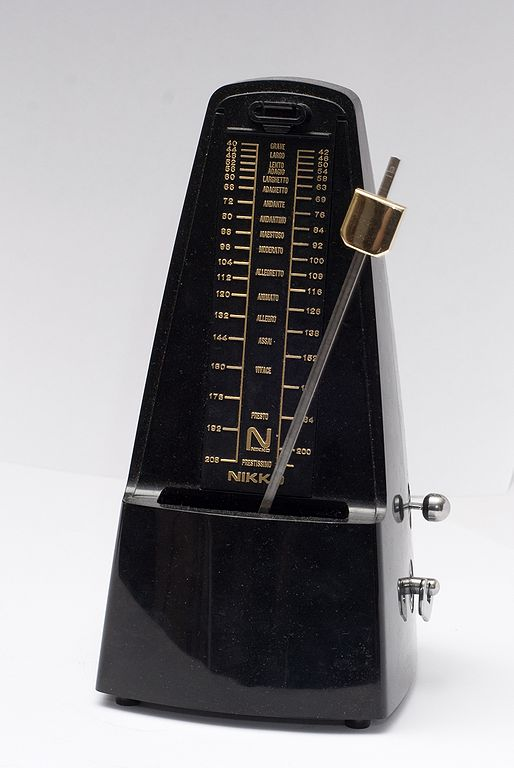

# Controllers 

Controllers initiate musical events, and in some cases, also define when musical events end.
In chapter \@ref(basic-modeling-concepts) we only looked at the keyboard controller, which is perhaps the most intuitive because it mirrors a traditional instrument.
Not all controllers are as obvious or as intuitive, however.
In this chapter, we will focus on clocks and sequencers, which are canonical examples of modular controllers.

## Clocks

Clocks in modular synthesis typically perform two functions.
The first function is synchronization.
Just like group of musicians may use a common reference to stay on the beat, e.g. drums, different modules can use a common clock to stay in time with each other.
A modular clock is similar in several respects to a metronome, which is a musical aid for keeping time.
Metronomes like the one shown in Figure \@ref(fig:metronome) create a regular click or pulse that is adjustable to a given beats per minute (BPM).
For reference, most current music ranges from 80-160 BPM.^[https://blog.musiio.com/2021/08/19/which-musical-tempos-are-people-streaming-the-most/]
Likewise, a modular clock creates a trigger pulse^[Occasionally clocks will produce gates.] at a given BPM and makes this signal available on an output jack.

(ref:metronome) A metronome produces a periodic sound to help musicians keep rhythm. The mechanism is an inverted pendulum with a weight on the end; moving the weight up/down changes the speed of the metronome accordingly. Image [© Vincent Quach/CC-BY-3.0](https://commons.wikimedia.org/wiki/File:Metronome_Nikko.jpg).

```{r metronome, echo=F, out.width="50%", fig.cap="(ref:metronome)"}

```

Many clock modules also support ways of marking time off the main clock signal.
Most often these are clock divisions.
A clock division divides the clock frequency by an integer to get a new, lower frequency.
For example, if our clock is 120 BPM, then it is producing triggers at 2 Hz.
A clock division of 2 would therefore produce triggers at 1 Hz, or 60 BPM.
Clock divisions of 2, 4, and 8 are relatively common.
Each of these specialized signals requires its own jack, so typically only a few such divisions are available on a clock module.

Clock divisions can be used to implement [time signatures](https://en.wikipedia.org/wiki/Time_signature) that track how many beats occur in a measure (also known as a bar).
A common time signature in popular music is ${}^{4}_{4}$, which indicates there are four quarter notes per measure, in contrast to ${}^{3}_{4}$, which indicates there are three quarter notes per measure.
Assuming each pulse indicates a quarter note, an end of measure signal can be generated by using a clock division matching the top of the time signature.
Because a clock pulse represents the lowest resolution control signal and thus the shortest note, using more pulses per quarter note allows more resolution and shorter notes.^[Not all modules receiving clock will interpret a pulse as a quarter note. Some have higher resolutions and so require multiple pulses to advance. Twenty-four [pulses per quarter note](https://en.wikipedia.org/wiki/Pulses_per_quarter_note) is one such standard.]

The second function of a modular clock is [transport](https://en.wikipedia.org/wiki/Transport_(recording)) control, which is recording terminology for controls like play, pause, stop, rewind, etc.
Since clocks are not involved in recording per se, they typically have start, stop, and reset controls.
A reset signal is analogous to a rewind in the sense that all receiving modules will start at their initial states rather than where they left off.
Resets are a useful tool in both composition and recording.
Each of the transport controls is likely to have its own button for manual control, plus an output jack to send the control signal to downstream modules.

As with all things modular, it's important to realize that although there are specialized clock modules, anything that produces a trigger/gate pulse can be used as a clock.
Since clocks are sources of triggers, clocks can also be used for non-clock purposes.

### Clock under a scope

To get a better sense of what's going on, let's take a look at clock output on a scope.
Try connecting a scope to a clock's main output and bar output using the button in Figure \@ref(fig:bar-beat-bpm-scope).
You should see regular pulses off the main output and a different color bar output overlaid every 4th beat using the default time signature.

(ref:bar-beat-bpm-scope) [Virtual modular](https://cardinal.olney.ai) for making a clock patch with a scope.

<!-- MODAL HTML BLOCK -->
```{r echo=F, out.width="100%"}
modular_modal("bar-beat-bpm-scope", instructions_html="<ul>
<li>Add “Clock” and Host Audio</li>
<li>Connect Clock BEAT to Scope In 1</li>
<li>Connect Clock BAR to Scope In 2</li>
<li>Set Scope time and gain so you can see occasional bar pulses by color</li>
</ul>

",solution_html="")
```

<!-- CAPTION BLOCK -->
```{r bar-beat-bpm-scope, echo=F, out.width="100%", fig.cap="(ref:bar-beat-bpm-scope)"}
modular_caption()
```

### Clock as a generator

Since clocks produce a regular stream of pulses, we can hear them at audio rates.
Recall the bottom threshold of human hearing is approximately 20 Hz (20 cycles per second).
Since 1200 BPM corresponds to 20 Hz, we should be able to hear clock signals above this BPM.
The clock module from the last patch only goes up to 300 BPM, but if we use the 16ths output^[This particular clock does not use division notation.], we can achieve four times that, or just about the threshold.
Starting with the last patch, try adding an audio out module after the scope using the button in 
Figure \@ref(fig:clock-sound-bpm-scope-out).
The sixteenth note pulses should show as approximately a square wave, and by moving the BPM up and down, you should hear a change in pitch.

(ref:clock-sound-bpm-scope-out) [Virtual modular](https://cardinal.olney.ai) for making a clock-based drone patch with a scope.

<!-- MODAL HTML BLOCK -->
```{r echo=F, out.width="100%"}
modular_modal("clock-sound-bpm-scope-out", instructions_html="<ul>
<li>Add Host Audio</li>
<li>Remove all patch cables</li>
<li>Connect Clock 16th to Scope In 1</li>
<li>Connect Scope Out 1 to Host Audio L In</li>
<li>Try adjusting<ul>
<li>Time on the scope so you see a square wave (50% duty cycle)</li>
<li>BPM on the clock to create different pitches (you may need good headphones)</li>
</ul>
</ul>
",solution_html="")
```

<!-- CAPTION BLOCK -->
```{r clock-sound-bpm-scope-out, echo=F, out.width="100%", fig.cap="(ref:clock-sound-bpm-scope-out)"}
modular_caption()
```

-----------------------


<!-- An example controller is a module that waits for key presses and, on receiving them, sends a signal to initiate a musical event. -->
<!-- Another example is a sequencer, which you can think of as way of recording key presses and then playing them back to initiate musical events. -->

<!-- Chapters \@ref(physics-and-perception-of-sound) and \@ref(harmonic-and-inharmonic-sounds) focused on the "understand the problem" stage of problem solving, and they introduced both the basic concepts and terminology of modeling sound. -->
<!-- The present chapter pivots to the make/implement a plan stages of problem solving by introducing the model elements and how they interact. -->
<!-- Since we are building models for modular synthesis, the model elements are the modules, and their interactions are driven by how they are connected together in a patch. -->
<!-- Figure \@ref(fig:serge-modular-2) shows an example patch on a real modular synthesizer from Chapter \@ref(introduction). -->

<!-- Options -->
<!-- Chaining keyboards -->
<!-- Touch controllers (has exponential) -->

<!-- Clocks -->
<!-- Sequencer 1 channel/3 channel -->
<!-- trigger sequencer -->

<!-- Clocks, transport/tempo, divisions, time signatures,  -->
<!-- patches  -->
<!-- - into scope with signature as 2nd signal -->
<!-- - into audio out changing bpm, now 16ths to make tone -->
<!-- - gating low sine osc envelope for beats -->

<!-- Sequencing -->
<!-- signals over time; on/off vs continuous -->
<!-- patches -->
<!-- - beat patters by putting trg in between clock and adsr; introduce resets -->
<!-- - pitch sequencer: sequence a new osc with notes; duplicate modules and also have reset -->
<!-- - add variable length notes/rests by using TRG gate as a clock signal for adr3 and gate for saw adsr -->


<!-- Tremelo/vibrato? -->
<!-- Fundamental Modules and Composition		 -->
<!-- 	Basic concepts	 -->
<!-- 		 Module categories, signals, signal interpretation, 5 patchs from drone to key controller for pitch/gate with amplitude envelope -->
<!-- 	Controllers	 -->
<!-- 		Controllers -->
<!-- 		Trigger/gate, phase, sync -->
<!-- 	Generators	 -->
<!-- 		Oscillators (VCO) /LFO ; morphing between waveshapes/ PWM /sync-->
<!-- noise -->
<!-- 		Samplers -->
<!-- 	Modifiers	 -->
<!-- 		Filters (VCF): poles, slopes, cutoff frequency, resonance -->
<!-- 		Envelopes, velocity sensitivity, aftertouch -->
<!-- 		Amplifiers -->
<!-- 		Effects: delay/reverb/panning -->

<!-- Complex modules and Compositions		 -->
<!-- 	Controllers	 -->
<!-- 		Clock, sequencing, arpggiators -->
<!-- 		Euclidean rhythms -->
<!-- 		Probability -->
<!-- 	Generators	 -->
<!-- 		PWM -->
<!-- 		FM/AM -->
<!-- 		Ring modulation -->
<!-- 		Vocoders -->
<!-- 		Random sampling -->
<!-- 	Modifiers	 -->
<!-- 		LFO -->
<!-- 		Sample and hold -->
<!-- 		Slew -->
<!-- 		Wave-folding -->
<!-- 		Attenuators, inverters, and attenuverters -->
<!-- 		Quantizers -->
<!-- 		Switches -->
<!-- 		Logic -->

