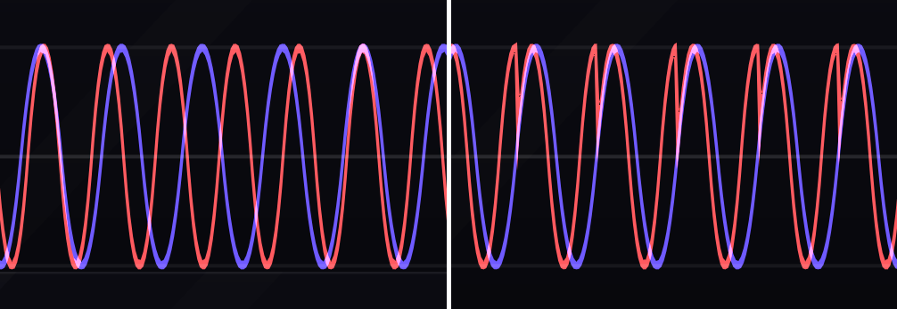
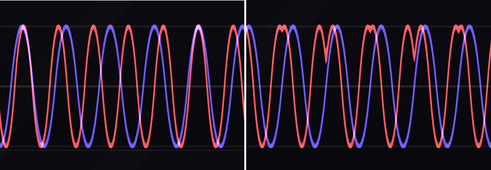
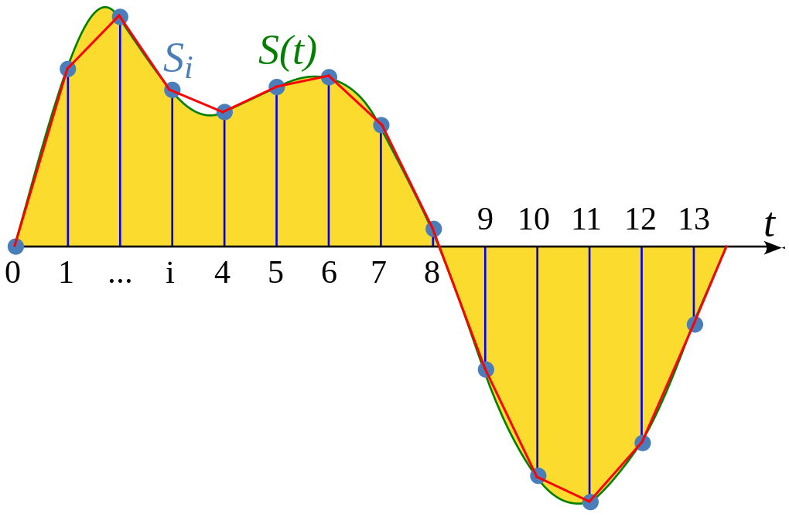

# Generators

Generators create audible sound.
Chapter \@ref(basic-modeling-concepts) introduced oscillators, which are the prototypical generator.
This chapter expands upon oscillators and how they can be combined together to produce fuller and more interesting sounds.
Additionally, two new generators are introduced, noise and samplers.
Noise can also be combined with oscillators and other generators to create richer and more realistic sound.
Samplers represent the extreme of realism in generators, at least as far as their digital representation allows.

<!-- https://docs.google.com/document/d/19EkU7Ypa6J5FYPeDNzVzeNc1qc1sGrxfDMu7Nw2PAgU/edit -->

## Chords 

<!-- chords -->
<!-- - chords from clock division; suboctaves from clock divider -->
<!-- - chords from voltage division -->

Section \@ref(phase-reflections-standing-waves-and-harmonics) briefly mentioned the relationship between harmonics and fundamental relationships like octaves and fifths.
To recap, the second harmonic has double the frequency of the first and so is one octave above the first harmonic.
We can express this relationship as 2:1, i.e. an octave is twice the frequency of the the fundamental.
Similarly the third harmonic is a fifth above the second harmonic, so we can express a fifth as 3:2.^[Whole number ratios require [just intonation](https://en.wikipedia.org/wiki/Just_intonation). The twelve tone [equal temperment](https://en.wikipedia.org/wiki/Equal_temperament) used in Western music is a close approximation, e.g. 3:2 is 1.498 in twelve tone equal temperment.]

Now consider what happens if two notes an octave apart or a fifth apart are played at the same time.
Clearly some of their harmonics will be the same.
Thus playing two or more notes this way will add and enhance harmonics beyond that of a single note, creating a richer and fuller sound.
Of course, notes may be played that are not harmonically related, to a different effect.^[The reader may be interested in [consonance/dissonance](https://en.wikipedia.org/wiki/Consonance_and_dissonance) as discussed in music theory.]
When two notes are played simultaneously, it is called an [interval](https://en.wikipedia.org/wiki/Interval_(music)), with three notes, a [trichord](https://en.wikipedia.org/wiki/Trichord), with four notes, a [tetrachord](https://en.wikipedia.org/wiki/Tetrachord), etc.
Many harmonically related notes can be played simultaneously to good effect.
For example, the [THX Deep Note](https://en.wikipedia.org/wiki/Deep_Note) in Figure \@ref(fig:deep-note) resolves to 11 notes, mostly harmonically related by 3, 4, and 7 semitones (minor/major thirds and fifths). 

(ref:deep-note) [Youtube video](https://www.youtube.com/watch?v=sPY3Y2qhyXk) of the THX Deep Note, which resolves to 11 harmonically related notes. Image [© THX Ltd](https://www.youtube.com/c/THXLtd).

```{r deep-note, fig.cap="(ref:deep-note)", echo = F}
embed_youtube("sPY3Y2qhyXk",5)
```

In modular synthesis, there are at least two ways to create chords, which correspond to stages of the process to create a single note.
At the first stage, we have a V/Oct control signal, so we can create chords by making new control signals harmonically related to the original signal.
At the final stage, we have an audio signal, so we can create chords by making new audio signals harmonically related to the original signal.
Let's look at both.

To create harmonically related control voltage signals, we can use a voltage offset module to create new signals offset from the original signal, i.e. the original voltage plus/minus a harmonically-related voltage.
It can take a little math to do this if the offset module is labeled in volts^[Recall 1 V/Oct means a semitone is 1/12 of a volt.], but if the offset module is labeled in semitones, it is [fairly straightforward](https://en.wikipedia.org/wiki/Interval_(music)#Main_intervals), e.g. a fifth is seven semitones.
Additionally we will need multiple oscillators to play a note for each offset voltage.
We could reasonably do this with separate oscillators, but some chord-oriented modules contain multiple oscillators and take separate V/Oct for each.
Try making a trichord using a fifth and an octave using the button in Figure \@ref(fig:voltage-division-chords).

(ref:voltage-division-chords) [Virtual modular](https://cardinal.olney.ai) for making a chord using signal offsets.

<!-- MODAL HTML BLOCK -->
```{r echo=F, out.width="100%"}
modular_modal("voltage-division-chords", starter_file="empty.vcv", instructions_html="<ul>
<li>Add 12-Key and Host audio</li>
<li>Add BST (voltage offset) and D'Acchord (multiple oscillator) </li>
<li>Connect 12-Key CV out to BST bias 1 input</li>
<li>Make sure the Volts/Semi switch is set to semi</li>
<li>Set BST bias 1 output to +0st (root note) and connect to D'Acchord P1</li>
<li>Set BST bias 2 output to +7st (fifth) and connect to D'Acchord P2</li>
<li>Set BST bias 3 output to +12st (octave) and connect to D'Acchord P3</li>
<li>Connect D'Accord Left/Right to Host audio Left/Right</li>
<li>Try the following and note the differences in the sound<ul>
<li>Use the ATTN row of knobs in D&#39;Accord to remove all but the root note</li>
<li>Add each the others back in slowly, noting the change in the sound</li>
<li>Play the keyboard and note the stability of the chord across keys </li>
</ul>
</li>
</ul>
<div class='d-flex flex-row justify-content-around'>


</div>
",solution_html="")
```

<!-- CAPTION BLOCK -->
```{r voltage-division-chords, echo=F, out.width="100%", fig.cap="(ref:voltage-division-chords)"}
modular_caption()
```

To create harmonically related audio signals, we can use a clock divider as long as the original signal can be interpreted as clock and the clock divider in question can accept audio rates.
This approach is related to a classic technique for creating a fatter sound, the sub-octave square wave.
A sub-octave square wave is exactly that: a square wave one octave below the fundamental.
Since a clock division of $/2$ cuts the source clock frequency in half, we can easily generate a sub-octave square wave using a clock divider, albeit with the same assumptions.
Perhaps more interestingly, if our clock divider supports both even and odd divisions we can create subharmonic chords, or perhaps more appropriately, an [inverted chord](https://en.wikipedia.org/wiki/Inversion_(music)). 
All that is required is knowing the harmonic ratios mentioned above, e.g. 3:2 means that the divisions $/3$ and $/2$ are a fifth apart.
Try making a trichord using a fifth and an octave using the button in Figure \@ref(fig:clock-division-chords).

(ref:clock-division-chords) [Virtual modular](https://cardinal.olney.ai) for making a chord using clock divisions.

<!-- MODAL HTML BLOCK -->
```{r echo=F, out.width="100%"}
modular_modal("clock-division-chords", starter_file="voltage-division-chords.vcv", instructions_html="<ul>
<li>Remove modules except for 12-Key and Host audio</li>
<li>Add VCO, dividah (even clock divider), D1v1de (adjustable clock divider), Scope, and QuadVCA/Mixer </li>
<li>Connect 12-Key CV out to VCO V/Oct</li>
<li>Connect VCO Sqr out to dividah Clock in, D1v1de in, Scope in 1, and QuadVCA in 1</li>
<li>Connect dividah by 2 out to Scope in 2 and QuadVCA in 2</li>
<li>Connect D1v1de out to QuadVCA in 3 and set D1v1de clock division to 3</li>
<li>Connect QuadVCA mix out to Host audio L</li>
<li>Use the scope to confirm the divided signals are correctly aligned to the VCO</li>
<li>Try the following and note the differences in the sound<ul>
<li>Use the QuadVCA sliders to mute all but the root note</li>
<li>Add each the others back in slowly, noting the change in the sound</li>
<li>Play the keyboard and note the stability of the chord across keys </li>
</ul>
</li>
</ul>
<div class='d-flex flex-row justify-content-around'>


</div>
",solution_html="")
```

<!-- CAPTION BLOCK -->
```{r clock-division-chords, echo=F, out.width="100%", fig.cap="(ref:clock-division-chords)"}
modular_caption()
```

## Chorus

We can also combine different oscillators using the same, or almost the same pitch.
As discussed in Section \@ref(phase-reflections-standing-waves-and-harmonics), two identical waves will constructively interfere with each other and produce a new wave with twice the amplitude.
However, if the waves are slightly out of phase or have slightly different frequencies, a subtle interference pattern will be produced that slowly changes the amplitude and timbre of the sound over time.
This effect is used in pianos, which have more than one string for most notes, as well as 12-string guitars that have six pairs of identical strings.
In fact, this effect is so general is used as an audio processing effect called [chorus](https://en.wikipedia.org/wiki/Chorus_(audio_effect)).

To achieve this effect in modular, one only needs to slightly detune one of the VCOs with respect to the other or change the phase relationship between oscillators.
Typically two independent oscillators will already be out of phase, but in modules that contain multiple oscillators there is sometimes a control to adjust the phase of one oscillator with respect to the others.
Both detuning and phase changes must be subtle in order to increase the richness of the sound.
If the detuning is too great, two different pitches will be perceived as out of tune rather than a richer single sound.
Similarly, as phase is increased there is greater destructive interference and potentially cancellation when completely out of phase.
Remember that most interference will create spans of sound with greater loudness and quietness, as shown as shown in Figure \@ref(fig:beat-freq).

(ref:beat-freq) [Animation](https://olney.ai/ct-modular-book/images/beat-freq.gif) of interfering sine waves as one increases in frequency. Note how multiple beats appear in this short span as the frequency increases. Image [© Adjwilley/CC-BY-SA-3.0](https://commons.wikimedia.org/wiki/File:WaveInterference.gif).

```{r beat-freq, echo=F, out.width="70%", fig.cap="(ref:beat-freq)"}
  embed_linked_media("images/beat-freq.gif")
```

These changes in volume can be perceived as [beats](https://en.wikipedia.org/wiki/Beat_(acoustics)) if they are strong enough and occur within a certain range of frequencies.
Typically such beats are unwanted, so the interference between the sound waves should either be too slow/fast to be perceive as beats or the beats themselves are so soft that they are not perceived as beats.
Returning to the first patch, try to detuning the oscillator a fifth above the root while silencing the oscillator an octave above, using the button in Figure \@ref(fig:clock-division-chords).
You should hear a beat whose beat increases as you increase detuning.

(ref:detune-beat) [Virtual modular](https://cardinal.olney.ai) for detuning a second oscillator.

<!-- MODAL HTML BLOCK -->
```{r echo=F, out.width="100%"}
modular_modal("detune-beat", starter_file="voltage-division-chords.vcv", instructions_html="<ul>
<li>Silence P3 using the ATTN knob </li>
<li>Detune P2 using the Detune knob</li>
<li>Note the beat whose frequency increases with detuning</li>
<li>At what point of detuning do you think it sounds best?</li>
",solution_html="")
```

<!-- CAPTION BLOCK -->
```{r detune-beat, echo=F, out.width="100%", fig.cap="(ref:detune-beat)"}
modular_caption()
```

## Low frequency oscillators & uses

Low frequency oscillators (LFOs) are modules that produce waves at frequencies below audio rates.
It may seem strange to introduce LFOs in a chapter on generators, which by our definition create audible sound.
The reason is that LFOs are essentially identical to regular oscillators (VCOs) except that LFOs operate at lower frequencies.
In fact, it's common to find LFOs that can operate at audio rates and VCOs that operate below audio rates.
One other common difference is that LFOs often have a unipolar switch.
The switch changes the output of the LFO, which are by default bipolar and range from -5 to +5 V, to unipolar output of 0 to 10 V.
We've already met a unipolar LFO by another name - a clock is a unipolar LFO that uses a pulse wave!

LFOs have many potential uses, but perhaps the most prominent is to add movement to a sound.
For example, it's generally thought that chorus adds to sound through movement, specifically movement caused by interference and changing harmonics.
LFOs can create similar movement in other contexts as described below.
What all these contexts share is two properties: the speed of the movement (frequency) and the depth of the movement (amplitude).

### Pulse width modulation

LFOs can create the effect of two interfering oscillators with only one VCO.
This is an interesting effect in its own right, but is particularly valuable when only one VCO is present.
The prototypical case for this effect is with pulse waves, where it is called pulse width modulation (PWM).
As a motivating example, consider Figure \@ref(fig:pwm), which shows the interference  of two pulse waves at 25% and 50% duty cycles, respectively.
The resulting wave looks like the 25% wave where the wave is positive and like the 50% wave where the wave is negative.
This occurs because the two component waves, which have the same amplitude, combine to either exactly double the amplitude or sum to zero at all points of the wave. 

(ref:pwm) Interference of a pulse wave with 25% duty cycle (gold) with a pulse wave with a 50% duty cycle (blue). Note the resulting wave (green) has a positive signal matching the 25% wave and a negative signal matching the 50% wave. Waves are offset for comparison.

```{r pwm, fig.cap="(ref:pwm)", echo = F, message=F, warning=F,dev='png'}
library(gsignal)
x <- seq(0, 5, length.out = 1e3)
square_50 <- square(2 * pi * 1 *x, duty = 50)
plot(x, square_50, type="l", xlab = "", ylab = "", main = "",col="blue",lwd=2,lty=3, ylim = c(- 2, 2))
abline(0,0,col="black")

square_25 <- square(2 * pi * 1 *x, duty = 25)
lines( x + .04, square_25, col="gold", lwd=2,lty=3)

lines( x + .08, square_25 + square_50, col="green",lwd=3)
```

Because this is such a useful and interesting effect, many oscillators that produce pulse waves have a PWM input that allows the duty cycle of the wave to be controlled by another module.
Try to implement PWM with an LFO using the button in Figure \@ref(fig:pwm-lfo-vco-scope).
If you hook up the VCO square wave to a scope, you can see the resulting waveshape.
The LFO frequency and the PWM depth knobs give control over the speed of the PWM and the depth (i.e. the range of duty cycles covered), respectively.


(ref:pwm-lfo-vco-scope) [Virtual modular](https://cardinal.olney.ai) for implementing pulse width modulation (PWM) using a low frequency oscillator (LFO).

<!-- MODAL HTML BLOCK -->
```{r echo=F, out.width="100%"}
modular_modal("pwm-lfo-vco-scope", starter_file="empty.vcv", instructions_html="<ul>
<li>Add LFO, VCO, Scope, and Host audio </li>
<li>Connect LFO triangle out to VCO PWM</li>
<li>Connect VCO square out to  Scope in 1</li>
<li>Connect LFO triangle out to  Scope in 2</li>
<li>Connect Scope out 1 to Host audio L</li>
<li>Adjust the scope to visualize the wave</li>
<li>Try the following and note the differences in the sound (richness/beats)<ul>
<li>Increase the depth of the PWM by adjusting the PWM knob on the VCO (the knob adjusts an internal VCA)</li>
<li>Turn the LFO frequency to zero to hear the raw wave, then increase frequency</li>
<li>Try different LFO waves</li>
</ul>
</li>
</ul>
<div class='d-flex flex-row justify-content-around'>

</div>
",solution_html="")
```

<!-- CAPTION BLOCK -->
```{r pwm-lfo-vco-scope, echo=F, out.width="100%", fig.cap="(ref:pwm-lfo-vco-scope)"}
modular_caption()
```

### Vibrato

Vibrato is movement around pitch that can be defined in terms of speed of movement around a center pitch and depth of movement, or distance from, that same center pitch.
Vibrato is widely used in music, but is perhaps most strongly associated with opera as shown in Figure \@ref(fig:opera-vibrato).

(ref:opera-vibrato) [Youtube video](https://www.youtube.com/watch?v=CPPOrQHiP40) of an opera singer's vibrato, or frequency variation around a central note. Image [© jiggle throat](https://www.youtube.com/channel/UC9FSr2uoO_OqymmeNSE5AyQ).

```{r opera-vibrato, fig.cap="(ref:opera-vibrato)", echo = F}
embed_youtube("CPPOrQHiP40",0)
```

LFOs can create vibrato on a VCO by controlling V/Oct.
Unlike PWM, an additional VCA is needed to control the depth of the vibrato.^[Technically you can use the FM input and attenuator, but there are pedagogical reasons for not using the FM input at the moment, namely that we have not discused FM yet. ]
Try to create vibrato with an LFO using the button in Figure \@ref(fig:vibrato-lfo-vca-vco-scope).
With a little adjustment of the parameters, it's possible to match the vibrato of the opera singer just discussed.
Since no vibrato occurs when the LFO frequency is zero, one can turn the vibrato effect on and off by setting LFO frequency, e.g. through a sequencer.


(ref:vibrato-lfo-vca-vco-scope) [Virtual modular](https://cardinal.olney.ai) for implementing vibrato using a low frequency oscillator (LFO).

<!-- MODAL HTML BLOCK -->
```{r echo=F, out.width="100%"}
modular_modal("vibrato-lfo-vca-vco-scope", starter_file="pwm-lfo-vco-scope.vcv", instructions_html="<ul>
<li>Add a QuadVCA/Mixer between the LFO and VCO </li>
<li>Connect LFO triangle out to QuadVCA input 1</li>
<li>Connect QuadVCA mix out to VCO V/Oct</li>
<li>Connect Scope out 1 to Host audio L</li>
<li>Try the following and note the differences in the sound<ul>
<li>Decrease the depth of the vibrato by adjusting the QuadVCA gain down towards zero</li>
<li>Turn the LFO frequency to zero to hear the raw wave, then increase frequency</li>
<li>Try different LFO waves</li>
</ul>
</li>
</ul>
",solution_html="")
```

<!-- CAPTION BLOCK -->
```{r vibrato-lfo-vca-vco-scope, echo=F, out.width="100%", fig.cap="(ref:vibrato-lfo-vca-vco-scope)"}
modular_caption()
```

### Tremolo

In electronic music, tremolo is movement around loudness that can be defined in terms of speed of movement around a center volume and depth of movement, or distance from, that same center volume.^[The mnemonic "tremolo**ud**" might help prevent confusion with vibrato.]
Note that in other forms of music, there are [different definitions of tremolo](https://en.wikipedia.org/wiki/Tremolo).
Tremolo has been widely used in popular guitar music since the 1960's, and guitar pedals producing tremolo effects as shown in Figure \@ref(fig:guitar-tremolo) are quite common today. 

(ref:guitar-tremolo) [Youtube video](https://youtu.be/ZHDV3yBm33A?t=12) of a tremolo guitar pedal. The flashing light corresponds to the speed of loudness changes around a center volume. Image [© CheaperPedals.com](https://www.youtube.com/c/Cheaperpedals).

```{r guitar-tremolo, fig.cap="(ref:guitar-tremolo)", echo = F}
embed_youtube("ZHDV3yBm33A",12)
```

LFOs can create tremolo by controlling the amplitude of VCO output.
A VCA is is used to the depth of the tremelo.
However, there are two differences with respect to previous patches.
First, a VCA accepts unipolar control CV, so the LFO must be set to unipolar.
Second, when the LFO goes to zero, it will completely close the VCA just like an envelope does.
In order to keep some base line of loudness, you must mix a copy of the VCO output with the tremolo-modified VCO output.
Try to create tremolo with an LFO using the button in Figure \@ref(fig:tremelo-lfo-vca-vco-scope) and adjust the parameters to match the tremolo of the guitar pedal in Figure \@ref(fig:guitar-tremolo).
As before, no tremolo occurs when the LFO frequency is zero, so on can turn the tremolo effect on and off by setting LFO frequency using a sequencer or other means.


(ref:tremelo-lfo-vca-vco-scope) [Virtual modular](https://cardinal.olney.ai) for implementing tremolo using a low frequency oscillator (LFO).

<!-- MODAL HTML BLOCK -->
```{r echo=F, out.width="100%"}
modular_modal("tremelo-lfo-vca-vco-scope", starter_file="vibrato-lfo-vca-vco-scope.vcv", instructions_html="<ul>
<li>Disconnect all cables but Scope out 1 to Host audio L and LFO triangle out to Scope in 1</li>
<li>Connect VCO square out to QuadVCA input 1</li>
<li>Connect LFO triangle out 1 to QuadVCA CH 1 gain CV</li>
<li>Connect QuadVCA mix out to Scope in 1</li>
<li>Try the following and note the differences in the sound<ul>
<li>Decrease the depth of the tremelo by adjusting the QuadVCA gain down towards zero</li>
<li>Turn the LFO frequency to zero to hear the raw wave, then increase frequency</li>
</ul>
</li>
<li>Notice the LFO wave on the scope goes below zero but there is no effect on the sound</li>
<li>Fix this by changing the LFO OFST to unipolar</li>
<li>Notice the volume goes to zero when the LFO goes to zero</li>
<li>Fix this by connecting VCO square out to QuadVCA input 2</li>
<li>Adjust the mix to get the right baseline volume and depth of modulation</li>
</ul>
",solution_html="")
```

<!-- CAPTION BLOCK -->
```{r tremelo-lfo-vca-vco-scope, echo=F, out.width="100%", fig.cap="(ref:tremelo-lfo-vca-vco-scope)"}
modular_caption()
```

## Synchronization

Techniques that allow you to remove/reduce phase relationships between oscillators are called synchronization (sync).
Despite seeming contradictory to the preceding discussion, sync can create interesting effects exactly because phase relationships have been removed/reduced.
The basic idea of sync is quite simple.
Every oscillator has an internal reset trigger that tells it when to start drawing its waveshape again.
A sync signal overrides this internal trigger, so we can control when the reset happens.

The most common form of sync is known as hard sync.
In hard sync, the sync signal removes phase by forcing an immediate reset.
Typically the sync signal is the wave output of one oscillator (the leader), which is connecte to the sync input of another oscillator (the follower).
If the two waves were identical in frequency, hard sync would simply align them in phase; however this is rarely the case.
When the two waves are different in frequency, one wave is reset and therefore has a sharp edges in its waveshape.
As discussed in Section \@ref(resonators-formants-and-frequency-spectrum), sharp edges contribute higher partials
Sync therefore changes the harmonic content of a wave in a different way than chorus type effects.
Notably, the closer the follower's frequency is to an integer multiple of the leader's frequency, the more the sync will emphasize the harmonics of the leader, but in general the new partials will not be harmonically related to the leader.
An example of hard sync is shown in Figure \@ref(fig:sine-sync), where the two sine waves on the left are hard synchronized on the right.

(ref:sine-sync) An example of hard sync using two sine waves. On the left, the sine waves are not synchronized. On the right, the leader's sine output is connected to the follower's sync input. As soon as the leader's sine wave (blue) increases above zero, the follower's sine wave (red) resets and begins its cycle again, creating a sharp edge in its waveshape.

```{r sine-sync, echo=F, out.width="100%", fig.cap="(ref:sine-sync)"}
 
```

There are [several variations](https://en.wikipedia.org/wiki/Oscillator_sync#Soft_Sync) of sync known as soft sync, but they all attempt to align the two oscillators in phase without creating the sharp edge found in hard sync.
One notable form of soft sync is reverse soft sync (or flip soft sync).
Reverse soft sync reverses the direction of the wave at the moment of reset.
This causes the follower to match the direction of the leader without exactly matching the leader's phase.
An example of reverse soft sync is shown in Figure \@ref(fig:sine-sync-soft), where the two sine waves on the left are soft synchronized on the right.

(ref:sine-sync-soft) An example of reverse soft sync using two sine waves. On the left, the sine waves are not synchronized. On the right, the leader's sine output is connected to the follower's sync input. As soon as the leader's sine wave (blue) increases above zero, the follower's sine wave (red) reverses, i.e. runs in the opposite direction, and begins its cycle again, creating a less sharp edge in its waveshape than hard sync.

```{r sine-sync-soft, echo=F, out.width="100%", fig.cap="(ref:sine-sync-soft)"}
 
```


Try to create hard and soft sync using the button in Figure \@ref(fig:hard-soft-sync) and that matches Figures \@ref(fig:sine-sync) and \@ref(fig:sine-sync-soft), respectively.
Each type of sync produces a characteristic sound that depends on the waveshapes involved and their relative frequencies.

(ref:hard-soft-sync) [Virtual modular](https://cardinal.olney.ai) for implementing hard and soft sync.

<!-- MODAL HTML BLOCK -->
```{r echo=F, out.width="100%"}
id = "hard-soft-sync"
starter_file="tremelo-lfo-vca-vco-scope.vcv"
instructions_html="<ul>
<li>Disconnect all cables and move the QuadVCA between the Scope and Host Audio</li>
<li>Replace the VCO with an LFO. We'll call this the lead VCO</li>
<li>Connect lead VCO sine out to follower VCO sync in and Scope in 1</li>
<li>Connect follower VCO sine out to Scope in 2</li>
<li>Connect Scope out 1 and 2 to QuadVCA in 1 and 2</li>
<li>Connect QuadVCA mix out to Host audio L</li>
<li>Try the following and note the differences in the sound<ul>
<li>Adjust the QuadVCA gain to hear only the follower, then a mix of both</li>
<li>Turn the leader frequency up and down</li>
<li>Turn the follower frequency up and down</li>
<li>Set the follower frequency at an integer multiple of the leader</li>
</ul>
</li>
<li>Turn on soft sync using the button next to the input jack</li>
<li>Try the same changes above with soft sync active</li>
</ul>
"
solution_html=""

modular_modal(id, starter_file=starter_file, instructions_html=instructions_html,solution_html=solution_html)
```

<!-- CAPTION BLOCK -->
```{r hard-soft-sync, echo=F, out.width="100%", fig.cap="(ref:hard-soft-sync)"}
modular_caption(id, starter_file=starter_file, instructions_html=instructions_html,solution_html=solution_html)
```

## Noise

Noise is commonly used in synthesis to complement other sounds.
As discussed in Section \@ref(inharmonic-standing-waves-and-noise), there are many different kinds of noise that can be distinguished by the frequencies they emphasize.
In modular, noise is typically provided by specialized modules, with separate jacks for different colors of noise.

Noise blended with other generators can create transients and complementary sounds that produce more realistic percussion.
For example, a kick drum has an initial noise transient that quickly dies out, and a snare has a long-lasting noise component that comes from the metal snares below the bottom membrane.
However, the kick drum noise is tilted towards lower frequencies (e.g. red noise) and the snare is tilted towards higher frequencies (e.g. blue noise).
Try to create kick and snare drums with noise using the button in Figure \@ref(fig:kick-bpm-noiz-adsr-vco-adsr-vca-scope).
The patches are identical except for different noise sources and knob settings.


(ref:kick-bpm-noiz-adsr-vco-adsr-vca-scope) [Virtual modular](https://cardinal.olney.ai) for adding noise to kick and snare drums.

<!-- MODAL HTML BLOCK -->
```{r echo=F, out.width="100%"}
id = "kick-bpm-noiz-adsr-vco-adsr-vca-scope"
starter_file="clock-kick-bpm-vco-adsr-vca-scope-out.vcv"
instructions_html="<ul>
<li>Replace the VCA with QuadVCA/Mixer</li>
<li>Connect VCO sine out to QuadVCA in 1</li>
<li>Connect ADSR out to QuadVCA CH 1 gain in</li>
<li>Connect QuadVCA mix out to Scope in 1</li>
<li>Connect Scope out 1 to Host audio L</li>
<li>Add Noiz module below VCO and put new ADSR next to Noiz</li>
<li>Connect Noiz Red out to QuadVCA in 2</li>
<li>Connect Clock out to noise ADSR gate in</li>
<li>Connect noise ADSR out to QuadVCA CH 2 gain in</li>
<li>Adjust noise ADSR knobs to 1 (lowest setting)</li>
<li>Adjust QuadVCA ch 1 gain to max and ch2 gain to 20%</li>
<li>Try the following and note the differences in the sound<ul>
<li>Adjust the QuadVCA gain to make the sine kick quiter and noise louder</li>
<li>Adjust the noise ADSR to make the noise slower/longer</li>
<li>To make a snare, change the noise source to blue</li>
<li>Increase the noise ADSR decay to 25ms</li>
<li>Increase the VCO frequency to 180 Hz</li>
<li>Adjust the QuadVCA gain so drum and noise are equal</li>
<li>Try the adjustments suggested for the kick and note changes in sound</li>
</ul>
</li>
</ul>
<div class='d-flex flex-row justify-content-around'>

</div>
"
solution_html="<h4>Only kick drum shown</h4>"

modular_modal(id, starter_file=starter_file, instructions_html=instructions_html,solution_html=solution_html)
```

<!-- CAPTION BLOCK -->
```{r kick-bpm-noiz-adsr-vco-adsr-vca-scope, echo=F, out.width="100%", fig.cap="(ref:kick-bpm-noiz-adsr-vco-adsr-vca-scope)"}
modular_caption(id, starter_file=starter_file, instructions_html=instructions_html,solution_html=solution_html)
```

## Samplers

Samplers are popular type of generator that can be used to produce very realistic sounds but simply playing back prerecorded sounds.
Samplers are thus very useful for performing with sounds that are difficult to synthesize (e.g. speech) or when it is impractical to use modules to synthesize multiple instruments due to cost/space constraints (as is often the case with percussion).

Samplers do not perform synthesis per se, though there are crossovers like wavetable synthesis, as discussed in Section \@ref(waveshape-and-timbre).
Instead, samplers represent audio data, typically digital audio data, without representing the process that generated the data.
Digital audio data is represented according to two parameters that each can be considered a kind of resolution, as shown in Figure \@ref(fig:sampling-rate-depth).

Sampling rate measures how close together each sample is taken.
If the distance between the samples is small, a straight line is a good approximation of the curve of the wave, and the digital representation has good fidelity to the original sound.
However, if frequency of the wave is high or the wave otherwise changes suddenly, those changes may be *between* samples and not show up in the digital representation at all.
Common sample rates are 8 kHz (phone quality), 16 kHz (speech recognition quality), and 44.1 (CD quality). 

Bit depth measures the accuracy at which the sample points are measured from 0.
Imagine you had a ruler with only inches marked - you could only measure inches, right?
Digital representations are similar in that we can only divide a space into as many pieces as we have bits.
A byte, which is 8 bits, has $2^8=256$ possible partitions, so if we represent a 10 V peak-to-peak signal with 8 bits, we have a resolution of $10/256\approx.04$.
This means is that if two different points of the wave are within this resolution, they will be digitized to the same value. 
This is why higher bit depths have better fidelity to the original signal.
Common bit depths are 16 and 24 bits per sample.

(ref:sampling-rate-depth) A wave digitized by sampling. The sampling rate corresponds to the distance between sample times on the horizontal $t$ axis. The bit depth corresponds to the accuracy of distance between the axis and sampled points on the wave. The straight red segments are the digital reconstruction of the original wave based on the samples. Image [public domain](https://commons.wikimedia.org/wiki/File:Signal_Sampling.svg).

```{r sampling-rate-depth, echo=F, out.width="80%", fig.cap="(ref:sampling-rate-depth)"}
 
```

While samplers offer less control over their representations than other forms of synthesis, they typically have many options for control, including playback within a sample, playing a sample at a faster/slower speed than the original, playing a sample in reverse, etc.
These performance parameters are typically under voltage control and so can be controlled by a keyboard, sequencer, or other controller.
Let's take a look at keyboard control of a sampler that changes the playback position of a sample based on the keyboard's output voltage.
Try this patch using the button in Figure \@ref(fig:sample-12key-ouaive).
You will need to [download the sample file](images/moonshot.wav) to load it into the sampler.

(ref:sample-12key-ouaive) [Virtual modular](https://cardinal.olney.ai) for keyboard control of a sampler's playback position.

<!-- MODAL HTML BLOCK -->
```{r echo=F, out.width="100%"}
id = "sample-12key-ouaive"
starter_file="empty.vcv"
instructions_html="<ul>
<li>Add 12 key, OUAIve sampler, and Host audio</li>
<li>Right click sampler, choose 'Load sample', and load the sample file</li>
<li>Connect 12 key CV out to OUAIve POS in</li>
<li>Connect 12 key Gate out to OUAIve Trig in</li>
<li>Press OUAIve Type button until Trig is shown</li>
<li>Press OUAIve Play button until a single play icon appears</li>
<li>Connect OUAIve outs to Host audio ins</li>
<li>Try playing different notes on the keyboard to play the sample at different locations</li>
<li>You can interrupt the playback by pressing another key before the sample finishes</li>
</ul>
<div class='d-flex flex-row justify-content-around'>

</div>
"
solution_html=""

modular_modal(id, starter_file=starter_file, instructions_html=instructions_html,solution_html=solution_html)
```

<!-- CAPTION BLOCK -->
```{r sample-12key-ouaive, echo=F, out.width="100%", fig.cap="(ref:sample-12key-ouaive)"}
modular_caption(id, starter_file=starter_file, instructions_html=instructions_html,solution_html=solution_html)
```

We can play, reverse play, and change the playback speed the sample by using an LFO and a gate-style controller.
Try to construct this patch using the button in Figure \@ref(fig:sample-lfo-trigger-ouaive).
Because the LFO produces continuous changes in voltage, the playback is continuous, unlike the keyboard-controlled playback where each key stepped the voltage by 1/12 of a volt.

(ref:sample-lfo-trigger-ouaive) [Virtual modular](https://cardinal.olney.ai) for LFO control of a sampler's playback: forward, reverse, and speed.

<!-- MODAL HTML BLOCK -->
```{r echo=F, out.width="100%"}
id = "sample-lfo-trigger-ouaive"
starter_file="sample-12key-ouaive.vcv"
instructions_html="<ul>
<li>Delete 12 key; add LFO and Triggers MK1</li>
<li>Right click sampler, choose 'Load sample', and load the sample file</li>
<li>Connect LFO triangle out to OUAIve POS in</li>
<li>Set LFO OFST to unipolar</li>
<li>Connect Triggers MK1 out to OUAIve Trig in</li>
<li>Press OUAIve Type button until Gate is shown</li>
<li>Press OUAIve Play button until a single play icon appears</li>
<li>Press the Triggers MK1 Latch button to start playback</li>
<li>Try adjusting the LFO frequency to change the playback speed</li>
</ul>
<div class='d-flex flex-row justify-content-around'>

</div>
"
solution_html=""

modular_modal(id, starter_file=starter_file, instructions_html=instructions_html,solution_html=solution_html)
```

<!-- CAPTION BLOCK -->
```{r sample-lfo-trigger-ouaive, echo=F, out.width="100%", fig.cap="(ref:sample-lfo-trigger-ouaive)"}
modular_caption(id, starter_file=starter_file, instructions_html=instructions_html,solution_html=solution_html)
```

<!-- 		Oscillators (VCO) /LFO ; morphing between waveshapes/ PWM /sync-->
<!-- noise -->
<!-- 		Samplers -->


<!-- Tremelo/vibrato? -->
<!-- Fundamental Modules and Composition		 -->
<!-- 	Basic concepts	 -->
<!-- 		 Module categories, signals, signal interpretation, 5 patchs from drone to key controller for pitch/gate with amplitude envelope -->
<!-- 	Controllers	 -->
<!-- 		Controllers -->
<!-- 		Trigger/gate, phase, sync -->
<!-- 	Generators	 -->
<!-- 		Oscillators (VCO) /LFO ; morphing between waveshapes/ PWM /sync-->
<!-- noise -->
<!-- 		Samplers -->
<!-- 	Modifiers	 -->
<!-- 		Filters (VCF): poles, slopes, cutoff frequency, resonance -->
<!-- 		Envelopes, velocity sensitivity, aftertouch -->
<!-- 		Amplifiers -->
<!-- 		Effects: delay/reverb/panning -->

<!-- Complex modules and Compositions		 -->
<!-- 	Controllers	 -->
<!-- 		Clock, sequencing, arpggiators -->
<!-- 		Euclidean rhythms -->
<!-- 		Probability -->
<!-- 	Generators	 -->
<!-- 		PWM -->
<!-- 		FM/AM -->
<!-- 		Ring modulation -->
<!-- 		Vocoders -->
<!-- 		Random sampling -->
<!-- 	Modifiers	 -->
<!-- 		LFO -->
<!-- 		Sample and hold -->
<!-- 		Slew -->
<!-- 		Wave-folding -->
<!-- 		Attenuators, inverters, and attenuverters -->
<!-- 		Quantizers -->
<!-- 		Switches -->
<!-- 		Logic -->


