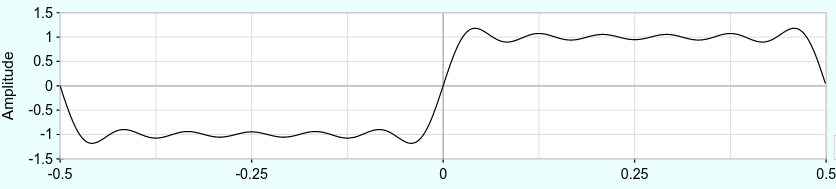

# Modifiers

Modifiers modify incoming signals that may be either audio or some kind of control signal.
Generators create audible sound.
Chapter \@ref(basic-modeling-concepts) introduced voltage controlled amplifiers (VCAs) that modify the amplitude of incoming signals, which can be either audio or control voltage.
That chapter also introduced envelopes that modify control voltage, and we have routinely used envelopes to control VCAs in order to model the dynamics of various instruments.

This chapter expands upon audio modifiers specifically and focuses on two foundational categories of modifiers, effects and voltage controlled filters.
Effects can substantially enrich the sounds you create both in terms of thickness of sound and sense of acoustic space, and voltage controlled filters create some of the most defining sounds in electronic music.

## TODO insert effects here.

## Voltage controlled filters

Voltage controlled filters (VCFs) are an essential component of subtractive synthesis.
Subtractive synthesis, as you recall, is characterized by taking harmonically complex waveshapes and then removing harmonic content to create the desired sounds. 
The opposite approach, additive synthesis, takes harmonically simple waveshapes and adds them together to create desired sounds; however, this becomes complex in analogue circuitry and is better suited to digital computers, which is why subtractive synthesis has historically been the dominant approach to synthesis.
Filters, if you haven't already guessed, are a primary method for removing harmonic content, which is why VCFs are an essential component of subtractive synthesis.

### Filters are imperfect

As discussed in Chapter \@ref(harmonic-and-inharmonic-sounds), timbre is intimately connected to waveshape, and removing harmonic content affects both the shape of the wave and its timbre.
You may assume from our discussion of Fourier analysis that a filter will remove selected harmonics completely.
If that were the case, we might expect a square wave with all but the first two harmonics filtered to look like Figure \@ref(fig:square-fourier-2-harmonics-2).^[This figure was created using the simulator in Section \@ref(resonators-formants-and-frequency-spectrum) which you can use to further explore these concepts.]

(ref:square-fourier-2-harmonics-2) Fourier approximation of the first 11 harmonics of a square wave.

```{r square-fourier-2-harmonics-2, echo=F, out.width="100%", fig.cap="(ref:square-fourier-2-harmonics-2)"}
 
```

Using Fourier decomposition to understand VCFs is misleading in many respects, as will become clear by the end of this section.
It is also not practical to build a filter based on Fourier decomposition for two at least two reasons.
First, we want our filter to happen in real time, i.e. before a wave has even completed its cycle, which Fourier can't do.
Second, Fourier introduces [Gibbs error](https://en.wikipedia.org/wiki/Gibbs_phenomenon) that you can see in Figure \@ref(fig:square-fourier-2-harmonics-2) as peaks where there should be 90 degree angles in the square wave.
If we were to use Fourier as the basis of a filter, those peaks would introduce ringing artifacts.

(ref:vcf-square-out) VCF output on a square wave that has been aligned and scaled for comparison to Figure \@ref(fig:square-fourier-2-harmonics-2). Note the relatively flat low and high regions of the wave, which imply the presence of higher harmonics.

```{r vcf-square-out, echo=F, out.width="100%", fig.cap="(ref:vcf-square-out)"}
 knitr::include_graphics("images/vcf-square-out.png")
```

The output of a real VCF filtering out all but the first 11 harmonics is shown in Figure \@ref(fig:vcf-square-out).
The VCF output has two striking differences with the Fourier example.
First, the transition from maximum positive to maximum negative (and vice versa) is substantially smoother for the VCF, creating rounder edges.
Second, the VCF has relatively flat maximum regions of the wave, which imply higher harmonics.
By comparing the Fourier and VCF outputs, we can see that the VCF is removing more low frequency content than we would expect (rounder edges) but that the VCF is removing less high frequency content than we would expect (flatter maximum regions of the wave).
So a VCF is not like a net that either lets harmonics through or not.
Instead, a VCF affects a range of harmonics, but within that range, it affects some harmonics more than others.

Let's take a look at this in some patches that filter white noise.
The advantage of filtering white noise is that white noise contains all frequencies, so it is easy to see the shape of the filter's effect.
The patches will use two common filters: low-pass filters and high-pass filters.
Low-pass filters (LPF) let low frequencies pass through relatively unaffected, and high-pass filters (HPF) let high frequencies pass through relatively unaffected.
The effect of each filter is controlled using the cutoff frequency, which defines a range of affected frequencies.
Try patching up the two filters using the button in Figure \@ref(fig:noiz-lfp-out-fft).

(ref:noiz-lfp-out-fft) [Virtual modular](https://cardinal.olney.ai) for applying low- and high-pass filtering on white noise.

<!-- MODAL HTML BLOCK -->
```{r echo=F, out.width="100%"}
modular_modal("noiz-lfp-out-fft", starter_file="empty.vcv", instructions_html="<ul>
<li>Add Noiz, VCF, Host audio out, and Sassy Scope</li>
<li>Connect Noiz white out to VCF in and Sassy input 1</li>
<li>Connect VCF LPF out to Host audio L and Sassy input 2</li>
<li>Right click the Sassy cable inputs to change the colors of inputs 1/2 if needed</li>
<li>Set Sassy to Freq mode using button, raise nearby slider to 100ms </li>
<li>Sassy shows the frequency spectrum of both the white noise and filtered noise</li>
<li>Try the following and note the differences in the sound and spectrum<ul>
<li>Change the cutoff frequency from zero to far right</li>
<li>Mouse over the cutoff knob to get the cutoff freq, then mouse over spectrum to find that freq</li>
</ul>
</li>
<li>Repeat with the HPF out to observe high-pass filtering</li>
</ul>
<div class='d-flex flex-row justify-content-around'>

</div>
",solution_html="")
```

<!-- CAPTION BLOCK -->
```{r noiz-lfp-out-fft, echo=F, out.width="100%", fig.cap="(ref:noiz-lfp-out-fft)"}
modular_caption()
```

Let's take another look, this time with a square wave and an oscilloscope, which will let us look at the effect on the wave rather than the frequency spectrum.
Of course the disadvantage of white noise is that you can't usefully look at the effect 
Try modifying your patch to use an audio rate LFO and an oscilloscope using the button in Figure \@ref(fig:lfo-lfp-out-scope-fft).
As you can see, LPF creates curious shapes that occasionally approximate shapes we recognize, like triangle and sine waves (though with reduced amplitude).
HPF creates perhaps even more curious shapes that quickly turn into increasingly sharp pulses.

(ref:lfo-lfp-out-scope-fft) [Virtual modular](https://cardinal.olney.ai) for applying low- and high-pass filtering on a square wave.

<!-- MODAL HTML BLOCK -->
```{r echo=F, out.width="100%"}
modular_modal("lfo-lfp-out-scope-fft", starter_file="noiz-lfp-out-fft.vcv", instructions_html="<ul>
<li>Add an LFO to the left of Noiz and Scope between Host Audio and Sassy Scope</li>
<li>Connect LFO square to VCF in, Scope in 1, and to Sassy input 1</li>
<li>Connect VCF LPF out to Host audio L, Scope i n2, and Sassy input 2</li>
<li>Right click the Sassy cable inputs to change the colors of inputs 1/2 if needed</li>
<li>Set LFO freq to around 100 Hz, VCF cutoff to around 400 Hz, Scope time to around 12 ms, and enable Scope TRG </li>
<li>The Scope shows the square wave and filtered square wave</li>
<li>Try the following and note the differences in the sound and spectrum<ul>
<li>Change the cutoff frequency from zero to far right</li>
<li>At various points, the wave should looke more like a triangle wave and then a sine wave</li>
</ul>
</li>
<li>Repeat with the HPF out to observe high-pass filtering</li>
</ul>
",solution_html="")
```

<!-- CAPTION BLOCK -->
```{r lfo-lfp-out-scope-fft, echo=F, out.width="100%", fig.cap="(ref:lfo-lfp-out-scope-fft)"}
modular_caption()
```

### Filters change frequency and phase

VCFs change more than just frequency spectrum - they also change the phase of those frequencies.
The best way to understand VCFs, which are complex, is in terms of the passive [RC circuit](https://en.wikipedia.org/wiki/RC_circuit).
When a signal runs through an RC circuit, the circuit leeches out energy from certain parts of the waveshape and returns that energy at other parts, as shown in Figure \@ref(fig:square-lpf-hpf).
While a full explanation of how the RC circuit works is out of scope,^[For a good basic explanation of an RC circuit, see [this video](https://youtu.be/3tMGNI--ofU).] we can nevertheless describe what it does to explain what a VCF does.
The overarching idea is that when an RC circuit leeches energy out of a signal, it slows down or speeds up frequency components of the signal and so phase shifts those components.

(ref:square-lpf-hpf) Square wave through a low-pass (left) and high-pass (right) filter. Note the symmetry of the difference between the square wave and the filtered signal: the shape of the filtered signal below the square wave in the positive region is the same as the filtered signal above the square wave in the negative region, but flipped. 

```{r square-lpf-hpf, echo=F, out.width="100%", fig.cap="(ref:square-lpf-hpf)"}
 knitr::include_graphics("images/square-lpf-hpf.png")
```

Let's look first at the LPF case, using the left side of Figure \@ref(fig:square-lpf-hpf) as a reference.
As the signal increases, the RC circuit leeches out energy until it fills up, at which point it has no effect on the signal. 
Once the signal starts decreasing, the RC circuit releases energy until it runs out.
Sharp signal increases are slowed down, meaning they are phase shifted negatively. Slowing them means removing high frequencies.
Here's an analogy that might help.
Imagine you're driving on the freeway and a wind blows from ahead whenever you try to accelerate and blows from behind whenever you decelerate. 
The wind is opposing your ability to change speed.
The RC circuit likewise is opposing the signal's voltage changes.

The HPF case on the right side of Figure \@ref(fig:square-lpf-hpf) is different.
As the signal increases and stops changing, the RC circuit leeches out energy until the capacitor fills up, at which point it has no effect on the signal. 
Once the signal starts decreasing and stops changing, the capacitor releases energy until it runs out.
Flat signals are speeded up, meaning they are phase shifted positively. 
Speeding them up means removing lower frequencies.
Using the wind and car analogy, imagine you're driving on the freeway and a wind blows whenever you try to keep a constant speed.^[More precisely, the wind blows from ahead when you start cruising after increasing speed, and the wind blows from behind when you start cruising after reducing speed.]
The wind is opposing your ability to maintain constant speed.
The RC circuit likewise is opposing the signal's constant voltage.

(ref:bode-low-pass) A Bode plot for a low-pass filter with a cutoff frequency of 100 Hz. Note the lines marked Bode pole represent idealized behavior of the filter and the Low Pass markers indicate actual behavior. The cutoff point is exactly aligned with a -45 degree phase shift. Image [© Brews ohare/CC-BY-4.0](https://commons.wikimedia.org/wiki/File:Bode_Low-Pass.PNG).

```{r bode-low-pass, echo=F, out.width="70%", fig.cap="(ref:bode-low-pass)"}
knitr::include_graphics("images/bode-low-pass.png")
```

The effect of the RC circuit on frequency and phase spectrum can be summarized by a [Bode plot](https://en.wikipedia.org/wiki/Bode_plot), as shown for an LPF in Figure \@ref(fig:bode-low-pass).
The lines labeled "Bode pole" are idealized and the actual behavior of the LPF is indicated by the markers.
Let's start with the upper subplot, which shows how the filter reduces the amplitude of the signal across frequencies.
The cutoff frequency occurs where the line changes from 0 dB to a downward angle.
As you can see, the actual behavior of the LPF is to reduce frequencies even before this point as shown by the markers below the line to the left of the cutoff point.
The decrease in amplitude at the cutoff frequency is 3 dB.^[Recall a 6 dB decrease means amplitude is cut in half.]
The decrease to the right of the cutoff point is 6 dB for each doubling of frequency, or 6 dB/Oct.
That means the amplitude of the signal will decrease by half for each additional octave above the cutoff frequency.
Let's look at the lower subplot, which shows phase shift how the filter changes phase across frequencies.
As previously explained, the LPF slows down higher frequency components of the wave, and creates a maximum phase shift of -90 degrees for those frequencies.
At the cutoff, the phase shift is already -45 degrees.

(ref:bode-high-pass) A Bode plot for a high-pass filter with a cutoff frequency of 100 Hz. Note the lines marked Bode pole represent idealized behavior of the filter and the High Pass markers indicate actual behavior. The cutoff point is exactly aligned with a 45 degree phase shift. Image [© Brews ohare/CC-BY-4.0](https://commons.wikimedia.org/wiki/File:Bode_High-Pass.PNG).

```{r bode-high-pass, echo=F, out.width="70%", fig.cap="(ref:bode-high-pass)"}
knitr::include_graphics("images/bode-high-pass.png")
```

The Bode plot for an HPF looks very similar to that of an LPF, but reversed as shown in Figure \@ref(fig:bode-high-pass).
As before the range of frequencies affected by the filter extends on both sides of the cutoff point, the signal is already attenuated by 3 dB at the cutoff point, and the decrease in amplitude (this time to the left of the cutoff) is 6 dB/Oct.
The main difference is in the sign of the phase shift in the lower subplot.
Instead of being negative because the frequencies have been slowed down, the phase shift is now positive because the affected frequencies have been sped up.

### Resonance and combining filters 

Resonant filters have been an important sound in electronic music even before modular synthesizers^[https://120years.net/wordpress/the-fonosynth-paul-ketoff-paolo-ketoff-julian-strini-gino-marinuzzi-jr-italy-1958/].
We previously discussed resonance in Section \@ref(resonators-formants-and-frequency-spectrum), but in terms of real instruments.
[Electrical resonance](https://en.wikipedia.org/wiki/Electrical_resonance) is similar and can be understood analogously to waves reflecting off the fixed end of a string to create a standing wave.
In the case of the filter, feedback from the frequency at the filter cutoff point "reflects" back into the circuit and interferes with the original signal.
As long as the two signals are aligned in phase, they will constructively interfere and amplify the frequencies at the cutoff point. 
If the feedback increases beyond a certain point, the filter will begin to oscillate and effectively turn into a sine wave VCO.
Try patching up a resonant filter using white noise using the button in Figure \@ref(fig:noiz-lpf-out-scope-fft).
If you crank up the resonance on the filter, you will get a sine wave even though the input is just noise.
This illustrates that resonance is a property of the filter itself, not of the input.
Try also extending the patch using square wave input to see what resonant filter sweeps sound and look like on a wave.
You should see that the cutoff frequency and resonance interact in interesting ways and that resonance can, in some cases, add frequency content back into the sound that the filter had removed.

(ref:noiz-lpf-out-scope-fft) [Virtual modular](https://cardinal.olney.ai) for applying resonant filtering on white noise and a square wave.

<!-- MODAL HTML BLOCK -->
```{r echo=F, out.width="100%"}
modular_modal("noiz-lpf-out-scope-fft", starter_file="lfo-lfp-out-scope-fft.vcv", instructions_html="<ul>
<li>Connect Noiz white out to VCF in, Scope input 1, and Sassy input 1</li>
<li>Connect VCF LPF out to Host audio L, Scope input 2, and Sassy input 2</li>
<li>Connect VCF LPF out to Scope EXT TRG (external trigger)  </li>
<li>Turn the VCF resonance up until you see a sine wave on the scope and a distinct peak on Sassy</li>
<li>Now reconnect everything using a square wave as your VCF input and EXT TRG</li>
<li>Try the following and note the differences in the sound and spectrum<ul>
<li>Set the resonance at 20% </li>
<li>Change the cutoff frequency from zero to far right</li>
<li>Repeat with the resonace at 50% and 80%</li>
</ul>
</li>
<li>Repeat with the HPF out to observe high-pass filtering</li>
</ul>
<div class='d-flex flex-row justify-content-around'>

</div>
",solution_html="")
```

<!-- CAPTION BLOCK -->
```{r noiz-lpf-out-scope-fft, echo=F, out.width="100%", fig.cap="(ref:noiz-lpf-out-scope-fft)"}
modular_caption()
```


<!-- Remaining plan -->

<!-- 	Modifiers	 -->
<!-- 		Filters (VCF): poles, slopes, cutoff frequency, resonance -->
<!-- 		Envelopes, velocity sensitivity, aftertouch -->
<!-- 		Amplifiers -->
<!-- 		Effects: delay/reverb/panning -->

<!-- Complex modules and Compositions		 -->
<!-- 	Controllers	 -->
<!-- 		Clock, sequencing, arpggiators -->
<!-- 		Euclidean rhythms -->
<!-- 		Probability -->
<!-- 	Generators	 -->
<!-- 		PWM -->
<!-- 		FM/AM -->
<!-- 		Ring modulation -->
<!-- audio rate modulation into resonant filter? -->
<!-- 		Vocoders -->
<!-- 		Random sampling -->
<!-- 	Modifiers	 -->
<!-- 		~~LFO~~ -->
<!-- 		Sample and hold -->
<!-- 		Slew -->
<!-- 		Wave-folding -->
<!-- 		Attenuators, inverters, and attenuverters -->
<!-- 		Quantizers -->
<!-- 		Switches -->
<!-- 		Logic -->


<!-- Actual -->
<!--     4 Basic Modeling Concepts -->
<!--     4.1 Modules are the model elements -->
<!--     4.2 Signals are how the model elements interact -->
<!--     4.3 Signals are interpreted by modules -->
<!--     4.4 Pulling it all together -->
<!--         4.4.1 Drone -->
<!--         4.4.2 Using an oscilloscope -->
<!--         4.4.3 Controlling pitch -->
<!--         4.4.4 Controlling note duration (on/off volume) -->
<!--         4.4.5 Controlling note dynamics (volume during note) -->
<!--     4.5 Moving forward -->

<!-- 5 Controllers -->
<!-- 5.1 Clocks -->

<!--     5.1.1 Clock under a scope -->
<!--     5.1.2 Clock as a generator -->

<!-- 5.2 Sequencers -->

<!--     5.2.1 Clocks as sequencers -->
<!--     5.2.2 Trigger sequencers -->
<!--     5.2.3 Control voltage sequencers -->


<!--     6 Generators -->
<!--     6.1 Chords -->
<!--     6.2 Chorus -->
<!--     6.3 Low frequency oscillators & uses -->
<!--         6.3.1 Pulse width modulation -->
<!--         6.3.2 Vibrato -->
<!--         6.3.3 Tremolo -->
<!--     6.4 Synchronization -->
<!--     6.5 Noise -->
<!--     6.6 Samplers -->


