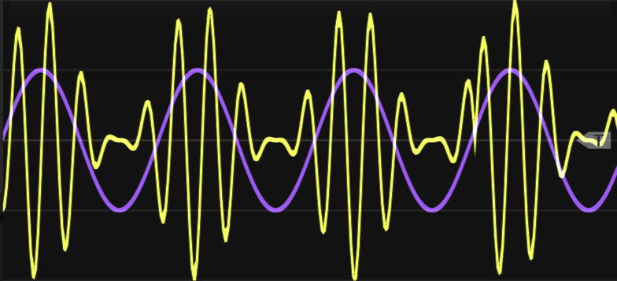
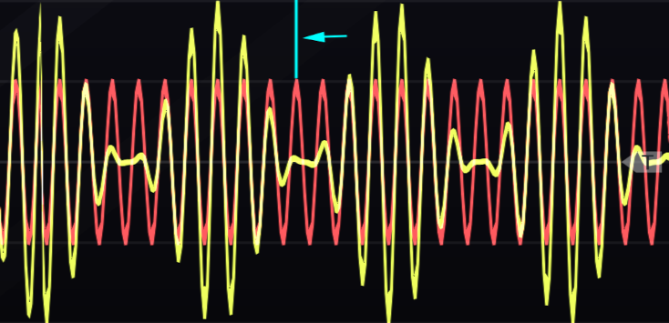
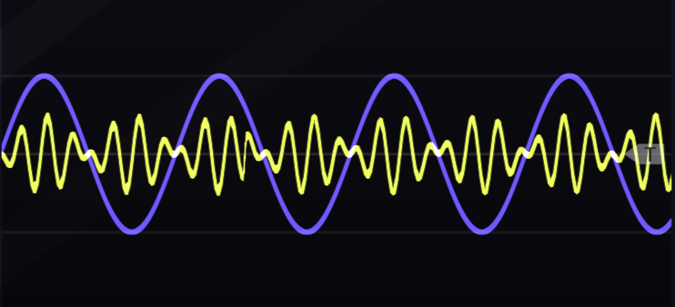
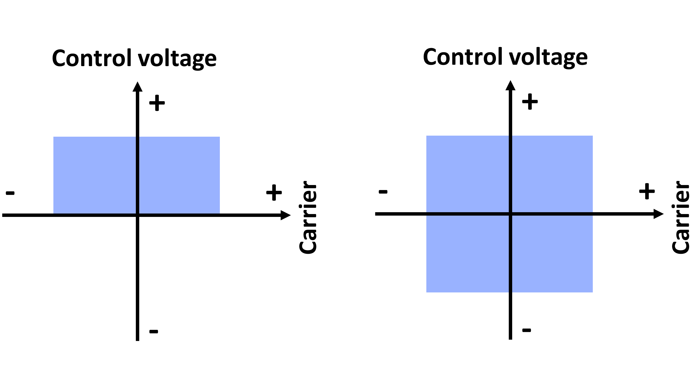
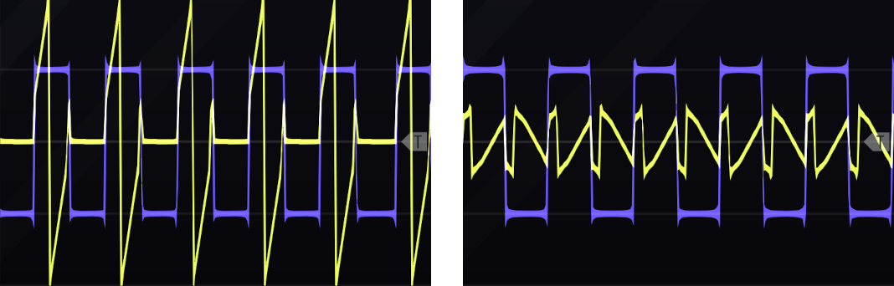
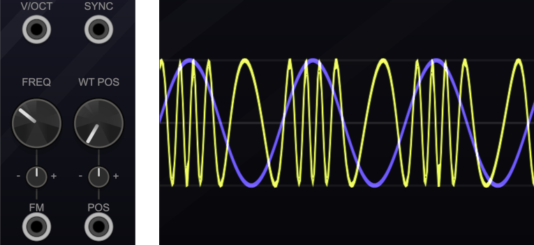
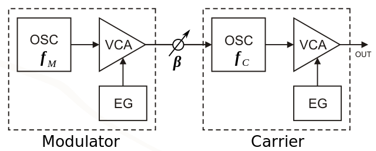

# Generators {#complex-generators}

This chapter extends Chapter \@ref(generators) and focuses entirely on audio-rate modulation.
Audio-rate modulation uses an audio-rate signal, typically an oscillator, to modulate a parameter, most commonly a parameter on another oscillator.^[Audio-rate modulation of a filter's cutoff is another common option but is beyond the scope of this chapter. Try it!]
Although the basic idea is simple to explain, sounds produced can be complex and require a new idea to understand: the sideband.

Before proceeding, let's introduce some terminology.
The audio rate signal source will be called the *modulator*.
The oscillator receiving the modulation is the *carrier*.
The depth, or strength, of modulation the carrier receives from the modulator will be called the *modulation index*.
The modulation index defines how much the parameter of the carrier changes around its default value.
For example, if a carrier has a frequency of 800 Hz, the modulation index may cause it to go +/- 1 Hz (from 799 to 801 Hz) or +/- 100 Hz (from 700 Hz to 900 Hz).
The signal resulting from audio-rate modulation is the *output*.

Recall that we can describe any wave by its shape, amplitude, frequency, and phase.
If we assume we can describe any waveshape by a collection of sine waves via Fourier transform, then we can focus on the amplitude, frequency, and phase parameters of these waves.
Audio-rate modulation can be performed on each of these parameters.
When the modulator acts on the amplitude parameter of the carrier, the result is amplitude modulation (AM).
When the modulator acts on the frequency parameter of the carrier, the result is frequency modulation (FM).
And when the modulator acts on the phase parameter of the carrier, the result is phase modulation (PM).

Each of these types of audio-rate modulation creates sidebands, which are new partials in the output.
Audio-rate modulation therefore is related to additive synthesis in that both involve adding partials to change the timbre of the output sound.
The main difference is that audio-rate modulation is not strictly additive and can also remove or change some partials in the carrier.
However, with sufficient control of audio-rate modulation, one can create a wide variety of sounds more efficiently than additive synthesis, as shown by the explosion of inexpensive FM keyboards in the 1980's, like the Yamaha DX7.

The following sections outline the use of audio-rate modulation in modular sound synthesis according to the parameters of amplitude, frequency, and phase.
However, the story is somewhat complicated due to the history of synthesis, limitations of analogue hardware, and mathematical relationships between methods.
There are actually two families of methods around amplitude and frequency that cover all three parameters, as will be explained.

## Modulating amplitude

The amplitude family includes amplitude modulation and ring modulation.
The difference between the two is that amplitude modulation stops producing sound when the modulation signal crosses below zero and ring modulation continues to produce sound.
Although this difference may seem like a small one, it leads to several differences in the resulting sidebands and therefore overall timbre.

### Amplitude modulation

You might have heard of amplitude modulation (AM) before, as it was one of the earliest technologies used in radio and is still in use today.
We actually already covered the basic idea of AM in Section \@ref(tremolo) to produce tremelo.
As you recall, we used an LFO at relatively low rates to control a VCA, and the VCA was controlling the output of our main oscillator.
AM works exactly the same way as this but at audio rates (>20 Hz).
At audio rates, we can hear sidebands, and the nature of the sound changes from an oscillation in loudness to a new timbre.

The VCA is key to understanding AM.
Recall that the VCA is a level control that lets through a certain amount of signal, typically 0-100%.^[Most VCAs are attenuators and so only reduce signal. Some VCAs include amplifiers that allow the gain on the signal to go above 100%].
If you stop to think about this mathematically, it means that the VCA is multiplying the signal by a control value.^[The control value itself at any moment is determined by the output of the modulator and thus it is the two signals that are being multiplied together, but for simplicity of exposition fixed point values are emphasized.]
For example, if the VCA control value is 50%, then it is multiplying the incoming signal amplitude by .5.
AM stops producing sound when the control value crosses below zero because VCAs are defined to operate in the 0-100% range, i.e., with unipolar control values only.
So when the control value crosses below zero, the VCA output simply stays at zero until the control value becomes positive again.
This behavior is illustrated in Figure \@ref(fig:am-unipolar).

(ref:am-unipolar) An example of amplitude modulation using sine waves for modulator and carrier. Note that where the modulator signal (purple) is at its peak, the output (yellow) is at greatest strength, but where the modulator signal is negative, the output reduces to zero.

```{r am-unipolar, echo=F, out.width="100%", fig.cap="(ref:am-unipolar)"}
 
```

Side bands for AM are simplest for sine waves.
If both modulator and carrier are sine waves, the spectrum of the output will include a partial at the carrier frequency $C_f$ and two partials offset by the modulator frequency $M_f$, specifically $C_f - M_f$ and $C_f + M_f$.
The sidebands have less strength than the carrier, and the strength of the sidebands is determined by the modulation index, which for AM is defined as the peak change in output amplitude divided by the amplitude of the carrier, $\Delta A/C_a$.^[When the modulation index is at maximum, each sideband is half of the strength of the carrier.] 
An example of peak change is given in Figure \@ref(fig:am-modulation-index).

(ref:am-modulation-index) An example of peak amplitude change using sine waves for modulator and carrier. The indicated difference in amplitude between the carrier signal (red) and the output (yellow) is the peak amplitude change $\Delta A$.

```{r am-modulation-index, echo=F, out.width="100%", fig.cap="(ref:am-modulation-index)"}
 
```


When the modulator and/or carrier are not sine waves, the sidebands contain the sums and differences for all pairs of partials between the modulator and the carrier.
For example, if $M_f$ has 3 partials and $C_f$ has 5 partials, then there are $3*5$ partials in the lower sideband and the same number in the upper sideband.
Even though the carrier frequency is not the fundamental, it is perceived as the pitch center of the sound, even when when the sidebands contain many partials.
Note that in the above formulas, any partial that crosses below zero disappears.
Also, if the modulator frequency goes above the carrier, $M_f > C_f$, the roles of carrier and modulator are reversed.

Implementing AM synthesis as described above is relatively simple in our virtual modular set up, but it has some surprises.
First, if we want pure sine waves, i.e. sine waves with only one harmonic, then we need to use wavetable oscillators, which we've briefly mentioned a few times up to this point but never used.
A [wavetable](https://en.wikipedia.org/wiki/Wavetable_synthesis) oscillator is a digital oscillator that defines a wave based on one stored cycle of that wave.
We need wavetable oscillators here to get a perfect sine wave, because the virtual analogue implementations faithfully recreate the imperfections of the original hardware.
This is also true for real VCAs, which tend to be a bit noisy, so we'll need to use a specific VCA that we've never used before.
All this effort is only necessary to get a result that matches the previous equations.
Otherwise you may not care about these small imperfections that give additional character to the sound through the extra sidebands they create.
Try creating a simple AM patch from scratch using the button in Figure \@ref(fig:am-example) and look carefully at the sidebands it creates.


(ref:am-example) [Virtual modular](https://cardinal.olney.ai) for amplitude modulation using pure sine waves.

<!-- MODAL HTML BLOCK -->
```{r echo=F, out.width="100%"}
modular_modal("am-example", starter_file="empty.vcv", instructions_html="<ul>
<li>Add two WT VCOs, AMP, Scope, and Sassy</li>
<li>On each WT VCO, move the wavetable position knob to the left to select a sine wave. The intermediate position morph between other waves like triangle and square</li>
<li>Connect the oscillator on the left (modulator) to the AMP CV and to a Sassy input</li>
<li>Connect the oscilator on the right (carrier) to the AMP in and to a Sassy input </li>
<li>Connect the AMP out to Scopein and a Sassy input</li>
<li>Enable the external trigger on the Scope, connect the modulator output to the Scop external trigger, and adjust Sassy for high-quality spectrogram output (left top sliders down to 1/32, top right slider up to 1000ms, freq radiobutton, 4x radiobutton)</li>
<li>Adjust the oscillator frequencies so that the modulator is lower than the carrier and the difference is sufficient to show on Sassy and not cross below zero (I used 60 and 400)</li>
<li>Try the following and note the differences in the scopes <ul>
<li>Mouse over the frequency peaks in Sassy. You should see one for the modulator, one for the carrier, and two for sidebands. Check their values and compare to the sideband formula</li>
<li>Temporarally disconnect the Sassy input from the carrier. You should now see a peak that was hidden in the output </li>
<li>Change the time knob on the scope to look at the output waveshape across scales. You should see the characteristic waveshape presented earlier. Connect the modulator output to the second Scope input to recreate the figure</li>
<li>Move the modulator wavetable position knob slowly upward and watch the change in Sassy. You will see both new peaks in the spectrum of the modulator as well as matching peaks in sidebands in the output signal.</li>
</ul></li>
</ul>
<div class='d-flex flex-row justify-content-around'>


</div>
",solution_html="")
```

<!-- CAPTION BLOCK -->
```{r am-example, echo=F, out.width="100%", fig.cap="(ref:am-example)"}
modular_caption()
```

AM synthesis will generally produce inharmonic sidebands unless the modulator and carrier frequencies are chosen to create harmonic relationships.
Using sine waves for example, if modulator and carrier have the same frequency, then the lower sideband will be zero and the upper sideband will be one octave above the carrier, e.g. 100 and 200 Hz.
We can describe such frequency relationships between modulator and carrier in terms of ratios, so if both have the same frequency, the ratio of C:M is 1:1.
You can easily check that any N:1 ratio is harmonic, for example using 200 Hz as the carrier would result in 100, 200, and 300 Hz harmonics.
Likewise, N:2 where N is odd will give odd harmonics (100, 300, 500 Hz), and N:2 where N in even will give even harmonics (200, 400, 600 Hz).
Typical frequency ratios associated with musical intervals shown in Table \@ref(tab:freq-ratio) may also be used to create chordal harmonic structures.

Table: (\#tab:freq-ratio) Frequency ratios for musical intervals.

| Frequency ratio | Musical interval |
|:---------------:|------------------|
|       2:1       | Octave           |
|       3:2       | Fifth            |
|       4:3       | Fourth           |
|       5:4       | Major third      |
|       6:5       | Minor third      |

Typically when a harmonic relationship like this has been established, one wishes to keep it intact while playing different notes.
This is as easy to accomplish as keeping two (or more) oscillators in tune as a chord while playing across a keyboard.
Try extending the last patch with a keyboard and use V/Oct connections to keep the harmonic relationship between modulator and carrier intact using the button in Figure \@ref(fig:am-keyboard-frequency-tracking).
This patch is also a good opportunity to explore the sounds of more complex modulator and carrier waves, as well as inharmonic sounds.


(ref:am-keyboard-frequency-tracking) [Virtual modular](https://cardinal.olney.ai) for amplitude modulation with keyboard tracking.

<!-- MODAL HTML BLOCK -->
```{r echo=F, out.width="100%"}
modular_modal("am-keyboard-frequency-tracking", starter_file="am-example.vcv", instructions_html="<ul>
<li>Add Twelve-Key and Host Audio</li>
<li>Move Scope and Sassy to the lower row to make space</li>
<li>Connect 12 ky CV to both oscillator V/Oct. The voltage from this connection will be summed with the dialed in voltage represented by each oscillator's frequency knob, so when each receives the same voltage from the 12 key, the relative tuning between oscillators will not change</li>
<li>Connect the AMP out to Host audio L</li>
<li>Set the oscillators to have a harmonic relationship, e.g. N:1</li>
<li>Try the following and note the differences in the sound and scopes <ul>
<li>Play across the keyboard. Notice that the carrier, which is the strongest harmonic, defines the perceived pitch and that the sidebands remain harmonic with it</li>
<li>Temporarally disconnect the modulator V/Oct and play up the keyboard. Note on most keys the result is inharmonic but it becomes harmonic on other keys by chance</li>
<li>Reconnect the V/Oct and move the modulator wavetable position knob slowly upward and listen to the change in the sound. Repeat for the carrier knob. Note that the carrier remains the perceived pitch center even as the harmonics increase </li>
</ul></li>
</ul>
",solution_html="")
```

<!-- CAPTION BLOCK -->
```{r am-keyboard-frequency-tracking, echo=F, out.width="100%", fig.cap="(ref:am-keyboard-frequency-tracking)"}
modular_caption()
```

AM creates an interesting sound with a fixed modulation index, but as with all audio-rate modulations, we can also change that modulation index over time.
All that is needed is a signal that changes over time and something to attenuate the modulation index in response to that signal.
We can extend the last patch along these lines by adding an envelope triggered by the keyboard where that envelope controls another VCA.
Every keypress will then cause a brief change in the modulation index, which will correspondingly change the strength of the sidebands.
This effect is even more pronounced for non-sine waves because there are more partials in the sidebands.
Try modulating the modulation index with an envelope using the button in Figure \@ref(fig:am-keyboard-frequency-tracking-adsr-modulation-index).

(ref:am-keyboard-frequency-tracking-adsr-modulation-index) [Virtual modular](https://cardinal.olney.ai) for amplitude modulation with keyboard tracking where the modulation index is controlled by an envelope.

<!-- MODAL HTML BLOCK -->
```{r echo=F, out.width="100%"}
modular_modal("am-keyboard-frequency-tracking-adsr-modulation-index", starter_file="am-keyboard-frequency-tracking.vcv", instructions_html="<ul>
<li>Add ADSR and another AMP to the right of the carrier VCO</li>
<li>Connect 12 ky gate out to ADSR gate in</li>
<li>Connect ADSR out to the new AMP CV in</li>
<li>Connect modulator out to new AMP in, new AMP out to old AMP CV</li>
<li>Try the following and note the differences in the sound and scopes <ul>
<li>Play across the keyboard. Notice the enveloped sound becomes a bit brighter and the brightness fades with the envelope. This is analogous to having filter whose cutoff is controlled by an envelope, but without using a filter module!</li>
<li>Change the gain on the new AMP all the way down. You should see a sine wave on the scope. Now when you play across the keyboard, the envelope it going from non-AM to AM wherease before, it was baseline AM to stronger AM</li>
<li>Repeat the above with non-sine waveshapes for modulator and carrier. The effect of the envelope is even more dramatic in these cases</li>
</ul></li>
</ul>
",solution_html="")
```

<!-- CAPTION BLOCK -->
```{r am-keyboard-frequency-tracking-adsr-modulation-index, echo=F, out.width="100%", fig.cap="(ref:am-keyboard-frequency-tracking-adsr-modulation-index)"}
modular_caption()
```


### Ring modulation

Ring modulation (RM) is implemented the same way as AM, except with a VCA where the control value can cross below zero.
That means that RM multiplies the carrier signal by the control value of the VCA, but since the control value can be negative, the output can also be negative.
Negative output may sound strange at first, but it is exactly the same as positive output *except* inverted.
Thus RM operates just like AM except that RM will never stop at zero, and when it crosses zero, the output is the same as above zero except inverted.
This behavior is illustrated in Figure \@ref(fig:rm-bipolar).

(ref:rm-bipolar) An example of ring modulation using sine waves for modulator and carrier. Note that where the modulator signal (purple) is at either its positive or negative peak, the output (yellow) is at greatest strength. The overall amplitude of the output is reduced relative to Figure \@ref(fig:am-unipolar) due to the removal of the carrier frequency (see text).

```{r rm-bipolar, echo=F, out.width="100%", fig.cap="(ref:rm-bipolar)"}
 
```

Historically, ring modulation was performed by a [circuit consisting of diodes arranged in a ring](https://en.wikipedia.org/wiki/Ring_modulation), thus the name.
Ring modulators and VCAs are sometimes called four- and two-quadrant multipliers.
On a VCA, the input signal can be bipolar but the control value is unipolar.
That means the VCA output is restricted to two quadrants of the Cartesian plane.
On a ring modulator, both input signal and control can be bipolar, so the output can occur in all four quadrants of the Cartesian plane.
The difference between  four- and two-quadrant multipliers is illustrated in Figure \@ref(fig:four-quadrant-multiplier).
Ring modulators are also sometimes called balanced modulators because the modulating signal spends as much time being negative as positive.

(ref:four-quadrant-multiplier) A two-quadrant multiplier multiplies a bipolar signal (carrier) and a unipolar signal (control voltage), so has output in two quadrants (left). A four-quadrant multiplier multiplies two bipolar signals, so has output in all four quadrants (right).

```{r four-quadrant-multiplier, echo=F, out.width="100%", fig.cap="(ref:four-quadrant-multiplier)"}
 
```

Like AM, side bands for RM are easiest to understand for sine waves.
The output spectrum is the same as AM, except that the carrier frequency $C_f$ is removed, leaving only the side bands $C_f - M_f$ and $C_f + M_f$, and any sidebands that cross below zero are reflected back as their absolute value instead of being lost.
Similarly, when the modulator and/or carrier are not sine waves, the sidebands contain the sums and differences for all pairs of partials between the modulator and the carrier.
The modulation index for RM is likewise the same as AM, and if the modulator frequency goes above the carrier, $M_f > C_f$, the roles of carrier and modulator are reversed.

We can implement RM with a slight modification to the first AM patch.
Again, the choice of module is important to get identical behavior to the equations above, though in practice, the character of small imperfections might be preferred.
Try creating a simple RM patch extending the AM patch using the button in Figure \@ref(fig:rm-example).

(ref:rm-example) [Virtual modular](https://cardinal.olney.ai) for ring modulation using pure sine waves.

<!-- MODAL HTML BLOCK -->
```{r echo=F, out.width="100%"}
modular_modal("rm-example", starter_file="am-example.vcv", instructions_html="<ul>
<li>Add feidah, copy the connections from AMP over to it, and remove AMP</li>
<li>Try the following and note the differences in the scopes <ul>
<li>Mouse over the frequency peaks in Sassy. You should see one for the modulator, one for the carrier, and two for sidebands. Check their values and compare to the sideband formula</li>
<li>Temporarally disconnect the Sassy input from the carrier. You should see that this carrier partial is missing from the ring mod output</li>
<li>Change the time knob on the scope to look at the output waveshape across scales. You should see the characteristic waveshape presented earlier. Connect the modulator output to the second Scope input to recreate the figure</li>
<li>Move the modulator wavetable position knob slowly upward and watch the change in Sassy. You will see both new peaks in the spectrum of the modulator as well as matching peaks in sidebands in the output signal.</li>
</ul></li>
</ul>
<div class='d-flex flex-row justify-content-around'>

</div>
",solution_html="")
```

<!-- CAPTION BLOCK -->
```{r rm-example, echo=F, out.width="100%", fig.cap="(ref:rm-example)"}
modular_caption()
```

In terms of harmonicity, RM is again identical to AM except for the properties of missing the carrier frequency and reflections of sideband partials off zero.
The missing carrier means that the overall spectrum will no longer have a strong pitch center.
However, our perception tends to fill in the missing frequency of the carrier such that the pitch still seems centered there, just not as strongly.
Reflected sideband partials have potential to interfere with other partials, but this will occur only when the modulator or carrier has a richer waveshape than sign and thus higher harmonics to subtract.
Otherwise the same concepts about harmonic frequency ratios, keyboard tracking, and modulating the modulation index apply to RM as AM.
Try extending the final AM patch to RM using the button in Figure \@ref(fig:rm-keyboard-frequency-tracking).
This patch is also a good opportunity to explore how the sound of RM differs from AM. 


(ref:rm-keyboard-frequency-tracking) [Virtual modular](https://cardinal.olney.ai) for ring modulation with keyboard tracking.

<!-- MODAL HTML BLOCK -->
```{r echo=F, out.width="100%"}
modular_modal("rm-keyboard-frequency-tracking", starter_file="rm-keyboard-frequency-tracking-adsr-modulation-index.vcv", instructions_html="<ul>
<li>Add two feidahs, copy the connections from the AMPs over to them, and remove the AMPs</li>
<li>Set the oscillators to have a harmonic relationship, e.g. N:1</li>
<li>Try the following and note the differences in the sound and scopes <ul>
<li>Play across the keyboard. Notice that even with the carrier missing, it still defines the perceived pitch and the sidebands remain harmonic with it. Notice the change in brightness with the envelope</li>
<li>Temporarally disconnect the modulator V/Oct and play up the keyboard. Note the result is perhaps a bit less inharmonic than AM under these conditions</li>
<li>Reconnect the V/Oct and move the modulator wavetable position knob slowly upward and listen to the change in the sound. Note that as the shape approaches saw, the carrier frequency is filled in by reflection. Repeat for the carrier knob. Note that the missing carrier remains the perceived pitch center even as the harmonics increase.</li>
</ul></li>
</ul>
",solution_html="")
```

<!-- CAPTION BLOCK -->
```{r rm-keyboard-frequency-tracking, echo=F, out.width="100%", fig.cap="(ref:rm-keyboard-frequency-tracking)"}
modular_caption()
```

RM and AM are similar in operation and in sound. 
The main differences revolve around the missing carrier component and sidebands reflecting off zero.
Both of these emphasize sidebands in RM, because the sidebands have more energy in them and are never destroyed.
In contrast, AM puts more weight on the carrier frequency and less on the sidebands.
Another way of looking at the difference is that RM copies the characteristics of the carrier into the sidebands without including the carrier, whereas AM copies the same characteristics to a lesser extent and includes the carrier.
This makes RM potentially more useful as an audio processing tool than AM.
These differences between AM and RM are illustrated in Figure \@ref(fig:am-rm-modsquare-carsaw).

(ref:am-rm-modsquare-carsaw) AM (left) and RM (right) for a square wave modulator (blue) and a saw wave carrier (yellow). Note that the energy of the saw wave carrier is more strongly preserved in AM, whereas in RM, the characteristics of the carrier are preserved without preserving its energy.

```{r am-rm-modsquare-carsaw, echo=F, out.width="100%", fig.cap="(ref:am-rm-modsquare-carsaw)"}
 
```

## Modulating frequency

The frequency family includes frequency modulation and phase modulation.
Since $frequency * time = phase$, frequency and phase modulation are closely related.
However, understanding this modulation family in modular synthesis requires understanding not just the math behind them but also the history.
Many modular synthesis methods involving this family are actually approximations rather than exact implementations.
Each approximation has its own characteristic sound that is now part of the genre of electronic music.
Thus understanding this family requires understanding both the true methods and the approximations.

### Frequency modulation

Frequency modulation (FM) is a widespread method for radio transmission, just like AM.
In the context of modular synthesis, FM is strongly associated with @Chowning1973, whose work in the 1970s [was used in the Yamaha FM synthesizers](https://en.wikipedia.org/wiki/Frequency_modulation_synthesis), notably the DX7.
Although Chowning's FM arrived decades after FM was used in modular synthesis, it sets the standard for all other forms of FM, which can largely be viewed as approximations of it.

We previously covered the basic idea of FM in Section \@ref(vibrato) to produce vibrato.
As you recall, we used an LFO at relatively low rates to control a VCA, and the VCA was controlling the V/Oct of our main oscillator.
In FM we don't use a VCA but instead an attenuverter/polarizer, i.e. FM crosses zero just like RM.
The attenuverter/polarizer is often integrated into the carrier oscillator with a corresponding FM input.
The voltage into the carrier's FM input is added to the voltage into the carrier's V/Oct input, so when only one input is used, these two inputs are interchangeable.
When using both, the V/Oct defines the carrier's frequency, and the FM input defines the variation around that frequency.
Thus as the modulator increases, the frequency of the output increases, and as the modulator decreases, the frequency of the output decreases, as shown in Figure \@ref(fig:fm-voct-composite).

(ref:fm-voct-composite) Voltage controlled oscillators typically have an FM input (lower left) in addition to a V/Oct input (upper left). The voltage from these two inputs is internally summed, thus V/Oct can be used to define a center frequency and FM can be used to define a variation around that frequency. Note the attenuator knob directly above the FM jack can be used to attenuate the FM voltage and therefore the strength of the modulation. The effect of the modulator through the FM jack (right) causes the carrier (yellow) to increase or decrease in frequency according to the value of the modulator (blue). 

```{r fm-voct-composite, echo=F, out.width="100%", fig.cap="(ref:fm-voct-composite)"}
 
```

As with AM and RM, FM creates sidebands symmetrically around the carrier frequency.
In contrast, FM creates an infinite number of sideband partials rather than just two - even when the modulator and carrier are sine waves.
These side band partials are arranged in pairs as $C_f - nM_f$ and $C_f + nM_f$, where $n$ is a natural number.
When $n$ is odd, the side band partials below $C_f$ have reversed phase.
Additionally, partials that cross zero will reflect with a reversal of phase.
The above is also true when the modulator and carrier are non-sine waves, in which case each pairing of partials between them creates a new sideband pair.
To avoid confusion around the word "pair," the following discussion of sidebands will be restricted to sine waves.

The FM modulation index is  defined as the peak change in output frequency divided by the highest frequency component of the modulator, $\Delta F/M_f$.
Changing the modulation index has a dramatic effect on the timbre for several reasons.
First, although FM produces infinite sidebands, most of the partials have negligible amplitude.
According to [Carson's bandwith rule](https://en.wikipedia.org/wiki/Carson_bandwidth_rule), 98% of the energy in the spectrum is within a bandwidth defined by $2(\Delta F + M_f)$, so  holding $M_f$ constant, the FM bandwidth will increase as the modulation index increases.
Larger bandwidth affects the timbre of the sound by increasing the audible partials and increasing the opportunities for partials to reflect off zero and interfere with existing partials.
Second, as the modulation index increases, each sideband pair defined by $n$ changes in amplitude according to its own Bessel function, and once the Bessel function crosses below zero, the sideband pair reverses phase.
The amplitude changes created by the Bessel functions ripple outward for increasing $n$ as the modulation index increases, as shown in Figure \@ref(fig:bessel-modulation).


(ref:bessel-modulation) [Vimeo video](https://vimeo.com/309150702) of FM sideband pair amplitudes following Bessel functions as the modulation index increases. Image [© Jeffery Hass](https://vimeo.com/jeffreyhass).

```{r bessel-modulation, fig.cap="(ref:bessel-modulation)", echo = F}
embed_vimeo("309150702")
```

Figure \@ref(fig:bessel-modulation) illustrates how the brightness of the sound increases as the modulation index increases.
Because there is a fluctuating loss of energy behind the peaking Bessel functions, the pitch center feels somewhat unstable as the modulation index increases.
Depending on where the carrier frequency falls along equal loudness contuors (see Chapter \@ref(physics-and-perception-of-sound)), the perceived pitch can appear to move up or down as the modulation index increases.
For example, the pitch in Figure \@ref(fig:bessel-modulation) is about 700 Hz, at which point human hearing has more sensitivity to higher frequencies than lower frequencies.
Thus as the modulation index increases, the upper sideband is perceived as louder than the lower sideband, causing a perception of upward pitch shift.

Harmonic ratios of carrier to modulator (C:M) are more complex for FM than AM/RM because FM sidebands are infinite and reflect from zero out of phase.
Additionally, sideband partials may already be inverted if they are both odd and less than the carrier frequency or if their Bessel function drops below zero.
If we only consider reflection from zero and ignore the other complexities, a 1:1 ratio will produce all harmonics and thus be similar to a saw wave.
This is because the first lower sideband partial is $1-1=0$, and all negative partials for higher $n$ reflect back on top of their positive counterparts.
Thus for 1:1, the carrier frequency is the fundamental, and the lower sideband is reflected on top of the upper sideband.
Another simple example is 1:2.
Since every sideband partial will be $1 \pm n2$, the partials will always be odd, giving a spectrum similar to a square wave.
Again the lower sideband will reflect across zero on top of the upper sideband, and the carrier frequency will be the fundamental.

Properties of C:M ratios can be generalized across integers.
For example, any N:1 will generate all harmonics starting at the value of 1, though the carrier will only be the fundamental for 1:1.
Ratio 1:N will skip every nth partial, e.g. for 1:3, partials 3, 9, 27, and so on will be skipped.
Ratio N:2 will yield only even partials if N is even and only odd partials if N is odd.
These examples show how different ratios can create the same result and illustrates the complexity of this topic, even under our current simplifying assumptions. 

If we consider ratios that produce the same result as a family, then we can describe families using a single ratio called [the normal form ratio](http://www.sfu.ca/%7Etruax/fmtut.html) by taking $|C-M|$ until the result is either 1:1 or $M \ge 2C$.
For example, any N:1 will reduce to 1:1 in normal form because we repeatedly subtract 1 from N until 1:1 is reached.
An important use of normal form ratios is to tell if a ratio is harmonic or not.
Any harmonic ratio will have a normal form of 1:N, and any other normal form ratio will be inharmonic.
For example, 2:7 is in normal form because $M \ge 2C$, but it is not 1:N, so it is inharmonic.

Keyboard tracking with FM requires additional effort relative to AM/RM because the modulation index, $\Delta F/M_f$, depends on the frequency of the modulator.
Without accounting for this, timbre will change as notes are played across the keyboard.
Any solution to this problem will proportionally increase $\Delta F$ as $M_f$ increases so that  $\Delta F/M_f$ stays constant.
One simple approach is to use the V/Oct from the keyboard to control the attenuverter/polarizer affecting the strength of the modulator.
As long as the calibration of the attenuverter/polarizer doubles the strength of $\Delta F$ for each volt, the shared V/Oct signal will keep the modulation index constant as $M_f$ changes.

The discussion to this point has focused on basic FM.
Despite this, it is fairly nuanced and complex, which explains why FM was first properly implemented digitally.
More advanced digital applications of FM involve modulators modulating other modulators, sometimes with feedback loops (so modulators are modulating themselves).
These advanced digital algorithms are typically defined using [operators](https://www.soundonsound.com/techniques/more-frequency-modulation#para5), where each operator is an oscillator, VCA, and envelope, as shown in Figure \@ref(fig:two-op-fm).
For reference, the DX7 uses six operators - the equivalent of 18 modules!
While the number of modules required to implement advanced FM algorithms in analogue may sometimes be impractical, understanding the correspondence between operators and  modules will help you import ideas from digital FM into analogue.

(ref:two-op-fm) Two operator FM. Image [© Clusternote/CC-BY-SA-3.0](https://commons.wikimedia.org/wiki/File:2op_FM.svg).

```{r two-op-fm, echo=F, out.width="100%", fig.cap="(ref:two-op-fm)"}
 
```

### Analogue exponential frequency modulation


<!-- **template** -->

<!-- - How are sideband frequency and amplitude calculated -->
<!-- - How does modulation index affect these -->
<!-- - What happens to partials that cross zero? -->
<!-- - How is result perceived -->
<!-- - How can we make it harmonic -->
<!-- - Ratios C:M -->
<!-- - Will harmonics track keyboard or not -->

Simple EFM with sine waves using the button in Figure \@ref(fig:efm-example).

(ref:efm-example) [Virtual modular](https://cardinal.olney.ai) for **TODO**.

<!-- MODAL HTML BLOCK -->
```{r echo=F, out.width="100%"}
modular_modal("efm-example", starter_file="rm-example.vcv", instructions_html="<ul>
<li>Remove feidah and add Host audio</li>
<li>Connect the modulator out to the carrier FM in</li>
<li>Connect the carrier out to Scope in 1 and modulator out to Scope in 2</li>
<li>Connect the carrier out to Host audio L</li>
<li>Try the following and note the differences in the sound and scopes <ul>
<li>Turn up the FM carrier knob slightly. Mouse over the frequency peaks in Sassy. You should see one for the modulator, one for the carrier, and two for sidebands. Check their values and compare to the sideband formula</li>
<li>Slowly turn up the carrier FM knob. This will increase the modulation index. Observe the changes in both the spectrum and the pitch of the sound. At what modulation index doe the pitch seem to noticably change?</li>
<li>Change the carrier FM knob down to a low but not zero level. Now increase the waveshape knob on the modulator and note the change in pitch. This is because the modulation index is based on the highest frequency component of the modulator, so when you use a waveshape with higher harmonics, the modulation index will also change.</li>
</ul></li>
</ul>
",solution_html="")
```

<!-- CAPTION BLOCK -->
```{r efm-example, echo=F, out.width="100%", fig.cap="(ref:efm-example)"}
modular_caption()
```


Keyboard tracking EFM with sine waves using the button in Figure \@ref(fig:efm-keyboard-frequency-tracking).

(ref:efm-keyboard-frequency-tracking) [Virtual modular](https://cardinal.olney.ai) for **TODO**.

<!-- MODAL HTML BLOCK -->
```{r echo=F, out.width="100%"}
modular_modal("efm-keyboard-frequency-tracking", starter_file="rm-keyboard-frequency-tracking.vcv", instructions_html="<ul>
<li>Remove feidah </li>
<li>Connect the modulator out to the carrier FM in</li>
<li>Connect the carrier out to Scope in 1 and modulator out to Scope in 2</li>
<li>Connect the carrier out to Host audio L</li>
<li>Try the following and note the differences in the sound and scopes <ul>
<li>Turn up the FM carrier knob to about 45 percent and play across the keyboard. Now change the keyboard octave up by 2 and play across the keyboard again. Notice how the timbre has changed as the pitch has changed. This is because the modulation index depends on the modulator/carrier frequencies and the depth of modulation simultaneously.</li>
<li>TODO</li>
</ul></li>
</ul>
",solution_html="")
```

<!-- CAPTION BLOCK -->
```{r efm-keyboard-frequency-tracking, echo=F, out.width="100%", fig.cap="(ref:efm-keyboard-frequency-tracking)"}
modular_caption()
```


### Analogue linear frequency modulation

### Analogue through-zero frequency modulation

### Phase modulation

<!-- which are related quantities as show in Figure \@ref(fig:freq-phase). -->
<!-- If we define frequency as the time it take the pendulum to return to vertical position, we can similarly define phase as the angle between the pendulum body and the vertical. -->
<!-- Unfortunately, explaining frequency modulation is complicated by its long history and different implementations in the digital and analogue domains.  -->


<!-- (ref:pulse-wave) [Animation](https://upload.wikimedia.org/wikipedia/commons/6/6f/Pendulum-no-text.gif?20201216081225) of a pendulum to illustrate the connection between frequency and phase. Image ©  [Ideophagous/CC-BY-SA-4.0 ](https://commons.wikimedia.org/wiki/File:Pendulum-no-text.gif). -->

<!-- ```{r pulse-wave, out.width="40%", fig.cap="(ref:pulse-wave)", echo=F} -->
<!-- embed_linked_media("https://upload.wikimedia.org/wikipedia/commons/0/02/PWM_duty_cycle_with_label.gif") -->
<!-- ``` -->

<!-- Remaining plan -->


<!-- 	Generators	 -->
<!-- 		PWM -->
<!-- 		FM/AM -->
<!-- 		Ring modulation -->
<!-- audio rate modulation into resonant filter? -->
<!-- 		Vocoders -->
<!-- 		Random sampling -->
<!-- 	Modifiers	 -->
<!-- 		~~LFO~~ -->
<!-- 		~~Sample and hold~~ -->
<!-- 		Slew -->
<!-- 		Wave-folding -->
<!-- 		Attenuators, inverters, and attenuverters -->
<!-- 		Quantizers -->
<!-- 		~~Switches~~ -->
<!-- 		~~Logic~~ -->

<!-- Sound design ideas -->
<!-- Cymbal PUSH UNTIL AFTER RING MOD -->
<!-- Maybe use these? -->
<!-- keyboard filter tracking or notes would disappear; filtering sine wave example -->
<!-- Growl: Low frequency sine wave modulation of the filter cut-off frequency -->
<!-- wah wah is LFO on LPF cutoff freq -->


<!-- Actual -->
<!--     4 Basic Modeling Concepts -->
<!--     4.1 Modules are the model elements -->
<!--     4.2 Signals are how the model elements interact -->
<!--     4.3 Signals are interpreted by modules -->
<!--     4.4 Pulling it all together -->
<!--         4.4.1 Drone -->
<!--         4.4.2 Using an oscilloscope -->
<!--         4.4.3 Controlling pitch -->
<!--         4.4.4 Controlling note duration (on/off volume) -->
<!--         4.4.5 Controlling note dynamics (volume during note) -->
<!--     4.5 Moving forward -->

<!-- 5 Controllers -->
<!-- 5.1 Clocks -->

<!--     5.1.1 Clock under a scope -->
<!--     5.1.2 Clock as a generator -->

<!-- 5.2 Sequencers -->

<!--     5.2.1 Clocks as sequencers -->
<!--     5.2.2 Trigger sequencers -->
<!--     5.2.3 Control voltage sequencers -->


<!--     6 Generators -->
<!--     6.1 Chords -->
<!--     6.2 Chorus -->
<!--     6.3 Low frequency oscillators & uses -->
<!--         6.3.1 Pulse width modulation -->
<!--         6.3.2 Vibrato -->
<!--         6.3.3 Tremolo -->
<!--     6.4 Synchronization -->
<!--     6.5 Noise -->
<!--     6.6 Samplers -->

<!-- 7 Modifiers -->
<!-- 7.1 Effects -->
<!--     7.1.1 Delays -->
<!--     7.1.2 Reverb -->
<!--     7.1.3 Chorus -->
<!--     7.1.4 Flanger -->
<!--     7.1.5 Phaser -->
<!-- 7.2 Voltage controlled filters -->
<!--     7.2.1 Filters are imperfect -->
<!--     7.2.2 Filters change frequency and phase -->
<!--     7.2.3 Combining filters -->
<!--     7.2.4 Resonance -->


<!-- 8 Designing a Kick Drum -->
<!-- 8.1 Problem solving for sound synthesis -->
<!--     8.1.1 Understand the problem -->
<!--     8.1.2 Devise a plan -->
<!--     8.1.3 Carry out the plan (and replanning) -->
<!--     8.1.4 Evaluate the solution -->
<!-- 8.2 Reviewing previous kick drum patches -->
<!--     8.2.1 Sine with envelope -->
<!--     8.2.2 Sine with an envelope plus noise burst -->
<!-- 8.3 Alternative approaches -->
<!--     8.3.1 Improving our understanding of the problem -->
<!--     8.3.2 Devising new plans -->
<!--     8.3.3 Working backwards -->


<!-- 9 Eighties Lead & Chiptune -->
<!-- 9.1 Eighties Lead -->
<!--     9.1.1 Waveshape -->
<!--     9.1.2 Dynamics -->
<!-- 9.2 Chiptune -->
<!--     9.2.1 Triad arpeggio -->
<!--     9.2.2 LFO PWM -->
<!--     9.2.3 Secondary sequencer for transposition -->
<!--     9.2.4 Hats and kick -->


<!-- 10 Controllers -->
<!-- 10.1 Modifying gates -->
<!-- 10.2 Making gates with logic -->
<!-- 10.3 Adding/removing gates with probability -->
<!-- 10.4 Speed variable clocks using LFOs -->
<!-- 10.5 Euclidean rhythm -->
<!-- 10.6 Sequential switches -->
