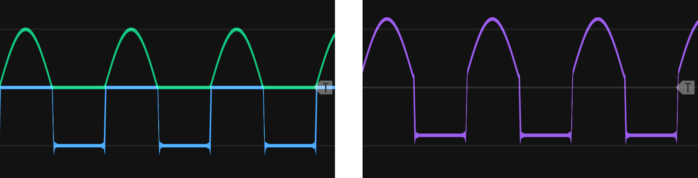

# Modulating Modifiers {#complex-modifiers}

Modifying incoming audio and control signals was introduced in Chapter \@ref(modifiers).
The present chapter introduces new modules and extends earlier concepts in modifiers around the loose organizing theme of converting between earlier signals, e.g. from gates to envelopes.

## Rectification and wavefolding

As discussed in Chapter \@ref(basic-modeling-concepts), signals are either unipolar or bipolar.
One way to make a bipolar signal unipolar is to add an offset to it, e.g. if a signal ranges from -5 to +5 V, then add 5 V to obtain a 0 to +10 V signal.
Another more interesting way to convert a bipolar signal to unipolar is to rectify the signal, as shown in Figure \@ref(fig:rectification).
Half-wave rectification simply removes the negative part of the signal by stopping the signal at zero, and staying at zero until the signal becomes positive again.
Full-wave rectification reflects the signal across the x-axis, i.e. takes the absolute value of the signal.
If you add a fully rectified signal to the original signal, you will get a half rectified signal because the negative portion of the original signal and the reflected portion of the fully rectified signal will cancel out. 

(ref:rectification) [Rectification](https://upload.wikimedia.org/wikipedia/commons/0/08/Sine_curve_drawing_animation.gif) of a sine wave using either half or full rectification. Image [©  	Omegatron/CC-BY-SA-3.0](https://commons.wikimedia.org/wiki/File:Rectified_waves.png).

```{r rectification, echo=F, out.width="100%", fig.cap="(ref:rectification)"}
 knitr::include_graphics("images/rectification.png")
```

A variation of rectification is wavefolding.
In wavefolding, a comparator (see Section \@ref(addingremoving-gates-with-probability)) reflects the the wave when it reaches an upper or lower threshold, as shown in Figure \@ref(fig:wavefold-sine).
Thus wavefolding is like rectification on parts of the signal that cross these boundaries, but a folding parameter allows the amplitude of the wave to increase until it reaches the opposing boundary, repeating the process.
Wavefolding does not affect the polarity of a signal.

(ref:wavefold-sine) Wavefolding of a sine wave. Note that additional folding can be performed by reflecting the wave peak off the opposing boundary.

```{r wavefold-sine, echo=F, out.width="100%", fig.cap="(ref:wavefold-sine)"}
 knitr::include_graphics("images/sine-wavefold.png")
```

Rectification and wavefolding change harmonics and therefore timbre.
The best way to understand their effect on harmonics is to consider a triangle at full rectification.
As the bottom part of the triangle is reflected, the resulting wave is still a triangle wave, but at twice the frequency as before, e.g. a 200 Hz wave becomes a 400 Hz wave, and the signal is offset above zero.
For a triangle wave, wavefolding doesn't double frequency but instead triples it, e.g. a 200 Hz wave becomes a 600 Hz wave. 
Tripling occurs because when a peak reflects, it creates two additional peaks in addition to itself.
Figure \@ref(fig:triangle-rect-fold) illustrates these two cases.
The tripling behavior of wavefolding means that it will add all odd harmonics to a sine wave but not add harmonics to the other basic waveshapes, because they already have odd harmonics.
Instead, wavefolding will change the relative strengths of the harmonics, and as wavefolding increases it will put more energy into higher harmonics for a brighter sound.


(ref:triangle-rect-fold) Full wave rectification (left) and wavefolding (right) of a triangle wave. The wavefolded peaks that have just reached the boundary are circled. 

```{r triangle-rect-fold, echo=F, out.width="100%", fig.cap="(ref:triangle-rect-fold)"}
 knitr::include_graphics("images/triangle-rect-fold.png")
```


The square wave has unusual behavior for wavefolding and rectification that deserves special mention.
During wavefolding, the upper and lower parts of the square wave will move in opposite directions rather than fold as shown in Figures \@ref(fig:wavefold-sine) and \@ref(fig:triangle-rect-fold).
As a consequence, there are moments where the two parts of the square wave meet at zero and result in a non-wave, somewhat comparable to amplitude modulation through wave folding.
Half rectification on a square wave turns it into an identical square wave, but at half amplitude and an offset.
Full rectification on a square wave turns it into just an offset, i.e. a constant voltage.
Because a constant voltage has zero frequency (0 Hz) it can be removed with a high pass filter - this is a good idea in most audio applications where constant voltages create noise.^[High pass filtering is a good idea when using clocks or clock dividers outputs as square waves for the same reason.]

The effects of rectification and wavefolding on the four basic wave shapes is summarized in Table \@ref(tab:freq-ratio) with respect to the addition of harmonics, change in frequency, and change in amplitude.
In all cases, the amplitude of individual harmonics changes, leading to a change in timbre with respect to the original wave.
Sometimes these changes can be quite extreme.
For example, a saw wave at full rectification keeps all harmonics, but the strongest harmonics more closely match a triangle wave than a saw.

Table: (\#tab:freq-ratio) Addition of harmonics, change in frequency, and change in amplitude to the four basic waveshapes under wavefolding, half rectification, and full rectification. Note all three affect strength of harmonics and so timbre.


| Wave     | Wavefolding   | Half rectification          | Full rectification                |
|----------|---------------|-----------------------------|-----------------------------------|
| Sine     | Odd harmonics | All harmonics               | All harmonics at double frequency |
| Triangle | -             | All harmonics but every 4th | Double frequency                  |
| Square   | -             | Amplitude reduced by half   | Offset voltage                    |
| Saw      | -             | -                           | -                                 |

Let's take a look at the change in harmonics resulting from wavefolding and rectification.
The best way to hear these is to step through with a sequential switch and use an LFO to drive the wavefolding.
Try creating this patch using the button in Figure \@ref(fig:wavefold-rect-example).

(ref:wavefold-rect-example) [Virtual modular](https://cardinal.olney.ai) for contrasting the effect of wavefolding and rectification on the four basic waveshapes. 

<!-- MODAL HTML BLOCK -->
```{r echo=F, out.width="100%"}
modular_modal("wavefold-rect-example", starter_file="empty.vcv", instructions_html="<ul>
<li>Add WT VCO, Utilites, Folding, LFO, Triggers MKIII, 8:1, filtah, Scope, Host audio, and Sassy</li>
<li>Connect WT VCO out to Utilities in, Folding in, 8:1 input 1, Scope input 2, and Scope trigger in</li>
<li>Connect Utilities half rectify out to 8:1 input 3 and full rectify out to 8:1 input 4</li>
<li>Connect LFO triangle out to Folding depth in and change the depth attenuverter (the small knob) to 9 o'clock, a slight amount</li>
<li>Connect Folding out to 8:1 input 2</li>
<li>Connect Triggers MKIII out to 8:1 clock</li>
<li>Set 8:1 steps to 4 and connect out to filtah input</li>
<li>Set filtah type switch to high pass and cutoff to the lowest level (lets everything above zero frequency through)and connect filtah out to Scope in 1</li>
<li>Connect Scope out 1 to Host audio L and Sassy input 1</li>
<li>Adjust Scope time and Sassy levels and FFT resolution to the highest level</li>
<li>Run the patch and observe the following<ul>
<li>Starting with sine, cycle through the 4 wave options using the button and note the change in sound, the image on the scope, and the change in harmonics. Mouse over the harmonics to check if they are all, odd, or even. You may prefer to set the WT VCO frequency to a round number, e.g. 200 Hz, and set the LFO to a slow rate, e.g. .2 Hz in order to make comparisons easier</li>
<li>Repeat the above for the other three waveshapes</li>
</ul></li>
</ul>
<div class='d-flex flex-row justify-content-around'>


</div>
",solution_html="")
```

<!-- CAPTION BLOCK -->
```{r wavefold-rect-example, echo=F, out.width="100%", fig.cap="(ref:wavefold-rect-example)"}
modular_caption()
```

Rectification has multiple uses besides changing harmonics.
One obvious use is making a bipolar control signal unipolar (e.g. to drive a VCA).
Another interesting use is to use rectification to perform waveshape surgery and combine the top part of one waveshape with the bottom of another.
This is relatively simple to do by fully rectifying two waveshapes and inverting one to become the bottom portion of the wave.
It's slightly trickier to align the top and bottom portions, but it's possible to do so using a module that allows specfication of phase offsets.
Figure \@ref(fig:fraken-rect) shows an example of waveshape surgery using the top portion of a sine wave and the bottom portion of a square wave.
By blending parts of different waves, you can achieve an intermediate sound, e.g. a slightly more mellow square wave.

(ref:fraken-rect) Upper sine wave and lower square wave portions cut using rectification and aligned with a phase offset (left). The final wave is high pass filtered to remove the voltage offset (right).

```{r fraken-rect, echo=F, out.width="100%", fig.cap="(ref:fraken-rect)"}
 
```

Try creating a new waveshape through rectification using the button in Figure \@ref(fig:franken-rect).
This method would also allow you to perform operations on just one part of the signal if desired, e.g. waveshaping on just the top half.

(ref:franken-rect) [Virtual modular](https://cardinal.olney.ai) for contrasting the effect of wavefolding and rectification on the four basic waveshapes. 

<!-- MODAL HTML BLOCK -->
```{r echo=F, out.width="100%"}
modular_modal("franken-rect", starter_file="wavefold-rect-example.vcv", instructions_html="<ul>
<li>Delete Folding, LFO, Triggers, and 8:1</li>
<li>Add 12 key, BoggAudio Sine, another utilities, QuadVCA/Mixer, and 8vert. 8vert is an attenuator that will let us invert one of the waves</li>
<li>Connect 12key CV out to WT VCO V/Oct and Sine V/Oct </li>
<li>Set WT VCO frequency and Sine frequency to match, e.g. 200 Hz</li>
<li>Connect WT VCO out to Sine sync. This will help us keep the phase relationship between them constant </li>
<li>Connect the WT VCO's Utilities half rectify out to QuadVCA/Mixer input 1 </li>
<li>Connect Sine out to the other Utilities input, and connect the half rectify out to QuadVCA/Mixer input 2</li>
<li>Connect QuadVCA/Mixer mix out to filtah</li>
<li>Connect filtah out to Scope in 1, Host Audio L, and Sassy input</li>
<li>Try the following and note the differences in the sound and scopes <ul>
<li>Move the 8vert knob to the left. This will invert the Sine signal<ul>
<li>Adjust the Sine phase offset. At 180 it should be correctly aligned</li>
<li>Use the WT VCO position knob to change waveshapes, play the keyboard and check the scopes to see and hear the sound. Right click Sine to select non-sine waveshapes</li>
</ul></li>
</ul>
<div class='d-flex flex-row justify-content-around'>

</div>
",solution_html="")
```

<!-- CAPTION BLOCK -->
```{r franken-rect, echo=F, out.width="100%", fig.cap="(ref:franken-rect)"}
modular_caption()
```

## Slew

Slew slows the rate of change of a signal.
We've seen this before with low pass filters, where the signal being slowed was audio rate.
Slew limiters behaves much the same way as low pass filters but are designed to work with unipolar signals.
Recall RC circuits from Section \@ref(voltage-controlled-filters) leech out energy from parts of the wave shape and return that energy to other parts, thus smoothing the signal.
Slew limiters work the same way but typically have parameters to control the rate of slew for both upward and downward transitions.

Slew limiters have applications in many areas that involve delaying a signal. 
For example, we can make a gate delay by combining a slew limiter with a comparator.
When a slew limiter receives a gate, its output voltage will slowly rise depending on the rate of slew, until the voltage is high enough that the comparator sends out a high signal.
Before we look at portamento, try creating  a gate delay from a slew limiter and comparator using the button in Figure \@ref(fig:slew-gate-delay).
The second scope in the patch shows another interesting application of slew, which is to convert gates into envelopes.
If the rise time runs into the fall time, the envelope will only go up and down (attack and decay).
Shorter rise and fall times will preserve the top of the gate, making an attack-sustain-release envelope, with sustain at max level.

(ref:slew-gate-delay) [Virtual modular](https://cardinal.olney.ai) for using a slew limiter and comparator to make a gate delay. 

<!-- MODAL HTML BLOCK -->
```{r echo=F, out.width="100%"}
modular_modal("slew-gate-delay", starter_file="empty.vcv", instructions_html="<ul>
<li>Connect LFO square out to Slew in and the first Scope in 1 </li>
<li>Connect Slew out to Edge In and the second Scope in 1</li>
<li>Connect Edge high out to both Scope input 2 </li>
<li>Turn on Scope trigger and adjust time so you see the slow gate</li>
<li>Adjust the Slew rise/fall sliders to adjust. Rise affects the delay of the comparator gate, and fall affects the length of that gate</li>
<li>Try adjusting the slew to make delayed gates at different delays and lengths</li>
<li>As you can see, with this method we can only delay so far because we need an incoming gate for the slew to smooth. A clock divider could create an incoming signal for a longer delay </li>
<li>Note the second scope trace for the slewed signal is identical to an envelope, i.e. slew can convert gates into simple envelopes </li>
</ul></li>
</ul>
<div class='d-flex flex-row justify-content-around'>

</div>
",solution_html="")
```

<!-- CAPTION BLOCK -->
```{r slew-gate-delay, echo=F, out.width="100%", fig.cap="(ref:slew-gate-delay)"}
modular_caption()
```

Perhaps the most common use of slew is to implement portamento/glissando by smoothing stepped V/Oct control signals to create glides.
If you consider V/Oct signals to be stepped like gates, then the last patch should help you understand how this works.
A slewed V/Oct signal will have a range of voltages between the steps, and these intermediate voltages will be cause a VCO receiving them to output intermediate pitches.
Most slew limiters will base the glide time on the distance between notes as well as the rise/fall settings.
This can be challenging musically, so if a constant glide time is desired, a better option is to use a low-pass filter.
Try patching up a slew limiter to a VCO to implement portamento using the button in Figure \@ref(fig:slew-portamento).

(ref:slew-portamento) [Virtual modular](https://cardinal.olney.ai) for using a slew limiter to implement portamento. 

<!-- MODAL HTML BLOCK -->
```{r echo=F, out.width="100%"}
modular_modal("slew-portamento", starter_file="empty.vcv", instructions_html="<ul>
<li>Add 12 key, Slew limiter, VCO, Host audio, and Scope </li>
<li>Connect 12 key CV out to Slew in and Slew out to VCO V/Oct</li>
<li>Connect VCO square out to Host audio L and Scope input 1</li>
<li>Try the following and note the differences in the sound and scopes <ul>
<li>Play two keys close together and far apart. Note the differenct in portamento length<ul>
<li>Adjust the Slew sliders one at a time and repeat. Note the asymmetry depending on whether the note sequence is ascending or descending</li>
<li>Change the shape knob to the right and repeat. Note the time it takes to implement the glide transition is much slower and matches the icon for that position (long attack)</li>
<li>To get a constant time portamento, replace Slew with filtah in LPF mode with a low cutoff. The low cuttoff is essential because the voltage changes are low frequency and will be removed otherwise</li>
</ul></li>
</ul>
<div class='d-flex flex-row justify-content-around'>

</div>
",solution_html="")
```

<!-- CAPTION BLOCK -->
```{r slew-portamento, echo=F, out.width="100%", fig.cap="(ref:slew-portamento)"}
modular_caption()
```


## Quantizers

A [quantizer](https://en.wikipedia.org/wiki/Quantization_(signal_processing)) maps input values to a smaller set of outputs.
Discussed quantization in Section \@ref(samplers) in the context of bit depth, where the height of a sound wave is approximately measured in order to convert it from analogue to digital.
In music, quantization is typically used to refer to either beat quantization or note quantization.
Beat quantization is often relevant when performing live into a sequencer.
If the sequencer is grid-based, any played beat will be snapped to the grid, i.e. snapped to the beat.
In modular, note quantization is the more commonly used, and note quantization maps a voltage range to a particular note.
Modular quantizers typically allow scales to be selected to determine what notes are available. 

Perhaps the easiest way to understand quantizers is through voltage controlled sequencers.
Recall that sequencers are typically clocked and advance one step at a time.
A voltage controlled sequencer will select the step based on the incoming voltage.
So when a voltage within a range corresponding to the step is received, that step will be selected, and whatever voltage was there will be output.
Quantizers perform the same function except that the output notes are determined by the scale rather than being assigned.
Despite this similarity, quantizers are often used after modular sequencers to make them easier to tune.
If a quantizer is used this way, adjustment to a sequencer knob will step from one note to the next rather than move through all frequencies in between.
Try patching up a quantizer both ways using the button in Figure \@ref(fig:cv-sequencer-quantizer-plus-quantizer): first using a voltage controlled sequencer and then as a modifier on a sequencer's output.

(ref:cv-sequencer-quantizer-plus-quantizer) [Virtual modular](https://cardinal.olney.ai) for implementing a quantizer using a voltage controlled sequencer and using a quantizer module to process the output of a sequencer. 

<!-- MODAL HTML BLOCK -->
```{r echo=F, out.width="100%"}
modular_modal("cv-sequencer-quantizer-plus-quantizer", starter_file="st-seq-arp-plus-dynamics", instructions_html="
<em>Quantizing an LFO signal into sequenced notes</em>
<ul>
<li>We'll modify the Stranger Things patch to avoid programming specific pitches into the sequencer </li>
<li>Add an LFO to the left of the Clock</li>
<li>Disconnect the Clock beat from the ADDR-SEQ Clock input</li>
<li>Connect the LFO triangle out to the ADDR-SEQ CV in and set the LFO to a low rate, e.g. .1 Hz</li>
<li>The sequence should move up and down with the LFO. If it is not starting on step 1, connect Clock reset out to the reset ins for LFO and ADDR-SEQ, then hit the button to reset and synchronize them</li>
</ul>
<em>Cleaning up sequencer output with a quantizer</em>
<ul>
<li>Add JW Quantizer to the right of ADDR-SEQ</li>
<li>Move all connects from ADDR-SEQ out to JW Quantizer out and connect ADDR-SEQ out to Quantizer in</li>
<li>Change the root note knob, mode knob, and octave shift knob to see how easy it is do do these manipulations with a quantizer to affect all the notes at once</li>
<li>Disconnect the LFO so the sequence stops on a single step Turn the knob for that step and notice how it now goes from note to note instead of continuous frequencies - that is the essence of quantization </li>
</ul>
<div class='d-flex flex-row justify-content-around'>

</div>
",solution_html="")
```

<!-- CAPTION BLOCK -->
```{r cv-sequencer-quantizer-plus-quantizer, echo=F, out.width="100%", fig.cap="(ref:cv-sequencer-quantizer-plus-quantizer)"}
modular_caption()
```

The last patch used a sequencer to store notes, but it's also possible to use a quantizer without a sequencer.
Particularly for arpeggios, its easy enough to use LFOs that cycle up and down.
All that is needed is a sample and hold module to synchronize the pitches to gates, and an attenuator to restrict the range of the LFO to the range of notes desired.
If the sample and hold is clocked with another LFO whose frequency is not a multiple of the quantized LFO, then the arpeggio will slowly shift its played notes over a longer period. 
Try patching up an LFO quantizer arpeggio using the button in Figure \@ref(fig:lfo-quantizer-arpeggio).

(ref:lfo-quantizer-arpeggio) [Virtual modular](https://cardinal.olney.ai) for creating an arpeggio using an LFO through a quantizer. 

<!-- MODAL HTML BLOCK -->
```{r echo=F, out.width="100%"}
modular_modal("lfo-quantizer-arpeggio", starter_file="twelvekey-env-chorus.vcv", instructions_html="<ul>
<li>Add two LFOs, Bogg Audio Offset, holdah, and Quantizer</li>
<li>Connect the 2nd LFO (the 'sequencer') triangle out Offset in and set the LFO to a low rate, e.g. .4 Hz</li>
<li>Connect Offset out to holdah in</li>
<li>Connect holdah out to Quantizer in</li>
<li>Connect Quantizer out to VCO V/Oct</li>
<li>Connect first LFO (the 'clock') square out to holdah trigger in and ADSR gate in. Set it to a higher rate, e.g. 2 or 3 Hz</li>
<li>Try the following and note the differences in the sound <ul>
<li>Adjust the Offset scale to a small number, e.g. .15 to define how many notes are in the sweep of the sequencer LFO</li>
<li>Adjust the frequencies of the clock LFO. The higher it is, the more notes will be selected from the sequencer LFO's sweep</li>
<li>Adjust the frequencies of the sequencer LFO. The slower it is, the more opportunities the clock LFO will have to select notes before the sequencer LFO changes direction</li>
</ul></li>
</ul>
<div class='d-flex flex-row justify-content-around'>

</div>
",solution_html="")
```

<!-- CAPTION BLOCK -->
```{r lfo-quantizer-arpeggio, echo=F, out.width="100%", fig.cap="(ref:lfo-quantizer-arpeggio)"}
modular_caption()
```

Another common application for quantizers is in generative patches where probability is used to generate voltages which are then turned into notes.
We can incorporate probability into the last patch using almost the same modules but connected a different way.
Try patching up a probability-based generative patch using sample and hold on noise through a quantizer and speed variable clocks for different note lengths using the button in Figure \@ref(fig:sh-quantizer-generative).

(ref:sh-quantizer-generative) [Virtual modular](https://cardinal.olney.ai) for creating an generative melody using sample and hold on noise through a quantizer. 

<!-- MODAL HTML BLOCK -->
```{r echo=F, out.width="100%"}
modular_modal("sh-quantizer-generative", starter_file="lfo-quantizer-arpeggio.vcv", instructions_html="<ul>
<li>Add Utilities and delete holdah and 12 key. The bottom section of Utilities has an integrated noise source and sample and hold, so we can use it to generate random stepped voltage</li>
<li>Connect the 2nd LFO (the 'clock') square out to Utilities S&H in</li>
<li>Connect Utilities out to offset in</li>
<li>Connect offset out out to Quantizer in</li>
<li>Connect 1st LFO triangle out to the FM in of the clock LFO</li>
<li>Try the following and note the differences in the sound <ul>
<li>Adjust the Offset scale to a small number, e.g. .15 to define how many notes are in the sweep of the sequencer LFO</li>
<li>Adjust the frequencies of the clock LFO. The higher it is, the more notes will be selected from the sample and hold</li>
<li>Adjust the frequencies of the first LFO and the FM attenuator of the clock LFO. The faster the first LFO is, the faster the note durations will change. The stronger the attenuated signal is, the more the first LFO will influence the speed of the clock. You might want the first LFO to be bipolar for this</li>
</ul></li>
</ul>
",solution_html="")
```

<!-- CAPTION BLOCK -->
```{r sh-quantizer-generative, echo=F, out.width="100%", fig.cap="(ref:sh-quantizer-generative)"}
modular_caption()
```

<!-- In Section \@ref(addingremoving-gates-with-probability) we used probability to create beats and then used logic on clocks to quantize those beats. -->


<!-- Remaining plan -->
<!-- 	Modifiers	 -->
<!-- 		Slew -->
<!-- 		Wave-folding -->
<!-- 		Quantizers -->


<!-- worthy orphans -->
<!-- audio rate modulation into resonant filter? -->
<!-- 		Vocoders -->
<!-- - -->
<!-- possibly undercovered -->
<!-- 		Attenuators, inverters, and attenuverters -->
<!-- 		~~Sample and hold~~ -->
<!-- - -->
<!-- Sound design ideas -->
<!-- Cymbal PUSH UNTIL AFTER RING MOD -> clark & reid comparison -->
<!-- Maybe use these? -->
<!-- Growl: Low frequency sine wave modulation of the filter cut-off frequency -->
<!-- wah wah is LFO on LPF cutoff freq -->


<!-- Actual -->
<!--     4 Basic Modeling Concepts -->
<!--     4.1 Modules are the model elements -->
<!--     4.2 Signals are how the model elements interact -->
<!--     4.3 Signals are interpreted by modules -->
<!--     4.4 Pulling it all together -->
<!--         4.4.1 Drone -->
<!--         4.4.2 Using an oscilloscope -->
<!--         4.4.3 Controlling pitch -->
<!--         4.4.4 Controlling note duration (on/off volume) -->
<!--         4.4.5 Controlling note dynamics (volume during note) -->
<!--     4.5 Moving forward -->

<!-- 5 Controllers -->
<!-- 5.1 Clocks -->

<!--     5.1.1 Clock under a scope -->
<!--     5.1.2 Clock as a generator -->

<!-- 5.2 Sequencers -->

<!--     5.2.1 Clocks as sequencers -->
<!--     5.2.2 Trigger sequencers -->
<!--     5.2.3 Control voltage sequencers -->


<!--     6 Generators -->
<!--     6.1 Chords -->
<!--     6.2 Chorus -->
<!--     6.3 Low frequency oscillators & uses -->
<!--         6.3.1 Pulse width modulation -->
<!--         6.3.2 Vibrato -->
<!--         6.3.3 Tremolo -->
<!--     6.4 Synchronization -->
<!--     6.5 Noise -->
<!--     6.6 Samplers -->

<!-- 7 Modifiers -->
<!-- 7.1 Effects -->
<!--     7.1.1 Delays -->
<!--     7.1.2 Reverb -->
<!--     7.1.3 Chorus -->
<!--     7.1.4 Flanger -->
<!--     7.1.5 Phaser -->
<!-- 7.2 Voltage controlled filters -->
<!--     7.2.1 Filters are imperfect -->
<!--     7.2.2 Filters change frequency and phase -->
<!--     7.2.3 Combining filters -->
<!--     7.2.4 Resonance -->


<!-- 8 Designing a Kick Drum -->
<!-- 8.1 Problem solving for sound synthesis -->
<!--     8.1.1 Understand the problem -->
<!--     8.1.2 Devise a plan -->
<!--     8.1.3 Carry out the plan (and replanning) -->
<!--     8.1.4 Evaluate the solution -->
<!-- 8.2 Reviewing previous kick drum patches -->
<!--     8.2.1 Sine with envelope -->
<!--     8.2.2 Sine with an envelope plus noise burst -->
<!-- 8.3 Alternative approaches -->
<!--     8.3.1 Improving our understanding of the problem -->
<!--     8.3.2 Devising new plans -->
<!--     8.3.3 Working backwards -->


<!-- 9 Eighties Lead & Chiptune -->
<!-- 9.1 Eighties Lead -->
<!--     9.1.1 Waveshape -->
<!--     9.1.2 Dynamics -->
<!-- 9.2 Chiptune -->
<!--     9.2.1 Triad arpeggio -->
<!--     9.2.2 LFO PWM -->
<!--     9.2.3 Secondary sequencer for transposition -->
<!--     9.2.4 Hats and kick -->


<!-- 10 Controllers -->
<!-- 10.1 Modifying gates -->
<!-- 10.2 Making gates with logic -->
<!-- 10.3 Adding/removing gates with probability -->
<!-- 10.4 Speed variable clocks using LFOs -->
<!-- 10.5 Euclidean rhythm -->
<!-- 10.6 Sequential switches -->


<!-- 11 Generators -->
<!-- 11.1 Modulating amplitude -->
<!--     11.1.1 Amplitude modulation -->
<!--     11.1.2 Ring modulation -->
<!-- 11.2 Modulating frequency -->
<!--     11.2.1 Frequency modulation -->
<!--     11.2.2 Analogue exponential frequency modulation -->
<!--     11.2.3 Analogue linear frequency modulation -->
<!--     11.2.4 Analogue through-zero frequency modulation -->
<!--     11.2.5 Phase modulation -->
