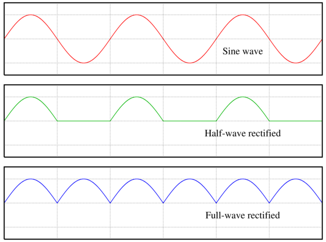
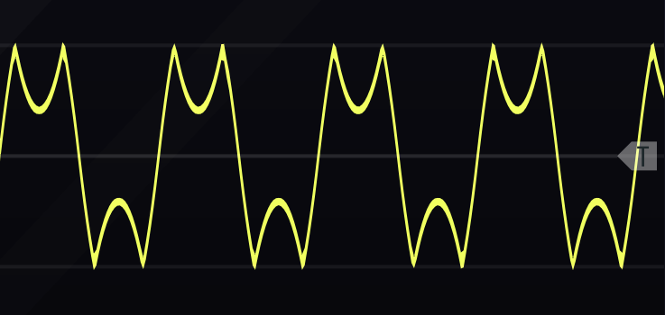
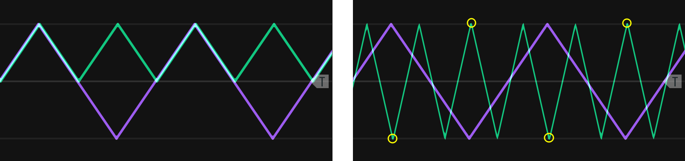

# Modulating Modifiers {#complex-modifiers}

Modifying incoming audio and control signals was introduced in Chapter \@ref(modifiers).
The present chapter introduces new modules and extends earlier concepts in modifiers around the loose organizing theme of converting between earlier signals, e.g. from gates to envelopes.

## Rectification and wavefolding

As discussed in Chapter \@ref(basic-modeling-concepts), signals are either unipolar or bipolar.
One way to make a bipolar signal unipolar is to add an offset to it, e.g. if a signal ranges from -5 to +5 V, then add 5 V to obtain a 0 to +10 V signal.
Another more interesting way to convert a bipolar signal to unipolar is to rectify the signal, as shown in Figure \@ref(fig:rectification).
Half-wave rectification simply removes the negative part of the signal by stopping the signal at zero, and staying at zero until the signal becomes positive again.
Full-wave rectification reflects the signal across the x-axis, i.e. takes the absolute value of the signal.

(ref:rectification) [Rectification](https://upload.wikimedia.org/wikipedia/commons/0/08/Sine_curve_drawing_animation.gif) of a sine wave using either half or full rectification. Image [©  	Omegatron/CC-BY-SA-3.0](https://commons.wikimedia.org/wiki/File:Rectified_waves.png).

```{r rectification, echo=F, out.width="80%", fig.cap="(ref:rectification)"}
 
```

A variation of rectification is wavefolding.
In wavefolding, a comparator (see Section \@ref(addingremoving-gates-with-probability)) reflects the the wave when it reaches an upper or lower threshold, as shown in Figure \@ref(fig:wavefold-sine).
Thus wavefolding is like rectification on parts of the signal that cross these boundaries, but a folding parameter allows the amplitude of the wave to increase until it reaches the opposing boundary, repeating the process.
Wavefolding does not affect the polarity of a signal.

(ref:wavefold-sine) Wavefolding of a sine wave. Note that additional folding can be performed by reflecting the wave peak off the opposing boundary.

```{r wavefold-sine, echo=F, out.width="80%", fig.cap="(ref:wavefold-sine)"}
 
```

Rectification and wavefolding change harmonics and therefore timbre.
The best way to understand their effect on harmonics is to consider a triangle at full rectification.
As the bottom part of the triangle is reflected, the resulting wave is still a triangle wave, but at twice the frequency as before, e.g. a 200 Hz wave becomes a 400 Hz wave, and the signal is offset above zero.
For a triangle wave, wavefolding doesn't double frequency but instead triples it, e.g. a 200 Hz wave becomes a 600 Hz wave. 
Tripling occurs because when a peak reflects, it creates two additional peaks in addition to itself.
Figure \@ref(fig:triangle-rect-fold) illustrates these two cases.
The tripling behavior of wavefolding means that it will add all odd harmonics to a sine wave but not add harmonics to the other basic waveshapes, because they already have odd harmonics.
Instead, wavefolding will change the relative strengths of the harmonics, and as wavefolding increases it will put more energy into higher harmonics for a brighter sound.


(ref:triangle-rect-fold) Full wave rectification (left) and wavefolding (right) of a triangle wave. The wavefolded peaks that have just reached the boundary are circled. 

```{r triangle-rect-fold, echo=F, out.width="80%", fig.cap="(ref:triangle-rect-fold)"}
 
```


The square wave has unusual behavior for wavefolding and rectification that deserves special mention.
During wavefolding, the upper and lower parts of the square wave will move in opposite directions rather than fold as shown in Figures \@ref(fig:wavefold-sine) and \@ref(fig:triangle-rect-fold).
As a consequence, there are moments where the two parts of the square wave meet at zero and result in a non-wave, somewhat comparable to amplitude modulation through wave folding.
Half rectification on a square wave turns it into an identical square wave, but at half amplitude and an offset.
Full rectification on a square wave turns it into just an offset, i.e. a constant voltage.
Because a constant voltage has zero frequency (0 Hz) it can be removed with a high pass filter - this is a good idea in most audio applications where constant voltages create noise.

The effects of rectification and wavefolding on the four basic wave shapes is summarized in Table \@ref(tab:freq-ratio) with respect to the addition of harmonics, change in frequency, and change in amplitude.
In all cases, the amplitude of individual harmonics changes, leading to a change in timbre with respect to the original wave.
Sometimes these changes can be quite extreme.
For example, a saw wave at full rectification keeps all harmonics, but the strongest harmonics more closely match a triangle wave than a saw.

Table: (\#tab:freq-ratio) Addition of harmonics, change in frequency, and change in amplitude to the four basic waveshapes under wavefolding, half rectification, and full rectification. Note all three affect strength of harmonics and so timbre.


| Wave     | Wavefolding   | Half rectification          | Full rectification                |
|----------|---------------|-----------------------------|-----------------------------------|
| Sine     | Odd harmonics | All harmonics               | All harmonics at double frequency |
| Triangle | -             | All harmonics but every 4th | Double frequency                  |
| Square   | -             | Amplitude reduced by half   | Offset voltage                    |
| Saw      | -             | -                           | -                                 |

Let's take a look at the change in harmonics resulting from wavefolding and rectification.
The best way to hear these is to step through with a sequential switch and use an LFO to drive the wavefolding.
Try creating this patch using the button in Figure \@ref(fig:wavefold-rect-example).

(ref:wavefold-rect-example) [Virtual modular](https://cardinal.olney.ai) for contrasting the effect of wavefolding and rectification on the four basic waveshapes. 

<!-- MODAL HTML BLOCK -->
```{r echo=F, out.width="100%"}
modular_modal("wavefold-rect-example", starter_file="empty.vcv", instructions_html="<ul>
<li>Add WT VCO, Utilites, Folding, LFO, Triggers MKIII, 8:1, filtah, Scope, Host audio, and Sassy</li>
<li>Connect WT VCO out to Utilities in, Folding in, 8:1 input 1, Scope input 2, and Scope trigger in</li>
<li>Connect Utilities half rectify out to 8:1 input 3 and full rectify out to 8:1 input 4</li>
<li>Connect LFO triangle out to Folding depth in and change the depth attenuverter (the small knob) to 9 o'clock, a slight amount</li>
<li>Connect Folding out to 8:1 input 2</li>
<li>Connect Triggers MKIII out to 8:1 clock</li>
<li>Set 8:1 steps to 4 and connect out to filtah input</li>
<li>Set filtah type switch to high pass and cutoff to the lowest level (lets everything above zero frequency through)and connect filtah out to Scope in 1</li>
<li>Connect Scope out 1 to Host audio L and Sassy input 1</li>
<li>Adjust Scope time and Sassy levels and FFT resolution to the highest level</li>
<li>Run the patch and observe the following<ul>
<li>Starting with sine, cycle through the 4 wave options using the button and note the change in sound, the image on the scope, and the change in harmonics. Mouse over the harmonics to check if they are all, odd, or even. You may prefer to set the WT VCO frequency to a round number, e.g. 200 Hz, and set the LFO to a slow rate, e.g. .2 Hz in order to make comparisons easier</li>
<li>Repeat the above for the other three waveshapes</li>
</ul></li>
</ul>
<div class='d-flex flex-row justify-content-around'>


</div>
",solution_html="")
```

<!-- CAPTION BLOCK -->
```{r wavefold-rect-example, echo=F, out.width="100%", fig.cap="(ref:wavefold-rect-example)"}
modular_caption()
```


## Slew

## Quantizers


<!-- Remaining plan -->
<!-- 	Modifiers	 -->
<!-- 		Slew -->
<!-- 		Wave-folding -->
<!-- 		Quantizers -->


<!-- worthy orphans -->
<!-- audio rate modulation into resonant filter? -->
<!-- 		Vocoders -->
<!-- - -->
<!-- possibly undercovered -->
<!-- 		Attenuators, inverters, and attenuverters -->
<!-- 		~~Sample and hold~~ -->
<!-- - -->
<!-- Sound design ideas -->
<!-- Cymbal PUSH UNTIL AFTER RING MOD -> clark & reid comparison -->
<!-- Maybe use these? -->
<!-- Growl: Low frequency sine wave modulation of the filter cut-off frequency -->
<!-- wah wah is LFO on LPF cutoff freq -->


<!-- Actual -->
<!--     4 Basic Modeling Concepts -->
<!--     4.1 Modules are the model elements -->
<!--     4.2 Signals are how the model elements interact -->
<!--     4.3 Signals are interpreted by modules -->
<!--     4.4 Pulling it all together -->
<!--         4.4.1 Drone -->
<!--         4.4.2 Using an oscilloscope -->
<!--         4.4.3 Controlling pitch -->
<!--         4.4.4 Controlling note duration (on/off volume) -->
<!--         4.4.5 Controlling note dynamics (volume during note) -->
<!--     4.5 Moving forward -->

<!-- 5 Controllers -->
<!-- 5.1 Clocks -->

<!--     5.1.1 Clock under a scope -->
<!--     5.1.2 Clock as a generator -->

<!-- 5.2 Sequencers -->

<!--     5.2.1 Clocks as sequencers -->
<!--     5.2.2 Trigger sequencers -->
<!--     5.2.3 Control voltage sequencers -->


<!--     6 Generators -->
<!--     6.1 Chords -->
<!--     6.2 Chorus -->
<!--     6.3 Low frequency oscillators & uses -->
<!--         6.3.1 Pulse width modulation -->
<!--         6.3.2 Vibrato -->
<!--         6.3.3 Tremolo -->
<!--     6.4 Synchronization -->
<!--     6.5 Noise -->
<!--     6.6 Samplers -->

<!-- 7 Modifiers -->
<!-- 7.1 Effects -->
<!--     7.1.1 Delays -->
<!--     7.1.2 Reverb -->
<!--     7.1.3 Chorus -->
<!--     7.1.4 Flanger -->
<!--     7.1.5 Phaser -->
<!-- 7.2 Voltage controlled filters -->
<!--     7.2.1 Filters are imperfect -->
<!--     7.2.2 Filters change frequency and phase -->
<!--     7.2.3 Combining filters -->
<!--     7.2.4 Resonance -->


<!-- 8 Designing a Kick Drum -->
<!-- 8.1 Problem solving for sound synthesis -->
<!--     8.1.1 Understand the problem -->
<!--     8.1.2 Devise a plan -->
<!--     8.1.3 Carry out the plan (and replanning) -->
<!--     8.1.4 Evaluate the solution -->
<!-- 8.2 Reviewing previous kick drum patches -->
<!--     8.2.1 Sine with envelope -->
<!--     8.2.2 Sine with an envelope plus noise burst -->
<!-- 8.3 Alternative approaches -->
<!--     8.3.1 Improving our understanding of the problem -->
<!--     8.3.2 Devising new plans -->
<!--     8.3.3 Working backwards -->


<!-- 9 Eighties Lead & Chiptune -->
<!-- 9.1 Eighties Lead -->
<!--     9.1.1 Waveshape -->
<!--     9.1.2 Dynamics -->
<!-- 9.2 Chiptune -->
<!--     9.2.1 Triad arpeggio -->
<!--     9.2.2 LFO PWM -->
<!--     9.2.3 Secondary sequencer for transposition -->
<!--     9.2.4 Hats and kick -->


<!-- 10 Controllers -->
<!-- 10.1 Modifying gates -->
<!-- 10.2 Making gates with logic -->
<!-- 10.3 Adding/removing gates with probability -->
<!-- 10.4 Speed variable clocks using LFOs -->
<!-- 10.5 Euclidean rhythm -->
<!-- 10.6 Sequential switches -->


<!-- 11 Generators -->
<!-- 11.1 Modulating amplitude -->
<!--     11.1.1 Amplitude modulation -->
<!--     11.1.2 Ring modulation -->
<!-- 11.2 Modulating frequency -->
<!--     11.2.1 Frequency modulation -->
<!--     11.2.2 Analogue exponential frequency modulation -->
<!--     11.2.3 Analogue linear frequency modulation -->
<!--     11.2.4 Analogue through-zero frequency modulation -->
<!--     11.2.5 Phase modulation -->
