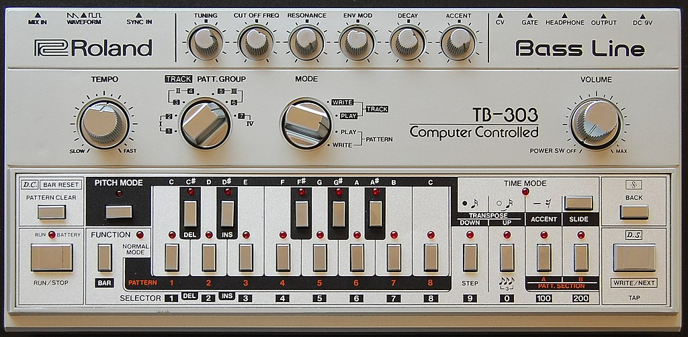
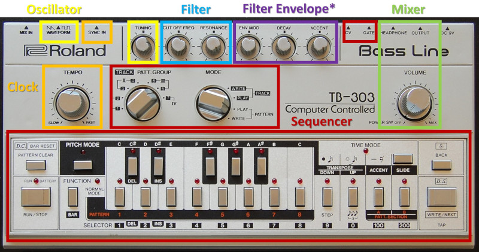
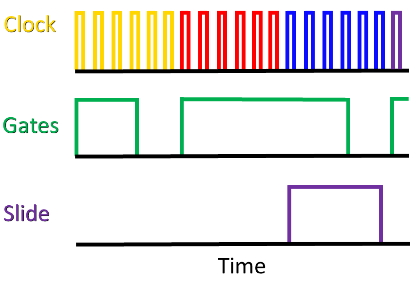
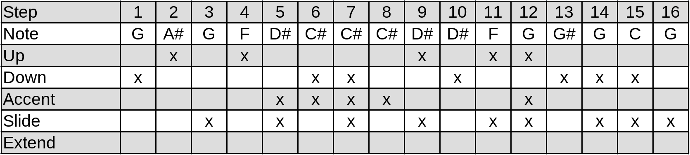

# (PART) Sound Design 2 {-}

# TB-303

This chapter examines a new sound design problem using the problem solving approach introduced in Chapter \@ref(designing-a-kick-drum).
The problem is to make a lead by recreating the fundamental characteristics of the Roland TB-303, an iconic instrument in acid house and subsequent genres of electronic music.
Thus the problem is not only about recreating a particular sound but also involves emulating the key features of the instrument in order to produce the sound.

## History

The [TB-303](https://en.wikipedia.org/wiki/Roland_TB-303) (hereafter 303; see Figure \@ref(fig:303)),  was released in 1981 and withdrawn in 1984 as a commercial failure.
The original purpose of the 303 was to replace a bass guitar in much the same way a drum machine like the [TR-808](https://en.wikipedia.org/wiki/Roland_TR-808) was meant to replace drums.
With its 92-page instruction manual, the 303 was widely considered as difficult to use, which together with a $1300 price tag^[In 2022 dollars.], likely led to its demise.

(ref:303) A Roland TB-303. Image [public domain](https://commons.wikimedia.org/wiki/File:Roland_TB-303_Panel.jpg).

```{r 303, echo=F, out.width="100%", fig.cap="(ref:303)"}
 
```


The 303's failure in the marketplace, however, meant that it was cheaply available in the secondhand market.
Dance music artists, most notably in Chicago, began incorporating the 303 into their performances, and the 303 became a signature sound of [acid house](https://en.wikipedia.org/wiki/Acid_house).
While the 303 was designed for bass guitar sounds, which are a common element of [disco](https://en.wikipedia.org/wiki/Disco) dance music, the 303 could also easily (and perhaps more easily) produce sounds that are nothing like a bass guitar or any other instrument from that time.^[Squelch, chirp, and scream are common descriptors of the 303 sound.]

The 303's use in acid house may be due to its extremely limited sequencer.
The 303 sequencer stored pitch and time information separately, and each of these were entered using separate modes.
As a result, it was not possible to edit the complete sequence in real time, i.e. during performance.^[It is possible to [live-play](https://tinyloops.com/tb303/quick_results.html#02) the 303 and [switch between tracks](https://tinyloops.com/tb303/quick_results.html#07), but this is not the same as editing a running sequence.]
However, it was very easy to change the timbre of an existing sequence using various parameter knobs (mostly across the top in Figure \@ref(fig:303)). 
The combined difficulty of imputing note sequences and the ease of using parameter knobs to sculpt timbres led early acid house pioneers to focus on the later.^[https://www.dwrl.utexas.edu/2016/11/22/rhetorical-synthesis-the-story-of-the-roland-tb-303/]
Thus repeating sequences with shifting timbres became a defining feature of acid house, as shown the early example in Figure \@ref(fig:acid-tracks).

(ref:acid-tracks) [*Acid Tracks*](https://en.wikipedia.org/wiki/Acid_Tracks) by [Phuture](https://en.wikipedia.org/wiki/Phuture). *Acid Tracks* helped define the sound of acid house.

```{r, acid-tracks, out.width='100%', fig.cap="(ref:acid-tracks)", dev='png', cache=TRUE, screenshot.opts=list(vwidth=400,cliprect = c(0, 0, 400, 300)), echo=F}
# embed_youtube("igNBeo3QSqc",75) #copyright restriction on embedding
knitr::include_url("https://olney.ai/ct-modular-book/images/acid-tracks.html", height = "60px")
```

## Problem solving approach

The problem solving stages elaborated for sound design in Chapter \@ref(designing-a-kick-drum) mostly apply to emulating a 303 but with some slight variation because the current goal is create a specific sound by emulating the key features of a 303.
Recall the problem solving stages are:

- Understand the problem
- Make a plan
- Implement the plan
- Evaluate the solution

For the understanding the problem stage, we need to know the defining characteristics of the 303 and what makes it special.
According to Robin Whittle, developer of the Devil Fish 303 mod, the most important aspects of the 303 sound are its sequencer, filter, filter envelope, and the oscillator to a minor extent.^[Most information is on Robin's [main website](https://www.firstpr.com.au/rwi/dfish/index.html) including the Devil Fish manual. Additional information is on the [Analogue Heaven mailing list](http://www.retrosynth.com/ah/).]

For the making a plan stage, Whittle's observations suggest a plan based around decomposition, namely that the 303 can be considered as a collection of modules.
Any 303 function that is generic can be satisfied with generic modules, while the functions contributing to the 303's distinctive sound can be addressed independently as subproblems.
Figure \@ref(fig:tb303-annotated) shows how the 303 interface is loosely organized around modular concepts like oscillators, filters, and envelopes and further supports an overall decomposition strategy for emulating a 303 in modular.

(ref:tb303-annotated) A Roland TB-303 annotated to group interface elements according to modular concepts. Note the accent knob affects both filter and volume envelopes. 

```{r tb303-annotated, echo=F, out.width="100%", fig.cap="(ref:tb303-annotated)"}
 
```

For the implementing a plan stage, we need evaluation criteria in order to assess alternate solutions and gauge our progress.
A simple and straightforward evaluation criterion is to use a well-known song with a 303 line.
Ideally, the 303 line should be easy to sequence and easy to listen to repeatedly throughout our design process.
*Da Funk* by Daft Punk seems suitable for this purpose ([listen here](https://youtu.be/PwILkY9gRrc?t=145)).
Another source of evaluation material has been provided by Din Sync, whose [reference recordings of a 303](http://www.dinsync.info/2010/02/tb-303-reference-recordings-for-x0xb0x.html) systematically map the sound of a C note across 303 knob positions.
The Din Sync materials are particularly useful for isolating parameters of the 303 as an instrument, which is very difficult to do from a live performance.
A 1-10 scale for both criteria seem appropriate at first glance.
Using these materials, we can address the subproblems of sequencing, oscillators, filter, and envelopes independently using the same four problem solving stages.

The evaluation stage, which we will cycle through iteratively, will use the *Da Funk* evaluation to determine overall success.
If we were trying to recreate the 303 in a broad sense, then additional evaluation materials would be necessary, but for the purposes of this chapter, this should be sufficient.

## Sequencing

Let's begin with understanding the sequencing problem.
The 303 has a maximum pattern length of 16 steps.
Because reducing the pattern length is somewhat tedious, many 303 patterns are 16 steps.
By default, the steps are staccato 16th notes in 4/4 time.^[The 303 also has a triplet mode, but that is not generally considered a signature component of the sound.]
As previously stated, the 303 sequencer has a timing mode and a pitch mode.
In timing mode, each step is identified as beginning a new note, beginning a rest, or continuing the previous step (which may be a note or a rest).
In pitch mode, each note is identified, whether it is transposed up/down an octave, whether is has an accent, and whether it has a slide.
For now, think of the accent as producing a slightly louder note, and a slide as a glide in pitch from one note to the next.
According to Whittle, the accent and slide are the two components of the sequencer that are the most important to the overall sound of a 303.

Figure \@ref(fig:tb303-slide) shows an example 303 clock and gate pattern modified by a slide.
Each step in the example has a different note and is represented by a clock color.
Gates for a single 16th note only extend less than a full step's worth of clock pulses, specifically three pulses and the positive portion of the fourth pulse.
Short gates relative to steps give the 303 its staccato note feel.
Slides, in contrast to gates, extend the entire step on which they are placed.
In the example, a slide has been placed on the red note, causing its gate to extend through the blue note's gate.
The the red note begins its slide into the blue note when the blue note starts, and the slide circuit stays on until the purple note.
Accents (not shown) are in time with the gates, and the gates control the envelopes receiving the accents.
My understanding is that continuing the previous note creates the same gate extension as using a slide.

(ref:tb303-slide) Clock, gate, and slide behavior of a 303 for four notes across four steps, indicated by different colors on the clock pulses. Note the gates are shorter than a step, but the slide extends for the entire step. ^[Adapted from https://www.firstpr.com.au/rwi/dfish/303-slide.html.]

```{r tb303-slide, echo=F, out.width="80%", fig.cap="(ref:tb303-slide)"}
 
```

Based on the above description, any solution to the 303 sequencer problem will need to somehow represent the following:

- Notes and rests
- Variable length gates in response to slides and step continuations
- Presence of accents and slides

To make a plan, let's consider some of our previous sequencing approaches from Chapter \@ref(complex-controllers).
First, clocks alone are clearly insufficient because sometimes we need rests.
We could accomplish rests using clock divisions and logic, but the variable length of notes and rests in the 303 would seem to make that approach very complicated, even if it is possible.
The two remaining obvious choices are modifying gates and using an LFO as a speed variable clock.
In the modifying gates approach, we'd zero out gate lengths to make rests and arbitrarily extend gate lengths for continued notes/slides and rests.
In the LFO clock approach, an LFO would be synced by a clock, and we'd increase/decrease the speed of the clock to change gate duration.
Comparing these two approaches with the sequencing needs of the 303, it seems that the speed variable clock has capabilities that aren't needed here, like adding multiple beats, e.g. subdividing 1/16th notes.
For the goal of emulating 303 sequencing, the modifying gates approach seems like it will accomplish the goals of variable length gates and rests with a minimum of complexity.

Returning to the list of sequencing elements we need to represent, most of the elements have an on/off flavor except for pitches: note/rest, accents, slides, and extended gates are either present or not.
This presence/absence flavor suggests that these elements are best represented using trigger sequencers that represent presence/absence of something at each step.
Because the 303 forces 16th notes in 16 steps as the minimal resolution, we are not sacrificing flexibility by using triggger sequencers in this case.
Altogether, this suggests one control voltage sequencer for pitch and four trigger sequencers for note/rest, accents, slides, and extended gate.
The pitch sequencing in this approach is handling three functions on the 303: defining a note, up transpositions, and down transpositions.
Try patching up *Da Funk* using a 16 step control voltage sequencer with some other placeholder modules to generate sound using the button in Figure .
The notation for the sequence is provided in the patch instructions.


Sequencer (with basic voice: oscillator/distortion)


Figure \@ref(fig:tb303-seq).

(ref:tb303-seq) [Virtual modular](https://cardinal.olney.ai) for tb303-seq

<!-- MODAL HTML BLOCK -->
```{r echo=F, out.width="100%"}
modular_modal("tb303-seq", starter_file="empty.vcv", instructions_html="<ul>
<li>Add two VCOs, QuadVCA/Mixer, Scope, Host audio, and Sassy Scope</li>
<li>Tune VCO 1 to 40 Hz and VCO 2 to 82 Hz</li>
<li>Connect VCO 1 square out to QuadVCA/Mixer input 1 and VCO 2 square out to QuadVCA/Mixer input 2</li>
<li>Connect QuadVCA/Mixer mix out to Scope in 1, connect Scope out 1 to Host audio L and Sassy input 1</li>
<li>Adjust the Scope time to see a single wave or two; use TRG button to sync the scope</li>
<li>Adjust Sassy to Freq, channel 1 level down to 1/32, resolution to 1000ms, and FFT to 8x. Note it is challenging to get the relative amplitudes of the spectrum using this or other settings with Sassy.</li>
<li>Try the following and note the differences in the sound, scope waveshape, and spectrum<ul>
<li>Adjust the mix levels for the two oscillators to best match the target spectrum</li>
<li>Adjust the tuning of VCO 1 to 41 Hz and note the waveshape stabilizes on the scope. This shows the effect of the original detuning. Now change it back.</li>
<li>Capture audio in Audacity and compute the spectrum. The mix ratios to match the target spectrum are approximately 60% and 100%</li>
</ul></li>
<li>After changing VCO 1 to saw, try the following and note the differences in the sound, scope waveshape, and spectrum<ul>
<li>Adjust the mix levels for the two oscillators to best match the target spectrum</li>
<li>Adjust the tuning of VCO 1 to 41 Hz and note the waveshape stabilizes on the scope. This shows the effect of the original detuning. Now change it back.</li>
<li>Capture audio in Audacity and compute the spectrum. The mix ratios to match the target spectrum are approximately 100% and 100%</li>
</ul></li>
</ul>
<div class='d-flex flex-row justify-content-around'>

</div>
",solution_html="<h4>Solution for two square waves only</h4>")
```

<!-- CAPTION BLOCK -->
```{r tb303-seq, echo=F, out.width="100%", fig.cap="(ref:tb303-seq)"}
modular_caption()
```

Gate extender

Figure \@ref(fig:tb303-seq-extendgate).

(ref:tb303-seq-extendgate) [Virtual modular](https://cardinal.olney.ai) for tb303-seq-extendgate

<!-- MODAL HTML BLOCK -->
```{r echo=F, out.width="100%"}
modular_modal("tb303-seq-extendgate", starter_file="tb303-seq.vcv", instructions_html="<ul>
<li>Add two VCOs, QuadVCA/Mixer, Scope, Host audio, and Sassy Scope</li>
<li>Tune VCO 1 to 40 Hz and VCO 2 to 82 Hz</li>
<li>Connect VCO 1 square out to QuadVCA/Mixer input 1 and VCO 2 square out to QuadVCA/Mixer input 2</li>
<li>Connect QuadVCA/Mixer mix out to Scope in 1, connect Scope out 1 to Host audio L and Sassy input 1</li>
<li>Adjust the Scope time to see a single wave or two; use TRG button to sync the scope</li>
<li>Adjust Sassy to Freq, channel 1 level down to 1/32, resolution to 1000ms, and FFT to 8x. Note it is challenging to get the relative amplitudes of the spectrum using this or other settings with Sassy.</li>
<li>Try the following and note the differences in the sound, scope waveshape, and spectrum<ul>
<li>Adjust the mix levels for the two oscillators to best match the target spectrum</li>
<li>Adjust the tuning of VCO 1 to 41 Hz and note the waveshape stabilizes on the scope. This shows the effect of the original detuning. Now change it back.</li>
<li>Capture audio in Audacity and compute the spectrum. The mix ratios to match the target spectrum are approximately 60% and 100%</li>
</ul></li>
<li>After changing VCO 1 to saw, try the following and note the differences in the sound, scope waveshape, and spectrum<ul>
<li>Adjust the mix levels for the two oscillators to best match the target spectrum</li>
<li>Adjust the tuning of VCO 1 to 41 Hz and note the waveshape stabilizes on the scope. This shows the effect of the original detuning. Now change it back.</li>
<li>Capture audio in Audacity and compute the spectrum. The mix ratios to match the target spectrum are approximately 100% and 100%</li>
</ul></li>
</ul>
<div class='d-flex flex-row justify-content-around'>

</div>
",solution_html="<h4>Solution for two square waves only</h4>")
```

<!-- CAPTION BLOCK -->
```{r tb303-seq-extendgate, echo=F, out.width="100%", fig.cap="(ref:tb303-seq-extendgate)"}
modular_caption()
```

Regular gate

Figure \@ref(fig:tb303-seq-extendgate-reggate).

(ref:tb303-seq-extendgate-reggate) [Virtual modular](https://cardinal.olney.ai) for tb303-seq-extendgate-reggate

<!-- MODAL HTML BLOCK -->
```{r echo=F, out.width="100%"}
modular_modal("tb303-seq-extendgate-reggate", starter_file="tb303-seq-extendgate.vcv", instructions_html="<ul>
<li>Add two VCOs, QuadVCA/Mixer, Scope, Host audio, and Sassy Scope</li>
<li>Tune VCO 1 to 40 Hz and VCO 2 to 82 Hz</li>
<li>Connect VCO 1 square out to QuadVCA/Mixer input 1 and VCO 2 square out to QuadVCA/Mixer input 2</li>
<li>Connect QuadVCA/Mixer mix out to Scope in 1, connect Scope out 1 to Host audio L and Sassy input 1</li>
<li>Adjust the Scope time to see a single wave or two; use TRG button to sync the scope</li>
<li>Adjust Sassy to Freq, channel 1 level down to 1/32, resolution to 1000ms, and FFT to 8x. Note it is challenging to get the relative amplitudes of the spectrum using this or other settings with Sassy.</li>
<li>Try the following and note the differences in the sound, scope waveshape, and spectrum<ul>
<li>Adjust the mix levels for the two oscillators to best match the target spectrum</li>
<li>Adjust the tuning of VCO 1 to 41 Hz and note the waveshape stabilizes on the scope. This shows the effect of the original detuning. Now change it back.</li>
<li>Capture audio in Audacity and compute the spectrum. The mix ratios to match the target spectrum are approximately 60% and 100%</li>
</ul></li>
<li>After changing VCO 1 to saw, try the following and note the differences in the sound, scope waveshape, and spectrum<ul>
<li>Adjust the mix levels for the two oscillators to best match the target spectrum</li>
<li>Adjust the tuning of VCO 1 to 41 Hz and note the waveshape stabilizes on the scope. This shows the effect of the original detuning. Now change it back.</li>
<li>Capture audio in Audacity and compute the spectrum. The mix ratios to match the target spectrum are approximately 100% and 100%</li>
</ul></li>
</ul>
<div class='d-flex flex-row justify-content-around'>

</div>
",solution_html="<h4>Solution for two square waves only</h4>")
```

<!-- CAPTION BLOCK -->
```{r tb303-seq-extendgate-reggate, echo=F, out.width="100%", fig.cap="(ref:tb303-seq-extendgate-reggate)"}
modular_caption()
```

Slide gate

Figure \@ref(fig:tb303-seq-extendgate-reggate-slidegate).

(ref:tb303-seq-extendgate-reggate-slidegate) [Virtual modular](https://cardinal.olney.ai) for tb303-seq-extendgate-reggate-slidegate

<!-- MODAL HTML BLOCK -->
```{r echo=F, out.width="100%"}
modular_modal("tb303-seq-extendgate-reggate-slidegate", starter_file="tb303-seq-extendgate-reggate.vcv", instructions_html="<ul>
<li>Add two VCOs, QuadVCA/Mixer, Scope, Host audio, and Sassy Scope</li>
<li>Tune VCO 1 to 40 Hz and VCO 2 to 82 Hz</li>
<li>Connect VCO 1 square out to QuadVCA/Mixer input 1 and VCO 2 square out to QuadVCA/Mixer input 2</li>
<li>Connect QuadVCA/Mixer mix out to Scope in 1, connect Scope out 1 to Host audio L and Sassy input 1</li>
<li>Adjust the Scope time to see a single wave or two; use TRG button to sync the scope</li>
<li>Adjust Sassy to Freq, channel 1 level down to 1/32, resolution to 1000ms, and FFT to 8x. Note it is challenging to get the relative amplitudes of the spectrum using this or other settings with Sassy.</li>
<li>Try the following and note the differences in the sound, scope waveshape, and spectrum<ul>
<li>Adjust the mix levels for the two oscillators to best match the target spectrum</li>
<li>Adjust the tuning of VCO 1 to 41 Hz and note the waveshape stabilizes on the scope. This shows the effect of the original detuning. Now change it back.</li>
<li>Capture audio in Audacity and compute the spectrum. The mix ratios to match the target spectrum are approximately 60% and 100%</li>
</ul></li>
<li>After changing VCO 1 to saw, try the following and note the differences in the sound, scope waveshape, and spectrum<ul>
<li>Adjust the mix levels for the two oscillators to best match the target spectrum</li>
<li>Adjust the tuning of VCO 1 to 41 Hz and note the waveshape stabilizes on the scope. This shows the effect of the original detuning. Now change it back.</li>
<li>Capture audio in Audacity and compute the spectrum. The mix ratios to match the target spectrum are approximately 100% and 100%</li>
</ul></li>
</ul>
<div class='d-flex flex-row justify-content-around'>

</div>
",solution_html="<h4>Solution for two square waves only</h4>")
```

<!-- CAPTION BLOCK -->
```{r tb303-seq-extendgate-reggate-slidegate, echo=F, out.width="100%", fig.cap="(ref:tb303-seq-extendgate-reggate-slidegate)"}
modular_caption()
```


Oscillator

Figure \@ref(fig:tb303-seq-extendgate-reggate-slidegate-osc).

(ref:tb303-seq-extendgate-reggate-slidegate-osc) [Virtual modular](https://cardinal.olney.ai) for tb303-seq-extendgate-reggate-slidegate-osc

<!-- MODAL HTML BLOCK -->
```{r echo=F, out.width="100%"}
modular_modal("tb303-seq-extendgate-reggate-slidegate-osc", starter_file="tb303-seq-extendgate-reggate-slidegate.vcv", instructions_html="<ul>
<li>Add two VCOs, QuadVCA/Mixer, Scope, Host audio, and Sassy Scope</li>
<li>Tune VCO 1 to 40 Hz and VCO 2 to 82 Hz</li>
<li>Connect VCO 1 square out to QuadVCA/Mixer input 1 and VCO 2 square out to QuadVCA/Mixer input 2</li>
<li>Connect QuadVCA/Mixer mix out to Scope in 1, connect Scope out 1 to Host audio L and Sassy input 1</li>
<li>Adjust the Scope time to see a single wave or two; use TRG button to sync the scope</li>
<li>Adjust Sassy to Freq, channel 1 level down to 1/32, resolution to 1000ms, and FFT to 8x. Note it is challenging to get the relative amplitudes of the spectrum using this or other settings with Sassy.</li>
<li>Try the following and note the differences in the sound, scope waveshape, and spectrum<ul>
<li>Adjust the mix levels for the two oscillators to best match the target spectrum</li>
<li>Adjust the tuning of VCO 1 to 41 Hz and note the waveshape stabilizes on the scope. This shows the effect of the original detuning. Now change it back.</li>
<li>Capture audio in Audacity and compute the spectrum. The mix ratios to match the target spectrum are approximately 60% and 100%</li>
</ul></li>
<li>After changing VCO 1 to saw, try the following and note the differences in the sound, scope waveshape, and spectrum<ul>
<li>Adjust the mix levels for the two oscillators to best match the target spectrum</li>
<li>Adjust the tuning of VCO 1 to 41 Hz and note the waveshape stabilizes on the scope. This shows the effect of the original detuning. Now change it back.</li>
<li>Capture audio in Audacity and compute the spectrum. The mix ratios to match the target spectrum are approximately 100% and 100%</li>
</ul></li>
</ul>
<div class='d-flex flex-row justify-content-around'>

</div>
",solution_html="<h4>Solution for two square waves only</h4>")
```

<!-- CAPTION BLOCK -->
```{r tb303-seq-extendgate-reggate-slidegate-osc, echo=F, out.width="100%", fig.cap="(ref:tb303-seq-extendgate-reggate-slidegate-osc)"}
modular_caption()
```

Volume envelope generator/Main envelope generator

Figure \@ref(fig:tb303-seq-extendgate-reggate-slidegate-osc-megveg).

(ref:tb303-seq-extendgate-reggate-slidegate-osc-megveg) [Virtual modular](https://cardinal.olney.ai) for tb303-seq-extendgate-reggate-slidegate-osc-megveg

<!-- MODAL HTML BLOCK -->
```{r echo=F, out.width="100%"}
modular_modal("tb303-seq-extendgate-reggate-slidegate-osc-megveg", starter_file="tb303-seq-extendgate-reggate-slidegate-osc.vcv", instructions_html="<ul>
<li>Add two VCOs, QuadVCA/Mixer, Scope, Host audio, and Sassy Scope</li>
<li>Tune VCO 1 to 40 Hz and VCO 2 to 82 Hz</li>
<li>Connect VCO 1 square out to QuadVCA/Mixer input 1 and VCO 2 square out to QuadVCA/Mixer input 2</li>
<li>Connect QuadVCA/Mixer mix out to Scope in 1, connect Scope out 1 to Host audio L and Sassy input 1</li>
<li>Adjust the Scope time to see a single wave or two; use TRG button to sync the scope</li>
<li>Adjust Sassy to Freq, channel 1 level down to 1/32, resolution to 1000ms, and FFT to 8x. Note it is challenging to get the relative amplitudes of the spectrum using this or other settings with Sassy.</li>
<li>Try the following and note the differences in the sound, scope waveshape, and spectrum<ul>
<li>Adjust the mix levels for the two oscillators to best match the target spectrum</li>
<li>Adjust the tuning of VCO 1 to 41 Hz and note the waveshape stabilizes on the scope. This shows the effect of the original detuning. Now change it back.</li>
<li>Capture audio in Audacity and compute the spectrum. The mix ratios to match the target spectrum are approximately 60% and 100%</li>
</ul></li>
<li>After changing VCO 1 to saw, try the following and note the differences in the sound, scope waveshape, and spectrum<ul>
<li>Adjust the mix levels for the two oscillators to best match the target spectrum</li>
<li>Adjust the tuning of VCO 1 to 41 Hz and note the waveshape stabilizes on the scope. This shows the effect of the original detuning. Now change it back.</li>
<li>Capture audio in Audacity and compute the spectrum. The mix ratios to match the target spectrum are approximately 100% and 100%</li>
</ul></li>
</ul>
<div class='d-flex flex-row justify-content-around'>

</div>
",solution_html="<h4>Solution for two square waves only</h4>")
```

<!-- CAPTION BLOCK -->
```{r tb303-seq-extendgate-reggate-slidegate-osc-megveg, echo=F, out.width="100%", fig.cap="(ref:tb303-seq-extendgate-reggate-slidegate-osc-megveg)"}
modular_caption()
```


Accent

Figure \@ref(fig:tb303-seq-extendgate-reggate-slidegate-osc-megveg-accents).

(ref:tb303-seq-extendgate-reggate-slidegate-osc-megveg-accents) [Virtual modular](https://cardinal.olney.ai) for tb303-seq-extendgate-reggate-slidegate-osc-megveg-accents

<!-- MODAL HTML BLOCK -->
```{r echo=F, out.width="100%"}
modular_modal("tb303-seq-extendgate-reggate-slidegate-osc-megveg-accents", starter_file="tb303-seq-extendgate-reggate-slidegate-osc-megveg.vcv", instructions_html="<ul>
<li>Add two VCOs, QuadVCA/Mixer, Scope, Host audio, and Sassy Scope</li>
<li>Tune VCO 1 to 40 Hz and VCO 2 to 82 Hz</li>
<li>Connect VCO 1 square out to QuadVCA/Mixer input 1 and VCO 2 square out to QuadVCA/Mixer input 2</li>
<li>Connect QuadVCA/Mixer mix out to Scope in 1, connect Scope out 1 to Host audio L and Sassy input 1</li>
<li>Adjust the Scope time to see a single wave or two; use TRG button to sync the scope</li>
<li>Adjust Sassy to Freq, channel 1 level down to 1/32, resolution to 1000ms, and FFT to 8x. Note it is challenging to get the relative amplitudes of the spectrum using this or other settings with Sassy.</li>
<li>Try the following and note the differences in the sound, scope waveshape, and spectrum<ul>
<li>Adjust the mix levels for the two oscillators to best match the target spectrum</li>
<li>Adjust the tuning of VCO 1 to 41 Hz and note the waveshape stabilizes on the scope. This shows the effect of the original detuning. Now change it back.</li>
<li>Capture audio in Audacity and compute the spectrum. The mix ratios to match the target spectrum are approximately 60% and 100%</li>
</ul></li>
<li>After changing VCO 1 to saw, try the following and note the differences in the sound, scope waveshape, and spectrum<ul>
<li>Adjust the mix levels for the two oscillators to best match the target spectrum</li>
<li>Adjust the tuning of VCO 1 to 41 Hz and note the waveshape stabilizes on the scope. This shows the effect of the original detuning. Now change it back.</li>
<li>Capture audio in Audacity and compute the spectrum. The mix ratios to match the target spectrum are approximately 100% and 100%</li>
</ul></li>
</ul>
<div class='d-flex flex-row justify-content-around'>

</div>
",solution_html="<h4>Solution for two square waves only</h4>")
```

<!-- CAPTION BLOCK -->
```{r tb303-seq-extendgate-reggate-slidegate-osc-megveg-accents, echo=F, out.width="100%", fig.cap="(ref:tb303-seq-extendgate-reggate-slidegate-osc-megveg-accents)"}
modular_caption()
```


FINAL


Figure \@ref(fig:tb303-final).

(ref:tb303-final) [Virtual modular](https://cardinal.olney.ai) for tb303-final

<!-- MODAL HTML BLOCK -->
```{r echo=F, out.width="100%"}
modular_modal("tb303-final", starter_file="tb303-seq-extendgate-reggate-slidegate-osc-megveg-accents.vcv", instructions_html="<ul>
<li>Add two VCOs, QuadVCA/Mixer, Scope, Host audio, and Sassy Scope</li>
<li>Tune VCO 1 to 40 Hz and VCO 2 to 82 Hz</li>
<li>Connect VCO 1 square out to QuadVCA/Mixer input 1 and VCO 2 square out to QuadVCA/Mixer input 2</li>
<li>Connect QuadVCA/Mixer mix out to Scope in 1, connect Scope out 1 to Host audio L and Sassy input 1</li>
<li>Adjust the Scope time to see a single wave or two; use TRG button to sync the scope</li>
<li>Adjust Sassy to Freq, channel 1 level down to 1/32, resolution to 1000ms, and FFT to 8x. Note it is challenging to get the relative amplitudes of the spectrum using this or other settings with Sassy.</li>
<li>Try the following and note the differences in the sound, scope waveshape, and spectrum<ul>
<li>Adjust the mix levels for the two oscillators to best match the target spectrum</li>
<li>Adjust the tuning of VCO 1 to 41 Hz and note the waveshape stabilizes on the scope. This shows the effect of the original detuning. Now change it back.</li>
<li>Capture audio in Audacity and compute the spectrum. The mix ratios to match the target spectrum are approximately 60% and 100%</li>
</ul></li>
<li>After changing VCO 1 to saw, try the following and note the differences in the sound, scope waveshape, and spectrum<ul>
<li>Adjust the mix levels for the two oscillators to best match the target spectrum</li>
<li>Adjust the tuning of VCO 1 to 41 Hz and note the waveshape stabilizes on the scope. This shows the effect of the original detuning. Now change it back.</li>
<li>Capture audio in Audacity and compute the spectrum. The mix ratios to match the target spectrum are approximately 100% and 100%</li>
</ul></li>
</ul>
<div class='d-flex flex-row justify-content-around'>

</div>
",solution_html="<h4>Solution for two square waves only</h4>")
```

<!-- CAPTION BLOCK -->
```{r tb303-final, echo=F, out.width="100%", fig.cap="(ref:tb303-final)"}
modular_caption()
```


<!-- Remaining plan -->

<!-- Sound design ideas -->
<!-- - cymbal -->
<!-- - 303 -->
<!-- - krell -->


<!-- worthy orphans -->
<!-- audio rate modulation into resonant filter? -->
<!-- 		Vocoders -->
<!-- - -->
<!-- possibly undercovered -->
<!-- 		Attenuators, inverters, and attenuverters -->
<!-- 		~~Sample and hold~~ -->
<!-- - -->
<!-- Sound design ideas -->
<!-- Cymbal PUSH UNTIL AFTER RING MOD -> clark & reid comparison -->
<!-- Maybe use these? -->
<!-- Growl: Low frequency sine wave modulation of the filter cut-off frequency -->
<!-- wah wah is LFO on LPF cutoff freq -->


<!-- Actual -->
<!--     4 Basic Modeling Concepts -->
<!--     4.1 Modules are the model elements -->
<!--     4.2 Signals are how the model elements interact -->
<!--     4.3 Signals are interpreted by modules -->
<!--     4.4 Pulling it all together -->
<!--         4.4.1 Drone -->
<!--         4.4.2 Using an oscilloscope -->
<!--         4.4.3 Controlling pitch -->
<!--         4.4.4 Controlling note duration (on/off volume) -->
<!--         4.4.5 Controlling note dynamics (volume during note) -->
<!--     4.5 Moving forward -->

<!-- 5 Controllers -->
<!-- 5.1 Clocks -->

<!--     5.1.1 Clock under a scope -->
<!--     5.1.2 Clock as a generator -->

<!-- 5.2 Sequencers -->

<!--     5.2.1 Clocks as sequencers -->
<!--     5.2.2 Trigger sequencers -->
<!--     5.2.3 Control voltage sequencers -->


<!--     6 Generators -->
<!--     6.1 Chords -->
<!--     6.2 Chorus -->
<!--     6.3 Low frequency oscillators & uses -->
<!--         6.3.1 Pulse width modulation -->
<!--         6.3.2 Vibrato -->
<!--         6.3.3 Tremolo -->
<!--     6.4 Synchronization -->
<!--     6.5 Noise -->
<!--     6.6 Samplers -->

<!-- 7 Modifiers -->
<!-- 7.1 Effects -->
<!--     7.1.1 Delays -->
<!--     7.1.2 Reverb -->
<!--     7.1.3 Chorus -->
<!--     7.1.4 Flanger -->
<!--     7.1.5 Phaser -->
<!-- 7.2 Voltage controlled filters -->
<!--     7.2.1 Filters are imperfect -->
<!--     7.2.2 Filters change frequency and phase -->
<!--     7.2.3 Combining filters -->
<!--     7.2.4 Resonance -->


<!-- 8 Designing a Kick Drum -->
<!-- 8.1 Problem solving for sound synthesis -->
<!--     8.1.1 Understand the problem -->
<!--     8.1.2 Devise a plan -->
<!--     8.1.3 Carry out the plan (and replanning) -->
<!--     8.1.4 Evaluate the solution -->
<!-- 8.2 Reviewing previous kick drum patches -->
<!--     8.2.1 Sine with envelope -->
<!--     8.2.2 Sine with an envelope plus noise burst -->
<!-- 8.3 Alternative approaches -->
<!--     8.3.1 Improving our understanding of the problem -->
<!--     8.3.2 Devising new plans -->
<!--     8.3.3 Working backwards -->


<!-- 9 Eighties Lead & Chiptune -->
<!-- 9.1 Eighties Lead -->
<!--     9.1.1 Waveshape -->
<!--     9.1.2 Dynamics -->
<!-- 9.2 Chiptune -->
<!--     9.2.1 Triad arpeggio -->
<!--     9.2.2 LFO PWM -->
<!--     9.2.3 Secondary sequencer for transposition -->
<!--     9.2.4 Hats and kick -->


<!-- 10 Controllers -->
<!-- 10.1 Modifying gates -->
<!-- 10.2 Making gates with logic -->
<!-- 10.3 Adding/removing gates with probability -->
<!-- 10.4 Speed variable clocks using LFOs -->
<!-- 10.5 Euclidean rhythm -->
<!-- 10.6 Sequential switches -->

<!-- 11 Generators -->
<!-- 11.1 Modulating amplitude -->
<!--     11.1.1 Amplitude modulation -->
<!--     11.1.2 Ring modulation -->
<!-- 11.2 Modulating frequency -->
<!--     11.2.1 Frequency modulation -->
<!--     11.2.2 Analogue exponential frequency modulation -->
<!--     11.2.3 Analogue linear frequency modulation -->
<!--     11.2.4 Analogue through-zero frequency modulation -->
<!--     11.2.5 Phase modulation -->

<!-- 12 Modulating Modifiers -->
<!-- 12.1 Rectification and wavefolding -->
<!-- 12.2 Slew -->
<!-- 12.3 Quantizers -->


