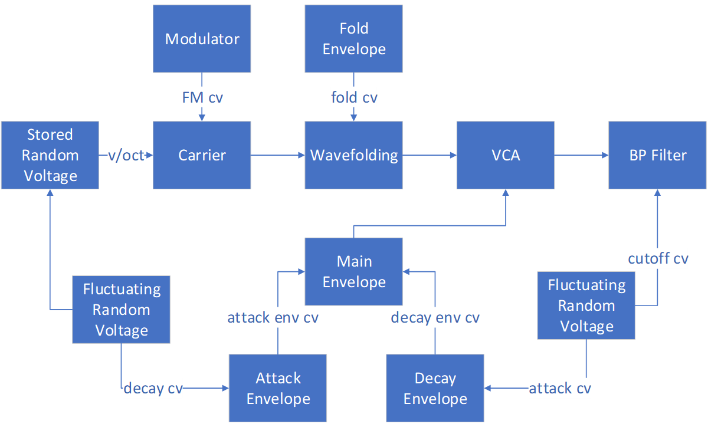

# Krell

This final chapter explores a new sound design problem centered on recreating the Krell patch by Todd Barton.
The Krell patch is a generative patch (it plays itself) that makes use of more advanced probability techniques than we've previously discussed.
An additional challenge with this patch is that Barton uses the Buchla 200e series rather than Eurorack, so the modules and signals between them are not directly compatible and must be translated.

## History

The Krell patch, shown in Figure \@ref(fig:krell-performance), was publicly released  by [Todd Barton](https://toddbarton.com/) in 2012.^[Based on the release date of the [performance video](https://vimeo.com/48382205) and [walkthrough video](https://vimeo.com/48466272).]
The name "Krell" is an homage to the 1956 sci-fi film [*Forbidden Planet*](https://en.wikipedia.org/wiki/Forbidden_Planet), which was the first film to use an electronic score.
In the film, human explorers encounter strange forces on the planet of an ancient extinct alien race, called the Krell.
The film was scored by [Bebe and Louis Barron](https://en.wikipedia.org/wiki/Bebe_and_Louis_Barron) who were early electronic music pioneers inspired by [cybernetics](https://en.wikipedia.org/wiki/Cybernetics), a precusor to artificial intelligence.
Louis Barron created much of his own equipment, including synthesizer circuits used to generate sound, such as ring modulators.
The sounds were recorded onto tape for mixing, adding effects, and preservation, as the circuits themselves burned out quickly.
The Barron's work on film sound effects led to their work on *Forbidden Planet*.
Thus Barton's choice of the name "Krell" for the patch is an homage to the film's score and the work of Bebe and Louis Barron.

(ref:krell-performance) [Vimeo video](https://vimeo.com/48382205) of Todd Barton's Krell patch. Image [© Todd Barton](https://vimeo.com/user2359061).

```{r krell-performance, fig.cap="(ref:krell-performance)", echo = F}
embed_vimeo("48382205")
```

As illustrated by Figure \@ref(fig:krell-performance), the patch is produces a non-repeating melody.
The notes generated by the patch are of variable lengths and pitches, and the timbres change periodically, ranging from woodwinds to percussive sounds.
Despite these various changing elements, the overall sound is somewhat cohesive, if otherworldly.
Keeping this cohesion is a primary concern in recreating the sound of this patch.


## Problem solving approach

This chapter applies the problem solving stages discussed in previous chapters, namely:

- Understand the problem
- Make a plan
- Implement the plan
- Evaluate the solution

For the understanding the problem stage, we need to understand the patch, which divides into understanding the function of each module and the signals sent from module to module.
An Internet search reveals some disagreement about the modules involved in the patch.
It is generally agreed that there is a main envelope controlling the length of each note, where that envelope's attack and decay are controlled by additional envelopes receiving random modulation.
However, there are additional modules that seem to be in dispute.
Some patches exclude a wavefolder on the main voice^[http://manual-synthesis.info/2017/01/26/krell], others exclude FM^[https://modwiggler.com/forum/viewtopic.php?t=159798], and yet others exclude band pass filtering [@Bjoern2018].
Review of Barton's [performance video](https://vimeo.com/48382205) and [walkthrough video](https://vimeo.com/48466272) indicate that all of these elements are present in the patch.
Figure \@ref(fig:krell-patch-diagram) was created by carefully tracing each of the connections shown in the videos and Todd's comments about the connections.
Todd's comments are particularly important as some functions, like FM, are internally routed in his Buchla 200e system and so are not marked with a patch cable.

(ref:krell-patch-diagram) A diagram of the Krell patch illustrating signal flow between modules. 

```{r krell-patch-diagram, echo=F, out.width="100%", fig.cap="(ref:krell-patch-diagram)"}
 
```

One of the major issues with understanding the Krell patch in detail is that the Buchla 200e system is different from Eurorack in several respects.
First, the modules themselves are idiosyncratic.
For example, the 291e Triple Morphing Filter combines band pass filtering with sequencing, and the precise functioning of the filter is a matter of ongoing speculation, despite access to Buchla's circuit designs.^[https://modwiggler.com/forum/viewtopic.php?t=106373]
Thus close matching of the module's behavior is unlikely in some instances, and we'll have to determine what elements are more important than others to match.
Second, Buchla signals are different from the types of signals used in Eurorack.
One of the most notable difference is that Buchla separates audio and signals rather than using the same standard for both: audio signals are line level (~1 V) whereas control voltages are 10 V.
These two signals are handled by different wires, perhaps to prevent sending the wrong type of signal to the wrong jack.
Another difference is that gate/triggers are not interchangeable as they are in Eurorack.
Instead, triggers a brief 10 V pulses, and sustains are 5 V^[At least for the 200 series; see [this blog post for various Buchla conventions](http://buchlatech.blogspot.com/2008/10/good-thing-about-standards-so-many-to.html)].
Thus to send a gate that sustains a note, one would send (on the same cable) a signal consisting of a pulse that then drops to 5 V for as long as the sustain would be held.
These different signal types are color coded on the 200e: CV inputs are black/grey, CV outputs are blue/violet/green, pulse inputs are orange, and pulse outputs are red.
Knowing these conventions is useful when reviewing a Buchla patch in order to determine whether a module is generating or receiving a signal, in addition to consulting the terse [200e manual](https://buchla.com/guides/200e_Users_Guide_v1.4.pdf).

For the making a plan stage, decomposition of the patch according to modules seems like a valid approach.
Since Barton's walk through video in Figure \@ref(fig:krell-walk-through) shows how the patch sounds at different stages of completion, building up the patch in the same order seems ideal because it produces sound at each stage of development.
Thus we can treat each stage as a subproblem and further address issues that arise in those stages.

(ref:krell-walk-through) [Vimeo video](https://vimeo.com/48466272) showing an incremental build of Todd Barton's Krell patch, with voice-over explanation. Image [© Todd Barton](https://vimeo.com/user2359061).

```{r krell-walk-through, fig.cap="(ref:krell-walk-through)", echo = F}
embed_vimeo("48466272")
```

For the implementing a plan stage, we need evaluation criteria in order to assess alternate solutions and gauge our progress.
The best evaluation material seems to be the videos in Figures \@ref(fig:krell-performance) & \@ref(fig:krell-walk-through), though there are additional recordings available from Barton.^[On SoundCloud [here](https://soundcloud.com/user7621213/krell-muzak-1) and [here](https://soundcloud.com/user7621213/krell-muzak-2).]

The evaluation stage will used the above videos to determine success based on what appear to be their major characteristics, i.e. matching of variation in melody, timbre, etc.
Since the patch is generative, it is impossible to match it exactly, so any evaluation will have a subjective aspect.

## 
