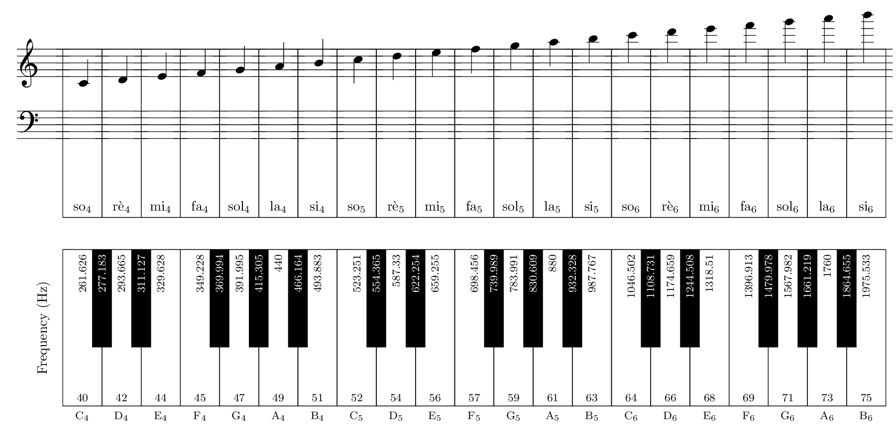

# (PART) Sound {-}

# Physics and Perception

From the outset, it's important to understand that the physics of sound and how we perceive it are not the same.
This is a simple fact of biology.
Birds can see ultraviolet, and bats can hear ultrasound; humans can't do either.
Dogs have up to 40 times more olfactory receptors than humans and correspondingly have a much keener sense of smell.
We can only perceive what our bodies are equipped to perceive.

In addition to the limits of our perception, our bodies also *structure* sensations in ways that don't always align with physics.
A good example of this is [equal loudness contours](https://en.wikipedia.org/wiki/Equal-loudness_contour).
As shown in Figure \@ref(fig:elc), sounds can appear equally loud to humans across frequencies even though the actual sound pressure level (a measure of sound energy) is not constant. 
In other words, our hearing becomes more sensitive depending on the frequency of the sound.

(ref:elc) An equal loudness contour showing improved sensitivity to frequencies between 500Hz and 4KHz, which approximately matches the range of human speech frequencies. Image [public domain](https://en.wikipedia.org/wiki/Psychoacoustics#/media/File:Perceived_Human_Hearing.svg).


<div class="figure">

<p class="caption">(\#fig:elc)(ref:elc)</p>
</div>

Why do we need to understand the physics of sound *and* perception of sound? 
Ultimately we hear the sounds we're going to make, but the process of making those sounds is based in physics.
So we need to know how both the physics and perception of sound work, at least a bit.

## Waves

Have you ever noticed a dust particle floating in the air, just randomly wandering around?
That random movement is known as Brownian motion, and it was shown by Einstein to be evidence for the existence of atoms - that you can see with your own eyes!
The movement is caused by air molecules^[In what follows, we will ignore that air is a mixture of gases because it is irrelevant to the present discussion.] bombarding the much larger dust particle from random directions, as shown in Figure \@ref(fig:sim-brownian).

(ref:sim-brownian) [Simulation](https://physics.bu.edu/~duffy/HTML5/brownian_motion.html) of Brownian motion. Press `Pause` to stop the simulation. © Andrew Duffy/[CC-BY-NC-SA-4.0](https://creativecommons.org/licenses/by-nc-sa/4.0/).

<div class="figure">
<a href="https://physics.bu.edu/~duffy/HTML5/brownian_motion.html" target="_blank"></a>
<p class="caption">(\#fig:sim-brownian)(ref:sim-brownian)</p>
</div>

<!-- Air molecules are always whizzing around like this. -->
<!-- However, in much of the discussion below, we'll largely ignore this fact and focus instead on the properties of waves passing through air. -->

Amazingly, it is also possible to see sound waves moving through the air, using a technique called [Schlieren photography](https://en.wikipedia.org/wiki/Schlieren_photography).
Schlieren photography captures differences in air pressure, and sound is just a difference in air pressure that travels as a wave.
The animation in Figure \@ref(fig:firecracker-wave) shows a primary wave of sound corresponding to the explosion of the firecracker in slow motion, and we can see that wave radiate outwards from the explosion.

(ref:firecracker-wave) [Animation](http://media.npr.org/assets/img/2014/01/21/cracker.gif) of a firecracker exploding in slow motion, captured by Schlieren photography. Note the pressure wave that radiates outward. Image © Mike Hargather. Linked with [permission from NPR](https://www.npr.org/about-npr/179876898/terms-of-use#LinksNPRServices).

<div class="figure">

<p class="caption">(\#fig:firecracker-wave)(ref:firecracker-wave)</p>
</div>

<!-- Note: alternative way using YouTube; revert to this if Tumblr fails -->
<!-- (ref:firecracker-wave) [Youtube video](https://www.youtube.com/embed/px3oVGXr4mo?start=125&end=128) of firecracker exploding, captured by Schlieren photography. Note the dark pressure wave that radiates outward. Image [© NPR](https://www.youtube.com/nationalpublicradio). -->

<!-- ```{r firecracker-wave, fig.cap="(ref:firecracker-wave)", echo = F} -->
<!-- embed_youtube("px3oVGXr4mo",125,128) -->
<!-- ``` -->

Let's look at a more musical example, the slow motion drum hit shown in Figure \@ref(fig:slow-drum).
After the stick hits the drum head, the head first moves inward and then outward, before repeating the inward/outward cycle.
When the drum head moves inward, it creates more room for the surrounding air molecules, so the density of the air next to the drum head decreases (i.e., it becomes less dense, because there is more space for the same amount of air molecules).
The decrease in density is called rarefaction.
When the drum head moves outward, it creates less room for the surrounding air molecules, so the density of the air next to the drum head increases (i.e., it becomes more dense, because there is less space for the same amount of air molecules).
The increase in density is called compression.

(ref:slow-drum) [Youtube video](https://www.youtube.com/watch?v=tM8WyhB6zYo) of a slow motion drum hit. Watch how the drum head continues to move inward and outward after the hit. Image [© Boulder Drum Studio](https://www.youtube.com/channel/UCRZIyRiTD427A9dw3CBM4Fg).

<div class="figure">

<p class="caption">(\#fig:slow-drum)(ref:slow-drum)</p>
</div>


You can see an analogous simulation of to the drum hit in Figure \@ref(fig:sim-gas).
If you add say 50 particles, grab the handle on the left, and move it to the right, the volume of the chamber decreases, and the pressure in the chamber goes up (compression).
Likewise, if you move the handle to the left, the volume of the chamber increases, and the pressure goes down (rarefaction).
In the drum example, when the stick hits the head and causes it to move inward, the volume of air above the head will rush in to fill that space (rarefaction), and when the head moves outward, the volume of air above the head will shrink (compression).

(ref:sim-gas) [Simulation](https://phet.colorado.edu/sims/html/gas-properties/latest/gas-properties_en.html?screens=2) of gas in a chamber. Simulation by [PhET Interactive Simulations](https://phet.colorado.edu/), University of Colorado Boulder, licensed under [CC-BY-4.0](https://creativecommons.org/licenses/by/4.0/).

<!-- The block parameters here are very sensitive; slight changes will cause undefined references in pdf (screenshot will appear but not be wrapped in figure) -->
<div class="figure">
<a href="https://phet.colorado.edu/sims/html/gas-properties/latest/gas-properties_en.html?screens=2" target="_blank"></a>
<p class="caption">(\#fig:sim-gas)(ref:sim-gas)</p>
</div>

Sound is a difference in air pressure that travels as a wave through compression and rarefaction.
We could see this with the firecracker example because the explosion rapidly heated and expanded the air, creating a pressure wave on the boundary between the surrounding air and the hot air.
However, as we've seen with the drum and will discuss in more detail later, musical instruments are designed to create more than a single wave.
The Schlieren photography animation in Figure \@ref(fig:schlieren-wave) is more typical of a musical instrument.

(ref:schlieren-wave) [Animation](http://media.npr.org/assets/img/2014/01/21/speaker1.gif) of a continuous tone from a speaker in slow motion, captured by Schlieren photography. The resulting sound wave shows as lighter compression and darker rarefaction bands that radiate outward. Image © Mike Hargather. Linked with [permission from NPR](https://www.npr.org/about-npr/179876898/terms-of-use#LinksNPRServices).

<div class="figure">

<p class="caption">(\#fig:schlieren-wave)(ref:schlieren-wave)</p>
</div>

The rings in Figure \@ref(fig:schlieren-wave) represent compression (light) and rarefaction (dark) stages of the wave.
It is important to understand that air molecules aren't moving from the speaker to the left side of the image.
Instead, the wave is moving the entire distance, and the air molecules are only moving a little bit as a result of the wave.^[The air molecules are moving randomly in general, so the simulation shows only the movement attributable to the effect of the wave.]

To see how this works, take a look at the simulation in Figure \@ref(fig:sim-wave).
Hit the green button to start the sound waves and then select the `Particles` radio button.
The red dots are markers to help you see how much the air is moving as a result of the wave.
As you can see, every red dot is staying in their neighborhood by **moving in opposite directions** as a result of compression and rarefaction cycles.
If you select the `Both` radio button, you can see the outlines of waves on top of the air molecules.
Note how each red dot is moving back and forth between a white band and a dark band.
If you further select the `Graph` checkbox, you will see that the white bands in this simulation correpond to increases in pressure and the black bands correspond to decreases in pressure.
This type of graph is commonly used to describe waves, so make sure you feel comfortable with it before moving on.

(ref:sim-wave) [Simulation](https://phet.colorado.edu/sims/html/waves-intro/latest/waves-intro_en.html?screens=2) of sound waves. Simulation by [PhET Interactive Simulations](https://phet.colorado.edu/), University of Colorado Boulder, licensed under [CC-BY-4.0](https://creativecommons.org/licenses/by/4.0/).

<!-- The block parameters here are very sensitive; slight changes will cause undefined references in pdf (screenshot will appear but not be wrapped in figure) -->
<div class="figure">
<a href="https://phet.colorado.edu/sims/html/waves-intro/latest/waves-intro_en.html?screens=2" target="_blank"></a>
<p class="caption">(\#fig:sim-wave)(ref:sim-wave)</p>
</div>

Now that we've established what sound waves are, let's talk about some important physical  properties of sound waves and how we perceive those properties.
Most of these properties directly align with the shape of a sound wave.

## Frequency and pitch

Almost all waves we'll talk about are periodic, meaning they repeat themselves over time.
If you look at the blue wave in Figure \@ref(fig:wavelength-frequency), you'll notice that it starts at equilibrium pressure (marked as zero^[Recall sound is a pressure wave, and it is the change in air pressure we care about. Subtracting out the equilibrium pressure to get zero here makes the positive/negative changes in air pressure easier to see.]), goes positive, hits zero again, and then goes negative before hitting zero at 2 seconds.
So at 2 seconds, the blue wave has completed 1 full cycle.
Now look at the yellow wave. 
The end of its first cycle is indicated by the circle marker at .5 seconds.
By the 2 second mark, the yellow wave has repeated its cycle 4 times.
Because the yellow wave has more cycles than the blue wave in the same amount of time, we say that the yellow wave has a higher frequency, i.e. it repeats its cycle more frequently than the blue wave.
The standard unit of frequency is Hertz (Hz), which is the number of cycles per second.
So the blue wave is .5 Hz and the yellow wave is 2 Hz.


(ref:wavelength-frequency) Two waves overlaid on the same graph. The yellow wave completes its cycle 4 times in 2 seconds and the blue wave completes its cycle 1 time in 2 seconds, so the frequencies of the waves are 2 Hz and .5 Hz, respectively.

<div class="figure">

<p class="caption">(\#fig:wavelength-frequency)(ref:wavelength-frequency)</p>
</div>

<!-- graphics.off() -->
<!-- png("sine.png", res = 300, width = 6, height = 4,units = 'in') -->
<!-- t=seq(0,2,0.01) -->
<!-- y=sin(t*pi) -->
<!-- z=sin(t*4*pi) -->
<!-- plot(t,z*2,type="l", xlab="Time", ylab="Pressure",col="gold",lwd=3) -->
<!-- lines(t,y*.5,col="blue",lwd=3) -->
<!-- abline(0,0,col="black") -->
<!-- dev.off() -->

Humans perceive sound wave frequency as pitch.
As a sound wave cycles faster, we hear the sound's pitch increase. 
However, the relationship between frequency and pitch is nonlinear.
For example, the pitch A above middle C is 440 Hz^[Also called A4.], but the A one octave higher is 880 Hz, and the A two octaves higher is 1760 Hz.
If you wanted to write an equation for this progression, it would look something like $A_n = 440 * 2^n$, which means the relationship between frequency and pitch is exponential.
Figure \@ref(fig:freq-pitch) shows the relationship between sound wave frequency and pitch for part of a piano keyboard, together with corresponding white keys and  [solfège](https://www.youtube.com/watch?v=drnBMAEA3AM).
Notice that the difference in frequencies between the two keys on the far left is about 16 Hz but the difference in frequencies between the two keys on the far right is about 111 Hz.
So for low frequencies, the pitches we perceive are closer together in frequency, and for high frequencies, the pitches we perceive are more spread out in frequency.

(ref:freq-pitch) Part of an 88 key piano keyboard with frequency of keys in Hz on each key. The corresponding note in musical notation and solfège is arranged above the keys. Zoom in on the image for more detail.

<div class="figure">

<p class="caption">(\#fig:freq-pitch)(ref:freq-pitch)</p>
</div>

Of course we experience pitch linearly, so the difference in pitch between the two keys in the far left is the same as the difference between the keys on the far right.
We can make the relationship linear by taking the logarithm of the frequencies.
On the left side of Figure \@ref(fig:log-freq), we see the exponential relationship between frequency and pitch: as we go higher on the piano keys and pitch increases, the frequencies increase faster, such that the differences in frequencies between keys gets wider.
On the right side of Figure \@ref(fig:log-freq), we see the same piano keys, but we've taken the logarithm of the frequencies, and now the relationship is linear.
It turns out that, in general, our perception is logarithmic in nature (this is sometimes called the [Weber-Fechner law](https://en.wikipedia.org/wiki/Weber%E2%80%93Fechner_law)).
Our logarithmic perception of pitch is just one example.

<div class="figure">

<p class="caption">(\#fig:log-freq)(ref:log-freq)</p>
</div>

You might be wondering if there's point at which pitches are low enough that the notes run together!
It seems the answer to this is that our ability to hear sound at all gives out before this happens.
Going back to the 88-key piano keyboard, the two lowest keys (keys 1 & 2; not shown) are about 1.5 Hz appart, but the lowest key^[Also called A0] is 27.5 Hz.
Humans generally can only hear frequencies between 20 Hz and 20,000 Hz (20 kHz).
Below 20 Hz, sounds are felt more than heard (especially if they are loud), and above 20 kHz generally can't be heard at all, though intense sounds at these frequencies can still cause hearing damage.

You may also be curious about the fractional frequencies for pitches besides A.
This appears to be largely based on several historical conventions.
In brief, western music divides the octave into 12 pitches called semitones based on a system called [twelve-tone equal temperment](https://en.wikipedia.org/wiki/Equal_temperament#Twelve-tone_equal_temperament).
This is why on a piano, there are 12 white and black keys in an octave - each key represents a semitone.
It's possible to divide an octave into more or less than 12 pitches, and some cultures do this.
In fact, research suggests that our perception of octaves isn't universal either  [@Jacoby2019].
We'll discuss why notes an octave apart feel somehow the same in a later section.

## Amplitude and loudness

As discussed, sound is a pressure wave with phases of increasing and decreasing pressure.
Take a look at the yellow and blue waves in Figure \@ref(fig:amplitude).
The peak compression of each wave cycle has been marked with a dashed line. 
For the yellow wave, the peak positive pressure is 2, and for the blue wave, the peak positive pressure is .5.
This peak deviation of a sound wave from equilibrium pressure is called amplitude.^[Note that since the positive and negative pressures are equivalent, amplitude could be measured down from equilibrium to peak negative pressure as well]
It is perhaps not surprising that we perceive larger deviations (with corresponding large positive and negative pressures) as louder sounds.

(ref:amplitude) Two waves overlaid on the same graph, with a dashed line marking the amplitude of each wave as the deviation from equilibrium.

<div class="figure">

<p class="caption">(\#fig:amplitude)(ref:amplitude)</p>
</div>

The relationship between amplitude and loudness is also nonlinear: we hear quiet sounds very well, and sounds must get a lot louder before we perceive them as being louder.
In fact, the nonlinear relationship between amplitude and our perception of loudness is *even more extreme* than the relationship for frequency and pitch.

You might have heard of the unit of loudness before, the [decibel (dB)](https://en.wikipedia.org/wiki/Decibel).
Unfortunately, the decibel is a bit harder to understand that Hz, and it use used as a unit of measurement for different ways of expressing the strength of a sound, like sound pressure, sound power, sound intensity, etc.
The most important thing you need to understand with decibels is that they are not an absolute measurement, but rather a relative measurement.
Therefore, decibels are always based on a reference value.
For hearing, that reference value is the quietest sound people can detect, which is defined as 0 dB.
Some examples of 0 to 10dB sounds are a mosquito, breathing, a pin drop, or a leaf hitting the ground.^[These are commonly given examples, but see below for how they are misleading when you take frequency into account.]

If we call the reference sound pressure $S_0$ and the sound pressure we are measuring $S$, then we calculate the sound pressure level dB of $S$ as $20 * log_{10}(S/S_0)$ dB.
Under this definition, a 6 dB increase in sound pressure level means amplitude has doubled: $20 * log_{10}(2) = 6.02$ dB.^[Note that if we'd used sound intensity level, the corresponding value would be 3 dB. Sound pressure level is more useful in our context: it connects directly to sound wave amplitude, it is measured by a microphone and reflected in microphone output voltage, and it has the same formula as dBV, a decibel measurement of voltage common in audio electronics. Sound intensity level is the square of the sound pressure level.]
Since our hearing is quickly damaged at 120 dB, you can see that our range of hearing goes from the quietest sound we can hear (0 dB) to a sound that is 1,000,000,000,000 times more intense (120 dB).

Remember from Figure \@ref(fig:elc) that frequency affects our perception of loudness.
As a result, we can't say how loud a person will perceive a random 40 dB sound - not in general.
One way of approaching this problem is to choose a standard frequency and define loudness for that frequency.
The [phon/sone](http://hyperphysics.phy-astr.gsu.edu/hbase/Sound/phon.html) system uses a standard frequency of 1 kHz so that a [10 dB increase in sound pressure level is perceived as twice as loud](https://en.wikipedia.org/wiki/Sone).
This relationship is commonly described as needing 10 violins to sound twice as loud as a single violin.
There are [alternative ways of weighting dB](https://en.wikipedia.org/wiki/A-weighting) across a range of frequencies rather than just 1 kHz, so the 10 dB figure should be viewed as an oversimplification, though a useful one.
Table \@ref(tab:db) summarizes the above discussion with useful dB values to remember.


Table: (\#tab:db) Useful values for working with dB. All values reflect sound pressure or sound pressure level.

| Value          | Meaning                                        |
|----------------|------------------------------------------------|
| 0 db           | Reference level, e.g. quietest possible sound. |
| 6 db increase  | Twice the amplitude           |
| 10 db increase | Twice as loud                                  |
| 20 db increase | Ten times the amplitude                        |


## Waveshape and timbre

## Phase and ... phase?


You might think that we only need to understand how humans perceive sound and not the physics of it...
