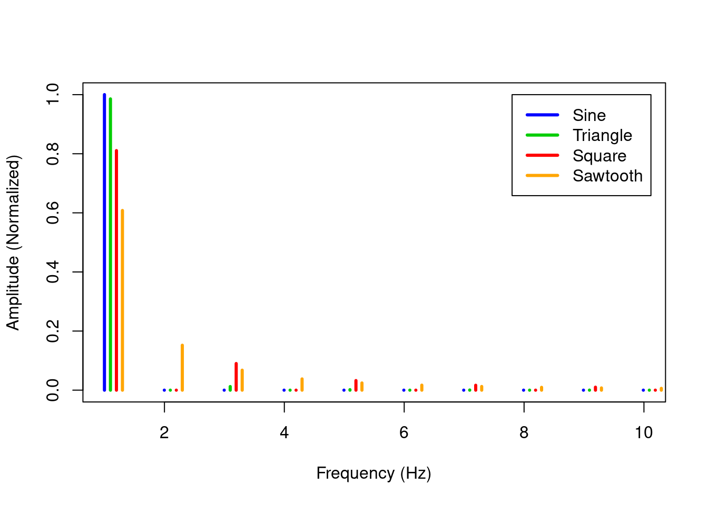
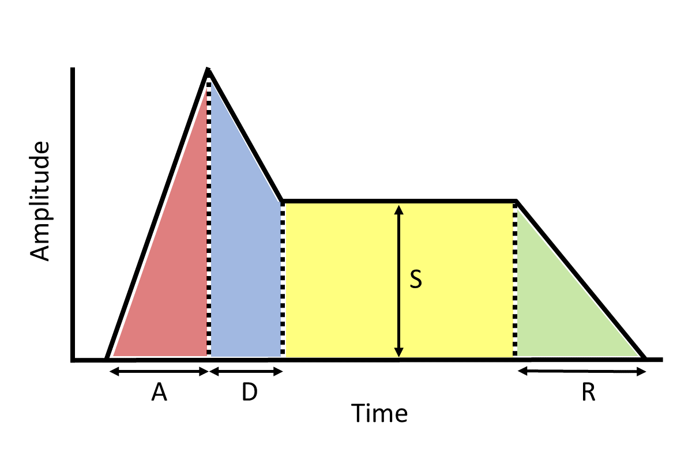

# Harmonic and Inharmonic Sounds

We reviewed four common waveshapes in Section \@ref(waveshape-and-timbre), but 
<!-- we reviewed four common waveshapes and corresponding instruments with similar timbre. -->
we did not explain *why* the waveshapes have their own distinctive timbre.
The short answer is that the waveshapes have different harmonics.
Understanding the relationship between waveshape and harmonics will be extremely useful to you as you design your own sounds.
In order to explain the harmonics behind the different waveshape timbres, we need to understand what harmonics are and how they are created.
Not all sounds are harmonic, however.
Most percussion sounds are inharmonic, with drums and cymbals as prominent examples.^[I prefer to think of these sounds as pitched but inharmonic, but this is not a common view.]
These sounds have a high degree of "noise" associated with them.
Finally, traditional instruments producing harmonic and inharmonic sounds have distinctly different dynamics that contribute to their timbre.
Harmonic, inharmonic, and dynamic elements all play an important role in shaping sounds.

## Phase reflections, standing waves, and harmonics

When we discussed wave phase and interference in Section \@ref(phase-and-interference), we mentioned the importance of phase and reflection in musical instruments.
Before going any further, ask yourself what makes something a musical instrument?
Is a stick hitting a sheet of paper a musical instrument?
What about a stick hitting an empty glass?

A common property of musical instruments is that they make reliable pitches rather than noise.
These pitches are created by waves reflecting in the instrument to create standing waves and, in harmonic instruments, get rid of noise.
Standing waves are fairly similar and straightforward in [strings and pipes](http://www.phys.unsw.edu.au/jw/basics.html), so 
we'll begin our discussion with strings, where the waves are easily visible.

Standing waves are created when two waves moving in opposite directions interfere with each other to create a new wave that appears to remain in place (i.e. it "stands" rather than moves).
In a string, the two waves are created by an initial wave that reflects back from the ends of the string, which creates an out of phase wave.
Figure \@ref(fig:sim-reflect) shows a simulation of a reflected wave.
Select the checkbox for `Pulse` and move `Damping` to `None`, then press the green button to initiate a pulse.
As you can see, when the pulse reaches a fixed end, it reflects both in direction and in phase, i.e. if it is above the line going right, it will flip below the line and go left when it hits a fixed end.
<!-- Once the wave has traversed the string a few times, move `Damping` higher and watch the wave die out. -->
<!-- Damping is an important property that removes energy from the system. -->
<!-- In an instrument, damping is what removes noise a bit faster than standing waves, allowing us to hear a tone. -->

(ref:sim-reflect) [Simulation](https://phet.colorado.edu/sims/html/wave-on-a-string/latest/wave-on-a-string_en.html) of waves on a string. Simulation by [PhET Interactive Simulations](https://phet.colorado.edu/), University of Colorado Boulder, licensed under [CC-BY-4.0](https://creativecommons.org/licenses/by/4.0/).

<!-- The block parameters here are very sensitive; slight changes will cause undefined references in pdf (screenshot will appear but not be wrapped in figure) -->

<iframe src="https://phet.colorado.edu/sims/html/wave-on-a-string/latest/wave-on-a-string_en.html" width="100%" height="400px" data-external="1"></iframe>

(\#fig:sim-reflect)(ref:sim-reflect)

You can use the same simulation to make a standing wave.
Set `Amplitude` to .20, `Frequency` to .17, `Damping` to `None`, `Tension` to `Low`, and select `Oscillate`.
These settings will send a wave from the left to interfere with the reflected wave coming back from the right.
You will very quickly see a standing wave with three nodes, indicated by the green beads.
Two of the nodes are at either end of the string, and the third node is exactly in the middle.
This standing wave is the 2nd harmonic.
You can make the first harmonic (commonly called the fundamental frequency) by reducing `Frequency` to half, $.17 / 2 = .085 \approx .09$ and hitting restart.
Observe that the only nodes are the two ends of the string.
Finally, you can create additional harmonics by multiplying the frequency of the fundamental by integers greater than 1.
Try $.085 * 3 = .255 \approx .26$, $.085 * 4 = 34$, $.085 * 5 = .425 \approx .43$, etc.
Note the green beads don't always mark nodes, which by definition don't move; instead the green beads sometimes mark antinodes, or places of greatest motion.

For the odd harmonics, the simulation requires us to do some rounding that results in an imperfect standing wave.
Eventually these imperfect standing waves will cancel out because they are not true standing waves.
True standing waves on our string model have frequencies that are perfectly aligned with the length of our string.
When this happens, the two waves that create the standing wave constructively interfere with each other, i.e. they are self-reinforcing.
We can see this in the simulation when we don't round the frequencies because the amplitude of the waves keeps increasing over time as we add more energy into the system through the oscillator on the left hand side.
Any wave whose frequency does not create a standing wave will eventually cancel itself out even if damping is zero.

Standing waves on a string explain why harmonics are integer multiples of the fundamental frequency.
In the simulation for the first harmonic, the oscillator started its second pulse at the moment the first reflected pulse returned to the oscillator, so the first pulse had to travel twice the length of the string.
For the second harmonic, the oscillator started its second pulse at the moment the first pulse reached the fixed end, or the full length of the string.
In each case, the combined speed of the waves must evenly divide the length of the string (giving an integer) in order for the out of phase passing waves to align and create a standing wave.
The integer relationship of harmonics is very important to how we perceive musical instruments and may even be the reason for our perception of fundamental musical relationships like octaves and [fifths](https://en.wikipedia.org/wiki/Perfect_fifth).
For example, recall from Section \@ref(frequency-and-pitch) than one octave above a pitch is double the frequency of that pitch.
Since the second harmonic is double the frequency of the fundamental, the second harmonic is one octave above the fundamental frequency.
Similarly, the third harmonic is one fifth above the second harmonic.^[One might speculate that we created instruments in order to consistently create pitches based on the fundamental, but the instruments instilled in us a music theory as a side effect of their harmonics.]

Before moving on, it's important to note that the oscillator simulation in Figure \@ref(fig:sim-reflect) does not accurately represent what happens in a plucked string because the simulation doesn't fix both sides of the string.
Instead, the simulation uses an oscillator on one side to generate sine waves.
We can, however, observe a very similar behavior to the simulation when a string is plucked, as shown the slow motion video in Figure \@ref(fig:tap-string).
In the video, the tap on the string (a reverse of a pluck) creates two pulses that move in opposite directions, reflect off their respective ends of the string and switch phase, and then constructively interfere in the center to create an apparent standing wave.

(ref:tap-string) [Youtube video](https://www.youtube.com/watch?v=9O3VEXzuOKI) of a slow motion tap on a long string. Watch how the tap creates two pulses that reflect off their respective ends of the string, switching phase, and then constructively interfere to create an apparent standing wave. Image [© Kemp Strings](https://www.youtube.com/c/KempStrings).

<iframe src="https://www.youtube.com/embed/9O3VEXzuOKI?start=0" width="672" height="400px" data-external="1"></iframe>

(\#fig:tap-string)(ref:tap-string)

Although Figure \@ref(fig:tap-string) looks straightforward and might lead us to believe that the differences between the simulation and plucking a string are superficial, the true story is more complicated.
A real string pluck does not create a single standing wave but rather a [stack of standing waves happening all at once](https://physics.stackexchange.com/a/412746).
This is because, unlike the simulation in \@ref(fig:sim-reflect), the wave created by plucking a string is not a sine wave but has an initial shape [more like a triangle](https://physics.stackexchange.com/questions/111780/why-do-harmonics-occur-when-you-pluck-a-string).
In addition, a string pluck is highly likely [not to occur in the middle of the string](https://physics.stackexchange.com/questions/411175/fourier-series-analysis/411177#411177).
These differences mean that when a string is plucked, waves of all different frequencies are created and begin racing back and forth on the string.
Those that correspond to harmonic frequencies are sustained longer and create a tone.
The remaining frequencies are known as [transients](https://en.wikipedia.org/wiki/Transient_(acoustics)) and quickly cancel out.^[Transients are commonly modeled using noise in electronic music in order to make a simulated sound more realistic.]

<!-- ## Frequency spectrum, resonators, and formants -->

## Resonators, formants, and frequency spectrum

In a real string instrument, the vibrations of the strings are transmitted to the rest of the instrument, which includes a [resonator](https://en.wikipedia.org/wiki/Helmholtz_resonance) that is typically shaped like a box with an opening.
The resonator vibrates at the same frequencies as the string (primarily the harmonic frequencies as discussed) but pushes against a larger volume of air than the string, which has a small surface area by comparison. 
Therefore the resonator creates a larger change in air pressure for a higher amplitude (and louder) sound wave.
The resonator does not amplify the string frequencies perfectly, however.
Some frequencies are better amplified than others, and this means that the resonator affects the timbre of the instrument.
This is why two guitars with different resonators will sound different even if they have identical strings.
The effect a resonator has on a frequency's amplitude is called [Q](https://en.wikipedia.org/wiki/Q_factor), and the relative strengths of frequencies emitted by a resonator are called formants.^[You will often see the word "formants" applied to human speech, where the resonator is the vocal tract, but it also applies to instruments with resonators.]

You can probably imagine how differences in the construction and operation of other instruments might lead to the differences in their characteristic sounds.
Their mode of operation (string, wind, etc.) and their resonators (wood, metal, etc.) affect both what harmonics are produced and the relative strengths of these frequencies (the formants).
For example, [closed end pipes produce only odd harmonics](https://newt.phys.unsw.edu.au/jw/flutes.v.clarinets.html)!
In each case, the instrument is producing multiple harmonic frequencies at once, with some instruments producing more harmonics than others.
These differences in characteristic sounds are reflected in the four waveshapes presented in Section \@ref(waveshape-and-timbre).

Unfortunately, when we look at a waveshape, we see the sum of all the harmonic frequencies - we can't see the individual harmonics just by looking at a waveshape.
Wouldn't it be nice if we could somehow see all the harmonics that make up a waveshape?
It turns out we can decompose any complex waveshape into components using a technique called [Fourier analysis](https://en.wikipedia.org/wiki/Fourier_analysis).
Each component extracted by Fourier analysis is a sine wave called a partial, and we can reconstruct a complex waveshape by adding the sine wave partials together (potentially an infinite number of them).
When the waveshape is from a harmonic instrument, the partials are harmonics, so we can use Fourier analysis to see all the harmonics in a waveshape.

Figure \@ref(fig:fourier-waves) is a simulation showing how Fourier analysis can use sine waves to approximate more complex waveshapes.
The first waveshape is a sine, which is quite trivially approximated by a single sine wave.
Take a moment to look at the amplitude of the red line (the first harmonic) and how it corresponds to the red bar in the upper bar plot.
You can grab the top of that bar and move it up and down to change the amplitude of the first harmonic.
As you move the bar, note how the bottom graph showing the sum of harmonics changes exactly the same way - this is because it is the sum of harmonics, and we only have one harmonic, so the sum is equal to that harmonic.

Use the dropdown on the right to select a triangle waveshape.
Note that all the harmonics are odd for the triangle, and that the sum is clearly different from the sine wave of the first harmonic.
It turns out you can't get any closer to a triangle waveshape with only 11 harmonics, but feel free to try by moving the sliders around.
What you will find is that as you try to change the shape at one part of the waveshape, you end up making changes everywhere.
This is because the sine waves that are being summed up keep going up and down everywhere.
The only way to get closer to a triangle shape is to use more and smaller sine waves.
You can see what this looks like by using the `Infinite Harmonics` checkbox on the bottom.
This illustrates a general principle of Fourier analysis: sharp edges in a waveshape mean high frequency partials.

(ref:fourier-waves) [Simulation](https://phet.colorado.edu/sims/html/fourier-making-waves/latest/fourier-making-waves_en.html?screens=1) showing how Fourier analysis can approximate a complex wave using sine waves. Simulation by [PhET Interactive Simulations](https://phet.colorado.edu/), University of Colorado Boulder, licensed under [CC-BY-4.0](https://creativecommons.org/licenses/by/4.0/).

<!-- The block parameters here are very sensitive; slight changes will cause undefined references in pdf (screenshot will appear but not be wrapped in figure) -->

<iframe src="https://phet.colorado.edu/sims/html/fourier-making-waves/latest/fourier-making-waves_en.html?screens=1" width="100%" height="400px" data-external="1"></iframe>

(\#fig:fourier-waves)(ref:fourier-waves)

The square and sawtooth waveshapes give more impressive examples of this.
If you select square, you'll see that again only odd harmonics are used, but you'll also see that the sum of harmonics is pretty far from the square waveshape we looked at before.
The sawtooth waveshape, which uses both even and odd harmonics (with opposite signs), also looks pretty different from the sawtooth waveshape we saw before.
Both of these waveshapes have sharp edges that need more harmonics to approximate.
They also have straight regions that don't line up well with the straight-ish part of the first harmonic, and these straight regions also need more high frequency components to straighten out.
In both cases, you can check infinite harmonics to see how additional harmonics would help.

It may have already occurred to you that you could create any sound by adding together the sine waves in the right combinations.
This is exactly what [additive synthesis](https://en.wikipedia.org/wiki/Additive_synthesis) does!
Running a Fourier analysis to get sine wave partials of a sound and then recombine them to reproduce the sound is very appealing.
However, even though the idea of additive synthesis has been around a long time, it was not practical with analogue technology because of the many oscillators and precise timings involved.
<!-- As digital technology improved, sampling and [wavetable synthsis](https://en.wikipedia.org/wiki/Wavetable_synthesis) became more popular than additive synthesis in achieving similar goals. -->
Conceptually, the alternative to additive synthesis is [subtractive synthesis](https://en.wikipedia.org/wiki/Subtractive_synthesis), which has been a very popular approach in analogue synthesis to the present day.
Subtractive synthesis starts with complex waveforms and then removes harmonics to create the desired sound.
Harmonics can be removed with relatively simple analogue electronics as we'll discuss in a later chapter.

While the simulation in Figure \@ref(fig:fourier-waves) is useful for understanding how Fourier analysis works, it's difficult to see all of the frequenecy components because they are stacked on top of each other.
An alternative way of visualizing a Fourier analysis is a frequency spectrogram.
A frequency spectrogram shows each sine wave based on its frequency and amplitude.
Figure \@ref(fig:freq-spectrum) shows a frequency spectrogram of the same four waveshapes at 1 Hz with harmonics side by side and amplitudes normalized so all harmonics sum to 1.
The order of harmonics at 1 Hz shows how much energy each waveshape has in the first harmonic, the order of harmonics at 2 Hz shows the energy at the second harmonic, etc.^[1 Hz is a convenient fundamental frequency to get 10 harmonics on a compact plot, but we'd see the same pattern regardless of the fundamental frequency.]

Figure \@ref(fig:freq-spectrum) clearly shows what we noted before: only sawtooth has even harmonics, and only sawtooth and square have easily visible harmonics above the third harmonic.
It's quite amazing that these waves have such small visible differences in their frequency spectrums and yet have such distinctive sounds.
For all waveshapes, the fundamental has the most energy (highest amplitude). 
This is crucial to our perception of the overall pitch of the sound.
If you go back to Figure \@ref(fig:fourier-waves) and increase the amplitude of a harmonic above the amplitude of the harmonic (and click the checkbox to hear the sound), your perception of the pitch will shift to the louder harmonic.
<!-- ^[[Subharmonics](https://en.wikipedia.org/wiki/Undertone_series)] -->

(ref:freq-spectrum) Frequency spectrum of four basic waveshapes at 1 Hz. Amplitude is normalized so all harmonics sum to 1. Harmonics are offset for comparison.

(\#fig:freq-spectrum)(ref:freq-spectrum)

Are all sounds actually made out of sine waves, or is Fourier analysis only an approximation of sounds?
When we talk about sounds produced using standing waves, [harmonic motion](https://en.wikipedia.org/wiki/Harmonic_oscillator) tells us the sound waves are sine waves.
Therefore when Fourier analysis is applied to these types of sounds, its solution closely corresponds to how the sounds were generated.
However, when the sounds are produced by other means, Fourier analysis no longer corresponds to how the sounds were generated, even though it may approximate them arbitrarily.
These distinctions perhaps matter when we are concerned with listening to sound, since our auditory system [decomposes complex sounds into frequency bands](https://www.ncbi.nlm.nih.gov/pmc/articles/PMC5819010#S8title) analogous to Fourier analysis, regardless of how the sound was produced.

## Inharmonic standing waves and noise

While standing waves in one dimension, like a string, are necessarily harmonic, standing waves in two dimensions are typically not harmonic.
Inharmonic means that the frequencies of the standing waves are not integer multiples of the fundamental.
Two-dimensional standing waves are common in drums, cymbals, and related percussion instruments, where they are called modes, and the physics behind the acoustics of these instruments [can get very complex](http://www.ness.music.ed.ac.uk/archives/systems/3d-embeddings).
Recall that standing waves in a string had nodes which were points of no movement.
In a circular membrane (a drum) or a circular plate (a cymbal) the nodes are lines and  circles, because the waves can now travel in two dimensions and reflect off the edges of the vibrating surface.
Some modes of a vibrating drum are shown in Figure \@ref(fig:drum-modes).
Each of these modes has  0, 1, or 2 nodal lines across the diameter of the drum head and a nodal circle around the perimeter of the drum head.
Modes are usually denoted in pairs $(d,c)$ where $d$ is the number of nodal lines across the diameter and $c$ is the number of nodal circles.

(ref:drum-modes) [Animations](https://olney.ai/ct-modular-book/images/drum-modes.html) of drum head vibration modes with a single nodal circle and 0, 1, or 2 nodal lines. Images [public domain](https://en.wikipedia.org/wiki/Vibrations_of_a_circular_membrane#Animations_of_several_vibration_modes).

<iframe src="https://olney.ai/ct-modular-book/images/drum-modes.html" width="100%" height="140px" data-external="1"></iframe>

(\#fig:drum-modes)(ref:drum-modes)

As with standing waves on a string, when a drum or cymbal is struck, infinitely many modes are excited all at once.
Some of these modes are very efficient in transferring energy to the air while others are less efficient, which causes the frequencies of the modes to be relatively short, or longer lived, respectively.
The fundamental mode, in particular, is so efficient at transferring energy to the air [that it quickly disappates energy and dies out](https://www.acs.psu.edu/drussell/demos/membranecircle/circle.html), which means that in these instruments, the fundamental frequency is very weak compared to harmonic instruments.

In general, the modes have inharmonic frequency relationships to each other as shown in Table \@ref(tab:mode-freq).
The timpani is [a notable counterexample](http://hyperphysics.phy-astr.gsu.edu/hbase/Music/timpani.html) where the kettle and the style of playing enhance the $(d,1)$ modes, a few of which in the timpani have harmonic relationships to each other.
Cymbals similarly have inharmonic frequency relationships but [differ in modes and spread of ratios across modes](http://acoustics.ae.illinois.edu/pdfs/Vibration%20of%20Plates%20(Leissa,%20NASA%20SP-160).pdf#page=20).

Table: (\#tab:mode-freq) Modes of a vibrating membrane like a drum head and their relative frequencies with respect to (0,1). Note the ratio as not integers and so the series is inharmonic.

| Mode  | Frequency ratio |
|-------|-----------------|
| (0,1) | 1               |
| (1,1) | 1.594           |
| (2,1) | 2.136           |
| (0,2) | 2.296           |
| (3,1) | 2.653           |
| (1,2) | 2.918           |
| (4,1) | 3.156           |
| (2,2) | 3.501           |
| (0,3) | 3.600           |
| (5,1) | 3.652           |

Harmonics are defined as integer multiples of the fundamental frequency, and the frequency relationships in Table \@ref(tab:mode-freq) are clearly not integers.
Note also that they are much more closely packed together than integers: there are 10 modes with a frequency ratio below 4, whereas in a harmonic series we'd only expect four standing waves in that space.
Because the frequency relationships are inharmonic, we can only call the standing wave frequencies of such instruments partials - they are not harmonics.^[They are not overtones either. An overtone is a harmonic above the fundamental.]

Because the partials of percussion instruments are dense, their relationships inharmonic, and the fundamental weak, percussion instruments are commonly approximated in electronic music using some form of noise.
Noise is a random mixture of frequencies, so by definition it does not have harmonic relationships or a fundamental, and the respective frequencies are very close together.
For percussion instruments that have more pitch to them, one can add a simple wave, like a sine wave, to convey the sense of a fundamental.

Various types of noise have been defined with different acoustic properties.
The noise types have [color names](https://en.wikipedia.org/wiki/Colors_of_noise) that may be helpful for remembering which is which, though in some cases the color names seem a bit arbitrary.
The first and most commonly though of noise is white noise.
You can see this kind of noise on an old television set (the "snow" on channel with no broadcast).
White noise has equal energy across its frequency spectrum.
Since we perceive each doubling of frequency as an octave increase in pitch, this means that high frequency sounds are more prominent in white noise.
All other colors of noise are based on white noise but change the distribution of energy in the frequency spectrum in some way, i.e. increase the amplitude of some frequencies and decrease the amplitude of others, as shown in Figure \@ref(fig:noise-types).

(ref:noise-types) Frequency spectrum and [sound](https://olney.ai/ct-modular-book/images/noise-table.html) of various "colors" of noise.

<!-- NOTE: must manually copy constituent images to docs/images -->

<iframe src="https://olney.ai/ct-modular-book/images/noise-table.html" width="100%" height="510px" data-external="1"></iframe>

(\#fig:noise-types)(ref:noise-types)

Pink noise balances energy across each octave to *roughly* approximate human perception by reducing energy (i.e., amplitude) as frequency increases.
Brown noise (also called red noise) is like pink noise but reduces energy more quickly as frequency increases, which puts more energy in lower octaves.
Blue noise is the opposite of pink noise: it increases energy as frequency increases by the same amount that pink noise reduced energy.
Similarly, violet noise (also called purple noise) is the opposite of brown noise, and increases energy with frequency by the same amount.
Finally, grey noise is based on psychoacoustics and places energy on a curve that might seem familiar - compare it to the equal loudness contour in Figure \@ref(fig:elc).
Grey noise thus takes into account that humans hear some frequencies better than others, and allocates energy so that all frequencies sound equally loud.
One might consider grey noise the the evolution of pink noise.
Both take human perception into account, but grey noise does so in a more nuanced way than pink noise.

## Dynamics and Envelopes

Up to this point, the discussion has focused on frequencies of sound and their relative strengths, with only occasional reference to how sound unfolds over time.
However, the way a sound unfolds over time plays a critical role in its timbre.
For example, think back to a time when you heard a sound played backwards.
That reversed sound had the exact same frequencies and distribution of energy as the original, but the reversed version probably sounded pretty bizarre.
How sounds unfold over time is sometimes referred to as [dynamics](https://academic.udayton.edu/PhillipMagnuson/soundpatterns/dynamics/) in music and [envelopes](https://en.wikipedia.org/wiki/Envelope_(waves)) in physics.
Our focus is on the sound of a single instrument over time, so is aligned with timbral dynamics and envelopes.

The basic concept of an envelope is that the amplitude of a sound changes over time.
Ideally we'd model this change in sound with a complex curve that goes from zero, up for a time, and then back down to zero for each instrument.
Such curves would be fairly complicated for different instruments and would clearly vary with how hard the instrument was played, e.g. how hard a string was plucked or a drum hit.
To simplify matters, early developers of electronic music settled on envelopes with discrete stages: attack, decay, sustain, release (ADSR).
All of the stages except sustain are based on time, as shown in Figure \@ref(fig:adsr-envelope).
Attack is the time it takes for an instrument's sound to reach peak amplitude, decay is the time it takes to decrease from peak amplitude to the next stage or zero, and release is the time it takes to decrease from sustain to zero.
None of these set amplitude levels - they only determine how fast amplitude levels are reached (max, sustain, and zero, respectively).
Sustain, on the other hand, is an amplitude level rather than a time.
The duration of sustain is as long as the stage is held, e.g. a finger on a key.
In this way, and ADSR envelope is a simple, yet fairly flexible model of a physical envelope.

(ref:adsr-envelope) An example Attack-Decay-Sustain-Release (ADSR) envelope. Sustain ends with manual control and is the only parameter that sets amplitude level. All other stage lengths are controlled by time parameters as indicated.

(\#fig:adsr-envelope)(ref:adsr-envelope)

The full ADSR envelope makes the most sense on a keyboard instrument where pressing a key begins the attack for its duration, which then gives way to decay for its duration.
Sustain is then held as long as the key is held, and release begins as soon as the finger leaves the key and lasts for its duration before the amplitude returns to zero.
Clearly the full ADSR envelope does not make sense for other instruments.
For example, a drum only needs AD, as does a plucked string.
Examples of sounds shaped by envelopes are given in Figure \@ref(fig:adsr-sound-table).
While the examples in Figure \@ref(fig:adsr-sound-table) only use envelopes for amplitude, envelopes are commonly used to control other properties that change over time.
One example is the brightness of a string when it is first plucked, followed by a mellowing of the tone as the higher frequencies disappear.
This effect can be created by using an envelope on a filter, a technique we will cover in a future chapter.

(ref:adsr-sound-table) [Sounds](https://olney.ai/ct-modular-book/images/adsr-sound-table.html) of basic sound waves shaped by envelopes. The kick has fast attack and decay, and the violin has relatively slow attack, decay, and release.

<!-- NOTE: must manually copy constituent images to docs/images -->

<iframe src="https://olney.ai/ct-modular-book/images/adsr-sound-table.html" width="100%" height="150px" data-external="1"></iframe>

(\#fig:adsr-sound-table)(ref:adsr-sound-table)

<!-- Tonal sounds	 -->
<!-- 	Common waves, harmonics, spectrum -->
<!-- 	Fourier series -->
<!-- 	Envelopes -->
<!-- 	Music concepts: semitones, scales, notes, timbre, polyphony -->
<!-- Rhythmic sounds	 -->
<!-- 	Noise: white/pink/brown -->
<!-- 	Envelopes -->
<!-- 	Music concepts: beats, timbre, polyrhythm -->
	
	

