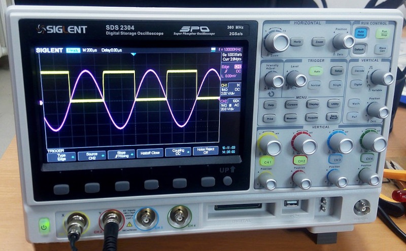

# (PART) Fundamental Modules {-}

# Basic Modeling Concepts

Chapters \@ref(physics-and-perception-of-sound) and \@ref(harmonic-and-inharmonic-sounds) focused on the "understand the problem" stage of problem solving, and they introduced the basic concepts and terminology of sounds we want to model.
The present chapter pivots to the "make a plan" stage of problem solving by introducing the model elements and how they interact.
Since we are building models for modular synthesis, the model elements are the modules, and their interactions are driven by how they are connected together in a patch.
Figure \@ref(fig:serge-modular-2) shows an example patch on a real modular synthesizer from Chapter \@ref(introduction).

(ref:serge-modular-2) A Serge modular system based on a 1970s design. Each module is labeled at the top edge, e.g. `Wave Multiplier`, and extends down to the bottom edge in a column. Note that although the modules have the same height, they have different widths. Image [© mikael altemark/CC-BY-2.0](https://commons.wikimedia.org/wiki/File:Serge_Modular,_Norbergfestival_2007.jpg).

(\#fig:serge-modular-2)(ref:serge-modular-2)

Here and throughout the book, we will mostly avoid discussing real life modules, because it's impractical to assume that you, the reader, will have access to those modules.
Instead, we will use open source modular software called Patchcab [@Spectrome2021] that has been integrated into the web version of the book.
Patchcab is relatively simple and runs in the browser, which for our needs makes it preferable to the popular open source modular software, VCVRack [@VCVRack2022], which is desktop based.^[VCVRack is otherwise recommended. Both @Bjoern2018 and @Dusha2020 have distributed VCVRack patch files with their books.]

## Modules are the model elements

The universe of modules is rather vast, which can make learning about modules overwhelming.
For example, [ModularGrid](https://www.modulargrid.net/) lists over 10,000 modules and classifies them according to 56 categories based on their function.
While those 56 categories are certainly real and useful, you can get the main idea with only three categories: controllers, generators, and modifiers.
You might think of these as "categories of categories."

**Controllers** initiate musical events.
An example controller is a module that waits for key presses and, on receiving them, sends a signal to initiate a musical event.
Another example is a sequencer, which you can think of as way of recording key presses and then playing them back to initiate musical events.

**Generators** create audible sound.
An example generator is an oscillator that generates one or more of the four basic waveshapes discussed in Section \@ref(waveshape-and-timbre).
Another example is a noise generator that generates one or more colors of noise described in Section \@ref(inharmonic-standing-waves-and-noise).

**Modifiers** modify incoming signals that may be either audio or some kind of control signal.
An example audio modifier is a reverb, which adds diffuse echoes to sound, giving it the feel of being played in a room.
An example control signal modifier is an envelope, which we can use to control the amplitude of a sound over time, as discussed in Section \@ref(dynamics-and-envelopes).

## Signals are how the  model elements interact

Modules interact with each other through signals sent via patch cables.
Starting with the signals, we can broadly separate them into two types: audio and control signals.
Audio signals are a voltage representation of sound.
Recall that sound is a pressure wave with high and low phases of pressure.
It's perhaps not surprising that audio signals use corresponding positive and negative voltage to represent a sound wave.
This kind of voltage is [AC voltage](https://en.wikipedia.org/wiki/Alternating_current#Mathematics_of_AC_voltages). 
Anytime a signal is bipoloar, i.e. it crosses zero, you can assume the voltage is AC.

Control signals represent everything besides audio.
Unlike audio signals, control signals are unipolar voltage representations, i.e. they don't cross zero, and thus use [DC voltage](https://en.wikipedia.org/wiki/Direct_current#Various_definitions).^[Under this definition, low frequency oscillators are audio signals, not control signals.]
There are two main types of control signals in modular synthesis.
Both of these can be understood in terms of light switches as shown in Figure \@ref(fig:light-switches).
Regular light switches are either on or off.
In terms of voltage, they are either at minimum voltage or maximum voltage.
Dimmer switches in contrast can smoothly adjust voltage between their minimum and maximum.

(ref:light-switches) On/off light switch (left) and dimmer light switch (right). While on/off switches can only be at minimum or maximum voltage, dimmer switches can be at all voltages in between. Images [© DemonDays64/CC-BY-4.0](https://commons.wikimedia.org/wiki/File:Rocker_light_switch.jpg) and [© Paolomarco/CC-BY-4.0](https://commons.wikimedia.org/wiki/File:Dimmer_Light_Switch.jpg).

(\#fig:light-switches)(ref:light-switches)

On/off signals are either gates or triggers, as shown in Figure \@ref(fig:trigger-gate).
Both triggers and gates are rectangular pulses that control a musical event.
The difference is that triggers are used to start musical events, but gates are used to both start and end musical events.
That's why triggers have the same length, but the length of gates varies by the end time of the musical event.
As a result, we can use a trigger to model a drum hit, but we need a gate to model holding down a key on keyboard.

(ref:trigger-gate) Triggers and gates shown over time. Both are on/off unipolar voltages that show as rectangular pulses. Only gates have variable duration.

(\#fig:trigger-gate)(ref:trigger-gate)

Envelopes are a great example of a continuous control voltage.
As discussed in Section \@ref(dynamics-and-envelopes), envelopes can be used to control the amplitude of a sound wave and thus its loudness.
We can represent an envelope in control voltage as shown in Figure \@ref(fig:voltage-adsr).
This envelope example illustrates how flexible control voltage can be - any voltage level or shape over time is possible.

(ref:voltage-adsr) An example Attack-Decay-Sustain-Release (ADSR) envelope represented as control voltage.

(\#fig:voltage-adsr)(ref:voltage-adsr)

In Eurorack, signal voltages typically span 10 volts.
This is much move voltage than common audio devices, so connecting modular gear to standard audio equipment requires some care.
Table \@ref(tab:voltage) presents the voltage levels for modular signals in Eurorack, together with common audio signals for reference.

Table: (\#tab:voltage) The voltage ranges for Eurorack modular signals compared with standard audio equipment.

| Modular signals           | Voltage range | Common audio signals |  Voltage range |
|---------------------------|:-------------:|----------------------|:--------------:|
| Audio signal              |    -5 to +5   | Pro audio level      |  -1.7 to +1.7  |
| Continuous control signal^[Can be inverted] |    0 to 10    | Line audio level     |  -.45 to +.45  |
| On/off control signal     |     0 to 5    | Instrument level     |  -.02 to +.02  |
|                           |               | Microphone level     | -.005 to +.005 |

Modular signals are transmitted by patch cables.^[The Eurorack standard does allow for signals to be [transmitted using a bus on the in-case ribbon cable](https://doepfer.de/a100_man/a100t_e.htm), but few modules support this. Likewise there are other bus conventions that are not widely followed like [i2c](https://en.wikipedia.org/wiki/I%C2%B2C). Often if two modules are connected behind the panel, one is an expansion module that adds additional connections or capabilities to the other.]
Patch cables are primarily mono but sometimes stereo if a jack supports it.
These two patch cable types look identical, except at their connectors, as shown in Figure \@ref(fig:ts-trs).
Stereo patch cables are TRS (tip-ring-sleeve), whereas mono patch cables are TS (tip-sleeve).

(ref:ts-trs) Stereo (top) and mono (bottom) patch cable connectors. Both have a tip and sleeve conductor, but stereo has an additional "ring" conductor to carry a second audio channel. Image [public domain](https://commons.wikimedia.org/wiki/File:Photo-audiojacks.jpg).

(\#fig:ts-trs)(ref:ts-trs)

## Signals are interpreted by modules

One of the most powerful aspects of modular synthesis is the variety of ways that modules can be connected together.
You can often send an unusual signal to a module, and that module will still respond.
However, its also possible to send a signal to a module and for nothing to happen.
The reason for this is that modules expect certain signal types at their input jacks, and they will interpret the signals they receive according to these expectations.

Take gates and triggers for example.
What makes a gate a gate and a trigger a trigger?
As we said above, gates have a variable duration, but that doesn't prevent them from being used as triggers.
Modules that receive triggers listen for the leading edge of the rectangular pulse and then stop listening.
So a module expecting a trigger will be satisfied with a gate.
If the trigger is wide enough, it might also satisfy a module expecting a gate, because that module will listen for the trailing edge of the rectangular pulse to mark the end of a gate.
We probably wouldn't want to do this in practice because we wouldn't be able to change the length of the musical event, but you get the idea.

Modular signals are also somewhat interchangeable between audio signals and control signals.
Recall that human hearing is sensitive to frequencies between 20 Hz and 20 kHz.
So if we generated a train of rectangular gate pulses in this frequency range, we are generating the same shape as audio, and we can listen to our gates as a pulse wave.
Similarly, if we generate envelopes repeatedly at an audible frequency, our envelope becomes a waveshape, and we will hear a sound based on the shape of the envelope.
However, in other cases you might hear nothing!
This is because jacks that expect audio are [AC-coupled](https://en.wikipedia.org/wiki/Capacitive_coupling#Use_in_analog_circuits), which removes low frequency noise and offset bias that would interfere with sound quality.

One signal that deserves special mention is volt per octave (V/Oct).
This signal used to tell oscillators and other generators what pitch they should play.
The V/Oct standard was [pioneered by Moog](https://en.wikipedia.org/wiki/CV/gate#CV) and is widely used in the Eurorack format.
Note that V/Oct goes straight from the voltage representation to pitch perception, with no mention of frequency.
This makes it easy for musicians: since each volt represents an octave, it is easy to play a note one octave above the current note by adding one volt to the current signal.
Similarly, one semitone above a note corresponds to 1/12 of a volt above the current voltage.^[Western music divides the octave into 12 pitches called semitones based on a system called [twelve-tone equal temperment](https://en.wikipedia.org/wiki/Equal_temperament#Twelve-tone_equal_temperament).]
While just about any signal could be used,^[Typically unipolar signals are used for V/Oct.] continuous control signals are commonly used in order to access a range of pitches.

When signals don't work as expected, it can be hard to  figure out why.
One of the best tools you can use to diagnose problems is an oscilloscope.
Oscilloscopes display voltages over time, so they are great for displaying modular signals, including rapidly changing signals like audio.
A bench oscilloscope is shown in Figure \@ref(fig:oscilloscope), but several modular manufacturers have created compact oscilloscopes that fit into a case, and you can also use computer software if you have a DC coupled audio interface.
Another great tool for diagnosing problems is the manual for the module in question. 
If the signal in the oscilloscope looks correct, then it's likely you have a misconception about the type of signal the module is expecting.

(ref:oscilloscope) A bench oscilloscope showing a sine wave and offset square wave simultaneously. Image [© Wild Pancake/CC-BY-4.0](https://commons.wikimedia.org/wiki/File:My_friend_oscilloscope.jpg).

(\#fig:oscilloscope)(ref:oscilloscope)

<!-- Basic concept patches -->
<!-- - Drone: (OSC+OUT) two connections; try each wave; manually sweep frequency; manually sweep volume;  -->
<!-- - Drone with scope: (OSC+scope+OUT) repeat with scope set up, observe different frequencies/waves as they play; -->
<!-- - Pitched Osc: (12key+OSC+scope+OUT) pitch by different keys; try to play as an instrument -->
<!-- - Pitched gated Osc: (12key+OSC+scope+OUT) repeat with envelope accepting gates to control volume. -->

Test of cardinal as figure \@ref(fig:cardinal).

(ref:cardinal) [Simulation](https://cardinal.olney.ai) of Eurorack.

<!-- MODAL HTML BLOCK -->

<!-- CAPTION BLOCK -->

(\#fig:cardinal)(ref:cardinal)

<!-- Fundamental Modules and Composition		 -->
<!-- 	Basic concepts	 -->
<!-- 		 I/O, controls, representation, trigger, create, modify -->
<!-- 	Trigger	 -->
<!-- 		Controllers -->
<!-- 		Trigger/gate, phase, sync -->
<!-- 	Create	 -->
<!-- 		Oscillators (VCO) -->
<!-- 		Samplers -->
<!-- 	Modify	 -->
<!-- 		Filters (VCF): poles, slopes, cutoff frequency, resonance -->
<!-- 		Envelopes, velocity sensitivity, aftertouch -->
<!-- 		Amplifiers -->
<!-- 		Effects: delay/reverb/panning -->

<!-- Complex modules and Compositions		 -->
<!-- 	Trigger	 -->
<!-- 		Clock, sequencing, arpggiators -->
<!-- 		Euclidean rhythms -->
<!-- 		Probability -->
<!-- 	Create	 -->
<!-- 		PWM -->
<!-- 		FM/AM -->
<!-- 		Ring modulation -->
<!-- 		Vocoders -->
<!-- 		Random sampling -->
<!-- 	Modify	 -->
<!-- 		LFO -->
<!-- 		Sample and hold -->
<!-- 		Slew -->
<!-- 		Wave-folding -->
<!-- 		Attenuators, inverters, and attenuverters -->
<!-- 		Quantizers -->
<!-- 		Switches -->
<!-- 		Logic -->

