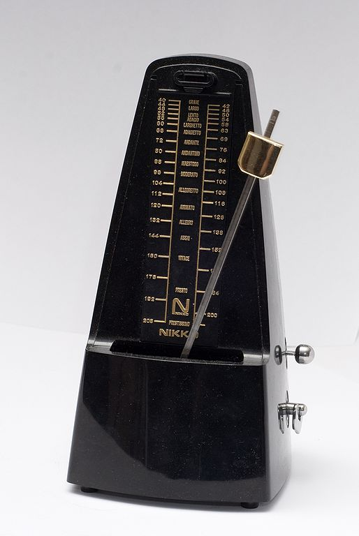
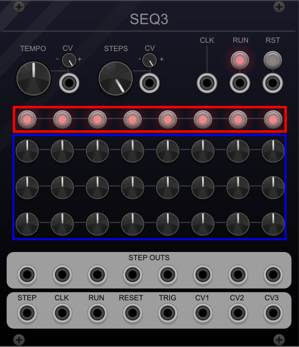

# Controllers 

Controllers initiate musical events, and in some cases, also define when musical events end.
Chapter \@ref(basic-modeling-concepts) introduced the keyboard controller, which is perhaps the most intuitive controller because it mirrors a traditional instrument.
Not all controllers are as obvious or as intuitive, however.
This chapter focuses on clocks and sequencers, which are canonical examples of modular controllers.
Unlike keyboards, clocks and sequencers are partially automated.
This means that, once started, they continue to produce control signals without additional manual control.

## Clocks

Clocks in modular synthesis typically perform two functions.
The first function is synchronization.
Just like group of musicians may use a common reference to stay on the beat, e.g. drums, different modules can use a common clock to stay in time with each other.
A modular clock is similar in several respects to a metronome, which is a musical aid for keeping time.
Metronomes like the one shown in Figure \@ref(fig:metronome) create a regular click or pulse that is adjustable to a given beats per minute (BPM).
For reference, most current music ranges from 80-160 BPM.^[https://blog.musiio.com/2021/08/19/which-musical-tempos-are-people-streaming-the-most/]
Likewise, a modular clock creates a trigger pulse^[Some clocks will produce gates.] at a given BPM and makes this signal available on an output jack.

(ref:metronome) A metronome produces a periodic sound to help musicians keep rhythm. The mechanism is an inverted pendulum with a weight on the end; moving the weight up/down changes the speed of the metronome accordingly. Image [© Vincent Quach/CC-BY-3.0](https://commons.wikimedia.org/wiki/File:Metronome_Nikko.jpg).

(\#fig:metronome)(ref:metronome)

Many clock modules also support ways of marking time off the main clock signal.
Most often these are clock divisions.
A clock division divides the clock frequency by an integer to get a new, lower frequency.
For example, if our clock is 120 BPM, then it is producing triggers at 2 Hz.
A clock division of 2 would therefore produce triggers at 1 Hz, or 60 BPM.
Clock divisions of 2, 4, and 8 are relatively common.
Each of these specialized signals requires its own jack, so typically only a few such divisions are available on a clock module.

Clock divisions can be used to implement [time signatures](https://en.wikipedia.org/wiki/Time_signature) that track how many beats occur in a measure (also known as a bar).
A common time signature in popular music is ${}^{4}_{4}$, which indicates there are four quarter notes per measure, in contrast to ${}^{3}_{4}$, which indicates there are three quarter notes per measure.
Assuming each pulse indicates a quarter note, an end of measure signal can be generated by using a clock division matching the top of the time signature.
Because a clock pulse represents the lowest resolution control signal and thus the shortest note, using more pulses per quarter note allows more resolution and shorter notes.^[Not all modules receiving clock will interpret a pulse as a quarter note. Some have higher resolutions and so require multiple pulses to advance. Twenty-four [pulses per quarter note](https://en.wikipedia.org/wiki/Pulses_per_quarter_note) is one such standard.]

The second function of a modular clock is [transport](https://en.wikipedia.org/wiki/Transport_(recording)) control, which is recording terminology for controls like play, pause, stop, rewind, etc.
Since clocks are not involved in recording per se, they typically have start, stop, and reset controls.
A reset signal is analogous to a rewind in the sense that all receiving modules will start at their initial states rather than where they left off.
Resets are a useful tool in both composition and recording.
Each of the transport controls is likely to have its own button for manual control, plus an output jack to send the control signal to downstream modules.

As with all things modular, it's important to realize that although there are specialized clock modules, anything that produces a trigger/gate pulse can be used as a clock.^[Some modules will accept non-rectangular signals as a clock signal as long as the voltage exceeds some internal threshold.]
Since clocks are sources of triggers, clocks can also be used for non-clock purposes.

### Clock under a scope

To get a better sense of what's going on, let's take a look at clock output on a scope.
Try connecting a scope to a clock's main output and bar output using the button in Figure \@ref(fig:bar-beat-bpm-scope).
You should see regular pulses off the main output and a different color bar output overlaid every 4th beat using the default time signature.

(ref:bar-beat-bpm-scope) [Virtual modular](https://cardinal.olney.ai) for making a clock patch with a scope.

<!-- MODAL HTML BLOCK -->

<!-- CAPTION BLOCK -->

(\#fig:bar-beat-bpm-scope)(ref:bar-beat-bpm-scope)

### Clock as a generator

Since clock modules produce a regular stream of pulses, we can hear them if they pulse at audio rates.
Recall the bottom threshold of human hearing is approximately 20 Hz (20 cycles per second).
Since 1200 BPM corresponds to 20 Hz, we should be able to hear clock signals above this BPM.
The clock module from the last patch only goes up to 300 BPM, but if we use the 16ths output^[This particular clock does not use division notation.], we can achieve four times that, or 1200 BPM.
Try adding an audio out module after the scope using the button in 
Figure \@ref(fig:clock-sound-bpm-scope-out) to extend the last patch.
The sixteenth note pulses should show as approximately a square wave, and by moving the BPM up and down, you should hear a change in pitch.

(ref:clock-sound-bpm-scope-out) [Virtual modular](https://cardinal.olney.ai) for making a clock-based drone patch with a scope.

<!-- MODAL HTML BLOCK -->

<!-- CAPTION BLOCK -->

(\#fig:clock-sound-bpm-scope-out)(ref:clock-sound-bpm-scope-out)

## Sequencers

The basic idea of a sequencer is very simple: a sequencer replays a control signal at a particular moment in time.
To represent time, sequencers use the idea of a *step*.
Each pulse of the clock will advance the sequencer by one step.
Any given step will have one or more control signals pre-stored.
On each step, these control signals will be sent to the corresponding output jacks.
When a sequencer reaches the last available step, it will loop back to the first step.
Sequencers typically have a switch to lower the number of available steps from the hardware maximum, e.g. from eight steps to seven.
The steps for a given control signal are respectively referred to as a *channel*.

<!-- Sequencers are more general than clocks in both the variety of control signals they support as well as the timings of those signals. -->
In analogue hardware, sequencers supporting only one control signal tend to be very compact and require external clock inputs.
Sequencers supporting multiple control signals tend to have their own clock and transport controls.
When a sequencer has only one control signal, it can be anything, but is most frequently either a trigger or a control voltage.
When a sequencer has multiple control signals, they are frequently a combination of triggers and control voltages arranged in different channels.
As previously discussed, these control signals naturally correspond to initiating musical events and pitches for notes, but any musical parameter that can be controlled by voltage can be stored in an analogue sequencer.^[Some digital sequencers can replay voltage-based control signals, but not all.]

### Clocks as sequencers

You could consider a clock as a kind of sequencer that produces triggers on a single channel.
Let's look at this by making a bass drum patch driven by a clock, which will form the basis of other patches in this section.
You like to refer back to Section \@ref(controlling-note-dynamics-volume-during-note) if you don't recall some of the modules involved.
This *very* basic kick patch uses a sine wave from the VCO and controls the amplitude of the sine wave with a fast attack, medium decay envelope.
Try making as much of the patch as possible using the button in 
Figure \@ref(fig:clock-kick-bpm-vco-adsr-vca-scope-out) before referring to the instructions there.

(ref:clock-kick-bpm-vco-adsr-vca-scope-out) [Virtual modular](https://cardinal.olney.ai) for making a clock-driven kick patch.

<!-- MODAL HTML BLOCK -->

<!-- CAPTION BLOCK -->

(\#fig:clock-kick-bpm-vco-adsr-vca-scope-out)(ref:clock-kick-bpm-vco-adsr-vca-scope-out)

Keep this example in mind as your continue through this chapter. 
Ultimately any module that produces the signals we want can be used as a sequencer, regardless of whether the module is called a sequencer.

### Trigger sequencers

The main difference between a clock and a trigger sequencer is the precise control over the timing of the triggers.
Let's look at a simple trigger-based sequencer to extend the previous kick patch.
Try adding the TRG module between the Clock and VCO using the button in 
Figure \@ref(fig:trg-kick-bpm-trg-vco-adsr-vca-scope-out).
Once you have it set up, activate a pattern of steps that isn't strictly regular, e.g. some beats immediately after each other and some spaced apart.
Each activated step will issue a gate.
Control of irregular timings is where trigger sequencers really shine compared to sequencing off a clock.

(ref:trg-kick-bpm-trg-vco-adsr-vca-scope-out) [Virtual modular](https://cardinal.olney.ai) for a trigger-sequenced kick patch.

<!-- MODAL HTML BLOCK -->

<!-- CAPTION BLOCK -->

(\#fig:trg-kick-bpm-trg-vco-adsr-vca-scope-out)(ref:trg-kick-bpm-trg-vco-adsr-vca-scope-out)

### Control voltage sequencers

Control voltage sequencers replay voltage for each step.
Typically the voltage is constant for the duration of the step, which is useful for sending V/Oct signals to play notes.
<!-- When sequencing multiple instruments, you have a choice between using a single sequencer that can handle everything or multiple separate sequencers. -->
To keep things simple and to build on the previous patch, let's create a saw-based synth voice whose pitch is controlled by a separate control voltage sequencer.
Try duplicating the VCO, ADSR, and VCA modules from the last patch and controlling the VCO with the ADDR-SEQ module by using the button in 
Figure \@ref(fig:trg-kick-seqaddr-saw-bpm-vco-adsr-vca-mixer-out).
Each sequencer step has a voltage controlled by a knob, so turning these knobs sets the note pitch for each step.
Because the volumes of these two instruments, or voices, is so different, you'll need to run each into a mixer module rather than directly into the host audio.

(ref:trg-kick-seqaddr-saw-bpm-vco-adsr-vca-mixer-out) [Virtual modular](https://cardinal.olney.ai) for a trigger-sequenced kick mixed with a control-voltage sequenced saw wave.

<!-- MODAL HTML BLOCK -->

<!-- CAPTION BLOCK -->

(\#fig:trg-kick-seqaddr-saw-bpm-vco-adsr-vca-mixer-out)(ref:trg-kick-seqaddr-saw-bpm-vco-adsr-vca-mixer-out)

#### Sequencing rests

<!-- You've likely noticed a limitation with the ADDR-SEQ module, specifically that it always plays a note and the notes are of equal duration. -->
<!-- Let's consider each of these in turn. -->
A limitation with the ADDR-SEQ module is that it always plays a note and never pauses, or [rests](https://en.wikipedia.org/wiki/Rest_(music)).
One option would be to adjust the pitch on a step so it is outside the range of human hearing.
While this option is simple and effective, it's possible that the sound will interfere with other sound waves in ways that become audible.
Another option is to replace the clock signal into the ADDR-SEQ module with the output of the trigger sequencer.
Since the trigger sequencer has steps with no trigger, this means that no clock would be sent to ADDR-SEQ on these steps.
The effect of using the trigger sequencer as a clock depends, however, on how the saw envelope is gated
Try this using the button in 
Figure \@ref(fig:rests-trg-kick-seqaddr-saw-bpm-vco-adsr-vca-mixer-out) to explore the different combinations.

(ref:rests-trg-kick-seqaddr-saw-bpm-vco-adsr-vca-mixer-out) [Virtual modular](https://cardinal.olney.ai) for a trigger-sequenced kick mixed with a control-voltage sequenced saw wave, using the trigger sequence as a clock on the voltage-controlled sequencer.

<!-- MODAL HTML BLOCK -->

<!-- CAPTION BLOCK -->

(\#fig:rests-trg-kick-seqaddr-saw-bpm-vco-adsr-vca-mixer-out)(ref:rests-trg-kick-seqaddr-saw-bpm-vco-adsr-vca-mixer-out)

The patch in Figure \@ref(fig:rests-trg-kick-seqaddr-saw-bpm-vco-adsr-vca-mixer-out) illustrates that the way the sequencers are connected to each other and the clock plays a big difference on the resulting sound.
If the gate and the clock are from the same source, and therefore match, every sequenced note will be heard.
If the gate source is the trigger sequencer, rests will be produced. 
These effects are summarized in Table \@ref(tab:trigger-clock-effects).
The second row is comparable to a multichannel sequencer that allows steps to be silenced, thus reducing the overall pitched steps available by replacing them with silence.
In contrast, the third row *inserts* silence between pitched steps, creating a longer sequence where no pitched steps are discarded.

Table: (\#tab:trigger-clock-effects) Effects of gate and clock mismatching when combining trigger and control voltage sequencers to produce rests.

| Clock source      |    Gate source    | Effect                        |
|-------------------|-----------------|-------------------------------|
| Clock             |       Clock       | Every note played, no rests          |
| Clock             | Trigger sequencer | Notes skipped, with rests           |
| Trigger sequencer | Trigger sequencer | Every note played, with rests |
| Trigger sequencer |       Clock       | Notes repeated, no rests       |

#### Sequencing note duration

A second limitation of the ADDR-SEQ is that all the notes are the same duration.
This limitation can be somewhat addressed by using variable length release on the envelope.
A longer release would lengthen the duration of the sound, but for any instrument that has a sustain, the volume would not be correct using this method.
The fundamental problem is that the gate into the ADSR is a fixed width which results in a fixed length note.
What is needed is to change the clock signal into a gate where the length of the gate matches the length of the desired note.
Ideally we'd use a separate control voltage sequencer to set the gate lengths for us, but in the interest of keeping things relatively simple, let's control gate length manually.
Try to add a trigger to gate module that takes the clock and sends out a gate to the saw envelope using the button in Figure \@ref(fig:rests-note-lengths-trg-kick-seqaddr-saw-bpm-vco-adsr-vca-mixer-out).
As you move the gate length knob, you'll hear that the note lengths change correspondingly.

(ref:rests-note-lengths-trg-kick-seqaddr-saw-bpm-vco-adsr-vca-mixer-out) [Virtual modular](https://cardinal.olney.ai) for a trigger-sequenced kick mixed with a control-voltage sequenced saw wave, using the trigger sequence as a clock on the voltage-controlled sequencer and a trigger to gate module to control note length.

<!-- MODAL HTML BLOCK -->

<!-- CAPTION BLOCK -->

(\#fig:rests-note-lengths-trg-kick-seqaddr-saw-bpm-vco-adsr-vca-mixer-out)(ref:rests-note-lengths-trg-kick-seqaddr-saw-bpm-vco-adsr-vca-mixer-out)

## Summing up

Clocks and sequencers are canonical modules for creating control signals in a modular system. 
Unlike manual controller like a keyboard, both clocks and sequencers are semi-automated: once they are set up, they will continue to generate control signals without additional human intervention.
<!-- Sequencing can get complex rather quickly, and there has been a tremendous amount of innovation around the problem of sequencing, leading to a variety of different approaches. -->
The patches in this chapter explored more traditional analogue sequencing using separate modules.
Larger analogue sequencer modules with multiple channels and features can often be viewed as composites of these smaller modules, as shown in Figure \@ref(fig:seq3-annotated).
Perhaps the most powerful aspect of modular controllers is that anything generating a control signal can be used as a controller.
Thus one can build a custom sequencer out of basic components to solve a particular musical problem.
Future chapters will explore additional controllers and control techniques.

(ref:seq3-annotated) The SEQ3 sequencer module from VCVRack. The trigger sequence channel is highlighted in red and the control voltage channels are highlighted in blue.

(\#fig:seq3-annotated)(ref:seq3-annotated)

<!-- Options -->
<!-- Chaining keyboards -->
<!-- Touch controllers (has exponential) -->

<!-- Clocks -->
<!-- Sequencer 1 channel/3 channel -->
<!-- trigger sequencer -->

<!-- Clocks, transport/tempo, divisions, time signatures,  -->
<!-- patches  -->
<!-- - into scope with signature as 2nd signal -->
<!-- - into audio out changing bpm, now 16ths to make tone -->
<!-- - gating low sine osc envelope for beats -->

<!-- Sequencing -->
<!-- signals over time; on/off vs continuous -->
<!-- patches -->
<!-- - beat patters by putting trg in between clock and adsr; introduce resets -->
<!-- - pitch sequencer: sequence a new osc with notes; duplicate modules and also have reset -->
<!-- - add variable length notes/rests by using TRG gate as a clock signal for adr3 and gate for saw adsr -->

<!-- Tremelo/vibrato? -->
<!-- Fundamental Modules and Composition		 -->
<!-- 	Basic concepts	 -->
<!-- 		 Module categories, signals, signal interpretation, 5 patchs from drone to key controller for pitch/gate with amplitude envelope -->
<!-- 	Controllers	 -->
<!-- 		Controllers -->
<!-- 		Trigger/gate, phase, sync -->
<!-- 	Generators	 -->
<!-- 		Oscillators (VCO) /LFO ; morphing between waveshapes/ PWM /sync-->
<!-- noise -->
<!-- 		Samplers -->
<!-- 	Modifiers	 -->
<!-- 		Filters (VCF): poles, slopes, cutoff frequency, resonance -->
<!-- 		Envelopes, velocity sensitivity, aftertouch -->
<!-- 		Amplifiers -->
<!-- 		Effects: delay/reverb/panning -->

<!-- Complex modules and Compositions		 -->
<!-- 	Controllers	 -->
<!-- 		Clock, sequencing, arpggiators -->
<!-- 		Euclidean rhythms -->
<!-- 		Probability -->
<!-- 	Generators	 -->
<!-- 		PWM -->
<!-- 		FM/AM -->
<!-- 		Ring modulation -->
<!-- 		Vocoders -->
<!-- 		Random sampling -->
<!-- 	Modifiers	 -->
<!-- 		LFO -->
<!-- 		Sample and hold -->
<!-- 		Slew -->
<!-- 		Wave-folding -->
<!-- 		Attenuators, inverters, and attenuverters -->
<!-- 		Quantizers -->
<!-- 		Switches -->
<!-- 		Logic -->

