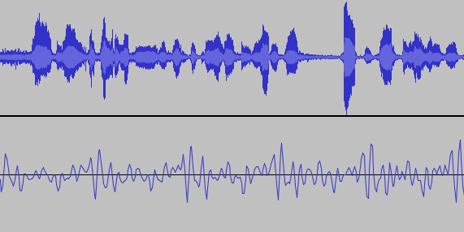
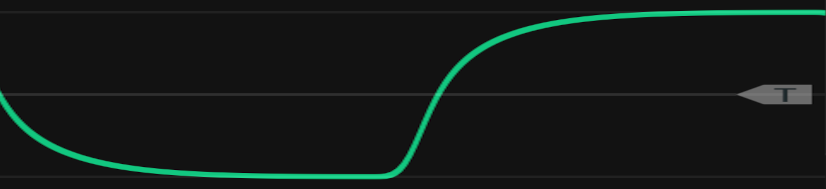

# Modifiers

Modifiers modify incoming signals that may be either audio or some kind of control signal.
Generators create audible sound.
Chapter \@ref(basic-modeling-concepts) introduced voltage controlled amplifiers (VCAs) that modify the amplitude of incoming signals, which can be either audio or control voltage.
That chapter also introduced envelopes that modify control voltage, and we have routinely used envelopes to control VCAs in order to model the dynamics of various instruments.

This chapter expands upon audio modifiers specifically and focuses on two foundational categories of modifiers, effects and voltage controlled filters.
Effects can substantially enrich the sounds you create both in terms of thickness of sound and sense of acoustic space, and voltage controlled filters create some of the most defining sounds in electronic music.

## Effects

There are perhaps an infinite number of possible audio effects.
This section focuses on time-based effects, as the ideas behind these are complementary to the following discussion of voltage controlled filters.
Time and phase are closely related when we're talking about a repeating waveshape.
Imagine you put a red dot on the outside of a car tire  and start driving.
At any moment, you can stop the car and the red dot will be in a certain position, which you can describe as an angle relative to the ground.
If the car has been moving at the same speed the entire time, you can exactly predict where the red dot will be.
Figure \@ref(fig:wheel-sine) shows an abstract rendering of this example, highlighting the relationship between the rotation of the wheel (in radians) and the shape of a sine wave.

(ref:wheel-sine) [Relation](https://upload.wikimedia.org/wikipedia/commons/0/08/Sine_curve_drawing_animation.gif) between a unit circle and a sine wave. Image [© Brews ohare/CC-BY-4.0](https://commons.wikimedia.org/wiki/File:Sine_curve_drawing_animation.gif).

(\#fig:wheel-sine)(ref:wheel-sine)

The discussion of simultaneously-sounding oscillators in Chapter \@ref(generators) emphasized phase relationships between the oscillators as well as slight tuning differences between the oscillators, both of which can give a fuller sound.
Phase captures everything about the relationship between continuous tones because the amount one signal has been offset relative to another can always be reduced to between 0 and 360 degrees (or $2pi$).^[If the offset is more than 360 degrees, it simply wraps around to a value equivalent to a value between 0 and 360 degrees, e.g. 370 degrees is the same as 10 degrees.]
However, music does not consist of continuous tones.

When we begin to consider music more broadly, it makes sense to think of phase and offset distance being decoupled depending on how much time has passed.
In real music, simultaneous sounds don't repeat forever but rather change over fairly short timescales, e.g. the envelope of a kick drum.
For brief moments of time, phase relationships capture most everything, but for longer offset distances, the amount of time that has passed is more relevant than phase relationships.
For this reason, time-based effects for short periods of time are often described in terms of phase, and longer-period effects are described in terms to time.
Figure \@ref(fig:moon-phase-time) illustrates this idea with 6 seconds of natural sound (top) compared to .03 seconds of that same sound (bottom).
While the longer stretch is clearly not repeating, the shorter stretch is approximately repeating and could be usefully characterized in terms of phase.

(ref:moon-phase-time) Six seconds of natural sound (upper) with no clear repeating structure and .03 seconds of that same sound (lower) with approximate repeating structure.

(\#fig:moon-phase-time)(ref:moon-phase-time)

Unlike the topics we've previously covered, time-based effects tend to be implemented by single modules rather than by collections of modules working together.
Therefore our discussion will focus on the concepts behind these effects and modules that implement them.
We'll begin with effects operating on the longest time scales and move progressively downward until the effects are based in phase.

### Delays

A [delay effect](https://en.wikipedia.org/wiki/Delay_(audio_effect)) copies some portion of of the signal and then replays it, typically mixed in with the original signal.
The ratio of original signal to processed signal is commonly referred to as dry/wet, where dry is the original signal and wet is the processed signal.
Common parameters of delays include the length of the delayed and the number of times it repeats.
Often a decay parameter is applied so that the delayed copy gets attenuated with each repetition.
Some delays can play back multiple copies at once, which blurs the boundary between a delay effect and reverb.
An example delay effect is shown in Figure \@ref(fig:moonshot-delay2s). 
The original signal ([JFK's famous moon speech](https://en.wikipedia.org/wiki/We_choose_to_go_to_the_Moon)), is copied and then a delay effect applied to the copy, with decay.
Note that the delay effect extends well beyond the length of the original audio.
Delay is the longest time-based effect we will discuss, typically ranging from a hundred milliseconds to multiple seconds.

(ref:moonshot-delay2s) [Delay](https://olney.ai/ct-modular-book/images/moonshot-delay2s.png-moonshot-delay2s.ogg-local.html) applied to an audio clip. The original sound (upper) is duplicated (lower) and the effect applied. The decaying echos of the delay make the lower track significantly longer than the original.

(\#fig:moonshot-delay2s)(ref:moonshot-delay2s)

Let's take a look at a delay module.
The main controls are the time (length of the delay offset), the feedback (amount of decay), and the wet/dry mix.
These parameters can be set using knobs for a consistent sound but also modulated to create very unusual sounds.
Try patching up a reverb into a single voice keyboard patch using the button in Figure \@ref(fig:twelvekey-env-delay).

(ref:twelvekey-env-delay) [Virtual modular](https://cardinal.olney.ai) for a delay effect.

<!-- MODAL HTML BLOCK -->

<!-- CAPTION BLOCK -->

(\#fig:twelvekey-env-delay)(ref:twelvekey-env-delay)

### Reverb

A [reverb effect](https://en.wikipedia.org/wiki/Reverb_effect) is a delay-time effect with multiple overlapping copies and relatively fast decays.
Reverb conveys a sense of space, or room that the sound is occuring in, because it emulates the reflections of sound off various surfaces at different distances.
Sound travels at about 1100 feet per second, or a 1.1 feet per millisecond, so each foot of different distance in the reflection should cause an offset of about 1 millisecond relative to other reflections and the original sound.
One of the earliest ways of creating reverb was to take a recording and play it back in a particular space while simultaneously re-recording it with a microphone in that space.
The approach effectively "bakes in" the natural reverb of the room onto the recording.
Various electronic methods have been used to create a reverb effect using physical media.
Notably among these is the spring reverb, which passes the signal through a spring and uses the reflections created in the spring to model the reflections of sound.

Reverb has been added to the speech example in in Figure \@ref(fig:moonshot-reverb75), and like delay extends beyond the length of the original audio.
However, the duration it extends is much shorter (about 300 milliseconds), reflecting a faster decay time.
Note that this recording was taken in a stadium that already had significant natural reverb.

(ref:moonshot-reverb75) [Reverb](https://olney.ai/ct-modular-book/images/moonshot-reverb75.png-moonshot-reverb75.ogg-local.html) applied to an audio clip. The original sound (upper) is duplicated (lower) and the effect applied. The added reverb slightly extends the length of the original track and is most noticeable at that point due to the natural reverb in the original recording.

(\#fig:moonshot-reverb75)(ref:moonshot-reverb75)

Let's take a look at a reverb module.
The main controls are the input level, high-pass filtering^[High-pass filtering will be explained in detail later in the chapter.], and the wet/dry mix.
This reverb module uses a combinations of sliders and knobs for parameter settings, but these can again be both manually set and modulated to create interesting sounds.
Try patching up a reverb into a single voice keyboard patch using the button in Figure \@ref(fig:twelvekey-env-reverb).

(ref:twelvekey-env-reverb) [Virtual modular](https://cardinal.olney.ai) for a reverb effect.

<!-- MODAL HTML BLOCK -->

<!-- CAPTION BLOCK -->

(\#fig:twelvekey-env-reverb)(ref:twelvekey-env-reverb)

### Chorus {#chorus-effect}

A [chorus effect](https://en.wikipedia.org/wiki/Chorus_(audio_effect)) creates copies of the original signal with slight frequency and phase changes relative to the original.
We previously discussed chorus in Section \@ref(chorus-oscillators) in the context of multiple oscillators playing together.
The chorus effect is similar except that it applies to the overall audio signal, and it typically has an internal LFO that controls the phase offsets between copies of the signal. 

Chorus has been added to the speech example in in Figure \@ref(fig:moonshot-chorus), and unlike the previous effects, does not noticeably extend beyond the length of the original audio.
Instead you can see an effect on the shape of the wave as the copies interfere with each other.
In this example, the chorus delay is 20 milliseconds, which is in the middle of the typical chorus range of 10-30 milliseconds.

(ref:moonshot-chorus) [Chorus](https://olney.ai/ct-modular-book/images/moonshot-chorus.png-moonshot-chorus.ogg-local.html) applied to an audio clip. The original sound (upper) is duplicated (lower) and the effect applied. The shape of the wave is affected by the interference of copies of the original signal delayed by 20 milliseconds.

(\#fig:moonshot-chorus)(ref:moonshot-chorus)

Let's take a look at a chorus module.
The main controls are the rate and depth of the internal LFO and the wet/dry mix.
As before, the controls can be manually set or voltage-controlled. 
Try patching up a chorus into a single voice keyboard patch using the button in Figure \@ref(fig:twelvekey-env-chorus).

(ref:twelvekey-env-chorus) [Virtual modular](https://cardinal.olney.ai) for a chorus effect.

<!-- MODAL HTML BLOCK -->

<!-- CAPTION BLOCK -->

(\#fig:twelvekey-env-chorus)(ref:twelvekey-env-chorus)

### Flanger

A [flanger, or flanging effect](https://en.wikipedia.org/wiki/Flanging#Comparison_with_phase_shifting) is created by creating one copy of the signal and delaying it very briefly, typically 1-5 milliseconds.
This slight shift causes harmonically-related frequencies in the signal to be amplified.
For example, 1 millisecond shift means that every 1000 Hz, the original signal will be doubled in amplitude through constructive interference.
This doubling will occur for all integer multiples of 1000 Hz, and so produces a harmonic series with 1000 Hz as the fundamental.
Thus a stable offset can create a harmonic sound even out of noise, as shown in Figure \@ref(fig:noise-comb).
Flangers typically use an LFO to vary the offset to create a sweep across such sounds.

(ref:noise-comb) [Youtube video](https://www.youtube.com/watch?v=k5ewou_8Abc) of pink noise with increasing 1 millisecond offsets. Note the harmonic noise that emerges as well as the comb shape of the frequency spectrum. Image [© Sweetwater](https://www.youtube.com/c/sweetwater).

(\#fig:noise-comb)(ref:noise-comb)

A flanger has been added to the speech example in in Figure \@ref(fig:moonshot-flanger5ms), and like chorus does not noticeably extend beyond the length of the original audio.
Additionally, and like chorus, you can see an effect on the shape of the wave as the delayed copy of the signal interferes with the original.
In this example, the flanger delay is 1 millisecond and so produces a sweeping tone around 1000 Hz.

(ref:moonshot-flanger5ms) [Flanger](https://olney.ai/ct-modular-book/images/moonshot-flanger5ms.png-moonshot-flanger5ms.ogg-local.html) applied to an audio clip. The original sound (upper) is duplicated (lower) and the effect applied. The shape of the wave is affected by the interference of a copy of the original signal delayed by 1 millisecond.

(\#fig:moonshot-flanger5ms)(ref:moonshot-flanger5ms)

Let's take a look at a flanger module.
The main controls are the rate and depth of the internal LFO and the flanging offset.
As before, the controls can be manually set or voltage-controlled. 
Try patching up a flanger into a single voice keyboard patch using the button in Figure \@ref(fig:twelvekey-env-flanger).

(ref:twelvekey-env-flanger) [Virtual modular](https://cardinal.olney.ai) for a flanger effect.

<!-- MODAL HTML BLOCK -->

<!-- CAPTION BLOCK -->

(\#fig:twelvekey-env-flanger)(ref:twelvekey-env-flanger)

### Phaser

A [phaser effect](https://en.wikipedia.org/wiki/Phaser_(effect)) does not apply a delay.
Instead, a phaser shifts the phase of frequencies based on the values of those frequencies.
As a result, some frequencies are phase shifted behind the original signal while others are phase shifted ahead of the original signal.
Typically phasers have multiple stages of phase shifting to magnify the effect.
The variation in phase shifting means that while a phaser produces peaks in frequency spectrum like a flanger, those peaks are not harmonically related.
A rough analogy would be that a flanger is to a phaser like a single delay is to a reverb: the former cases use a single copy whereas the latter cases use multiple diffuse copies.

A phaser has been added to the speech example in in Figure \@ref(fig:moonshot-phaser), and like chorus and flanger does not noticeably extend beyond the length of the original audio.
The effect on the shape of the wave is quite subtle compared to the flanger, reflecting the constructive and destructive interference resulting from the phaser.

(ref:moonshot-phaser) [Phaser](https://olney.ai/ct-modular-book/images/moonshot-phaser.png-moonshot-phaser.ogg-local.html) applied to an audio clip. The original sound (upper) is duplicated (lower) and the effect applied. The effect on the shape of the wave is subtle and reflects both constructive and destructive interference.

(\#fig:moonshot-phaser)(ref:moonshot-phaser)

Let's take a look at a phaser module.
The main controls are the rate and depth of the internal LFO and feedback.
As before, the controls can be manually set or voltage-controlled. 
Try patching up a phaser into a single voice keyboard patch using the button in Figure \@ref(fig:twelvekey-env-phaser).

(ref:twelvekey-env-phaser) [Virtual modular](https://cardinal.olney.ai) for a phaser effect.

<!-- MODAL HTML BLOCK -->

<!-- CAPTION BLOCK -->

(\#fig:twelvekey-env-phaser)(ref:twelvekey-env-phaser)

## Voltage controlled filters

Voltage controlled filters (VCFs) are an essential component of subtractive synthesis.
Subtractive synthesis, as you recall, is characterized by taking harmonically complex waveshapes and then removing harmonic content to create the desired sounds. 
The opposite approach, additive synthesis, takes harmonically simple waveshapes and adds them together to create desired sounds; however, this becomes complex in analogue circuitry and is better suited to digital computers, which is why subtractive synthesis has historically been the dominant approach to synthesis.
Filters, if you haven't already guessed, are a primary method for removing harmonic content, which is why VCFs are an essential component of subtractive synthesis.

### Filters are imperfect

As discussed in Chapter \@ref(harmonic-and-inharmonic-sounds), timbre is intimately connected to waveshape, and removing harmonic content affects both the shape of the wave and its timbre.
You may assume from our discussion of Fourier analysis that a filter will remove selected harmonics completely.
If that were the case, we might expect a square wave with all but the first two harmonics filtered to look like Figure \@ref(fig:square-fourier-2-harmonics-2).^[This figure was created using the simulator in Section \@ref(resonators-formants-and-frequency-spectrum) which you can use to further explore these concepts.]

(ref:square-fourier-2-harmonics-2) Fourier approximation of the first 11 harmonics of a square wave.

(\#fig:square-fourier-2-harmonics-2)(ref:square-fourier-2-harmonics-2)

Using Fourier decomposition to understand VCFs is misleading in many respects, as will become clear by the end of this section.
It is also not practical to build a filter based on Fourier decomposition for two at least two reasons.
First, we want our filter to happen in real time, i.e. before a wave has even completed its cycle, which Fourier can't do.
Second, Fourier introduces [Gibbs error](https://en.wikipedia.org/wiki/Gibbs_phenomenon) that you can see in Figure \@ref(fig:square-fourier-2-harmonics-2) as peaks where there should be 90 degree angles in the square wave.
If we were to use Fourier as the basis of a filter, those peaks would introduce ringing artifacts.

(ref:vcf-square-out) VCF output on a square wave that has been aligned and scaled for comparison to Figure \@ref(fig:square-fourier-2-harmonics-2). Note the relatively flat low and high regions of the wave, which imply the presence of higher harmonics.

(\#fig:vcf-square-out)(ref:vcf-square-out)

The output of a real VCF filtering out all but the first 11 harmonics is shown in Figure \@ref(fig:vcf-square-out).
The VCF output has two striking differences with the Fourier example.
First, the transition from maximum positive to maximum negative (and vice versa) is substantially smoother for the VCF, creating rounder edges.
Second, the VCF has relatively flat maximum regions of the wave, which imply higher harmonics.
By comparing the Fourier and VCF outputs, we can see that the VCF is removing more low frequency content than we would expect (rounder edges) but that the VCF is removing less high frequency content than we would expect (flatter maximum regions of the wave).
So a VCF is not like a net that either lets harmonics through or not.
Instead, a VCF affects a range of harmonics, but within that range, it affects some harmonics more than others.

Let's take a look at this in some patches that filter white noise.
The advantage of filtering white noise is that white noise contains all frequencies, so it is easy to see the shape of the filter's effect.
The patches will use two common filters: low-pass filters and high-pass filters.
Low-pass filters (LPF) let low frequencies pass through relatively unaffected, and high-pass filters (HPF) let high frequencies pass through relatively unaffected.
The effect of each filter is controlled using the cutoff frequency, which defines a range of affected frequencies.
Try patching up the two filters using the button in Figure \@ref(fig:noiz-lfp-out-fft).

(ref:noiz-lfp-out-fft) [Virtual modular](https://cardinal.olney.ai) for applying low- and high-pass filtering on white noise.

<!-- MODAL HTML BLOCK -->

<!-- CAPTION BLOCK -->

(\#fig:noiz-lfp-out-fft)(ref:noiz-lfp-out-fft)

Let's take another look, this time with a square wave and an oscilloscope, which will let us look at the effect on the wave rather than the frequency spectrum.
Of course the disadvantage of white noise is that you can't usefully look at the effect 
Try modifying your patch to use an audio rate LFO and an oscilloscope using the button in Figure \@ref(fig:lfo-lfp-out-scope-fft).
As you can see, LPF creates curious shapes that occasionally approximate shapes we recognize, like triangle and sine waves (though with reduced amplitude).
HPF creates perhaps even more curious shapes that quickly turn into increasingly sharp pulses.

(ref:lfo-lfp-out-scope-fft) [Virtual modular](https://cardinal.olney.ai) for applying low- and high-pass filtering on a square wave.

<!-- MODAL HTML BLOCK -->

<!-- CAPTION BLOCK -->

(\#fig:lfo-lfp-out-scope-fft)(ref:lfo-lfp-out-scope-fft)

### Filters change frequency and phase

To understand why VCFs are behaving this way, we need to understand how they work.
The best way to understand VCFs, which are complex, is in terms of the passive [RC circuit](https://en.wikipedia.org/wiki/RC_circuit).
When a signal runs through an RC circuit, the circuit leeches out energy from certain parts of the waveshape and returns that energy at other parts, as shown in Figure \@ref(fig:square-lpf-hpf).
While a full explanation of how the RC circuit works is out of scope,^[For a good basic explanation of an RC circuit, see [this video](https://youtu.be/3tMGNI--ofU).] we can nevertheless describe what it does to explain what a VCF does.
The overarching idea is that when an RC circuit leeches energy out of a signal, it slows down or speeds up frequency components of the signal and so phase shifts those components.
Again, VCFs change more than just frequency spectrum - they also change phase across the frequency spectrum.

(ref:square-lpf-hpf) Square wave through a low-pass (left) and high-pass (right) filter. Note the symmetry of the difference between the square wave and the filtered signal: the shape of the filtered signal below the square wave in the positive region is the same as the filtered signal above the square wave in the negative region, but flipped. 

(\#fig:square-lpf-hpf)(ref:square-lpf-hpf)

Let's look first at the LPF case, using the left side of Figure \@ref(fig:square-lpf-hpf) as a reference.
As the signal increases, the RC circuit leeches out energy until it fills up, at which point it has no effect on the signal. 
Once the signal starts decreasing, the RC circuit releases energy until it runs out.
Sharp signal increases are slowed down, meaning they are phase shifted negatively. Slowing them means removing high frequencies.
Here's an analogy that might help.
Imagine you're driving on the freeway and a wind blows from ahead whenever you try to accelerate and blows from behind whenever you decelerate. 
The wind is opposing your ability to change speed.
The RC circuit likewise is opposing the signal's voltage changes.

The HPF case on the right side of Figure \@ref(fig:square-lpf-hpf) is different.
As the signal increases and stops changing, the RC circuit leeches out energy until the capacitor fills up, at which point it has no effect on the signal. 
Once the signal starts decreasing and stops changing, the capacitor releases energy until it runs out.
Flat signals are speeded up, meaning they are phase shifted positively. 
Speeding them up means removing lower frequencies.
Using the wind and car analogy, imagine you're driving on the freeway and a wind blows whenever you try to keep a constant speed.^[More precisely, the wind blows from ahead when you start cruising after increasing speed, and the wind blows from behind when you start cruising after reducing speed.]
The wind is opposing your ability to maintain constant speed.
The RC circuit likewise is opposing the signal's constant voltage.

(ref:bode-low-pass) A Bode plot for a low-pass filter with a cutoff frequency of 100 Hz. Note the lines marked Bode pole represent idealized behavior of the filter and the Low Pass markers indicate actual behavior. The cutoff point is exactly aligned with a -45 degree phase shift. Image [public domain](https://commons.wikimedia.org/wiki/File:Sine_curve_drawing_animation.gif).

(\#fig:bode-low-pass)(ref:bode-low-pass)

The effect of the RC circuit on frequency and phase spectrum can be summarized by a [Bode plot](https://en.wikipedia.org/wiki/Bode_plot), as shown for an LPF in Figure \@ref(fig:bode-low-pass).
The lines labeled "Bode pole" are idealized and the actual behavior of the LPF is indicated by the markers.
Let's start with the upper subplot, which shows how the filter reduces the amplitude of the signal across frequencies.
The cutoff frequency occurs where the line changes from 0 dB to a downward angle.
As you can see, the actual behavior of the LPF is to reduce frequencies even before this point as shown by the markers below the line to the left of the cutoff point.
The decrease in amplitude at the cutoff frequency is 3 dB.^[Recall a 6 dB decrease means amplitude is cut in half.]
The decrease to the right of the cutoff point is 6 dB for each doubling of frequency, or 6 dB/Oct.
That means the amplitude of the signal will decrease by half for each additional octave above the cutoff frequency.
Let's look at the lower subplot, which shows phase shift how the filter changes phase across frequencies.
As previously explained, the LPF slows down higher frequency components of the wave, and creates a maximum phase shift of -90 degrees for those frequencies.
At the cutoff, the phase shift is already -45 degrees.

(ref:bode-high-pass) A Bode plot for a high-pass filter with a cutoff frequency of 100 Hz. Note the lines marked Bode pole represent idealized behavior of the filter and the High Pass markers indicate actual behavior. The cutoff point is exactly aligned with a 45 degree phase shift. Image [© Brews ohare/CC-BY-4.0](https://commons.wikimedia.org/wiki/File:Bode_High-Pass.PNG).

(\#fig:bode-high-pass)(ref:bode-high-pass)

The Bode plot for an HPF looks very similar to that of an LPF, but reversed as shown in Figure \@ref(fig:bode-high-pass).
As before the range of frequencies affected by the filter extends on both sides of the cutoff point, the signal is already attenuated by 3 dB at the cutoff point, and the decrease in amplitude (this time to the left of the cutoff) is 6 dB/Oct.
The main difference is in the sign of the phase shift in the lower subplot.
Instead of being negative because the frequencies have been slowed down, the phase shift is now positive because the affected frequencies have been sped up.

### Combining filters 

In the previous Bode plots, the cutoff frequency marked the location past which the amplitude reduced by 6 dB/Oct.
This bend in the frequency response of the filter is called a pole, and the RC circuit is therefore an example of a 1-pole filter element.
To get greater reductions than 6 dB/Oct, multiple 1-pole filter elements can be combined.^[RC circuits cannot be simply combined, but they remain useful for understanding the additive effect of each element.]
Each filter element has a distinct pole, so the overall shape of the drop off has bends corresponding to these poles.
This means that a 4-pole filter would have four distinct regions of drop off rather than the single region we looked at before.
Each region would contribute both to amplitude attenuation and phase shift at a given frequency.
Common VCFs range from 1-4 poles and therefore implement 6, 12, 18, or 24 dB/Oct reductions in amplitude.
It should now be clear why filters have such characteristic sounds: the many different design choices in a filter, ranging from the selection of components to the arrangement of filter elements, each contributes to a specific effect on both amplitude attenuation and phase for each frequency filtered.

In addition to combining filters of the same type, we can also combine filters of different types.
As you might expect, multiple filters working in different frequency directions create complex phase relationships as each independently contributes to  amplitude attenuation and phase for each frequency filtered.
A band-pass filter can be created by combining an LPF and HPF in series.
A band-pass filter mostly lets through frequencies within a range but more strongly attenuates frequencies outside that range.
Try making a band-pass filter using two VCFs using the button in Figure \@ref(fig:lfo-lpf-hpf-out-scope-fft).
Since there are now two cutoffs to control to hear the combined filter sweep, hook up an LFO to each VCF cutoff frequency.

(ref:lfo-lpf-hpf-out-scope-fft) [Virtual modular](https://cardinal.olney.ai) for combining LPF and HPF filters to make a band-pass filter and animating it with an LFO.

<!-- MODAL HTML BLOCK -->

<!-- CAPTION BLOCK -->

(\#fig:lfo-lpf-hpf-out-scope-fft)(ref:lfo-lpf-hpf-out-scope-fft)

A notch filter^[A notch filter is sometimes called a band-reject filter.] can be created by combining an LPF and HPF in parallel.
A notch filter mostly lets through every thing but frequencies within a range.
Try making a notch filter using two VCFs and a mixer using the button in Figure \@ref(fig:lfo-lfo-lpf-hpf-mixer-out-scope-fft).
As before, there are two cutoffs to control to hear the combined filter sweep, so an LFO can be used to control each VCF cutoff frequency.

(ref:lfo-lfo-lpf-hpf-mixer-out-scope-fft) [Virtual modular](https://cardinal.olney.ai) for combining LPF and HPF filters to make a notch filter and animating it with an LFO.

<!-- MODAL HTML BLOCK -->

<!-- CAPTION BLOCK -->

(\#fig:lfo-lfo-lpf-hpf-mixer-out-scope-fft)(ref:lfo-lfo-lpf-hpf-mixer-out-scope-fft)

### Resonance

Resonant filters have been an important sound in electronic music even before modular synthesizers^[https://120years.net/wordpress/the-fonosynth-paul-ketoff-paolo-ketoff-julian-strini-gino-marinuzzi-jr-italy-1958/].
We previously discussed resonance in Section \@ref(resonators-formants-and-frequency-spectrum), but in terms of real instruments.
[Electrical resonance](https://en.wikipedia.org/wiki/Electrical_resonance) is similar and can be understood analogously to waves reflecting off the fixed end of a string to create a standing wave.
In the case of the filter, feedback from the frequency at the filter cutoff point "reflects" back into the circuit and interferes with the original signal.
As long as the two signals are aligned in phase, they will constructively interfere and amplify the frequencies at the cutoff point. 
If the feedback increases beyond a certain point, the filter will begin to oscillate and effectively turn into a sine wave VCO.
Try patching up a resonant filter using white noise using the button in Figure \@ref(fig:noiz-lpf-out-scope-fft).
If you crank up the resonance on the filter, you will get a sine wave even though the input is just noise.
This illustrates that resonance is a property of the filter itself, not of the input.
Try also extending the patch using square wave input to see what resonant filter sweeps sound and look like on a wave.
You should see that the cutoff frequency and resonance interact in interesting ways and that resonance can, in some cases, add frequency content back into the sound that the filter had removed.

(ref:noiz-lpf-out-scope-fft) [Virtual modular](https://cardinal.olney.ai) for applying resonant filtering on white noise and a square wave.

<!-- MODAL HTML BLOCK -->

<!-- CAPTION BLOCK -->

(\#fig:noiz-lpf-out-scope-fft)(ref:noiz-lpf-out-scope-fft)

Although filter resonance has clear regions where the filter is self-oscillating or not, there is also an intermediate region where the filter begins to oscillate but the oscillation quickly dies out.
This is analogous to plucking a string or pushing on a pendulum.
Because energy is not continuously being introduced into the system, the dampening in the system brings it to rest.
The filter resonance region that acts as a dampened oscillator is used for an effect called pinging.
Pinging sends a gate or trigger to a filter in the dampened oscillator region of resonance.
That signal excites the filter enough to create a short oscillation that quickly decays.
So instead of using a VCO, VCA, and envelop to get a brief oscillation, one can simply ping a resonant filter.
This is particularly useful for percussive sounds.

Try to ping a filter using the button in Figure \@ref(fig:lfo-vcf-out-scope-fft).
Once the resonance is adjusted to be on the edge of oscillation, you can ping it by sending a pulse from a square LFO.
The pitch of the pinged response can be adjusted by the filter's cutoff.
Because the shape of the pulse used to ping a filter represents energy over time, the shape of the pulse will affect how the filter rings in response to the ping. 
Any kind of pulse can be used to ping a filter, including envelopes.

(ref:lfo-vcf-out-scope-fft) [Virtual modular](https://cardinal.olney.ai) for applying resonant filtering on white noise and a square wave.

<!-- MODAL HTML BLOCK -->

<!-- CAPTION BLOCK -->

(\#fig:lfo-vcf-out-scope-fft)(ref:lfo-vcf-out-scope-fft)

## Waveguides

Time-based effects and filters can be combined to make a synthesis technique called a [waveguide](https://en.wikipedia.org/wiki/Digital_waveguide_synthesis).
The simplest waveguide is known as the [Karplus-Strong algorithm](https://en.wikipedia.org/wiki/Karplus%E2%80%93Strong_string_synthesis).
The basic idea of a waveguide is somewhat similar to a resonant filter.
A resonant filter has a feedback path that cycles energy back into the circuit and sets up oscillation.
A waveguide creates a delayed copy of the signal (often noise), filters it, and the feeds back to mixes it in with the incoming signal as shown in Figure \@ref(fig:karplus-strong).
Unlike a resonant filter, however, waveguides are highly influenced by the nature of the delay.
The time-based effects discussed in this chapter apply to waveguides.
For example, the flanger effect of creating harmonics in a short delay will affect the harmonics of a waveguide.
While waveguides can be used to create a wide range of sounds, Karplus-Strong is typically used for string pluck sounds.

(ref:karplus-strong) A diagram of the Karplus-Strong algorithm. The plus symbol mixes the feedback path with the incoming signal. Image [© PoroCYon/CC-BY-SA-3.0](https://en.wikipedia.org/wiki/File:Karplus-strong-schematic.svg).

(\#fig:karplus-strong)(ref:karplus-strong)

Try to create a guitar string pluck by waveguide using the button in Figure \@ref(fig:karplus-strong-guitar-env-delay-filter).
One of the tricky things about waveguides is that they have many parameters that depend on each other.
The initial sound source will bleed through more to the final sound if you use a wider envelope that lets more of it through.
The delay time will set the fundamental and have some effect on the amount of vibration.
However, much of the vibration, i.e. how long it takes the vibration to decay, is controlled by the filter cutoff, the mixer controlling feedback from the delay loop, and the amount of initial sound.
It's best to go back and forth between these settings to see what effect they have to get the sound you want.

(ref:karplus-strong-guitar-env-delay-filter) [Virtual modular](https://cardinal.olney.ai) for applying resonant filtering on white noise and a square wave.

<!-- MODAL HTML BLOCK -->

<!-- CAPTION BLOCK -->

(\#fig:karplus-strong-guitar-env-delay-filter)(ref:karplus-strong-guitar-env-delay-filter)

