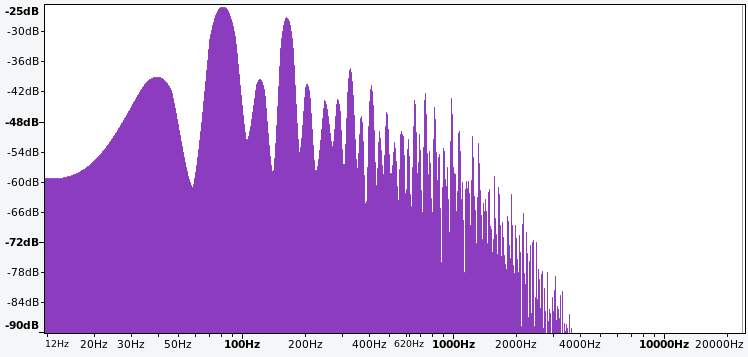
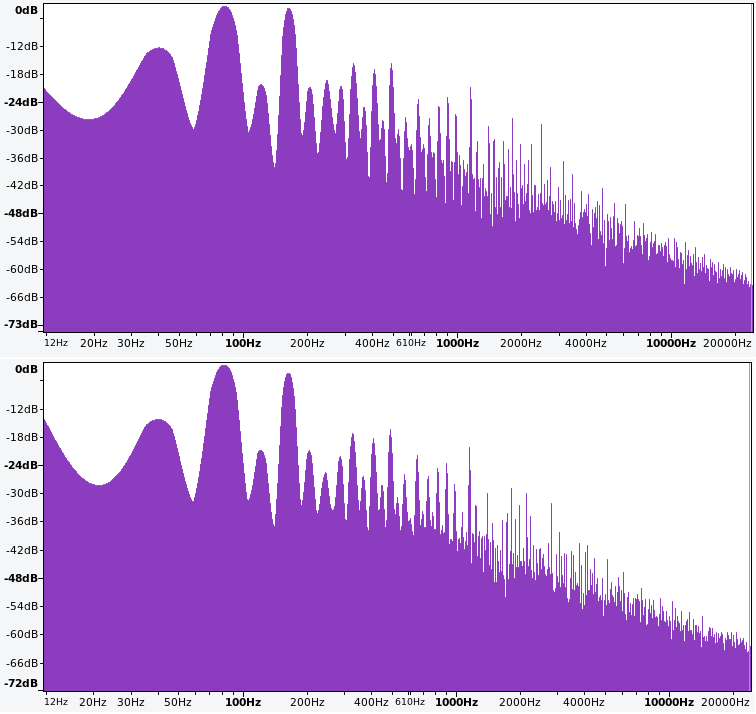

# Eighties Lead & Chiptune
<!-- sic 'Stranger Lead'? -->

This chapter explores additional sound design problems using the problem solving approach elaborated in Chapter \@ref(designing-a-kick-drum).
The first problem is to recreate an 80's-style lead from the show [*Stranger Things*](https://en.wikipedia.org/wiki/Stranger_Things).
The major strategy used to this problem is working backwards, since the goal is to emulate something that already exists.
The second problem is to create a chiptune-style groove reminiscent of arcade games and early computers.
For the chiptune problem, the main strategies are decomposition and looking at related problems.

## Eighties Lead

The music of the show *Stranger Things* [uses vintage synthesizers](https://www.synthhistory.com/post/interview-with-kyle-dixon-michael-stein) in order to match the 1980's setting of the show.
The theme song uses an [arpeggio](https://en.wikipedia.org/wiki/Arpeggio) as a lead.
An arpeggio is a type of broken chord, or chord that is played one note at a time.
Arpeggios are a common element in electronic music likely because many synthesizers (and VCOs) have historically been monophonic and so can only play one note at a time.
Recreating the *Stranger Things* arpeggio in modular is an interesting sound design problem because it requires working backward from the recording and doing a little detective work to infer how the sound was originally created.

### Waveshape

The first step is to determine the waveshape used in the arpeggio.
Because the theme is composed using vintage synthesizers, we can expect it to use basic waveshapes like sine, triangle, saw, or square rather than a complex wavetable.
Listen to the theme in Figure \@ref(fig:stranger-things-theme) to see if you can identify what kind of waveshape is used, paying particular attention to the brightness of the sound, which indicates higher harmonics.

(ref:stranger-things-theme) [YouTube video](https://youtu.be/-RcPZdihrp4) of the *Stranger Things* theme song. Image [© Netflix](https://www.youtube.com/c/strangerthings).

(\#fig:stranger-things-theme)(ref:stranger-things-theme)

To me, it starts off a bit dull, like a sine or triangle, then gets brighter around 15 seconds, duller again around 30 seconds, and has a quick run up to brightness around 50 seconds.
The brightness suggests that the waveshape is either saw or square.
We'll return to the change in brightness in the next section.

Saws and square waves can be distinguished by their frequency spectrum as discussed in Section \@ref(resonators-formants-and-frequency-spectrum).
Specifically, saws have both even and odd harmonics, whereas squares have only odd harmonics.
Thus a frequency spectrum could help identify which waveshape is being used.
Using a frequency spectrum this way allows us to use the working backwards strategy and also use the frequency spectrum as an evaluation criteria.

It is much more convenient to use Audacity than R here because Audacity allows a portion of a track to be auditioned and then frequency spectrum to be computed for that portion.
This makes it relatively easy to isolate a portion of the song with just a single note of the arpeggio while it is bright.^[To calculate frequency spectrum in Audacity, drag select the region of the audio, audition it using the play button, and then use Analyze -> Plot Spectrum. A high window size is needed for a detailed spectrum, e.g. 4096.]
Figure \@ref(fig:stranger-things-theme-frequency-audacity-7-top-4096) shows the frequency spectrum of a single note of the arpeggio around the 50 second mark. 

(ref:stranger-things-theme-frequency-audacity-7-top-4096) Frequency spectrum of a single note from the *Stranger Things* theme arpeggio.

(\#fig:stranger-things-theme-frequency-audacity-7-top-4096)(ref:stranger-things-theme-frequency-audacity-7-top-4096)

Characteristics of the frequency peaks are shown in Table \@ref(tab:stranger-things-ref-peaks), including the harmonic ratio of each peak with the fundamental.
Assume for a moment that these are harmonics even though the harmonic ratios are not strictly integers.
Since both even and odd harmonics are present, this spectrum is consistent with a saw wave.
However, this pattern is also close to that of two square waves, one with a fundamental at 40 Hz and one with a fundamental at 82 Hz.^[Because 80 Hz is the second harmonic of 40 Hz, the odd harmonics of the 80 Hz square wave would match half the even harmonics of 40 Hz.]

The ambiguity between a single saw and two squares can interrogated by examining the amplitudes in Table \@ref(tab:stranger-things-ref-peaks).
The amplitude peaks at 82 Hz and 164 Hz could be from constructive interference, specifically a saw at 40 Hz and a square at 82 Hz where the square reinforces the existing harmonics of the saw.
Alternatively, these amplitude peaks could potentially be created by two square waves where the square wave at 82 Hz is mixed in more strongly.

Table: (\#tab:stranger-things-ref-peaks) Characteristics of the frequency peaks in Figure \@ref(fig:stranger-things-theme-frequency-audacity-7-top-4096).

| Frequency | Amplitude  | Harmonic Ratio |
|-----------|------------|----------------|
| 40        | -39.1      | 1.00           |
| 82        | -25.2      | 2.05           |
| 122       | -39.6      | 3.05           |
| 164       | -27.4      | 4.10           |
| 204       | -40.5      | 5.10           |
| 247       | -43.7      | 6.18           |
| 285       | -43.4      | 7.13           |
| 326       | -37.1      | 8.15           |
| 367       | -46.9      | 9.18           |
| 410       | -40.6      | 10.25          |

These possibilities can be examined by modeling each in modular.
The problem solving approach then is to create a model of each possibility and then use them to reason about how the true frequency spectrum was created.
This is a subtle, yet significant shift in using modular: we are now using it to create alternative models in order to reason about the correct model.

Try patching two square waves at 40 and 82 Hz and a saw and square wave at the same frequencies using the button in Figure \@ref(fig:st-square40-square82).
Because the current spectrum analyzers available in Rack are too noisy to closely compare with the target spectrum, you'll need to [record output with Audacity](https://manual.audacityteam.org/man/tutorial_recording_audio_playing_on_the_computer.html) and [plot spectrum there](https://manual.audacityteam.org/man/plot_spectrum.html).^[The Bogaudio spectrum analyzers are sufficient for *approximately* matching spectrum at higher quality settings, but these are not currently working in Cardinal and so must be used in VCVRack. High quality spectrum comparisons currently require Audacity regardless.]

(ref:st-square40-square82) [Virtual modular](https://olney.ai/ct-modular-book/modular-for-pdf.html?starter=empty.vcv&solution=%3ch4%3eSolution+for+two+square+waves+only%3c%2fh4%3e%3cimg+class%3d%27rack-image%27+src%3d%27images%2fpatch-solutions%2fst-square40-square82.png%27%3e&instructions=%3cul%3e%0a%3cli%3eAdd+two+VCOs%2c+QuadVCA%2fMixer%2c+Scope%2c+Host+audio%2c+and+Sassy+Scope%3c%2fli%3e%0a%3cli%3eTune+VCO+1+to+40+Hz+and+VCO+2+to+82+Hz%3c%2fli%3e%0a%3cli%3eConnect+VCO+1+square+out+to+QuadVCA%2fMixer+input+1+and+VCO+2+square+out+to+QuadVCA%2fMixer+input+2%3c%2fli%3e%0a%3cli%3eConnect+QuadVCA%2fMixer+mix+out+to+Scope+in+1%2c+connect+Scope+out+1+to+Host+audio+L+and+Sassy+input+1%3c%2fli%3e%0a%3cli%3eAdjust+the+Scope+time+to+see+a+single+wave+or+two%3b+use+TRG+button+to+sync+the+scope%3c%2fli%3e%0a%3cli%3eAdjust+Sassy+to+Freq%2c+channel+1+level+down+to+1%2f32%2c+resolution+to+1000ms%2c+and+FFT+to+8x.+Note+it+is+challenging+to+get+the+relative+amplitudes+of+the+spectrum+using+this+or+other+settings+with+Sassy.%3c%2fli%3e%0a%3cli%3eTry+the+following+and+note+the+differences+in+the+sound%2c+scope+waveshape%2c+and+spectrum%3cul%3e%0a%3cli%3eAdjust+the+mix+levels+for+the+two+oscillators+to+best+match+the+target+spectrum%3c%2fli%3e%0a%3cli%3eAdjust+the+tuning+of+VCO+1+to+41+Hz+and+note+the+waveshape+stabilizes+on+the+scope.+This+shows+the+effect+of+the+original+detuning.+Now+change+it+back.%3c%2fli%3e%0a%3cli%3eCapture+audio+in+Audacity+and+compute+the+spectrum.+The+mix+ratios+to+match+the+target+spectrum+are+approximately+60%25+and+100%25%3c%2fli%3e%0a%3c%2ful%3e%3c%2fli%3e%0a%3cli%3eAfter+changing+VCO+1+to+saw%2c+try+the+following+and+note+the+differences+in+the+sound%2c+scope+waveshape%2c+and+spectrum%3cul%3e%0a%3cli%3eAdjust+the+mix+levels+for+the+two+oscillators+to+best+match+the+target+spectrum%3c%2fli%3e%0a%3cli%3eAdjust+the+tuning+of+VCO+1+to+41+Hz+and+note+the+waveshape+stabilizes+on+the+scope.+This+shows+the+effect+of+the+original+detuning.+Now+change+it+back.%3c%2fli%3e%0a%3cli%3eCapture+audio+in+Audacity+and+compute+the+spectrum.+The+mix+ratios+to+match+the+target+spectrum+are+approximately+100%25+and+100%25%3c%2fli%3e%0a%3c%2ful%3e%3c%2fli%3e%0a%3c%2ful%3e%0a) for assessing whether two square waves or a saw and a square wave are a closer match for the target spectrum.

<!-- MODAL HTML BLOCK -->

<!-- CAPTION BLOCK -->

(\#fig:st-square40-square82)(ref:st-square40-square82)

Figure \@ref(fig:stranger-things-two-squares-and-saw-square-mixed-to-match-sample7) shows the frequency spectrum of the two square waves and the saw plus square wave model. 
In both cases, the first three harmonics approximately match the target spectrum in Figure \@ref(fig:stranger-things-theme-frequency-audacity-7-top-4096), but they diverge on the 4th harmonic.
Our inability to get the 4th harmonic with either of these models suggests another element is needed.
One possibility is a third wave, but we may also be able to further adjust the spectrum in our existing models by applying PWM to the square waves. 
Try adding PWM to the 82 Hz square wave in both models to match the target spectrum using the button in Figure \@ref(fig:st-square40-square82at36pwm).

(ref:stranger-things-two-squares-and-saw-square-mixed-to-match-sample7) Frequency spectrum of two square waves (upper) and a saw and square wave (lower) at 40 and 82 Hz, respectively.

(\#fig:stranger-things-two-squares-and-saw-square-mixed-to-match-sample7)(ref:stranger-things-two-squares-and-saw-square-mixed-to-match-sample7)

(ref:st-square40-square82at36pwm) [Virtual modular](https://olney.ai/ct-modular-book/modular-for-pdf.html?starter=st-square40-square82.vcv&solution=%3ch4%3eSolution+for+two+square+waves+only%3c%2fh4%3e%3cimg+class%3d%27rack-image%27+src%3d%27images%2fpatch-solutions%2fst-square40-square82at36pwm.png%27%3e&instructions=%3cul%3e%0a%3cli%3eTry+the+following+and+note+the+differences+in+the+sound%2c+scope+waveshape%2c+and+spectrum%3cul%3e%0a%3cli%3eAlternate+between+adjusting+the+PWM+and+adjusting+the+mix+levels+for+the+two+oscillators+to+best+match+the+target+spectrum%3c%2fli%3e%0a%3cli%3eCapture+audio+in+Audacity+and+compute+the+spectrum.+The+mix+ratios+to+match+the+target+spectrum+are+approximately+60%25+and+100%25%2c+and+the+PWM+is+36%25%3c%2fli%3e%0a%3c%2ful%3e%3c%2fli%3e%0a%3cli%3eAfter+changing+VCO+1+to+saw%2c+try+the+following+and+note+the+differences+in+the+sound%2c+scope+waveshape%2c+and+spectrum%3cul%3e%0a%3cli%3eAlternate+between+adjusting+the+PWM+and+adjusting+the+mix+levels+for+the+two+oscillators+to+best+match+the+target+spectrum%3c%2fli%3e%0a%3cli%3eCapture+audio+in+Audacity+and+compute+the+spectrum.+The+mix+ratios+to+match+the+target+spectrum+are+approximately+100%25+and+100%25%2c+and+the+PWM+is+36%25%3c%2fli%3e%0a%3c%2ful%3e%3c%2fli%3e%0a%3c%2ful%3e%0a) for assessing whether two square waves or a saw and a square wave are a closer match for the target spectrum, when PWM is applied to the higher frequency square wave.

<!-- MODAL HTML BLOCK -->

<!-- CAPTION BLOCK -->

(\#fig:st-square40-square82at36pwm)(ref:st-square40-square82at36pwm)

Figure \@ref(fig:stranger-things-square40-square82at36pwm-mixed-to-match-sample7) shows the effect of PWM on the 82 Hz square wave.
In both cases, the 4th harmonic got boosted but not enough to match the target spectrum in Figure \@ref(fig:stranger-things-theme-frequency-audacity-7-top-4096).
However there is a nice flattening of harmonics 5-7 that matches the target spectrum, which suggests PWM should be kept.
Thus it seems necessary to add another wave at the 4th harmonic (164 Hz). 
A square wave is appropriate because it would more precisely target the 4th harmonic, whereas a saw would affect the 4th harmonic relatively less and increase successive harmonics more evenly.
Try adding an additional square VCO at 164 Hz square wave in both models to match the target spectrum using the button in Figure \@ref(fig:st-square40-square82at36pwm-square164).

(ref:stranger-things-square40-square82at36pwm-mixed-to-match-sample7) Frequency spectrum of two square waves (upper) and a saw and square wave (lower) at 40 and 82 Hz, respectively, when the 82 Hz wave is pulse width modulated with a 36% duty cycle.

(\#fig:stranger-things-square40-square82at36pwm-mixed-to-match-sample7)(ref:stranger-things-square40-square82at36pwm-mixed-to-match-sample7)

(ref:st-square40-square82at36pwm-square164) [Virtual modular](https://olney.ai/ct-modular-book/modular-for-pdf.html?starter=st-square40-square82at36pwm.vcv&solution=%3ch4%3eSolution+for+square+waves+only%3c%2fh4%3e%3cimg+class%3d%27rack-image%27+src%3d%27images%2fpatch-solutions%2fst-square40-square82at36pwm-square164.png%27%3e&instructions=%3cul%3e%0a%3cli%3eAdd+another+VCO+to+the+right+of+the+last+VCO%2c+set+its+frequncy+to+164%2c+and+connect+its+square+out+to+QuadVCA%2fMixer+input+3%3c%2fli%3e%0a%3cli%3eTry+the+following+and+note+the+differences+in+the+sound%2c+scope+waveshape%2c+and+spectrum%3cul%3e%0a%3cli%3eAdjust+the+mix+levels+for+the+two+oscillators+to+best+match+the+target+spectrum%3c%2fli%3e%0a%3cli%3eCapture+audio+in+Audacity+and+compute+the+spectrum.+The+mix+ratios+to+match+the+target+spectrum+are+approximately+34%25%2c+100%25%2c+and+56%25%3c%2fli%3e%0a%3c%2ful%3e%3c%2fli%3e%0a%3cli%3eAfter+changing+VCO+1+to+saw%2c+try+the+following+and+note+the+differences+in+the+sound%2c+scope+waveshape%2c+and+spectrum%3cul%3e%0a%3cli%3eAdjust+the+mix+levels+for+the+two+oscillators+to+best+match+the+target+spectrum%3c%2fli%3e%0a%3cli%3eCapture+audio+in+Audacity+and+compute+the+spectrum.+The+mix+ratios+to+match+the+target+spectrum+are+approximately+the+same%3c%2fli%3e%0a%3c%2ful%3e%3c%2fli%3e%0a%3c%2ful%3e%0a) for assessing whether two square waves or a saw and a square wave, both with PWM applied to the higher frequency square wave, are a closer match for the target spectrum when an additional square wave is added at the 4th harmonic.

<!-- MODAL HTML BLOCK -->

<!-- CAPTION BLOCK -->

(\#fig:st-square40-square82at36pwm-square164)(ref:st-square40-square82at36pwm-square164)

Figure \@ref(fig:stranger-things-square40-square82at36pwm-square164-mixed-to-match-sample7) shows the effect of the new 164 Hz square wave.
In both cases, the 4th harmonic looks good and the spectrum is a good match to the target spectrum for the first 8 harmonics.
Choosing between them is therefore somewhat subjective, but the all square wave spectrum seems to match the target spectrum a bit more closely to me in the higher harmonics, so let's use that as we move to the next step.

(ref:stranger-things-square40-square82at36pwm-square164-mixed-to-match-sample7) Frequency spectrum of three square waves (upper) and a saw with two square waves (lower) at 40, 82, and 164 Hz, respectively, when the 82 Hz wave is pulse width modulated with a 36% duty cycle.

(\#fig:stranger-things-square40-square82at36pwm-square164-mixed-to-match-sample7)(ref:stranger-things-square40-square82at36pwm-square164-mixed-to-match-sample7)

### Dynamics

It was previously noted that the arpeggio changes in brightness over time.
We know that filter sweeps are a common effect that would change brightness. 
Since the brightness comes and goes every 15 seconds (1/15 = .07 Hz), we could set up an LFO to change the cutoff on an LPF that would, presumably, create the change in brightness we're looking for.
However, there seems to be another more subtle change to the brightness, which is the shape of the envelope.
Take another listen to the target recording and see if you hear more pronounced notes when the arpeggio is bright and more slurred notes when the the arpeggio is dull.
We can try to use the same LFO to affect the ASDR envelope to create this effect as well.

Before moving on with dynamics, it makes sense to update the patch with sequenced notes rather than a constant pitch.
This will facilitate going back and forth between the patch and the target recording when making small parameter changes.
Try setting up the arpeggio using the button in Figure \@ref(fig:st-seq-arp-no-modulated-dynamics).
This will require adding a clock and sequencer, tuning the sequencer steps, and running the VCOs through an envelope.
The arpeggio plays up and down over a broken C major 7th chord: low C, E, G, B, C, B, G, and E.

(ref:st-seq-arp-no-modulated-dynamics) [Virtual modular](https://olney.ai/ct-modular-book/modular-for-pdf.html?starter=st-square40-square82at36pwm-square164.vcv&solution=%3cimg+class%3d%27rack-image-6u%27+src%3d%27images%2fpatch-solutions%2fst-seq-arp-no-modulated-dynamics.png%27%3e&instructions=%3cul%3e%0a%3cli%3eAdd+BPM+Clock+and+ADDR-SEQ+to+the+top+left+row%2c+connect+ADDR-SEQ+out+to+V%2fOct+of+all+three+oscillators%3c%2fli%3e%0a%3cli%3eConnect+Clock+16ths+out+to+ADDR-SEQ+clock+in+and+connect+Clock+Beat+to+Scope+ext+trig%3c%2fli%3e%0a%3cli%3eAdd+Reftone+and+Volt+meter%3b+connect+Reftone+V%2fOct+to+Volt+Meter+input+1%3c%2fli%3e%0a%3cli%3eThe+ADDR-SEQ+knobs+control+the+notes+for+each+step%2c+and+you+can+select+the+current+note+using+the+select+knob.+Turn+this+knob+to+select+each+step+and+tune+the+following+way%3cul%3e%0a%3cli%3eUse+the+Reftone+pitch+and+octave+knobs+to+get+the+voltage+for+the+notes+you+need%3a+low+C%2c+E%2c+G%2c+B%2c+C%2c+B%2c+G%2c+and+E+%3c%2fli%3e%0a%3cli%3eSelect+the+appropriate+ADDR-SEQ+step+using+the+select+knob%3c%2fli%3e%0a%3cli%3eMove+the+knob+until+the+voltage+matches+your+target%3b+you+can+also+right+click+and+type+the+voltage+in%3c%2fli%3e%0a%3c%2ful%3e%3c%2fli%3e%0a%3cli%3eAdd+ADSR+between+last+VCO+and+Mixer%2c+connect+Clock+16th+out+to+ADSR+gate+and+then+connect+ADSR+out+to+first+three+mixer+gain+inputs%3c%2fli%3e%0a%3cli%3eRun+the+clock+and+adjust+the+BPM+to+match+the+target+song%3c%2fli%3e%0a%3c%2ful%3e%0a%3cdiv+class%3d%27d-flex+flex-row+justify-content-around%27%3e%0a%3cimg+class%3d%27rack-image%27+src%3d%27images%2fsolo-modules%2freftone-voltmeter-solo.png%27%3e%0a%3c%2fdiv%3e%0a) for setting up an arpeggio using the final patch from Section \@ref(waveshape).

<!-- MODAL HTML BLOCK -->

<!-- CAPTION BLOCK -->

(\#fig:st-seq-arp-no-modulated-dynamics)(ref:st-seq-arp-no-modulated-dynamics)

Now we can add dynamics to the patch as previously discussed.
Try adding a VCF and an LFO to control both the VCF and the ADSR  using the button in Figure \@ref(fig:st-seq-arp-plus-dynamics).
Deciding the VCF and ADSR's setpoints and just how much the LFO will affect them can require a lot of back and forth as the changes are fairly subtle.

(ref:st-seq-arp-plus-dynamics) [Virtual modular](https://olney.ai/ct-modular-book/modular-for-pdf.html?starter=st-seq-arp-no-modulated-dynamics.vcv&solution=%3cimg+class%3d%27rack-image-6u%27+src%3d%27images%2fpatch-solutions%2fst-seq-arp-plus-dynamics.png%27%3e&instructions=%3cul%3e%0a%3cli%3eAdd+LFO+and+VCF+to+the+left+of+Sassy+on+the+lower+row%3c%2fli%3e%0a%3cli%3eConnect+Scope+out+1+to+VCF+in+and+Sassy+input+1%2c+VCF+LPF+out+to+Scope+2+in%2c+and+Scope+2+out+to+Host+audio+L%3c%2fli%3e%0a%3cli%3eConnect+LFO+out+%28pick+a+wave%29+to+VCF+cutoff+in%3c%2fli%3e%0a%3cli%3eTry+to+iteratively+adjust+the+following+and+note+the+change+in+sound%2c+scope%2c+and+spectrum%3cul%3e%0a%3cli%3eChange+the+VCF+cutoff+to+either+the+floor+of+the+dull%2fbright+cycle+or+the+average+%28and+depending+on+your+choice%2c+change+the+offset+button+on+the+LFO%29%3c%2fli%3e%0a%3cli%3eChange+the+cutoff+attenuator+to+adjust+the+depth+of+the+change+coming+from+the+LFO%3c%2fli%3e%0a%3cli%3eChange+the+shape+of+the+LFO+to+match+the+sound+-+does+it+spend+more+time+at+the+extremes+%28sine%29+or+move+evenly+between+them+%28triangle%29+or+something+else%3f%3c%2fli%3e%0a%3c%2ful%3e%3c%2fli%3e%0a%3cli%3eOnce+you+have+the+VCF+adjusted%2c+connect+the+LFO+to+the+ADSR+parameter+inputs+%28attack%2c+decay%2c+etc%29%3c%2fli%3e%0a%3cli%3eTry+to+iteratively+adjust+the+following+and+note+the+change+in+sound%2c+scope%2c+and+spectrum%3cul%3e%0a%3cli%3eChange+the+ADSR+parameters+to+either+the+floor+of+the+dull%2fbright+cycle+or+the+average+%28mirror+your+previous+choice%29%3c%2fli%3e%0a%3cli%3eChange+the+parameter+attenuators+to+adjust+the+depth+of+the+change+coming+from+the+LFO%2c+remembering+this+can+be+in+the+positive+or+negative+direction%3c%2fli%3e%0a%3cli%3eReconsider+the+shape+of+the+LFO+-+does+the+current+shape+work%2c+or+is+a+different+shape+needed%3f%3c%2fli%3e%0a%3c%2ful%3e%3c%2fli%3e%0a%3c%2ful%3e%0a) for adjusting  dynamics using the arpeggio patch from Figure \@ref(fig:st-seq-arp-no-modulated-dynamics).

<!-- MODAL HTML BLOCK -->

<!-- CAPTION BLOCK -->

(\#fig:st-seq-arp-plus-dynamics)(ref:st-seq-arp-plus-dynamics)

Altogether the solution seems fairly reasonable, though since the waveshapes were based on a sample of the the spectrum in a particular part of the overall cycle, it could be that the lowest square wave should be a saw in order to sound correct as the filter cutoff cycles up and down.
Other possibilities in our current design space include a slight detuning between square waves that changes over time or PWM that changes over time.

## Chiptune

Chiptune is a genre of music so-called because it originated in sound chips used to synthesize music in early electronics like arcade games and computers.
These early sound chips had low-fidelity digital implementations of various functions we've encountered in modular, like basic waveshapes, noise generators, and envelopes.
Because the sound chips were relatively limited in capability, designers developed various techniques to create bigger and more interesting sounds.
One of these tricks, the arpeggio, allowed chips with limited polyphony to emulate it, and thus arpeggio, particularly fast arpeggio, is common in chiptune. 
If you are not familiar with chiptune, check out the video in Figure \@ref(fig:chiptune-video).

(ref:chiptune-video) [YouTube video](https://youtu.be/NfxArPJpN5I) of a chiptune groove.  Image [© Noise Engineering](https://www.youtube.com/c/NoiseEngineering).

(\#fig:chiptune-video)(ref:chiptune-video)

Our design problem is to create a rapid arpeggio reminiscent of chiptune that transposes over time, like Figure \@ref(fig:chiptune-video), along with simple percussion in the form of hats and kick drum.
Let's use a decomposition strategy and look at related problems along the way, using the following sequence:

- Triad arpeggio
- LFO-controlled PWM 
- Secondary sequencer for transposition
- Hats and kick

Building this out incrementally nicely illustrates the power of decomposition into related problems we already know how to solve.

### Triad arpeggio

We made an arpeggio in the previous patch, so this that is a related solution we can adapt.
A few changes are necessary for chiptune however.
First, arpeggios in chiptune are very fast.
Second, we need a new chord to work from.
Let's go with A minor, so A, B, E.
Try patching up this arpeggio from scratch using the button in Figure \@ref(fig:chiptune-single-arp).

(ref:chiptune-single-arp) [Virtual modular](https://olney.ai/ct-modular-book/modular-for-pdf.html?starter=empty.vcv&solution=%3cimg+class%3d%27rack-image%27+src%3d%27images%2fpatch-solutions%2fchiptune-single-arp.png%27%3e&instructions=%3cul%3e%0a%3cli%3eAdd+Reftone%2c+Volt+meter%2c+BPM+Clock%2c+ADDR-SEQ%2c+VCO%2c+QuadVCA%2fMixer%2c+Scope%2c+and+Host+audio%3c%2fli%3e%0a%3cli%3eConnect+Clock+16ths+out+to+ADDR-SEQ+clock+in%3c%2fli%3e%0a%3cli%3eConnect+ADDR-SEQ+out+to+V%2fOct+of+the+VCO+%3c%2fli%3e%0a%3cli%3eConnect+VCO+square+out+to+QuadVCA%2fMixer+input+1%3c%2fli%3e%0a%3cli%3eConnect+QuadVCA%2fMixer+mix+output+to+Scope+input+1+and+Scope+out+to+Host+audio+L%3c%2fli%3e%0a%3cli%3eConnect+Reftone+V%2fOct+to+Volt+Meter+input+1%3c%2fli%3e%0a%3cli%3eSelecting+the+first+three+steps+of+ADDR-SEQ+in+turn%2c+use+the+Reftone+pitch+and+octave+knobs+to+get+the+voltage+for+the+notes+you+need%2c+A%2c+B%2c+and+E%2c+and+set+the+corresponding+step+voltage.+Make+sure+the+sequencer+is+set+for+3+steps+only%3c%2fli%3e%0a%3cli%3eTry+runnning+the+clock+at+different+BPMs%3b+a+target+BPM+around+225+is+suggested%3c%2fli%3e%0a%3c%2ful%3e%0a) for setting up a chiptune arpeggio.

<!-- MODAL HTML BLOCK -->

<!-- CAPTION BLOCK -->

(\#fig:chiptune-single-arp)(ref:chiptune-single-arp)

### LFO PWM

We previously controlled PWM using an LFO in Section \@ref(pulse-width-modulation), so it is easy to adapt that solution to control the square wave chiptune VCO.
Additionally, let's add an ADSR to control the VCA to get more note-like dynamics.
Try patching up the LFO into a PWM and ADSR using the button in Figure \@ref(fig:chiptune-single-arp-pwm).

(ref:chiptune-single-arp-pwm) [Virtual modular](https://olney.ai/ct-modular-book/modular-for-pdf.html?starter=chiptune-single-arp.vcv&solution=%3cimg+class%3d%27rack-image%27+src%3d%27images%2fpatch-solutions%2fchiptune-single-arp-pwm.png%27%3e&instructions=%3cul%3e%0a%3cli%3eAdd+an+LFO+to+the+left+of+the+VCO%2c+and+add+an+ADSR+to+the+right+of+the+VCO%3c%2fli%3e%0a%3cli%3eConnect+LFO+triangle+out+to+VCO+PWM%3c%2fli%3e%0a%3cli%3eConnect+Clock+16ths+to+ADSR+gate+%3c%2fli%3e%0a%3cli%3eConnect+ADSR+out+to+QuadVCA%2fMixer+CV+input+1%3c%2fli%3e%0a%3cli%3eTry+the+following+and+note+the+differences+in+the+sound+and+scope+waveshape%3cul%3e%0a%3cli%3eAdjust+the+PWM+width+manually%2c+deciding+if+you+want+a+unipolar+or+bipolar+LFO+offset%3c%2fli%3e%0a%3cli%3eAdjust+the+LFO+rate+and+the+PWM+attenuator+knob+to+change+the+speed+and+depth+of+the+modulation%3c%2fli%3e%0a%3cli%3eManually+adjust+the+ADSR+parameters+to+taste%3c%2fli%3e%0a%3c%2ful%3e%3c%2fli%3e%0a%3c%2ful%3e%0a) for setting up an enveloped chiptune arpeggio with pulse width modulated by an LFO.

<!-- MODAL HTML BLOCK -->

<!-- CAPTION BLOCK -->

(\#fig:chiptune-single-arp-pwm)(ref:chiptune-single-arp-pwm)

### Secondary sequencer for transposition

The transposition element is the most novel technique in this patch, relative to what's been covered so far.
Recall that the V/Oct standard means that doubling any voltage will transpose a note up one octave.
Therefore, adding any voltage to an existing V/Oct signal will raise the pitch, and subtracting any voltage from an existing V/Oct signal will lower the pitch.
We can accomplish adding and subtracting from a signal by using a mixer, since a mixer simply adds two signals together and voltage signals can be negative.

A very simple idea is to use a longer sequence on the transposing sequencer where each voltage either does nothing (0 V) or is the negative of one of the voltages in the arpeggio sequence.
Negating the voltage means that the resulting note will be C^[0 V is C4 in VCVRack, apparently, though there is no such standard in modular in general. V/Oct is a *relative* standard, not a standard that specifies what frequencies are associated with specific voltages.]
To keep things interesting, it's nice to have one or two notes that don't follow this pattern.
In the patch below, I used G#, D#, C#, C, G#, D#, E, and C as the transposing sequence, changing the step at each bar.
A slowed down video of the two sequencer outputs and their mixed output is shown in Figure \@ref(fig:two-sequencers-mixed).
Try patching up the transposing sequencer and mixer using the button in Figure \@ref(fig:chiptune-single-arp-pwm-transpose).

(ref:two-sequencers-mixed) [YouTube video](https://youtu.be/BlHnw4rgUEc) of a slow-motion arpeggio (left) voltage mixed with the output of another sequencer (middle) to produce a transposed arpeggio that changes with each bar (right).

(\#fig:two-sequencers-mixed)(ref:two-sequencers-mixed)

(ref:chiptune-single-arp-pwm-transpose) [Virtual modular](https://olney.ai/ct-modular-book/modular-for-pdf.html?starter=chiptune-single-arp-pwm.vcv&solution=%3cimg+class%3d%27rack-image%27+src%3d%27images%2fpatch-solutions%2fchiptune-single-arp-pwm-transpose.png%27%3e&instructions=%3cul%3e%0a%3cli%3eAdd+a+second+ADDR-SEQ+to+the+right+of+the+existing+one%2c+and+add+mixer+to+the+right+of+the+new+ADDR-SEQ%3c%2fli%3e%0a%3cli%3eConnect+Clock+Bar+to+the+new+ADDR-SEQ+clock+in%3c%2fli%3e%0a%3cli%3eConnect+the+outs+of+the+two+ADDR-SEQ+to+the+new+QuadVCA%2fMixer+inputs+1+and+2%3c%2fli%3e%0a%3cli%3eConnect++QuadVCA%2fMixer+out+to+VCO+V%2fOct%3c%2fli%3e%0a%3cli%3eSelecting+each+of+the+eight+ADDR-SEQ+steps+in+turn%2c+use+the+Reftone+pitch+and+octave+knobs+to+get+the+voltage+for+the+notes+you+need%2c+e.g.+G%23%2c+D%23%2c+C%23%2c+C%2c+G%23%2c+D%23%2c+E%2c+and+C+-+note+most+of+these+are+just+the+negative+of+the+original+arpeggio+voltages+except+C+which+is+zero+and+E.++Make+sure+the+sequencer+is+set+for+all+8+steps%3c%2fli%3e%0a%3cli%3eTry+different+clock+settings+and+different+beat+divisions+for+both+sequencers%3c%2fli%3e%0a%3c%2ful%3e%0a) for setting up an enveloped chiptune arpeggio with pulse width modulated by an LFO, transposed by a second sequencer every bar.

<!-- MODAL HTML BLOCK -->

<!-- CAPTION BLOCK -->

(\#fig:chiptune-single-arp-pwm-transpose)(ref:chiptune-single-arp-pwm-transpose)

### Hats and kick

We made hats in Section \@ref(noise) and simple kicks in Section \@ref(clocks-as-sequencers), so these are both problems we know how to solve.
A simple hat is just high frequency noise through an envelope/VCA, and a simple kick is just a sine through an envelope/VCA.
Both voices are ideally controlled with trigger sequencers, and by using two different sequencers we can use different patterns for each.
Try patching up hats and kick with their own sequencers using the button in Figure \@ref(fig:chiptune-single-arp-pwm-transpose-hats-kick).

(ref:chiptune-single-arp-pwm-transpose-hats-kick) [Virtual modular](https://olney.ai/ct-modular-book/modular-for-pdf.html?starter=chiptune-single-arp-pwm-transpose.vcv&solution=%3cimg+class%3d%27rack-image-6u%27+src%3d%27images%2fpatch-solutions%2fchiptune-single-arp-pwm-transpose-hats-kick.png%27%3e&instructions=%3cul%3e%0a%3cli%3eAdd+a+TRG%2c+Noiz%2c+and+ADSR+on+the+bottom+row%3c%2fli%3e%0a%3cli%3eConnect+Clock+8ths+to+TRG+clock+in%3c%2fli%3e%0a%3cli%3eConnect+TRG+gate+out+to+ADSR+gate+in%3c%2fli%3e%0a%3cli%3eConnect+Noiz+blue+out+to+the+main+QuadVCA%2fMixer+input+2+and+ADSR+out+to+the+CV+control+of+that+same+mixer+channel%3c%2fli%3e%0a%3cli%3eAdjust+the+TRG+steps+down+to+8+and+select+steps+for+the+hats+and+adjust+the+ADSR+envelope+to+suit%3c%2fli%3e%0a%3cli%3eRepeat+these+steps+but+use+a+VCO+sine+out+instead+of+Noiz%3c%2fli%3e%0a%3cli%3eAdjust+the+main+mix+out+levels+and+rhythms+to+match+chiptune+as+best+you+can%3c%2fli%3e%0a%3c%2ful%3e%0a) for setting up an enveloped chiptune arpeggio with pulse width modulated by an LFO, transposed by a second sequencer every bar, with hats and kick as additional voices.

<!-- MODAL HTML BLOCK -->

<!-- CAPTION BLOCK -->

(\#fig:chiptune-single-arp-pwm-transpose-hats-kick)(ref:chiptune-single-arp-pwm-transpose-hats-kick)

