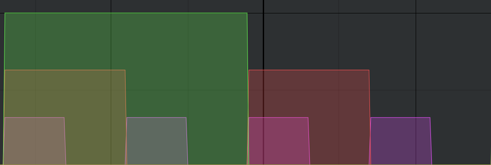

# (PART) Complex Modules {-}

# Controllers {#complex-controllers}

This chapter extends Chapter \@ref(controllers) by introducing more advanced approaches to sequencing.
Sequencing can be considered a kind of memory for musical events where the events can be stored and played back later.
Obviously there are gaps between events because not all notes (or beats) play at once.
This leads to the idea that sequencing involves both [positive space and negative space](https://en.wikipedia.org/wiki/Figure%E2%80%93ground_(perception)): positive space where musical events occur and negative space elsewhere.

This idea of positive and negative space can be seen clearly in step based sequencers that allow steps without events, such as the trigger sequencers discussed in Chapter \@ref(controllers).
However, a step-based conceptualization of sequencing leads to a limitation that a step should represent the smallest duration event, and such fine granularity naturally leads to more steps being empty.
An event-based conceptualization that flexibly represents the start and end of each event, in contrast,  has less need to explicitly define negative space.
For example, consider a sequence with two notes, the first lasting 2 units, followed by 4 units of silence, followed by the second note lasting 1 unit.
A step-based representation would use 7 steps and four of them would be empty.
An event-based representation would use two events, one starting at time 1 and lasting 2 units and one starting at time 6 and lasting 1 unit.

In practice, modular sequencing often combines both step-based and event-based elements.
The reason for combining both is that each has different strengths.
To better appreciate these strengths, let's define three ideal properties of a sequencing approach and use it to evaluate alternatives.
An ideal sequencing approach should allow:

- Compact representation of variations, i.e. in a minimal amount of space
- Ease of changes between variations
- Precise control of variations

It turns out that sometimes these properties are at odds with each other, such that different combinations of modules can outperform on some and underperform on others.
As we examine different options in this chapter, we'll keep this properties in mind.

## Modifying gates

One of the limitations of pure clock-based sequencing is that every gate starts [on the beat](https://en.wikipedia.org/wiki/Beat_(music)#On-beat_and_off-beat).
Unfortunately, [syncopation](https://en.wikipedia.org/wiki/Syncopation), which emphasizes off beats, is widespread in modern music.
The on-beat property of clock divisions is illustrated in Figure \@ref(fig:clock-div2-div4).
If we consider the clock to represent quarter notes, then the gaps between clock gates are eighth note off beats, i.e. if we count 1-and 2-and 3-and 4-and, the off beats are 'and'.

(ref:clock-div2-div4) Four gates from a clock (small) overlaid with two gates from a /2 clock division (medium) and further overlaid by one gate from a /4 clock division (large). If we consider each clock gate as defining a quarter note, then all three gates occur on the first quarter note and the first two occur on the third quarter note, so the three gates are aligning only on beats.  

(\#fig:clock-div2-div4)(ref:clock-div2-div4)

Let's build a basic patch with clock divisions that illustrates this on beat property both in sound and visually on the scope.
To keep things simple throughout this chapter, we will modify this percussion-oriented patch and note differences with sequencing pitches.
All the modules and concepts in this patch were introduced in previous chapters, except for a new three-voice percussion module that can produce various sounds.
Try patching up this basic percussion patch with clock divisions using the button in Figure \@ref(fig:clock-division-drums-mschack).

(ref:clock-division-drums-mschack) [Virtual modular](https://cardinal.olney.ai) for a basic percussion patch using clock divisions.

<!-- MODAL HTML BLOCK -->

<!-- CAPTION BLOCK -->

(\#fig:clock-division-drums-mschack)(ref:clock-division-drums-mschack)

In light of the ideal properties for sequencing, the basic clock division approach allows both compact representation in terms of divisions and ease of changing between variations by changing divisions.
However it lacks precise control because off beats are inaccessible.
Other related complications include increasing the number of hits on a particular beat, sometimes called a [roll](https://en.wikipedia.org/wiki/Drum_rudiment#Roll_rudiments) and skipping a beat.
All three of these variations can be approached by modifying existing gates, a concept that was first introduced in Section \@ref(sequencing-note-duration) for sequencing note duration.
Since sequencing note duration is identical to sequencing gate duration, we'll look at only the other two techniques here.

Hitting an off beat can be accomplished using a gate delay module.
A gate delay module receives an incoming gate (sometimes a trigger) and then create another gate at some time delay.
If the time delay corresponds to the length of a beat, then the delayed gate will appear on the off beat.
Try extending the last patch with a gate delay to move the open hat to the off beat using the button in Figure \@ref(fig:clock-division-drums-mschack-offbeat-gate-delay).

(ref:clock-division-drums-mschack-offbeat-gate-delay) [Virtual modular](https://cardinal.olney.ai) for a percussion patch using clock divisions and a gate delay to hit an off beat.

<!-- MODAL HTML BLOCK -->

<!-- CAPTION BLOCK -->

(\#fig:clock-division-drums-mschack-offbeat-gate-delay)(ref:clock-division-drums-mschack-offbeat-gate-delay)

With respect to the three ideal properties, the delayed gate approach (combined with clock divisions) is still compact, a bit less easy (because setting the delay is a bit fiddly), and more flexible, though the offset is the same for each clock or clock division.
Thus if we want variations of off beat or rolls, we need additional tools.

Drum rolls can be accomplished using a gate multiplier.
Gate multipliers will generally need a control voltage telling them how many gates to make, which correspond to the number of hits in the roll.
Thus an additional sequencer is needed to supply this control voltage.
Try extending the last patch with a gate multiplier and associate sequencer to give the kick a double hit on the first beat using the button in Figure \@ref(fig:clock-division-mshack-drums-offbeat-gate-delay-roll-seq-gate-mult).
Because the kick time is 4:4, the sequencer only needs four steps.

(ref:clock-division-mshack-drums-offbeat-gate-delay-roll-seq-gate-mult) [Virtual modular](https://cardinal.olney.ai) for a percussion patch using clock divisions, a delayed gate for an off beat hit, and a sequenced gate multiplier for multiple hits on the beat.

<!-- MODAL HTML BLOCK -->

<!-- CAPTION BLOCK -->

(\#fig:clock-division-mshack-drums-offbeat-gate-delay-roll-seq-gate-mult)(ref:clock-division-mshack-drums-offbeat-gate-delay-roll-seq-gate-mult)

Returning to the three ideal properties, the gate multiplier approach (again combined with clock divisions) is a bit compact because it relies on another sequencer, a bit less easy (because setting the multiplier voltage is a bit fiddly), and more flexible because it allows different drum rolls on each step.
Just as a sequencer was used for this patch, a sequencer could be used to control the gate delay offset of the previous patch or drop a step by sequencing the length parameter, as shown [here](images/patch-solutions/clock-division-mshack-drums-offbeat-gate-delay-roll-seq-gate-mult-skip-seq-gate-length.png).

It's clear that adding more sequencers to control these parameters increases flexibility but also makes the overall control less compact and changing between variations less easy.
For example, if one wanted to replace a skipped step with a triple beat, one would have to adjust the length sequencer for a non-zero gate length, then adjust the multiplier sequencer to create multiple hits on that step.
Is this suboptimal?
Let's compare against other solutions before making judgment.
One obvious alternative is to create the same pattern using standard step sequencers without any clock divisions.
Try updating the last patch with a step sequencer for the off beat hat and the double beat kick using the button in Figure \@ref(fig:trg-mshack-drums-offbeat-roll).
Because the kick time is 4:4, the sequencer only needs four steps.

(ref:trg-mshack-drums-offbeat-roll) [Virtual modular](https://cardinal.olney.ai) for a percussion patch using step sequencers for an off beat hit and multiple hits on the beat.

<!-- MODAL HTML BLOCK -->

<!-- CAPTION BLOCK -->

(\#fig:trg-mshack-drums-offbeat-roll)(ref:trg-mshack-drums-offbeat-roll)

Contrast this approach with what we've done so far.
The step sequencers are somewhat compact if the pattern can be decomposed into the smallest repeating loops, though not as compact as a clock divider.
They are easy to change in some ways but not others. 
For example, if we decide we want a triple hit on a beat rather than a double, we need to increase the step resolution from two steps per quarter note to three steps per quarter note, which requires changing the entire kick pattern.
Conversely, step sequencers have a high level of precision *if* one accepts increasing the number of steps arbitrarily to account for off beats, [swing](https://en.wikipedia.org/wiki/Swing_(jazz_performance_style)), or [dilla](https://en.wikipedia.org/wiki/J_Dilla#Musical_style), but this then sacrifices compactness.
Note that the previous approaches with gate delays and multiplications achieved these results to an arbitrary degree without additional loss of compactness, i.e. we could have a 10 hits instead of 2 with the same gate multiplier patch.

## Making gates with logic

Suppose we wanted to select the offbeats in our current pattern.
Looking at Figure \@ref(fig:clock-div2-div4), the ofbeats are simply where the the beats are *not*.
So if we had a way of specifying "not beat," then we'd be able make a gate for the off beats.
[Boolean logic](https://en.wikipedia.org/wiki/Boolean_algebra) provides a way of specifying "not beat" and can further be used for more complex beat specifications.

Although it may seem intimidating at first, Boolean logic has just three basic operators, AND, OR, and NOT.
AND means two things happen together, OR means at least one thing happens, and NOT means something didn't happen.
If we represent something happening (like a gate) as 1 and not happening as 0, then these basic operators are summarized in Table \@ref(tab:logic).

Table: (\#tab:logic) Basic boolean logic operators on signals S1 and S2. Note that AND and OR consider both signals but NOT considers only one or the other.

| S1 | S2 | AND(S1,S2) | OR(S1,S2)| NOT(S1) | NOT(S2) |
|:---:|:----:|:----:|:----:|:--------:|:--------:|
| 1  | 1  | 1 | 1  | 0      | 0      |
| 1  | 0  | 0 | 1  | 0      | 1      |
| 0  | 1  | 0 | 1  | 1      | 0      |
| 0  | 0  | 0 | 0  | 1      | 1      |

Try updating the basic percussion patch with a NOT module to put the open hat on every off beat using the button in Figure \@ref(fig:trg-mshack-drums-offbeat-roll).
We'll build on this logic in the following patches.

(ref:clock-division-drums-mschack-offbeat-logic-every-offbeat) [Virtual modular](https://cardinal.olney.ai) for a percussion patch using clock divisions and the NOT operator to create gates for all off beat hits.

<!-- MODAL HTML BLOCK -->

<!-- CAPTION BLOCK -->

(\#fig:clock-division-drums-mschack-offbeat-logic-every-offbeat)(ref:clock-division-drums-mschack-offbeat-logic-every-offbeat)

We can use logic to create other gates using combinations of the basic operators.
For example, consider every other offbeat in Figure \@ref(fig:clock-div2-div4).
These offbeats occur when the clock is not present and the /2 division is present.
Try updating the last patch with an AND module to implement this logic using the button in Figure \@ref(fig:clock-division-drums-mschack-offbeat-logic-every-other-offbeat).

(ref:clock-division-drums-mschack-offbeat-logic-every-other-offbeat) [Virtual modular](https://cardinal.olney.ai) for a percussion patch using clock divisions and combining the NOT and AND operators to create gates for every other off beat hit.

<!-- MODAL HTML BLOCK -->

<!-- CAPTION BLOCK -->

(\#fig:clock-division-drums-mschack-offbeat-logic-every-other-offbeat)(ref:clock-division-drums-mschack-offbeat-logic-every-other-offbeat)

Let's get even more specific with logic to match what we did previously with the gate delay, which was a single off beat.
Since the last patch used every other off beat, we can use an additional operator to select just one of those beats.
Again looking at Figure \@ref(fig:clock-div2-div4), we see that we can achieve this by using AND with our existing logic and next larger clock division.
Try updating the last patch to implement this logic using the button in Figure \@ref(fig:clock-division-drums-mschack-offbeat-logic-matching-gate-delay).

(ref:clock-division-drums-mschack-offbeat-logic-matching-gate-delay) [Virtual modular](https://cardinal.olney.ai) for a percussion patch using clock divisions and combining the NOT and AND operators to create gates for every other off beat hit.

<!-- MODAL HTML BLOCK -->

<!-- CAPTION BLOCK -->

(\#fig:clock-division-drums-mschack-offbeat-logic-matching-gate-delay)(ref:clock-division-drums-mschack-offbeat-logic-matching-gate-delay)

Let's consider the three ideal sequencer properties, in terms of logic.
The first application of NOT was quite compact, ease to change, and precise.
However, as the logic became more complex, the sequencing became less easy.
Contrast the last logic patch that needed three or four logical operators to what was previously accomplished by using a single gate delay.
It appears that clock divisions with logic are most suited to regular repeating patterns, and that when patterns become less regular, other options may be easier.

## Adding/removing gates with probability

## Speed variable clocks using LFOs

## Euclidean sequencing

## Sequential switches

<!-- Remaining plan -->

<!-- Complex modules and Compositions		 -->
<!-- 	Controllers	 -->
<!-- 		Clock, sequencing, arpeggiators -->
<!-- 		Euclidean rhythms -->
<!-- 		Probability -->
<!-- 	Generators	 -->
<!-- 		PWM -->
<!-- 		FM/AM -->
<!-- 		Ring modulation -->
<!-- audio rate modulation into resonant filter? -->
<!-- 		Vocoders -->
<!-- 		Random sampling -->
<!-- 	Modifiers	 -->
<!-- 		~~LFO~~ -->
<!-- 		Sample and hold -->
<!-- 		Slew -->
<!-- 		Wave-folding -->
<!-- 		Attenuators, inverters, and attenuverters -->
<!-- 		Quantizers -->
<!-- 		Switches -->
<!-- 		Logic -->

<!-- Sound design ideas -->
<!-- Cymbal PUSH UNTIL AFTER RING MOD -->
<!-- Maybe use these? -->
<!-- keyboard filter tracking or notes would disappear; filtering sine wave example -->
<!-- Growl: Low frequency sine wave modulation of the filter cut-off frequency -->
<!-- wah wah is LFO on LPF cutoff freq -->

<!-- Actual -->
<!--     4 Basic Modeling Concepts -->
<!--     4.1 Modules are the model elements -->
<!--     4.2 Signals are how the model elements interact -->
<!--     4.3 Signals are interpreted by modules -->
<!--     4.4 Pulling it all together -->
<!--         4.4.1 Drone -->
<!--         4.4.2 Using an oscilloscope -->
<!--         4.4.3 Controlling pitch -->
<!--         4.4.4 Controlling note duration (on/off volume) -->
<!--         4.4.5 Controlling note dynamics (volume during note) -->
<!--     4.5 Moving forward -->

<!-- 5 Controllers -->
<!-- 5.1 Clocks -->

<!--     5.1.1 Clock under a scope -->
<!--     5.1.2 Clock as a generator -->

<!-- 5.2 Sequencers -->

<!--     5.2.1 Clocks as sequencers -->
<!--     5.2.2 Trigger sequencers -->
<!--     5.2.3 Control voltage sequencers -->

<!--     6 Generators -->
<!--     6.1 Chords -->
<!--     6.2 Chorus -->
<!--     6.3 Low frequency oscillators & uses -->
<!--         6.3.1 Pulse width modulation -->
<!--         6.3.2 Vibrato -->
<!--         6.3.3 Tremolo -->
<!--     6.4 Synchronization -->
<!--     6.5 Noise -->
<!--     6.6 Samplers -->

<!-- 7 Modifiers -->
<!-- 7.1 Effects -->
<!--     7.1.1 Delays -->
<!--     7.1.2 Reverb -->
<!--     7.1.3 Chorus -->
<!--     7.1.4 Flanger -->
<!--     7.1.5 Phaser -->
<!-- 7.2 Voltage controlled filters -->
<!--     7.2.1 Filters are imperfect -->
<!--     7.2.2 Filters change frequency and phase -->
<!--     7.2.3 Combining filters -->
<!--     7.2.4 Resonance -->

<!-- 8 Designing a Kick Drum -->
<!-- 8.1 Problem solving for sound synthesis -->
<!--     8.1.1 Understand the problem -->
<!--     8.1.2 Devise a plan -->
<!--     8.1.3 Carry out the plan (and replanning) -->
<!--     8.1.4 Evaluate the solution -->
<!-- 8.2 Reviewing previous kick drum patches -->
<!--     8.2.1 Sine with envelope -->
<!--     8.2.2 Sine with an envelope plus noise burst -->
<!-- 8.3 Alternative approaches -->
<!--     8.3.1 Improving our understanding of the problem -->
<!--     8.3.2 Devising new plans -->
<!--     8.3.3 Working backwards -->

<!-- 9 Eighties Lead & Chiptune -->
<!-- 9.1 Eighties Lead -->
<!--     9.1.1 Waveshape -->
<!--     9.1.2 Dynamics -->
<!-- 9.2 Chiptune -->
<!--     9.2.1 Triad arpeggio -->
<!--     9.2.2 LFO PWM -->
<!--     9.2.3 Secondary sequencer for transposition -->
<!--     9.2.4 Hats and kick -->

