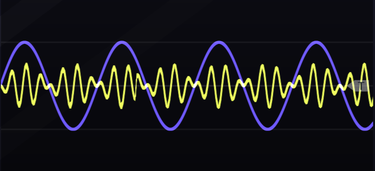

# Modulating Generators {#complex-generators}

This chapter extends Chapter \@ref(generators) and focuses entirely on audio-rate modulation.
Audio-rate modulation uses an audio-rate signal, typically an oscillator, to modulate a parameter, most commonly a parameter on another oscillator.^[Audio-rate modulation of a filter's cutoff is another common option but is beyond the scope of this chapter. Try it!]
Although the basic idea is simple to explain, sounds produced can be complex and require a new idea to understand: the sideband.

Before proceeding, let's introduce some terminology.
The audio rate signal source will be called the *modulator*.
The oscillator receiving the modulation is the *carrier*.
The strength of modulation the carrier receives from the modulator will be called the *modulation index*.
The modulation index defines how much the parameter of the carrier changes around its default value.
For example, if a carrier has a frequency of 800 Hz, the modulator may cause it to go +/- 1 Hz (from 799 to 801 Hz) or +/- 100 Hz (from 700 Hz to 900 Hz).
The signal resulting from audio-rate modulation is the *output*.

Recall that we can describe any wave by its shape, amplitude, frequency, and phase.
If we assume we can describe any waveshape by a collection of sine waves via Fourier transform, then we can focus on the amplitude, frequency, and phase parameters of these waves.
Audio-rate modulation can be performed on each of these parameters.
When the modulator acts on the amplitude parameter of the carrier, the result is amplitude modulation (AM).
When the modulator acts on the frequency parameter of the carrier, the result is frequency modulation (FM).
And when the modulator acts on the phase parameter of the carrier, the result is phase modulation (PM).

Each of these types of audio-rate modulation creates sidebands, which are new partials in the output.
Audio-rate modulation therefore is related to additive synthesis in that both involve adding partials to change the timbre of the output sound.
The main difference is that audio-rate modulation is not strictly additive and can also remove or change some partials in the carrier.
However, with sufficient control of audio-rate modulation, one can create a wide variety of sounds more efficiently than additive synthesis, as shown by the explosion of inexpensive FM keyboards in the 1980's, like the Yamaha DX7.

The following sections outline the use of audio-rate modulation in modular sound synthesis according to the parameters of amplitude, frequency, and phase.
However, the story is somewhat complicated due to the history of synthesis, limitations of analogue hardware, and mathematical relationships between methods.
There are actually two families of methods around amplitude and frequency that cover all three parameters, as will be explained.

## Modulating amplitude

The amplitude family includes amplitude modulation and ring modulation.
The difference between the two is that amplitude modulation stops producing sound when the modulation signal crosses below zero and ring modulation continues to produce sound.
Although this difference may seem like a small one, it leads to several differences in the resulting sidebands and therefore overall timbre.

### Amplitude modulation

You might have heard of amplitude modulation (AM) before, as it was one of the earliest technologies used in radio and is still in use today.
We actually already covered the basic idea of AM in Section \@ref(tremolo) to produce tremelo.
As you recall, we used an LFO at relatively low rates to control a VCA, and the VCA was controlling the output of our main oscillator.
AM works exactly the same way as this but at audio rates (>20 Hz).
At audio rates, we can hear sidebands, and the nature of the sound changes from an oscillation in loudness to a new timbre.

The VCA is key to understanding AM.
Recall that the VCA is a level control that lets through a certain amount of signal, typically 0-100%.^[Most VCAs are attenuators and so only reduce signal. Some VCAs include amplifiers that allow the gain on the signal to go above 100%].
If you stop to think about this mathematically, it means that the VCA is multiplying the signal by a control value.^[The control value itself at any moment is determined by the output of the modulator and thus it is the two signals that are being multiplied together, but for simplicity of exposition fixed point values are emphasized.]
For example, if the VCA control value is 50%, then it is multiplying the incoming signal amplitude by .5.
AM stops producing sound when the control value crosses below zero because VCAs are defined to operate in the 0-100% range, i.e., with unipolar control values only.
So when the control value crosses below zero, the VCA output simply stays at zero until the control value becomes positive again.
This behavior is illustrated in Figure \@ref(fig:am-unipolar).

(ref:am-unipolar) An example of amplitude modulation using sine waves for modulator and carrier. Note that where the modulator signal (purple) is at its peak, the output (yellow) is at greatest strength, but where the modulator signal is negative, the output reduces to zero.

(\#fig:am-unipolar)(ref:am-unipolar)

Side bands for AM are simplest for sine waves.
If both modulator and carrier are sine waves, the spectrum of the output will include a partial at the carrier frequency $C_f$ and two partials offset by the modulator frequency $M_f$, specifically $C_f - M_f$ and $C_f + M_f$.
The sidebands have less strength than the carrier, and the strength of the sidebands is determined by the modulation index, which for AM is defined as the peak change in output amplitude divided by the amplitude of the carrier, $\Delta A/C_a$.^[When the modulation index is at maximum, each sideband is half of the strength of the carrier.] 
An example of peak change is given in Figure \@ref(fig:am-modulation-index).

(ref:am-modulation-index) An example of peak amplitude change using sine waves for modulator and carrier. The indicated difference in amplitude between the carrier signal (red) and the output (yellow) is the peak amplitude change $\Delta A$.

(\#fig:am-modulation-index)(ref:am-modulation-index)

When the modulator and/or carrier are not sine waves, the sidebands contain the sums and differences for all pairs of partials between the modulator and the carrier.
For example, if $M_f$ has 3 partials and $C_f$ has 5 partials, then there are $3*5$ partials in the lower sideband and the same number in the upper sideband.
Even though the carrier frequency is not the fundamental, it is perceived as the pitch center of the sound, even when when the sidebands contain many partials.
Note that in the above formulas, any partial that crosses below zero disappears.
Also, if the modulator frequency goes above the carrier, $M_f > C_f$, the roles of carrier and modulator are reversed.

Implementing AM synthesis as described above is relatively simple in our virtual modular set up, but it has some surprises.
First, if we want pure sine waves, i.e. sine waves with only one harmonic, then we need to use wavetable oscillators, which we've briefly mentioned a few times up to this point but never used.
A [wavetable](https://en.wikipedia.org/wiki/Wavetable_synthesis) oscillator is a digital oscillator that defines a wave based on one stored cycle of that wave.
We need wavetable oscillators here to get a perfect sine wave, because the virtual analogue implementations faithfully recreate the imperfections of the original hardware.
This is also true for real VCAs, which tend to be a bit noisy, so we'll need to use a specific VCA that we've never used before.
All this effort is only necessary to get a result that matches the previous equations.
Otherwise you may not care about these small imperfections that give additional character to the sound through the extra sidebands they create.
Try creating a simple AM patch from scratch using the button in Figure \@ref(fig:am-example) and look carefully at the sidebands it creates.

(ref:am-example) [Virtual modular](https://cardinal.olney.ai) for amplitude modulation using pure sine waves.

<!-- MODAL HTML BLOCK -->

<!-- CAPTION BLOCK -->

(\#fig:am-example)(ref:am-example)

AM synthesis will generally produce inharmonic sidebands unless the modulator and carrier frequencies are chosen to create harmonic relationships.
Using sine waves for example, if modulator and carrier have the same frequency, then the lower sideband will be zero and the upper sideband will be one octave above the carrier, e.g. 100 and 200 Hz.
We can describe such frequency relationships between modulator and carrier in terms of ratios, so if both have the same frequency, the ratio of C:M is 1:1.
You can easily check that any N:1 ratio is harmonic, for example using 200 Hz as the carrier would result in 100, 200, and 300 Hz harmonics.
Likewise, N:2 where N is odd will give odd harmonics (100, 300, 500 Hz), and N:2 where N in even will give even harmonics (200, 400, 600 Hz).
Typical frequency ratios associated with musical intervals shown in Table \@ref(tab:freq-ratio) may also be used to create chordal harmonic structures.

Table: (\#tab:freq-ratio) Frequency ratios for musical intervals.

| Frequency ratio | Musical interval |
|:---------------:|------------------|
|       2:1       | Octave           |
|       3:2       | Fifth            |
|       4:3       | Fourth           |
|       5:4       | Major third      |
|       6:5       | Minor third      |

Typically when a harmonic relationship like this has been established, one wishes to keep it intact while playing different notes.
This is as easy to accomplish as keeping two (or more) oscillators in tune as a chord while playing across a keyboard.
Try extending the last patch with a keyboard and use V/Oct connections to keep the harmonic relationship between modulator and carrier intact using the button in Figure \@ref(fig:am-keyboard-frequency-tracking).
This patch is also a good opportunity to explore the sounds of more complex modulator and carrier waves, as well as inharmonic sounds.

(ref:am-keyboard-frequency-tracking) [Virtual modular](https://cardinal.olney.ai) for amplitude modulation with keyboard tracking.

<!-- MODAL HTML BLOCK -->

<!-- CAPTION BLOCK -->

(\#fig:am-keyboard-frequency-tracking)(ref:am-keyboard-frequency-tracking)

AM creates an interesting sound with a fixed modulation index, but as with all audio-rate modulations, we can also change that modulation index over time.
All that is needed is a signal that changes over time and something to attenuate the modulation index in response to that signal.
We can extend the last patch along these lines by adding an envelope triggered by the keyboard where that envelope controls another VCA.
Every keypress will then cause a brief change in the modulation index, which will correspondingly change the strength of the sidebands.
This effect is even more pronounced for non-sine waves because there are more partials in the sidebands.
Try modulating the modulation index with an envelope using the button in Figure \@ref(fig:am-keyboard-frequency-tracking-adsr-modulation-index).

(ref:am-keyboard-frequency-tracking-adsr-modulation-index) [Virtual modular](https://cardinal.olney.ai) for amplitude modulation with keyboard tracking where the modulation index is controlled by an envelope.

<!-- MODAL HTML BLOCK -->

<!-- CAPTION BLOCK -->

(\#fig:am-keyboard-frequency-tracking-adsr-modulation-index)(ref:am-keyboard-frequency-tracking-adsr-modulation-index)

### Ring modulation

Ring modulation (RM) is implemented the same way as AM, except with a VCA where the control value can cross below zero.
That means that RM multiplies the carrier signal by the control value of the VCA, but since the control value can be negative, the output can also be negative.
Negative output may sound strange at first, but it is exactly the same as positive output *except* inverted.
Thus RM operates just like AM except that RM will never stop at zero, and when it crosses zero, the output is the same as above zero except inverted.
This behavior is illustrated in Figure \@ref(fig:rm-bipolar).

(ref:rm-bipolar) An example of ring modulation using sine waves for modulator and carrier. Note that where the modulator signal (purple) is at either its positive or negative peak, the output (yellow) is at greatest strength. The overall amplitude of the output is reduced relative to Figure \@ref(fig:am-unipolar) due to the removal of the carrier frequency (see text).

(\#fig:rm-bipolar)(ref:rm-bipolar)

Historically, ring modulation was performed by a [circuit consisting of diodes arranged in a ring](https://en.wikipedia.org/wiki/Ring_modulation), thus the name.
Ring modulators and VCAs are sometimes called four- and two-quadrant multipliers.
On a VCA, the input signal can be bipolar but the control value is unipolar.
That means the VCA output is restricted to two quadrants of the Cartesian plane.
On a ring modulator, both input signal and control can be bipolar, so the output can occur in all four quadrants of the Cartesian plane.
The difference between  four- and two-quadrant multipliers is illustrated in Figure \@ref(fig:four-quadrant-multiplier).
Ring modulators are also sometimes called balanced modulators because the modulating signal spends as much time being negative as positive.

(ref:four-quadrant-multiplier) A two-quadrant multiplier multiplies a bipolar signal (carrier) and a unipolar signal (control voltage), so has output in two quadrants (left). A four-quadrant multiplier multiplies two bipolar signals, so has output in all four quadrants (right).

(\#fig:four-quadrant-multiplier)(ref:four-quadrant-multiplier)

Like AM, side bands for RM are easiest to understand for sine waves.
The output spectrum is the same as AM, except that the carrier frequency $C_f$ is removed, leaving only the side bands $C_f - M_f$ and $C_f + M_f$, and any sidebands that cross below zero are reflected back as their absolute value instead of being lost.
Similarly, when the modulator and/or carrier are not sine waves, the sidebands contain the sums and differences for all pairs of partials between the modulator and the carrier.
The modulation index for RM is likewise the same as AM, and if the modulator frequency goes above the carrier, $M_f > C_f$, the roles of carrier and modulator are reversed.

We can implement RM with a slight modification to the first AM patch.
Again, the choice of module is important to get identical behavior to the equations above, though in practice, the character of small imperfections might be preferred.
Try creating a simple RM patch extending the AM patch using the button in Figure \@ref(fig:rm-example).

(ref:rm-example) [Virtual modular](https://cardinal.olney.ai) for ring modulation using pure sine waves.

<!-- MODAL HTML BLOCK -->

<!-- CAPTION BLOCK -->

(\#fig:rm-example)(ref:rm-example)

In terms of harmonicity, RM is again identical to AM except for the properties of missing the carrier frequency and reflections of sideband partials off zero.
The missing carrier means that the overall spectrum will no longer have a strong pitch center.
However, our perception tends to fill in the missing frequency of the carrier such that the pitch still seems centered there, just not as strongly.
Reflected sideband partials have potential to interfere with other partials, but this will occur only when the modulator or carrier has a richer waveshape than sign and thus higher harmonics to subtract.
Otherwise the same concepts about harmonic frequency ratios, keyboard tracking, and modulating the modulation index apply to RM as AM.
Try extending the final AM patch to RM using the button in Figure \@ref(fig:rm-keyboard-frequency-tracking).
This patch is also a good opportunity to explore how the sound of RM differs from AM. 

(ref:rm-keyboard-frequency-tracking) [Virtual modular](https://cardinal.olney.ai) for ring modulation with keyboard tracking.

<!-- MODAL HTML BLOCK -->

<!-- CAPTION BLOCK -->

(\#fig:rm-keyboard-frequency-tracking)(ref:rm-keyboard-frequency-tracking)

RM and AM are similar in operation and in sound. 
The main differences revolve around the missing carrier component and sidebands reflecting off zero.
Both of these emphasize sidebands in RM, because the sidebands have more energy in them and are never destroyed.
In contrast, AM puts more weight on the carrier frequency and less on the sidebands.
Another way of looking at the difference is that RM copies the characteristics of the carrier into the sidebands without including the carrier, whereas AM copies the same characteristics to a lesser extent and includes the carrier.
This makes RM potentially more useful as an audio processing tool than AM.
These differences between AM and RM are illustrated in Figure \@ref(fig:am-rm-modsquare-carsaw).

(ref:am-rm-modsquare-carsaw) AM (left) and RM (right) for a square wave modulator (blue) and a saw wave carrier (yellow). Note that the energy of the saw wave carrier is more strongly preserved in AM, whereas in RM, the characteristics of the carrier are preserved without preserving its energy.

(\#fig:am-rm-modsquare-carsaw)(ref:am-rm-modsquare-carsaw)

## Modulating frequency

The frequency family includes frequency modulation and phase modulation.
Since $frequency * time = phase$, frequency and phase modulation are closely related.
However, understanding this modulation family in modular synthesis requires understanding not just the math behind them but also the history.
Many modular synthesis methods involving this family are actually approximations rather than exact implementations.
Each approximation has its own characteristic sound that is now part of the genre of electronic music.
Thus understanding this family requires understanding both the true methods and the approximations.

### Frequency modulation

Frequency modulation (FM) is a widespread method for radio transmission, just like AM.
In the context of modular synthesis, FM is strongly associated with @Chowning1973, whose work in the 1970s [was used in the Yamaha FM synthesizers](https://en.wikipedia.org/wiki/Frequency_modulation_synthesis), notably the DX7.^[Technically Chowning's FM is phase modulation, as will be discussed later in the chapter.]
<!-- Although Chowning's approach arrived decades after FM was used in modular synthesis, it sets the standard for all other forms of FM, which can largely be viewed as approximations of it. -->
Historically, FM synthesis methods have only approximated true FM.
The purpose of this section is thus to explain true FM so that approximations have a common reference point.

We previously covered the basic idea of FM in Section \@ref(vibrato) to produce vibrato.
As you recall, we used an LFO at relatively low rates to control a VCA, and the VCA was controlling the V/Oct of our main oscillator.
In FM we don't use a VCA but instead an attenuverter/polarizer, i.e. FM crosses zero just like RM.
The attenuverter/polarizer is often integrated into the carrier oscillator with a corresponding FM input.
The voltage into the carrier's FM input is added to the voltage into the carrier's V/Oct input, so when only one input is used, these two inputs are interchangeable.
When using both, the V/Oct defines the carrier's frequency, and the FM input defines the variation around that frequency.
Thus as the modulator's strength increases,^[The strength of the modulation is the amplitude of the modulation, just like the strength of any wave is the amplitude of the wave.] the frequency of the output increases, and as the modulator's strength decreases, the frequency of the output decreases, as shown in Figure \@ref(fig:fm-voct-composite).

(ref:fm-voct-composite) Voltage controlled oscillators typically have an FM input (lower left) in addition to a V/Oct input (upper left). The voltage from these two inputs is internally summed, thus V/Oct can be used to define a center frequency and FM can be used to define a variation around that frequency. Note the attenuator knob directly above the FM jack can be used to attenuate the FM voltage and therefore the strength of the modulation. The effect of the modulator through the FM jack (right) causes the carrier (yellow) to increase or decrease in frequency according to the value of the modulator (blue). 

(\#fig:fm-voct-composite)(ref:fm-voct-composite)

As with AM and RM, FM creates sidebands symmetrically around the carrier frequency.
However, FM creates an infinite number of sideband partials rather than just two - even when the modulator and carrier are sine waves.
These side band partials are arranged in pairs as $C_f - nM_f$ and $C_f + nM_f$, where $n$ is a natural number.
The FM sideband formula is the same as the AM/RM formula except that for AM/RM, $n$ is fixed at 1 instead of ranging from 1 to infinity.

FM side bands have several unusual behaviors with respect to phase.
When $n$ is odd, the side band partials below $C_f$ have reversed phase.
Additionally, partials that cross zero will reflect with a reversal of phase.
The above is also true when the modulator and carrier are non-sine waves, in which case each pairing of partials between them creates a new sideband pair.
To avoid confusion around the word "pair," the following discussion of sidebands will be restricted to sine waves.

The FM modulation index is  defined as the peak change in output frequency divided by the highest frequency component of the modulator, $\Delta F/M_f$.
Changing the modulation index has a dramatic effect on the timbre for several reasons.
First, the modulation index controls how many sideband partials are audible.
Although FM produces infinite sidebands, most of the partials have negligible amplitude and are imperceptible.
According to [Carson's bandwith rule](https://en.wikipedia.org/wiki/Carson_bandwidth_rule), 98% of the energy in the spectrum is within a bandwidth defined by $2(\Delta F + M_f)$, so  holding $M_f$ constant, the FM bandwidth will increase as the modulation index increases.
Larger bandwidth affects the timbre of the sound by increasing the audible sideband partials and increasing the opportunities for partials to reflect off zero and interfere with existing partials.
Second, as the modulation index increases, each sideband pair defined by $n$ changes in amplitude according to its own Bessel function, and once the Bessel function crosses below zero, the sideband pair reverses phase.
The amplitude changes created by the Bessel functions ripple outward for increasing $n$ as the modulation index increases, as shown in Figure \@ref(fig:bessel-modulation).
So the FM modulation index changes both the number of sideband partials and their relative strengths at the same time, both of which affect timbre.

(ref:bessel-modulation) [Vimeo video](https://vimeo.com/309150702) of FM sideband pair amplitudes following Bessel functions as the modulation index increases. Image [© Jeffery Hass](https://vimeo.com/jeffreyhass).

(\#fig:bessel-modulation)(ref:bessel-modulation)

Figure \@ref(fig:bessel-modulation) illustrates how the brightness of the sound increases as the modulation index increases.
Because there is a fluctuating loss of energy behind the peaking Bessel functions, the pitch center feels somewhat unstable as the modulation index increases.
Depending on where the carrier frequency falls along equal loudness contuors (see Chapter \@ref(physics-and-perception-of-sound)), the perceived pitch can appear to move up or down as the modulation index increases.
For example, the pitch in Figure \@ref(fig:bessel-modulation) is about 700 Hz, at which point human hearing has more sensitivity to higher frequencies than lower frequencies.
Thus as the modulation index increases, the upper sideband is perceived as louder than the lower sideband, causing a perception of upward pitch shift.

FM harmonic ratios of carrier to modulator (C:M) are likewise more complex than for AM/RM because FM sidebands are infinite and reflect from zero out of phase.
Additionally, sideband partials may already be inverted if they are both odd and less than the carrier frequency or if their Bessel function drops below zero.
If we only consider reflection from zero and ignore the other complexities, a 1:1 ratio will produce all harmonics and thus be similar to a saw wave.
This is because the first lower sideband partial is $1-1=0$, and all negative partials for higher $n$ reflect back on top of their positive counterparts.
Thus for 1:1, the carrier frequency is the fundamental, and the lower sideband is reflected on top of the upper sideband.
Another simple example is 1:2.
Since every sideband partial will be $1 \pm n2$, the partials will always be odd, giving a spectrum similar to a square wave.
Again the lower sideband will reflect across zero on top of the upper sideband, and the carrier frequency will be the fundamental.

Properties of C:M ratios can be generalized across integers.
For example, any N:1 will generate all harmonics starting at the value of 1, though the carrier will only be the fundamental for 1:1.
Ratio 1:N will skip every nth partial, e.g. for 1:3, partials 3, 9, 27, and so on will be skipped.
Ratio N:2 will yield only even partials if N is even and only odd partials if N is odd.
These examples show how different ratios can create the same result and illustrates the complexity of this topic, even under our current simplifying assumptions. 

If we consider ratios that produce the same result as a family, then we can describe families using a single ratio called [the normal form ratio](http://www.sfu.ca/%7Etruax/fmtut.html) by taking $|C-M|$ until the result is either 1:1 or $M \ge 2C$.
For example, any N:1 will reduce to 1:1 in normal form because we repeatedly subtract 1 from N until 1:1 is reached.
An important use of normal form ratios is to tell if a ratio is harmonic or not.
Any harmonic ratio will have a normal form of 1:N, and any other normal form ratio will be inharmonic.
For example, 2:7 is in normal form because $M \ge 2C$, but it is not 1:N, so it is inharmonic.
An extended table of interesting ratios has been developed by @Truax1977.

Keyboard tracking with FM requires no additional effort relative to AM/RM.
Even though the modulation index, $\Delta F/M_f$, depends on the frequency of the modulator, if we send the same V/Oct to modulator and carrier, the numerator and denominator of the modulation index will change by the same amount so the modulation index overall will not change.
Thus timbre will remain constant across the keyboard using the same approach to keyboard tracking as AM/RM.

The discussion to this point has focused on basic FM.
Even basic FM is fairly nuanced and complex, which explains why FM was first properly implemented digitally.
More advanced digital applications of FM involve modulators modulating other modulators, sometimes with feedback loops (so modulators are modulating themselves).
These advanced digital algorithms are typically defined using [operators](https://www.soundonsound.com/techniques/more-frequency-modulation#para5), where each operator is an oscillator, VCA, and envelope, as shown in Figure \@ref(fig:two-op-fm).
For reference, the DX7 uses six operators - the equivalent of 18 modules!
While the number of modules required to implement advanced FM algorithms in analogue may sometimes be impractical, understanding the correspondence between operators and  modules will help you import ideas from digital FM into analogue.

(ref:two-op-fm) Two operator FM. Image [© Clusternote/CC-BY-SA-3.0](https://commons.wikimedia.org/wiki/File:2op_FM.svg).

(\#fig:two-op-fm)(ref:two-op-fm)

This section is one of the most technical in the book, and it's easy to get lost in the details of FM. 
The most important things to remember about true FM are:

- The FM modulation index changes timbre, becoming more bright with higher index
- FM sidebands reflect off zero and interfere with partials in complex ways, creating a variety of sounds
- C:M ratios broadly define FM harmonic structure, and some C:M ratios are inharmonic

### Analogue exponential frequency modulation

Although frequency modulation has been traced back as far as the 1940s [@Bode1984], exponential frequency modulation (EFM) seems most strongly associated with the modular synthesizers after the 1960s when Robert Moog [advanced the exponential volt per octave standard](https://en.wikipedia.org/wiki/Moog_synthesizer).
In EFM, the output is moved an **equal musical interval** around the carrier's default value.
For example, suppose a $\pm1 V$ modulation signal goes into a 400 Hz carrier's FM input.
Then the first pair of sidebands will be 200 Hz and 800 Hz, or half and double the carrier frequency, respectively.
Since the output spends more time above 400 Hz than below it, the perceived pitch is shifted above 400 Hz.
The EFM pitch shift increases as the modulation index increases [@Hutchins1975] and 
is very problematic for staying in tune with other instruments.
Workarounds to the pitch shift problem for EFM include playing with other pitched instruments over a narrow frequency range where the shift is negligible, not playing with other pitched instruments at all, and using EFM for percussion only.

The effect of modulating by an equal musical interval goes beyond pitch shift.
As the EFM modulation index increases and the sidebands grow, they become increasingly asymmetric, which breaks the normal FM harmonic ratios [@Hutchins1975].
Recall that normal FM harmonic ratios are heavily dependent on the property of reflecting off zero.
In EFM, partials rarely reflect off zero because the change in frequency can never reach zero^[Exponential functions don't cross zero.] and the overall pitch shift pulls the lower sideband away from zero.
Thus the partials mostly don't reflect off zero, and the normal harmonic ratios are no longer valid.
In practice this means that it is difficult to get a stable output that is strongly harmonic as the modulation index increases, in addition to the pitch shift problem.

Despite these challenges, EFM has a history in electronic music and has been widely used for percussive and inharmonic sounds.
Let's build up some patches to explore EFM, starting with a basic patch to investigate the sidebands and pitch shift.
Try simple EFM with sine waves using the button in Figure \@ref(fig:efm-example) and note the effect of the modulation index on sidebands, pitch shift, and the harmonicity of the timbre.

(ref:efm-example) [Virtual modular](https://cardinal.olney.ai) for exponential frequency modulation illustrating pitch shift and inharmonicity with increasing modulation index.

<!-- MODAL HTML BLOCK -->

<!-- CAPTION BLOCK -->

(\#fig:efm-example)(ref:efm-example)

As you can see from the patch in Figure \@ref(fig:efm-example), increasing the modulation index very quickly shifts the pitch up and makes the sound less harmonic. 
To my ears the inharmonic aspect is essentially immediate and the pitch shift is noticeable around 10%. 
Similarly, changing the waveshape of the modulator from sine to anything else creates a pitch shift because the modulation index is based on the highest frequency component of $M_f$.

We can use mathematical thinking to highlight what EFM is doing and how it diverges from true FM.
Recall that a 1:1 ratio means that the carrier is the fundamental of a harmonic series with all harmonics.
What will happen in EFM if we use a 1:1 ratio?
Try extending the last patch to add keyboard tracking using the button in Figure \@ref(fig:efm-keyboard-frequency-tracking).
While keyboard tracking isn't strictly necessary for this demonstration, it makes it more fun and sets up comparisons with other forms of FM.

(ref:efm-keyboard-frequency-tracking) [Virtual modular](https://cardinal.olney.ai) for  exponential frequency modulation with keyboard tracking and exploring a 1:1 ratio.

<!-- MODAL HTML BLOCK -->

<!-- CAPTION BLOCK -->

(\#fig:efm-keyboard-frequency-tracking)(ref:efm-keyboard-frequency-tracking)

The patch in Figure \@ref(fig:efm-keyboard-frequency-tracking) demonstrates workable EFM keyboard tracking for a moderate fixed modulation index, as expected.^[For example, with feidah at .5 I get zero pitch shift across an octave from C4 to C5 but 6 cents of shift over two octaves, which is [generally perceptible](https://en.wikipedia.org/wiki/Cent_(music)).]
However, the patch also demonstrates how EFM, even using a small modulation index, diverges from true FM.
Not only do we find rogue harmonics below the fundamental, which should not happen with a 1:1 ratio, but we also see the a broad shift in the spectrum as the modulation index is modulated by an LFO, which badly affects EFM's pitch stability during modulation index changes.
These imperfections of EFM give it an interesting sound, so as previously stated, these problems may not be problems depending on the musical goal. 
Neither staying in tune with other instruments across multiple octaves nor dynamically changing the modulation index are necessary in every situation.

In addition to its distinctive pitched sound, EFM works quite well in percussive voices.
The kick drum patch in Section \@ref(improving-our-understanding-of-the-problem) actually used FM in the sense of modulating the V/Oct of a sine wave, albeit for a single-cycle envelope.
As a more interesting example, we can use an envelope to control both overall sound and the modulation index to create a bell like sound.
Try extending the last patch to with an envelope to create a bell sound  using the button in Figure \@ref(fig:efm-keyboard-bell).

(ref:efm-keyboard-bell) [Virtual modular](https://cardinal.olney.ai) for exponential frequency modulation to create a bell sound.

<!-- MODAL HTML BLOCK -->

<!-- CAPTION BLOCK -->

(\#fig:efm-keyboard-bell)(ref:efm-keyboard-bell)

### Analogue linear frequency modulation

In analogue linear frequency modulation (LFM), the output is moved in **equal frequencies** around the carrier's default value.
Thus LFM matches the behavior of true FM previously discussed, e.g. a 100 Hz modulator and 400 Hz carrier will create side bands at 300 Hz and 500 Hz.
Because LFM spends equal time above and below the carrier frequency, pitch shift is not an intrinsic problem as it is in EFM.
In modular, LFM is implemented invisibly: a module will except V/Oct into an FM jack, but internally that signal will be processed as a linear signal.

While LFM is a is closer approximation of true FM, it's still an imperfect approximation that leads to the same types of problems as EFM.
Recall the basic problem with EFM was asymmetry of the sidebands.
Because the upper sideband was wider than the lower sideband, and this asymmetry grew with increasing modulation index, EFM's pitch shifts upward and the harmonic ratios are destroyed.
In EFM, these problems are intrinsic because EFM moves the output in equal musical intervals rather than equal frequencies.
Even though LFM doesn't intrinsically have this asymmetry problem, it has the asymmetry problem in practical use.

<!-- the asymmetry problem reappears as soon as the LFM bandwidth gets close to zero. -->

To understand the asymmetry problem for LFM, consider a simple example.
Suppose a 100 Hz modulator and 400 Hz carrier as before.
As we increase the strength of the modulation, the peak change in output frequency $\Delta F$ will increase, as will the modulation index, which is defined as  $\Delta F/M_f$.
When the modulation index is 4, $\Delta F = 400Hz$, the output ranges from 0 Hz to 800 Hz.
<!-- LFM becomes asymmetric at this point because  -->
Because analogue oscillators that implement LFM don't go below zero but rather stop at zero, FM becomes asymmetric at this point and ranges over more frequencies above the carrier than below it, leading to pitch shift.
The pitch shift pulls sidebands away from zero, which destroys harmonic ratios just like EFM.

Perhaps the best way to contrast EFM and LFM is that in EFM, these are intrinsic problems, whereas for LFM, these problems arise at a relatively higher modulation index.
In practice, however, we typically want a higher modulation index in order to get interesting timbres, and it is at this point where the differences between EFM and LFM become less clear.
My experience with LFM is that it has better keyboard tracking when using an equivalent small modulation index with EFM, e.g. half the pitch shift over 4 octaves.
Other than that, it seems one can consider LFM to be a linearized version of EFM with basically the same characteristics.
The linear response of LFM means that turning a knob to increase the modulation index will not increase it as quickly as the exponential response of EFM, but under conditions where their modulation indices can be matched, their frequency spectrums are very similar.

We can investigate these issues again by using a 1:1 ratio and comparing the results to EFM.
Try extending the EFM keyboard patch to add LFM using the button in Figure \@ref(fig:lfm-keyboard-frequency-tracking).
As you can see, the pitch shift occurs with LFM just like EFM, but the shift is less for the same LFO range.

(ref:lfm-keyboard-frequency-tracking) [Virtual modular](https://cardinal.olney.ai) for  linear frequency modulation with keyboard tracking and exploring a 1:1 ratio.

<!-- MODAL HTML BLOCK -->

<!-- CAPTION BLOCK -->

(\#fig:lfm-keyboard-frequency-tracking)(ref:lfm-keyboard-frequency-tracking)

### Analogue through-zero frequency modulation

Analogue through-zero frequency modulation (TZFM), is perhaps the easiest FM to understand if you understand true FM, because TZFM is true FM!
Like LFM, TZFM output moves in equal frequencies around the carrier's default value, but when the modulator drives the carrier's frequency below zero, TZFM oscillators will go through zero instead of stopping at zero like LFM.
Going "through zero" is implemented by flipping the waveform, and is perhaps most easily understood as [running the waveform backwards](http://electronotes.netfirms.com/EN206.pdf).
Again, this is true FM: normal symmetric sidebands, no pitch shifting, and perfect harmonic ratios.

Let's take a look at TZFM  using a 1:1 ratio and comparing the results to EFM and LFM.
Try extending the LFM keyboard patch using the button in Figure \@ref(fig:tzfm-keyboard-frequency-tracking).
As you can see, there's no pitch shift and no rogue harmonics.

(ref:tzfm-keyboard-frequency-tracking) [Virtual modular](https://cardinal.olney.ai) for  through zero frequency modulation with keyboard tracking and exploring a 1:1 ratio.

<!-- MODAL HTML BLOCK -->

<!-- CAPTION BLOCK -->

(\#fig:tzfm-keyboard-frequency-tracking)(ref:tzfm-keyboard-frequency-tracking)

<!-- **template** -->

<!-- - How are sideband frequency and amplitude calculated -->
<!-- - How does modulation index affect these -->
<!-- - What happens to partials that cross zero? -->
<!-- - How is result perceived -->
<!-- - How can we make it harmonic -->
<!-- - Ratios C:M -->
<!-- - Will harmonics track keyboard or not -->

### Phase modulation

Phase modulation (PM) is very similar to frequency modulation - in fact Chowning's FM used in the DX7 was PM, not FM!
Recall that phase and frequency are very closely related.
Figure \@ref(fig:wheel-sine-2) shows how the angle on the wheel from 0 to 2$pi$ corresponds to one wavelength of a sine wave.
We can view frequency like speed: the change in angle over time.
Since  both frequency and phase can be described in terms of angle, both FM and PM are types of [angle modulation](https://en.wikipedia.org/wiki/Angle_modulation).

(ref:wheel-sine-2) [Relation](https://upload.wikimedia.org/wikipedia/commons/0/08/Sine_curve_drawing_animation.gif) between angle (in radians) and the wavelength of a sine wave. Image [© Brews ohare/CC-BY-4.0](https://commons.wikimedia.org/wiki/File:Sine_curve_drawing_animation.gif).

(\#fig:wheel-sine-2)(ref:wheel-sine-2)

We can think of PM similarly to TZFM.
When the modulator is positive, it adds phase to the carrier (moves forward in time along the carrier), and when the modulator changes direction, it subtracts phase from the carrier (moves backward in time along the carrier).
This makes PM "through zero" and so operate with symmetric sidebands and proper harmonic ratios.

There are two main differences between PM and true FM.
First, the modulation index for PM is simply $\Delta \theta$, where $\theta$ is the peak phase deviation.
This differs from true FM, where the modulation index also depends on $M_f$, the highest frequency component of the modulator.
The other difference with PM is that, relative to FM, it has [different scaling factors and phase offsets](https://moinsound.wordpress.com/2011/03/04/frequency-modulation-or-phase-modulation-synthesizer-technologies/).
These differences don't seem to matter for sine wave modulators, but for other signals, the differences get more interesting.
For example, [FM using a square wave gives the same result as PM on a triangle wave](https://ccrma.stanford.edu/software/snd/snd/fm.html).
So it isn't correct to say that PM and FM are identical, though they are very similar.

To round off this chapter, try adding PM to the TZFM keyboard patch using the button in Figure \@ref(fig:pm-keyboard-frequency-tracking).
As with TZFM, there's no pitch shift and no rogue harmonics using a 1:1 ratio, just a slightly different sensitivity of the modulation index to the attenuverter/polarizer.
The timbre is identical to TZFM for an equivalent modulation index.

(ref:pm-keyboard-frequency-tracking) [Virtual modular](https://cardinal.olney.ai) for  phase modulation with keyboard tracking and exploring a 1:1 ratio.

<!-- MODAL HTML BLOCK -->

<!-- CAPTION BLOCK -->

(\#fig:pm-keyboard-frequency-tracking)(ref:pm-keyboard-frequency-tracking)

Table \@ref(tab:frequency-summary) summarizes the important properties of the frequency modulation methods discussed in this section
If one wants a method that behaves like true FM, TZFM and PM are good choices. 
However, if one wants the character of EFM or LFM, that can't be denied.

Table: (\#tab:frequency-summary) Behaviors of frequency modulation methods discussed in this section. Linear FM items are marked with an asterisk when they are true for practical purposes but not always true.

| Behavior            | Exponential FM | Linear FM  | Thru Zero FM | Phase Mod. |
|---------------------|----------------|------------|-----------------|------------------|
| Symmetric sidebands | no             | no*         | yes             | yes              |
| C:M ratios          | broken     | broken | perfect         | perfect          |
| Pitch shift         | yes            | yes*        | no              | no               |

## Check your understanding

1. When a signal's amplitude is modulated, the result is:
- amplitude modulation
- frequency modulation
- phase modulation
            
2. When a signal's phase is modulated, the result is:
- amplitude modulation
- phase modulation
- frequency modulation
- frequency hopping
            
3. What type of frequency modulation moves the output signal an equal musical interval around the carrier's default value?
- through-zero linear FM
- linear FM
- PM
- exponential FM
            
4. What causes pitch shift in frequency modulation?
- digital modulation
- analogue modulation
- asymmetric modulation
- symmetric modulation
            
5. Which of the following does not behave like true FM?
- thru-zero FM
- PM
- linear FM
<!-- **template** -->

<!-- - How are sideband frequency and amplitude calculated -->
<!-- - How does modulation index affect these -->
<!-- - What happens to partials that cross zero? -->
<!-- - How is result perceived -->
<!-- - How can we make it harmonic -->
<!-- - Ratios C:M -->
<!-- - Will harmonics track keyboard or not -->

