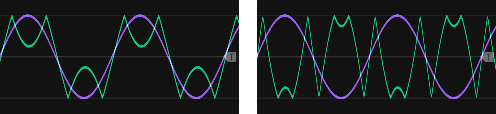
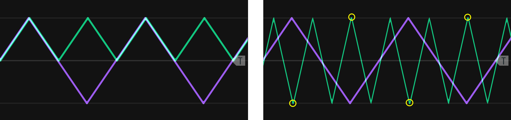
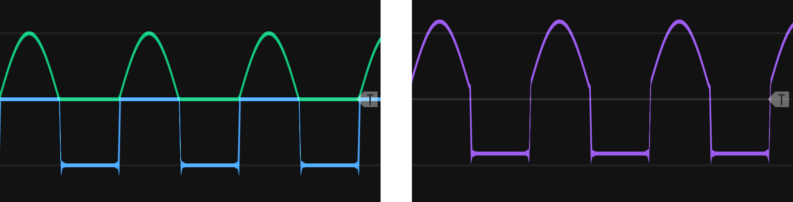
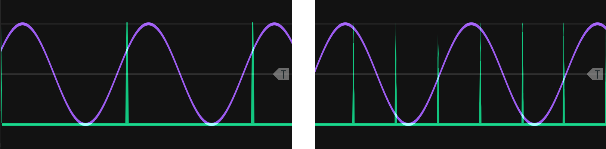

# Modulating Modifiers {#complex-modifiers}

Modifying incoming audio and control signals was introduced in Chapter \@ref(modifiers).
The present chapter introduces new modules and extends earlier concepts in modifiers around the loose organizing theme of converting between earlier signals, e.g. from gates to envelopes.

## Rectification and wavefolding

As discussed in Chapter \@ref(basic-modeling-concepts), signals are either unipolar or bipolar.
One way to make a bipolar signal unipolar is to add an offset to it, e.g. if a signal ranges from -5 to +5 V, then add 5 V to obtain a 0 to +10 V signal.
Another more interesting way to convert a bipolar signal to unipolar is to rectify the signal, as shown in Figure \@ref(fig:rectification).
Half-wave rectification simply removes the negative part of the signal by stopping the signal at zero, and staying at zero until the signal becomes positive again.
Full-wave rectification reflects the signal across the x-axis, i.e. takes the absolute value of the signal.
If you add a fully rectified signal to the original signal, you will get a half rectified signal because the negative portion of the original signal and the reflected portion of the fully rectified signal will cancel out. 

(ref:rectification) [Rectification](https://upload.wikimedia.org/wikipedia/commons/0/08/Sine_curve_drawing_animation.gif) of a sine wave using either half or full rectification. Image [©  	Omegatron/CC-BY-SA-3.0](https://commons.wikimedia.org/wiki/File:Rectified_waves.png).

(\#fig:rectification)(ref:rectification)

A variation of rectification is wavefolding.
In wavefolding, a comparator (see Section \@ref(addingremoving-gates-with-probability)) triggers reflection of the wave when it reaches an upper or lower threshold, as shown in Figure \@ref(fig:wavefold-sine).
Thus wavefolding is like rectification on parts of the signal that cross these boundaries, but a folding parameter allows the amplitude of the wave to increase until it reaches the opposing boundary, repeating the process.
Wavefolding does not affect the polarity of a signal.

(ref:wavefold-sine) Wavefolding (green) of a sine wave (purple). The fold parameter moves the top and bottom portions of the wave to their respective boundaries where they reflect (left). Further increase of the fold parameter causes them to reach the opposing boundary and reflect again (right), a repeatable process that creates additional folds.

(\#fig:wavefold-sine)(ref:wavefold-sine)

Rectification and wavefolding change harmonics and therefore timbre.
The best way to understand their effect on harmonics is to consider a triangle at full rectification.
As the bottom part of the triangle is reflected, the resulting wave is still a triangle wave, but at twice the frequency as before, e.g. a 200 Hz wave becomes a 400 Hz wave, and the signal is offset above zero.
For a triangle wave, wavefolding doesn't double frequency but instead triples it, e.g. a 200 Hz wave becomes a 600 Hz wave. 
Tripling occurs because when a peak reflects, it creates two additional peaks in addition to itself.
Figure \@ref(fig:triangle-rect-fold) illustrates these two cases.
The tripling behavior of wavefolding means that it will add all odd harmonics to a sine wave but not add harmonics to the other basic waveshapes, because they already have odd harmonics.
Instead, wavefolding will change the relative strengths of the harmonics, and as wavefolding increases it will put more energy into higher harmonics for a brighter sound.

(ref:triangle-rect-fold) Full wave rectification (left) and wavefolding (right) of a triangle wave. The wavefolded peaks that have just reached the boundary are circled. 

(\#fig:triangle-rect-fold)(ref:triangle-rect-fold)

The square wave has unusual behavior for wavefolding and rectification that deserves special mention.
During wavefolding, the upper and lower parts of the square wave will move in opposite directions rather than fold as shown in Figures \@ref(fig:wavefold-sine) and \@ref(fig:triangle-rect-fold).
As a consequence, there are moments where the two parts of the square wave meet at zero and result in a non-wave, somewhat comparable to amplitude modulation through wave folding.
Half rectification on a square wave turns it into an identical square wave, but at half amplitude and an offset.
Full rectification on a square wave turns it into just an offset, i.e. a constant voltage.
Because a constant voltage has zero frequency (0 Hz) it can be removed with a high pass filter - this is a good idea in most audio applications where constant voltages create noise.^[High pass filtering is a good idea when using clocks or clock dividers outputs as square waves for the same reason.]

The effects of rectification and wavefolding on the four basic wave shapes is summarized in Table \@ref(tab:freq-ratio) with respect to the addition of harmonics, change in frequency, and change in amplitude.
In all cases, the amplitude of individual harmonics changes, leading to a change in timbre with respect to the original wave.
Sometimes these changes can be quite extreme.
For example, a saw wave at full rectification keeps all harmonics, but the strongest harmonics more closely match a triangle wave than a saw.

Table: (\#tab:freq-ratio) Addition of harmonics, change in frequency, and change in amplitude to the four basic waveshapes under wavefolding, half rectification, and full rectification. Note all three affect strength of harmonics and so timbre.

| Wave     | Wavefolding   | Half rectification          | Full rectification                |
|----------|---------------|-----------------------------|-----------------------------------|
| Sine     | Odd harmonics | All harmonics               | All harmonics at double frequency |
| Triangle | -             | All harmonics but every 4th | Double frequency                  |
| Square   | -             | Amplitude reduced by half   | Offset voltage                    |
| Saw      | -             | -                           | -                                 |

Let's take a look at the change in harmonics resulting from wavefolding and rectification.
The best way to hear these is to step through with a sequential switch and use an LFO to drive the wavefolding.
Try creating this patch using the button in Figure \@ref(fig:wavefold-rect-example).

(ref:wavefold-rect-example) [Virtual modular](https://cardinal.olney.ai) for contrasting the effect of wavefolding and rectification on the four basic waveshapes. 

<!-- MODAL HTML BLOCK -->

<!-- CAPTION BLOCK -->

(\#fig:wavefold-rect-example)(ref:wavefold-rect-example)

Rectification has multiple uses besides changing harmonics.
One obvious use is making a bipolar control signal unipolar (e.g. to drive a VCA).
Another interesting use is to use rectification to perform waveshape surgery and combine the top part of one waveshape with the bottom of another.
This is relatively simple to do by fully rectifying two waveshapes and inverting one to become the bottom portion of the wave.
It's slightly trickier to align the top and bottom portions, but it's possible to do so using a module that allows specfication of phase offsets.
Figure \@ref(fig:fraken-rect) shows an example of waveshape surgery using the top portion of a sine wave and the bottom portion of a square wave.
By blending parts of different waves, you can achieve an intermediate sound, e.g. a slightly more mellow square wave.

(ref:fraken-rect) Upper sine wave and lower square wave portions cut using rectification and aligned with a phase offset (left). The final wave is high pass filtered to remove the voltage offset (right).

(\#fig:fraken-rect)(ref:fraken-rect)

Try creating a new waveshape through rectification using the button in Figure \@ref(fig:franken-rect).
This method would also allow you to perform operations on just one part of the signal if desired, e.g. waveshaping on just the top half.

(ref:franken-rect) [Virtual modular](https://cardinal.olney.ai) for contrasting the effect of wavefolding and rectification on the four basic waveshapes. 

<!-- TODO replace 8vert with Bogg Audio Offset? -->

<!-- MODAL HTML BLOCK -->

<!-- CAPTION BLOCK -->

(\#fig:franken-rect)(ref:franken-rect)

## Slew

Slew slows the rate of change of a signal.
We've seen this before with low pass filters, where the signal being slowed was audio rate.
Slew limiters behaves much the same way as low pass filters but are designed to work with unipolar signals.
Recall RC circuits from Section \@ref(voltage-controlled-filters) leech out energy from parts of the wave shape and return that energy to other parts, thus smoothing the signal.
Slew limiters work the same way but typically have parameters to control the rate of slew for both upward and downward transitions.

Slew limiters have applications in many areas that involve delaying a signal. 
For example, we can make a gate delay by combining a slew limiter with a comparator.
When a slew limiter receives a gate, its output voltage will slowly rise depending on the rate of slew, until the voltage is high enough that the comparator sends out a high signal.
Before we look at portamento, try creating  a gate delay from a slew limiter and comparator using the button in Figure \@ref(fig:slew-gate-delay).
The second scope in the patch shows another interesting application of slew, which is to convert gates into envelopes.
If the rise time runs into the fall time, the envelope will only go up and down (attack and decay).
Shorter rise and fall times will preserve the top of the gate, making an attack-sustain-release envelope, with sustain at max level.

(ref:slew-gate-delay) [Virtual modular](https://cardinal.olney.ai) for using a slew limiter and comparator to make a gate delay and slew alone to convert a gate to an envelope.

<!-- MODAL HTML BLOCK -->

<!-- CAPTION BLOCK -->

(\#fig:slew-gate-delay)(ref:slew-gate-delay)

Perhaps the most common use of slew is to implement portamento/glissando by smoothing stepped V/Oct control signals to create glides.
If you consider V/Oct signals to be stepped like gates, then the last patch should help you understand how this works.
A slewed V/Oct signal will have a range of voltages between the steps, and these intermediate voltages will be cause a VCO receiving them to output intermediate pitches.
Most slew limiters will base the glide time on the distance between notes as well as the rise/fall settings.
This can be challenging musically, so if a constant glide time is desired, a better option is to use a low-pass filter.
Try patching up a slew limiter to a VCO to implement portamento using the button in Figure \@ref(fig:slew-portamento).

(ref:slew-portamento) [Virtual modular](https://cardinal.olney.ai) for using a slew limiter to implement portamento. 

<!-- MODAL HTML BLOCK -->

<!-- CAPTION BLOCK -->

(\#fig:slew-portamento)(ref:slew-portamento)

Slew can also be combined with full rectification to make an envelope follower, a very useful tool for processing audio.
When we make sounds in modular, we typically apply an envelope like an ADSR in order to give the sound dynamic loudness.
We can further use the envelope to control modulation like filter cutoff, so that the spectrum of the sound changes at the same time as its loudness.
Envelopes can can be used for [sidechaining](https://en.wikipedia.org/wiki/Dynamic_range_compression#Side-chaining) effects like ducking, where the envelope on the kick is inverted and used to *reduce* the volume of other sounds, which gives the music a pulsing quality.

Sidechaining is relatively simple when an envelope was used to generate the sound, but when the sound isn't synthesized, like samples or live-recordings of instruments, an envelope follower is needed to generate the envelope that will be used for sidechaining.
An envelope follower essentially traces a curve along the peaks of a sound wave to outline an envelope akin to an ADSR.
Since ADSR envelopes are unipolar, full rectification of the audio takes place first.
Then slew is used to slow the rapid changes in the sound and generate a smoothish curve.
Some tuning of the envelope follower is typically required to create an envelope with the desired properties.
Try patching up an envelope follower using full rectification and a slew limiter using the button in Figure \@ref(fig:slew-sidechain-noise).
The audio in the patch comes from lo-fi synthesized speech with no envelope, and the patch demonstrates sidechaining to duck noise based on the followed envelope.

(ref:slew-sidechain-noise) [Virtual modular](https://cardinal.olney.ai) for using full rectification with a slew limiter to create an envelope follower. 

<!-- MODAL HTML BLOCK -->

<!-- CAPTION BLOCK -->

(\#fig:slew-sidechain-noise)(ref:slew-sidechain-noise)

## Quantizers

A [quantizer](https://en.wikipedia.org/wiki/Quantization_(signal_processing)) maps input values to a smaller set of outputs.
We discussed quantization in Section \@ref(samplers) in the context of bit depth, where the height of a sound wave is approximately measured in order to convert it from analogue to digital.
In music, quantization is typically used to refer to either beat quantization or note quantization.
Beat quantization is often relevant when performing live into a sequencer.
If the sequencer is grid-based, any played beat will be snapped to the grid, i.e. snapped to the beat.
In modular, note quantization is the more commonly used, and note quantization maps a voltage range to a particular note.
Modular quantizers typically allow scales to be selected to determine what notes are available. 

Perhaps the easiest way to understand quantizers is through voltage controlled sequencers.
Recall that sequencers are typically clocked and advance one step at a time.
A voltage controlled sequencer will select the step based on the incoming voltage.
So when a voltage within a range corresponding to the step is received, that step will be selected, and whatever voltage was there will be output.
Quantizers perform the same function except that the output notes are determined by the scale rather than being assigned.

Despite this similarity, quantizers are often used after modular sequencers to make them easier to tune.
If a quantizer is used on the output of a sequencer, adjustment to a sequencer knob will step from one note to the next rather than move through all frequencies in between.
Also, if the quantizer has scale selection, then it will affect all notes in the sequence simultaneously, which can be very convenient.
However, it's important to keep in mind that a quantizer's voltage for a note, e.g. C4, may not make your oscillator go to the same note.
To ensure your oscillator's output matches a quantizer, you must tune your oscillator so they match. 
Try patching up a quantizer both ways using the button in Figure \@ref(fig:cv-sequencer-quantizer-plus-quantizer): first using a voltage controlled sequencer and then as a modifier on a sequencer's output.

(ref:cv-sequencer-quantizer-plus-quantizer) [Virtual modular](https://cardinal.olney.ai) for implementing a quantizer using a voltage controlled sequencer and using a quantizer module to process the output of a sequencer. 

<!-- MODAL HTML BLOCK -->

<!-- CAPTION BLOCK -->

(\#fig:cv-sequencer-quantizer-plus-quantizer)(ref:cv-sequencer-quantizer-plus-quantizer)

The last patch used a sequencer to store notes, but it's also possible to use a quantizer without a sequencer.
Particularly for arpeggios, its easy enough to use LFOs that cycle up and down.
All that is needed is a sample and hold module to synchronize the pitches to gates, and an attenuator to restrict the range of the LFO to the range of notes desired.
The relationships between LFO frequency, LFO range, gate/trigger frequency, and gate/trigger synchronization are illustrated in Figure \@ref(fig:sine-quantize-figure).
If sampling occurs at the same frequency as the LFO, then it will always select the same note.
To get more notes, the sampling needs to occur at a higher frequency.

(ref:sine-quantize-figure) A sine wave LFO (purple) being sampled (green) so the sampled values can be input to a quantizer to create an arpeggio. If the sampling rate matches the LFO frequency, only one repeating note will be sampled (left). The samplng rate must be higher than the LFO rate (right) to increase the number of notes. See text for additional factors that effect what voltages are sampled.

(\#fig:sine-quantize-figure)(ref:sine-quantize-figure)

If the sample and hold is clocked with another LFO whose frequency is not a multiple of the quantized LFO, then the arpeggio will slowly shift its played notes over a longer period. 
Try patching up an LFO quantizer arpeggio using the button in Figure \@ref(fig:lfo-quantizer-arpeggio).
Other ways of creating variations are to change the range of the LFO, the offset of the LFO, the sampling rate, and the sampling phase/synchronization to the LFO.

(ref:lfo-quantizer-arpeggio) [Virtual modular](https://cardinal.olney.ai) for creating an arpeggio using an LFO through a quantizer. 

<!-- MODAL HTML BLOCK -->

<!-- CAPTION BLOCK -->

(\#fig:lfo-quantizer-arpeggio)(ref:lfo-quantizer-arpeggio)

Another common application for quantizers is in generative patches where probability is used to generate voltages which are then turned into notes.
We can incorporate probability into the last patch using almost the same modules but connected a different way.
Try patching up a probability-based generative patch using sample and hold on noise through a quantizer and speed variable clocks for different note lengths using the button in Figure \@ref(fig:sh-quantizer-generative).

(ref:sh-quantizer-generative) [Virtual modular](https://cardinal.olney.ai) for creating an generative melody using sample and hold on noise through a quantizer. 

<!-- MODAL HTML BLOCK -->

<!-- CAPTION BLOCK -->

(\#fig:sh-quantizer-generative)(ref:sh-quantizer-generative)

<!-- In Section \@ref(addingremoving-gates-with-probability) we used probability to create beats and then used logic on clocks to quantize those beats. -->

<!-- Remaining plan -->
<!-- 	Modifiers	 -->
<!-- 		Slew -->
<!-- 		Wave-folding -->
<!-- 		Quantizers -->

<!-- worthy orphans -->
<!-- audio rate modulation into resonant filter? -->
<!-- 		Vocoders -->
<!-- - -->
<!-- possibly undercovered -->
<!-- 		Attenuators, inverters, and attenuverters -->
<!-- 		~~Sample and hold~~ -->
<!-- - -->
<!-- Sound design ideas -->
<!-- Cymbal PUSH UNTIL AFTER RING MOD -> clark & reid comparison -->
<!-- Maybe use these? -->
<!-- Growl: Low frequency sine wave modulation of the filter cut-off frequency -->
<!-- wah wah is LFO on LPF cutoff freq -->

<!-- Actual -->
<!--     4 Basic Modeling Concepts -->
<!--     4.1 Modules are the model elements -->
<!--     4.2 Signals are how the model elements interact -->
<!--     4.3 Signals are interpreted by modules -->
<!--     4.4 Pulling it all together -->
<!--         4.4.1 Drone -->
<!--         4.4.2 Using an oscilloscope -->
<!--         4.4.3 Controlling pitch -->
<!--         4.4.4 Controlling note duration (on/off volume) -->
<!--         4.4.5 Controlling note dynamics (volume during note) -->
<!--     4.5 Moving forward -->

<!-- 5 Controllers -->
<!-- 5.1 Clocks -->

<!--     5.1.1 Clock under a scope -->
<!--     5.1.2 Clock as a generator -->

<!-- 5.2 Sequencers -->

<!--     5.2.1 Clocks as sequencers -->
<!--     5.2.2 Trigger sequencers -->
<!--     5.2.3 Control voltage sequencers -->

<!--     6 Generators -->
<!--     6.1 Chords -->
<!--     6.2 Chorus -->
<!--     6.3 Low frequency oscillators & uses -->
<!--         6.3.1 Pulse width modulation -->
<!--         6.3.2 Vibrato -->
<!--         6.3.3 Tremolo -->
<!--     6.4 Synchronization -->
<!--     6.5 Noise -->
<!--     6.6 Samplers -->

<!-- 7 Modifiers -->
<!-- 7.1 Effects -->
<!--     7.1.1 Delays -->
<!--     7.1.2 Reverb -->
<!--     7.1.3 Chorus -->
<!--     7.1.4 Flanger -->
<!--     7.1.5 Phaser -->
<!-- 7.2 Voltage controlled filters -->
<!--     7.2.1 Filters are imperfect -->
<!--     7.2.2 Filters change frequency and phase -->
<!--     7.2.3 Combining filters -->
<!--     7.2.4 Resonance -->

<!-- 8 Designing a Kick Drum -->
<!-- 8.1 Problem solving for sound synthesis -->
<!--     8.1.1 Understand the problem -->
<!--     8.1.2 Devise a plan -->
<!--     8.1.3 Carry out the plan (and replanning) -->
<!--     8.1.4 Evaluate the solution -->
<!-- 8.2 Reviewing previous kick drum patches -->
<!--     8.2.1 Sine with envelope -->
<!--     8.2.2 Sine with an envelope plus noise burst -->
<!-- 8.3 Alternative approaches -->
<!--     8.3.1 Improving our understanding of the problem -->
<!--     8.3.2 Devising new plans -->
<!--     8.3.3 Working backwards -->

<!-- 9 Eighties Lead & Chiptune -->
<!-- 9.1 Eighties Lead -->
<!--     9.1.1 Waveshape -->
<!--     9.1.2 Dynamics -->
<!-- 9.2 Chiptune -->
<!--     9.2.1 Triad arpeggio -->
<!--     9.2.2 LFO PWM -->
<!--     9.2.3 Secondary sequencer for transposition -->
<!--     9.2.4 Hats and kick -->

<!-- 10 Controllers -->
<!-- 10.1 Modifying gates -->
<!-- 10.2 Making gates with logic -->
<!-- 10.3 Adding/removing gates with probability -->
<!-- 10.4 Speed variable clocks using LFOs -->
<!-- 10.5 Euclidean rhythm -->
<!-- 10.6 Sequential switches -->

<!-- 11 Generators -->
<!-- 11.1 Modulating amplitude -->
<!--     11.1.1 Amplitude modulation -->
<!--     11.1.2 Ring modulation -->
<!-- 11.2 Modulating frequency -->
<!--     11.2.1 Frequency modulation -->
<!--     11.2.2 Analogue exponential frequency modulation -->
<!--     11.2.3 Analogue linear frequency modulation -->
<!--     11.2.4 Analogue through-zero frequency modulation -->
<!--     11.2.5 Phase modulation -->
