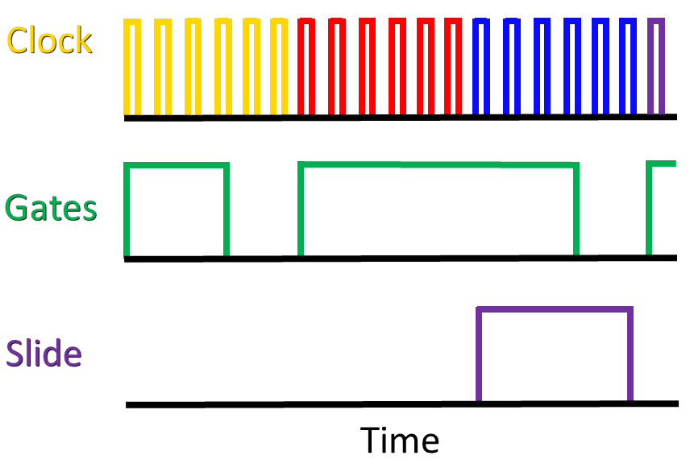
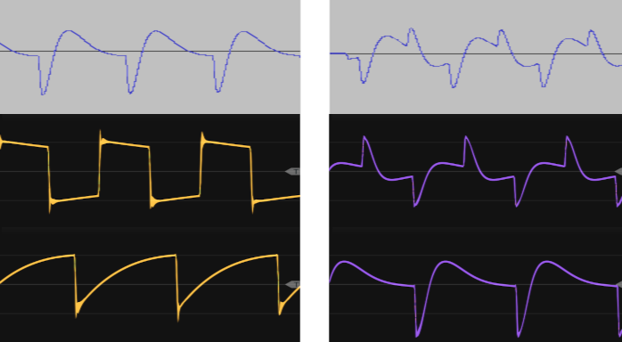

# (PART) Sound Design 2 {-}

# TB-303

This chapter examines a new sound design problem using the problem solving approach introduced in Chapter \@ref(designing-a-kick-drum).
The problem is to make a lead by recreating the fundamental characteristics of the Roland TB-303, an iconic instrument in acid house and subsequent genres of electronic music.
Thus the problem is not only about recreating a particular sound but also involves emulating the key features of the instrument in order to produce the sound.

## History

The [TB-303](https://en.wikipedia.org/wiki/Roland_TB-303) (hereafter 303; see Figure \@ref(fig:303)),  was released in 1981 and withdrawn in 1984 as a commercial failure.
The original purpose of the 303 was to replace a bass guitar in much the same way a drum machine like the [TR-808](https://en.wikipedia.org/wiki/Roland_TR-808) was meant to replace drums.
The 303 was widely considered as difficult to use, which together with a $1300 price tag^[In 2022 dollars.], likely led to its demise.

(ref:303) A Roland TB-303. Image [public domain](https://commons.wikimedia.org/wiki/File:Roland_TB-303_Panel.jpg).

(\#fig:303)(ref:303)

The 303's failure in the marketplace, however, meant that it was cheaply available in the secondhand market.
Dance music artists, most notably in Chicago, began incorporating the 303 into their performances, and the 303 became a signature sound of [acid house](https://en.wikipedia.org/wiki/Acid_house).
While the 303 was designed for bass guitar sounds, which are a common element of [disco](https://en.wikipedia.org/wiki/Disco) dance music, the 303 could also easily (and perhaps more easily) produce sounds that are nothing like a bass guitar or any other instrument from that time.^[Squelch, chirp, and scream are common descriptors of the 303 sound.]

The way the 303 was used in acid house may be due to its extremely limited sequencer.
The 303 sequencer stored pitch and time information separately, and each of these were entered using separate modes.
As a result, it was not possible to edit the complete sequence in real time, i.e. during performance.^[It is possible to [live-play](https://tinyloops.com/tb303/quick_results.html#02) the 303 and [switch between tracks](https://tinyloops.com/tb303/quick_results.html#07), but this is not the same as editing a running sequence.]
However, it was very easy to change the timbre of an existing sequence using various parameter knobs (mostly across the top in Figure \@ref(fig:303)). 
The combined difficulty of sequencing and the ease of using parameter knobs to sculpt timbres led early acid house pioneers to focus on the later.^[https://www.dwrl.utexas.edu/2016/11/22/rhetorical-synthesis-the-story-of-the-roland-tb-303/]
Thus repeating sequences with shifting timbres became a defining feature of acid house, as shown by the early example in Figure \@ref(fig:acid-tracks).

(ref:acid-tracks) [*Acid Tracks*](https://en.wikipedia.org/wiki/Acid_Tracks) by [Phuture](https://en.wikipedia.org/wiki/Phuture). *Acid Tracks* helped define the sound of acid house.

(\#fig:acid-tracks)(ref:acid-tracks)

## Problem solving approach

The problem solving stages elaborated for sound design in Chapter \@ref(designing-a-kick-drum) mostly apply to emulating a 303 but with some slight variation given the goal of creating a specific sound by emulating the key features of a 303.
Recall the problem solving stages are:

- Understand the problem
- Make a plan
- Implement the plan
- Evaluate the solution

For the understanding the problem stage, we need to know the defining characteristics of the 303 and what makes it special.
According to Robin Whittle, developer of the Devil Fish 303 mod, the most important aspects of the 303 sound are its sequencer, filter, filter envelope, and the oscillator to a minor extent.^[Most information is on Robin's [main website](https://www.firstpr.com.au/rwi/dfish/index.html) including the Devil Fish manual. Additional information is on the [Analogue Heaven mailing list](http://www.retrosynth.com/ah/).]

For the making a plan stage, Whittle's observations suggest a plan based around decomposition, namely that the 303 can be considered as a collection of modules.
Any 303 function that is generic can be satisfied with generic modules, while the functions contributing to the 303's distinctive sound can be addressed independently as subproblems.
Figure \@ref(fig:tb303-annotated) shows how the 303 interface is loosely organized around modular concepts like oscillators, filters, and envelopes, further supporting an overall decomposition strategy for emulating a 303 in modular.

(ref:tb303-annotated) A Roland TB-303 annotated to group interface elements according to modular concepts. Note the accent knob affects both filter and volume envelopes. 

(\#fig:tb303-annotated)(ref:tb303-annotated)

For the implementing a plan stage, we need evaluation criteria in order to assess alternate solutions and gauge our progress.
A simple and straightforward evaluation criterion is to use a well-known song with a 303 line.
Ideally, the 303 line should be easy to sequence and easy to listen to repeatedly throughout our design process.
*Da Funk* by Daft Punk seems suitable for this purpose ([listen here](https://youtu.be/PwILkY9gRrc?t=145)).
Another source of evaluation material has been provided by Din Sync, whose [reference recordings of a 303](http://www.dinsync.info/2010/02/tb-303-reference-recordings-for-x0xb0x.html) systematically map the sound of a C note across 303 knob positions.
The Din Sync materials are useful for isolating parameters of the 303 as an instrument, which is very difficult to do from a live performance.
A 1-10 scale for both criteria seem appropriate at first glance.
Using these materials, we can address the subproblems of sequencing, oscillators, filter, and envelopes independently using the same four problem solving stages.

The evaluation stage, which we will cycle through iteratively, will use the *Da Funk* evaluation to determine overall success.
If we were trying to recreate the 303 in a broad sense, then additional evaluation materials would be necessary, but for the purposes of this chapter, this should be sufficient.

## Sequencing

Let's begin with understanding the sequencing problem.
The 303 has a maximum pattern length of 16 steps.
Because reducing the pattern length is somewhat tedious, many 303 patterns are 16 steps.
By default, the steps are staccato 16th notes in 4/4 time.^[The 303 also has a triplet mode, but that is not generally considered a signature component of the sound.]
As previously stated, the 303 sequencer has a timing mode and a pitch mode.
In timing mode, each step is identified as beginning a new note, beginning a rest, or continuing the previous step (which may be a note or a rest).
In pitch mode, each note is identified, whether it is transposed up/down an octave, whether is has an accent, and whether it has a slide.
For now, think of the accent as producing a slightly louder note, and a slide as a glide in pitch from one note to the next.
According to Whittle, the accent and slide are the two components of the sequencer that are the most important to the overall sound of a 303.

Figure \@ref(fig:tb303-slide)^[Adapted from https://www.firstpr.com.au/rwi/dfish/303-slide.html.] shows an example 303 clock and gate pattern modified by a slide.
Each step in the example has a different note and is represented by a clock color.
Gates for a single 16th note extend less than a full step's worth of clock pulses, specifically three pulses and the positive portion of the fourth pulse.
Short gates relative to steps give the 303 its staccato note feel.
Extended gates, in contrast to regular gates, extend through the step on which they are placed and into the next step.
In the example's second row, a slide has been placed on the red note, causing its gate to extend through the blue note's gate.
Regular gates and extended gates control the envelopes for the filter and volume.
In addition to these gates, slide gates control the portamento from one note to the next.
In the example's third row, the red note begins its slide into the blue note when the blue note starts, and the slide circuit stays on until the purple note.
Accents (not shown) are in time with the gates and further affect the filter and volume envelopes.

(ref:tb303-slide) Clock, gate, and slide behavior of a 303 for four notes across four steps, indicated by different colors on the clock pulses. Note the gates are shorter than a step, gates can be extended across steps, and slide gates extend across an entire step. 

(\#fig:tb303-slide)(ref:tb303-slide)

Based on the above description, any solution to the 303 sequencer problem will need to somehow represent the following:

- Notes and rests
- Gates spanning steps in response to slides and extended steps
- Gates to control slide
- Presence of accents

To make a plan, let's consider some of our previous sequencing approaches from Chapter \@ref(complex-controllers).
First, clocks alone are clearly insufficient because sometimes we need rests.
We could accomplish rests using clock divisions and logic, but the variable length of notes and rests in the 303 would seem to make that approach very complicated, even if it is possible.
The two remaining obvious choices are modifying gates and using an LFO as a speed variable clock.
In the modifying gates approach, we could trigger gates on steps with notes and arbitrarily extend gate lengths for continued notes/slides and rests.
In the LFO clock approach, an LFO would be synced by a clock, and we'd increase/decrease the speed of the clock to change gate duration.
Comparing these two approaches with the sequencing needs of the 303, it seems that the speed variable clock has capabilities that aren't needed here, like adding multiple beats, e.g. subdividing 1/16th notes.
For the goal of emulating 303 sequencing, the modifying gates approach seems like it will accomplish the goals of variable length gates and rests with a minimum of complexity.

Returning to the list of sequencing elements we need to represent, most of the elements have an on/off flavor except for pitches: note/rest, accents, slides, and extended gates are either present or not.
This presence/absence flavor suggests that these elements are best represented using trigger sequencers that represent presence/absence of something at each step.
Because the 303 forces 16th notes in 16 steps as the minimal resolution, we are not sacrificing flexibility by using triggger sequencers in this case.
Altogether, this suggests one control voltage sequencer for pitch and four trigger sequencers for note/rest, accents, slides, and extended gate.
The pitch sequencing in this approach is handling three functions on the 303: defining a note, up transpositions, and down transpositions.
Try patching up *Da Funk* using a 16 step control voltage sequencer with some other placeholder modules to generate sound using the button in Figure \@ref(fig:tb303-seq).
The notation for the sequence is provided in the patch instructions.

(ref:tb303-seq) [Virtual modular](https://cardinal.olney.ai) for a 303-style sequencer.

<!-- MODAL HTML BLOCK -->

<!-- CAPTION BLOCK -->

(\#fig:tb303-seq)(ref:tb303-seq)

At this point, the song should be somewhat recognizable but also recognizably not right.
The 16th note gates generated by the clock are the right length for the 303's regular gates, but 9/16 of the steps have slides, and these should be implemented as extended gates and not short gates.
Extended gates should happen either when a step has been marked as a slide gate or when it has been marked as an extended gate.
Additionally, the extended gate should only occur when the step has a note.
The flavor of these conditions suggest logic should be used to decide when an extended gate should fire.
Try extending the last patch by adding logic to trigger extended gates and then tune those gates to the correct length  using the button in Figure \@ref(fig:tb303-seq-extendgate).

(ref:tb303-seq-extendgate) [Virtual modular](https://cardinal.olney.ai) for improving the 303 patch with extended gates.

<!-- MODAL HTML BLOCK -->

<!-- CAPTION BLOCK -->

(\#fig:tb303-seq-extendgate)(ref:tb303-seq-extendgate)

With the patch in Figure \@ref(fig:tb303-seq-extendgate), the song may sound more correct  but flawed in a different way.
This is because the last patch replaced all gates with extended gates.
Since a few gates are regular gates, they are currently not being generated at all.
Ideally, we'd use logic to define the length of the gate to generate and use the same mechanism to generate both regular and extended gates.
Unfortunately, the module being used to generate extended gates does not accept CV to control gate length.
As a result, we need two sources of gates and to send gates from both sources to the ADSR.
One option would be to use a sequential switch that accepted the gates from both sources and then selected one to send through using logic.
This would require several additional modules.
A simpler approach is to use a mixer to mix extended gates and regular gates from the step/rest sequencer.
This creates lumpy gates, but envelopes generally only pay attention to the rising and falling edges of a gate, so the lumpiness often won't matter.
Try extending the last patch by mixing in regular gates  using the button in Figure \@ref(fig:tb303-seq-extendgate-reggate).
We'll throw in some logic in order to show that the logic doesn't actually matter in this case.

(ref:tb303-seq-extendgate-reggate) [Virtual modular](https://cardinal.olney.ai) for  extending the 303 patch by mixing regular and extended gates.

<!-- MODAL HTML BLOCK -->

<!-- CAPTION BLOCK -->

(\#fig:tb303-seq-extendgate-reggate)(ref:tb303-seq-extendgate-reggate)

The final element of the sequencer we need to implement are the slide gates.
Recall that slide gates start on the step after the marked step.
For example, if step 8 is marked for a slide, step 8 will have its gate extended, but the slide gate which controls the portamento doesn't start until step 9.
Delayed gates again offer a convenient solution, but again they need to be tuned to the length of a step as well as filtering to glue together overlapping gates.
Unfortunately, it's less clear what the actual slide should look like in terms of its shape, which is important to know for slewing the V/Oct during the duration of the gate.
The Din Sync reference recordings do not have an example of slide.
Plotting the frequency spectrum of the song in Audacity is one way to get the frequencies of a window of audio, but extrapolating that to the change of frequencies over time seems so fraught with error that it is better to attempt setting the slew by ear.
Try extending the last patch with slide gates and tune the V/Oct slew using the button in Figure \@ref(fig:tb303-seq-extendgate-reggate-slidegate).

(ref:tb303-seq-extendgate-reggate-slidegate) [Virtual modular](https://cardinal.olney.ai) for  extending the 303 patch using slide gates and slewed V/Oct.

<!-- MODAL HTML BLOCK -->

<!-- CAPTION BLOCK -->

(\#fig:tb303-seq-extendgate-reggate-slidegate)(ref:tb303-seq-extendgate-reggate-slidegate)

## Oscillator

The waveshapes produced by the 303 are a bit unusual in the reference recordings, as shown in the top row of Figure \@ref(fig:tb303-square-saw-hpf-compare).
Curiously, each of these waves is very similar to high pass filtered versions of the other wave, as shown in the bottom two rows of Figure \@ref(fig:tb303-square-saw-hpf-compare).
Based on the reference recordings, we may achieve a more accurate sound by high pass filtering the opposing wave.
That's not to say that this is how it was done in the hardware but rather that it could be a reasonable strategy for recreating the sound in modular.
Because the reference recordings are all at a single note, it's unclear how the filtering could or should track V/Oct.

(ref:tb303-square-saw-hpf-compare) Top row: square (left) and saw (right) waves for a C note from the Din Sync 303 reference recordings. Note neither waveshape matches the canonical form. Middle row: square wave (left) that is high pass filtered (right), creating a shape similar to the reference recording saw wave. Bottom row: saw wave (left) that is high pass filtered (right), creating a shape similar to the reference recording square wave.

(\#fig:tb303-square-saw-hpf-compare)(ref:tb303-square-saw-hpf-compare)

Another quirk of the 303 oscillator is that, according to Whittle, the duty cycle of the square wave at high pitches is about 45% but about 71% at the lowest pitches. 
We can approximate this change in duty cycle by modulating the PWM input of the oscillator using the same voltage that is controlling pitch.
Try extending the last patch with these oscillator modifications using the button in Figure \@ref(fig:tb303-seq-extendgate-reggate-slidegate-osc).

(ref:tb303-seq-extendgate-reggate-slidegate-osc) [Virtual modular](https://cardinal.olney.ai) for extending the 303 patch with oscillator modifications for V/Oct driven PWM and HPF.

<!-- MODAL HTML BLOCK -->

<!-- CAPTION BLOCK -->

(\#fig:tb303-seq-extendgate-reggate-slidegate-osc)(ref:tb303-seq-extendgate-reggate-slidegate-osc)

## Filter and envelope generators

The filter on the 303 has been the subject of much debate and speculation.
Tim Stinchcombe has done [extensive analysis of the filter and its transfer function](https://www.timstinchcombe.co.uk/index.php?pge=diode
).
His results indicate that the filter is a 24 dB, 4-pole filter, and he suggests that perhaps the reason it is commonly described as an 18 dB filter is that it behaves more like an 18 dB filter over much of its audible range.^[Perhaps there were legal reasons for Roland to go along with the 18 dB description. The 303 diode ladder filter is seen as similar to the Moog transistor ladder filter, which was protected by patent at the time the 303 was developed.]
The 303's filter no doubt plays a significant role in its sound, but in our virtual modular environment we are rather constrained by a lack of filter options.
Another diode ladder filter would likely be the best choice, but short of that, a 24 dB transistor ladder filter seems the best alternative.

The 303 has two envelopes, which Whittle calls the main envelope generator (MEG) and the volume envelope generator (VEG).^[https://www.firstpr.com.au/rwi/dfish/303-unique.html]
Both envelopes are attack-decay with very fast attack.
The MEG controls the filter cutoff, and the VEG controls the final VCA.
The MEG and VEG have additional complexities involving accents, but we will address those in the next section.
Try extending the last patch with the filter and envelope generators using the button in Figure \@ref(fig:tb303-seq-extendgate-reggate-slidegate-osc-megveg).

(ref:tb303-seq-extendgate-reggate-slidegate-osc-megveg) [Virtual modular](https://cardinal.olney.ai) for extending the 303 patch with filter and envelope generators.

<!-- MODAL HTML BLOCK -->

<!-- CAPTION BLOCK -->

(\#fig:tb303-seq-extendgate-reggate-slidegate-osc-megveg)(ref:tb303-seq-extendgate-reggate-slidegate-osc-megveg)

## Accent

The 303 accent system alters the behavior of the MEG and VEG.
The accented changes and be broadly thought of as a pluckier sound that is shorter, louder, and slightly brighter. 
On an accented note:

- The MEG decay is shortened
- The MEG sends additional control voltage to the VCA, making it louder
- The filter cutoff is raised

Whittle [describes the effect on the filter](https://www.firstpr.com.au/rwi/dfish/303-unique.html) as an accent sweep circuit that smooths the control voltage driving the filter cutoff.
The smoothed voltage has a slow decay, so if there are multiple accent notes in a row, the voltage will continue to increase, creating a series of increasing peaks in filter cutoff, as shown in Figure \@ref(fig:accent-sweep).^[Based on [Whittle's diagram.](https://www.firstpr.com.au/rwi/dfish/303-unique.html)]

(ref:accent-sweep) Conceptual diagram of the effect of the 303 accent sweep circuit on filter cutoff control voltage. The accent sweep circuit does not fully discharge before the next step, creating increasing peaks when consecutive steps are accented.

(\#fig:accent-sweep)(ref:accent-sweep)

The accent system can be conceptualized in modular by incorporating a module that does smoothing and by incorporating a module that gives regular envelopes when no accents are received and modified envelopes when accents are received.
Smoothing can normally be accomplished using a slew limiter.
Modifying envelopes when accents are received can be accomplished similarly to how we modified gates, i.e. by creating step-length gates when accets are received, and using those gates to decide when to alternate between accented voltages and regular MEG voltages.
However, there seems to be a point of ambiguity in Whittle's description on how the smooth voltages is used. 
It could be that there is a switch controlled by accents that determines whether to use the smoothed voltage or the regular MEG voltage.
The apparent problem with that is that the smoothed voltage will have a much longer decay than normal, which is the opposite of the behavior the accented envelope is supposed to have.
For this reason, it seems a better solution is to mix the smoothed voltage with the regular envelope on accented steps.
Try extending the last patch with the accents using the button in Figure \@ref(fig:tb303-seq-extendgate-reggate-slidegate-osc-megveg-accents).

(ref:tb303-seq-extendgate-reggate-slidegate-osc-megveg-accents) [Virtual modular](https://cardinal.olney.ai) for for extending the 303 patch with accents.

<!-- MODAL HTML BLOCK -->

<!-- CAPTION BLOCK -->

(\#fig:tb303-seq-extendgate-reggate-slidegate-osc-megveg-accents)(ref:tb303-seq-extendgate-reggate-slidegate-osc-megveg-accents)

## Looking back

Overall this seems like a decent approximation to a 303.
My biggest reservations are around the accent system, which seems to capture some but not all of Whittle's descriptions.
Improving the accent system would require additional research and probably studying the circuit itself.
It would also be nice to have a diode ladder filter module rather than a transistor ladder module.
The transistor ladder seems to a pretty good job at low to medium resonance, but I'm not as convinced at higher resonance.
Probably the best way to make continued progress on this patch would be to obtain a real 303 and then make reference recordings for our target song and then use those to better tune parameters and make design decisions.
