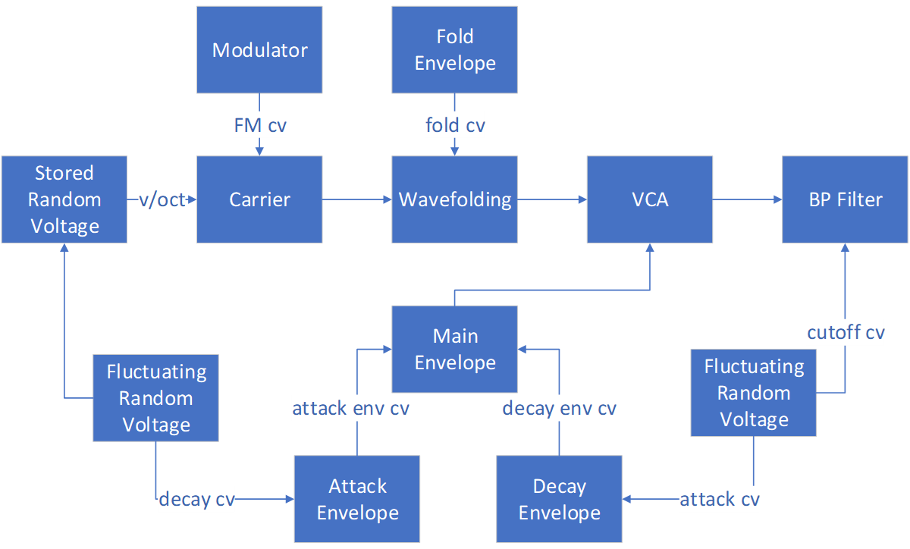

# Krell

This final chapter explores a new sound design problem centered on recreating the Krell patch by Todd Barton.
The Krell patch is a generative patch (it plays itself) that makes use of more advanced probability techniques than we've previously discussed.
An additional challenge with this patch is that Barton uses the Buchla 200e series rather than Eurorack, so the modules and signals between them are not directly compatible and must be translated.

## History

The Krell patch, shown in Figure \@ref(fig:krell-performance), was publicly released  by [Todd Barton](https://toddbarton.com/) in 2012.^[Based on the release date of the [performance video](https://vimeo.com/48382205) and [walkthrough video](https://vimeo.com/48466272).]
The name "Krell" is an homage to the 1956 sci-fi film [*Forbidden Planet*](https://en.wikipedia.org/wiki/Forbidden_Planet), which was the first film to use an electronic score.
In the film, human explorers encounter strange forces on the planet of an ancient extinct alien race, called the Krell.
The film was scored by [Bebe and Louis Barron](https://en.wikipedia.org/wiki/Bebe_and_Louis_Barron) who were early electronic music pioneers inspired by [cybernetics](https://en.wikipedia.org/wiki/Cybernetics), a precusor to artificial intelligence.
Louis Barron created much of his own equipment, including synthesizer circuits used to generate sound, such as ring modulators.
The sounds were recorded onto tape for mixing, adding effects, and preservation, as the circuits themselves burned out quickly.
The Barron's work on film sound effects led to their work on *Forbidden Planet*.
Thus Barton's choice of the name "Krell" for the patch is an homage to the film's score and the work of Bebe and Louis Barron.

(ref:krell-performance) [Vimeo video](https://vimeo.com/48382205) of Todd Barton's Krell patch. Image [© Todd Barton](https://vimeo.com/user2359061).

(\#fig:krell-performance)(ref:krell-performance)

As illustrated by Figure \@ref(fig:krell-performance), the patch is produces a non-repeating melody.
The notes generated by the patch are of variable lengths and pitches, and the timbres change periodically, ranging from woodwinds to percussive sounds.
Despite these various changing elements, the overall sound is somewhat cohesive, if otherworldly.
Keeping this cohesion is a primary concern in recreating the sound of this patch.

## Problem solving approach

This chapter applies the problem solving stages discussed in previous chapters, namely:

- Understand the problem
- Make a plan
- Implement the plan
- Evaluate the solution

For the understanding the problem stage, we need to understand the patch, which divides into understanding the function of each module and the signals sent from module to module.
An Internet search reveals some disagreement about the modules involved in the patch.
It is generally agreed that there is a main envelope controlling the length of each note, where that envelope's attack and decay are controlled by additional envelopes receiving random modulation.
However, there are additional modules that seem to be in dispute.
Some patches exclude a wavefolder on the main voice^[http://manual-synthesis.info/2017/01/26/krell], others exclude FM^[https://modwiggler.com/forum/viewtopic.php?t=159798], and yet others exclude band pass filtering [@Bjoern2018].
Review of Barton's [performance video](https://vimeo.com/48382205) and [walkthrough video](https://vimeo.com/48466272) indicate that all of these elements are present in the patch.
Figure \@ref(fig:krell-patch-diagram) was created by carefully tracing each of the connections shown in the videos and Todd's comments about the connections.
Todd's comments are particularly important as some functions, like FM, are internally routed in his Buchla 200e system and so are not marked with a patch cable.

(ref:krell-patch-diagram) A diagram of the Krell patch illustrating signal flow between modules. 

(\#fig:krell-patch-diagram)(ref:krell-patch-diagram)

One of the major issues with understanding the Krell patch in detail is that the Buchla 200e system is different from Eurorack in several respects.
First, the modules themselves are idiosyncratic.
For example, the 291e Triple Morphing Filter combines band pass filtering with sequencing, and the precise functioning of the filter is a matter of ongoing speculation, despite access to Buchla's circuit designs.^[https://modwiggler.com/forum/viewtopic.php?t=106373]
Thus close matching of the module's behavior is unlikely in some instances, and we'll have to determine what elements are more important than others to match.
Second, Buchla signals are different from the types of signals used in Eurorack.
One of the most notable difference is that Buchla separates audio and signals rather than using the same standard for both: audio signals are line level (~1 V) whereas control voltages are 10 V.
These two signals are handled by different wires, perhaps to prevent sending the wrong type of signal to the wrong jack.
Another difference is that gate/triggers are not interchangeable as they are in Eurorack.
Instead, triggers a brief 10 V pulses, and sustains are 5 V^[At least for the 200 series; see [this blog post for various Buchla conventions](http://buchlatech.blogspot.com/2008/10/good-thing-about-standards-so-many-to.html)].
Thus to send a gate that sustains a note, one would send (on the same cable) a signal consisting of a pulse that then drops to 5 V for as long as the sustain would be held.
These different signal types are color coded on the 200e: CV inputs are black/grey, CV outputs are blue/violet/green, pulse inputs are orange, and pulse outputs are red.
Knowing these conventions is useful when reviewing a Buchla patch in order to determine whether a module is generating or receiving a signal, in addition to consulting the terse [200e manual](https://buchla.com/guides/200e_Users_Guide_v1.4.pdf).

For the making a plan stage, decomposition of the patch according to modules seems like a valid approach.
Since Barton's walk through video in Figure \@ref(fig:krell-walk-through) shows how the patch sounds at different stages of completion, building up the patch in the same order seems ideal because it produces sound at each stage of development.
Thus we can treat each stage as a subproblem and further address issues that arise in those stages.

(ref:krell-walk-through) [Vimeo video](https://vimeo.com/48466272) showing an incremental build of Todd Barton's Krell patch, with voice-over explanation. Image [© Todd Barton](https://vimeo.com/user2359061).

(\#fig:krell-walk-through)(ref:krell-walk-through)

For the implementing a plan stage, we need evaluation criteria in order to assess alternate solutions and gauge our progress.
The best evaluation material seems to be the videos in Figures \@ref(fig:krell-performance) & \@ref(fig:krell-walk-through), though there are additional recordings available from Barton.^[On SoundCloud [here](https://soundcloud.com/user7621213/krell-muzak-1) and [here](https://soundcloud.com/user7621213/krell-muzak-2).]

The evaluation stage will used the above videos to determine success based on what appear to be their major characteristics, i.e. matching of variation in melody, timbre, etc.
Since the patch is generative, it is impossible to match it exactly, so any evaluation will have a subjective aspect.

## Basic voice

The basic voice of the Krell patch uses a 261e oscillator, a 281e attack/decay envelope, a 292e VCA, and a 291e filter.
The oscillator is initially outputting a sine wave at approximately 200 Hz and seems to be straightforward.
The envelope is not a standard triggered envelope but rather a looping envelope.
Perhaps the best way to understand looping is that the envelope fires a trigger at the end of its decay stage, and when it is in looping mode, that trigger is used to fire the envelope again.
Thus the envelope will repeat forever somewhat like an LFO but have voltage-controlled parameters for attack and decay.
The VCA can act as as a low-pass gate, which is a signature part of the Buchla sound.
A low-pass gate (LPG) combines a VCA and a filter in a single module with a single parameter that affects both the gain of the VCA and the cutoff frequency of the filter.
As a result, higher frequencies pass through when the VCA is high, and lower frequencies pass through when the VCA is low.
This combination of pitch shift with volume is useful for percussion intruments, and in previous chapters, the combination was implemented with separate modules.
In the walk through video, it's pretty clear that the VCA is in gate mode based on an indicator light, though in the other video the same light is off, and its not clear from the manual what that means.
It seems relatively safe to assume it is functioning as a gate, though we can compare by adding a low pass filter as well.
Finally, the filter is potentially quite complicated but seems to be in a simple mode that is allowing lower frequencies (apparently centered at 62 Hz) with a wide band (20% of range, presumably 4000 Hz).
Try patching up the basic Krell voice using the button in Figure \@ref(fig:krell-osc-env-vca-filter).
Open up the walk through video in another tab so you can refer to its sound as you complete the patch.

(ref:krell-osc-env-vca-filter) [Virtual modular](https://cardinal.olney.ai) for a basic Krell voice.

<!-- MODAL HTML BLOCK -->

<!-- CAPTION BLOCK -->

(\#fig:krell-osc-env-vca-filter)(ref:krell-osc-env-vca-filter)

This first patch has no discernible differences in sound to the reference recording, so it is presumably correct.

## Nesting envelopes

Figure \@ref(fig:krell-patch-diagram) shows how the main envelope from the last patch is modulated by two additional envelopes from the 281e, which we will call the attack and decay envelopes, because they modulate the attack and decay parameters of the main envelope, respectively.
The idea behind the nested envelopes is similar to LFO modulation of an oscillator's frequency.
As the LFO is increases and decreases over time, it creates a pattern in the frequency of the oscillator.
Changing the attack and decay portion of the main envelope with other envelopes will similarly set up a longer duration repeating pattern.
Explore this effect by extending the last patch with nested envelopes using the button in Figure \@ref(fig:krell-envA-envD).
Keep the walk through video open in another tab so you can refer to its sound as you complete the patch.

(ref:krell-envA-envD) [Virtual modular](https://cardinal.olney.ai) for a basic Krell voice with nested envelopes.

<!-- MODAL HTML BLOCK -->

<!-- CAPTION BLOCK -->

(\#fig:krell-envA-envD)(ref:krell-envA-envD)

It's harder to say for this last patch that we're on target because there are only a few seconds of the walk through video to reference.
Overall it seems close, but it also seems that the length of Barton's envelopes are longer.
The main envelope can be lengthened to accommodate this difference.
It's also unclear how Barton is handling the synchronization between the attack and decay envelopes.
Having them offset seems to get a better result, and the 281e has an option for quadrature mode that causes another envelope to be triggered when an envelope reaches the end of its attack stage.
Quadrature would create the needed offset, but again we can't tell if it's activated in the patch and can only assume that it isn't.

## Probabilistic control

The next stages of the patch rely heavily on the 266e Source of Uncertainty.
This is a rather famous module that inspired many Eurorack modules with similar functions.
The most significant functions for present purposes are the fluctuating random voltages (FRV), which are used to modulate the attack and decay envelopes, and the stored random voltage (SRV), which is used to control the pitch of the oscillator.

Unfortunately there don't seem to be good analogues in our virtual modular for these two functions at this time.
It is also a bit difficult to recreate them in modular based on the [complexity of the 266 circuit](https://modularsynthesis.com/roman/buchla266/266sou_pcb1.htm).
However, it is possible to recreate the Buchla 265, which also has these functions, in our virtual modular.
The functions aren't implemented the same way as the 266, so potentially there could be some resulting differences in sound.
As we will see, however, there are also some interesting possibilities for gaining more control over the various probabilities with this approach, which makes it useful for other problems in the future as well as the current problem.

### Buchla 265

The 265 preceded the 266 and has functions for FRV and SRV.
Both functions rely on a "noisy triangle," which may be created by using white noise to FM a triangle oscillator^[See the [Doepfer manual section of fluctuating random voltages](https://doepfer.de/a100_man/a100_patch.htm)] or by using a comparator on the noise level and triggering a hard sync on the triangle oscillator.^[See [Mark Verbos interview](https://youtu.be/8I2PfWKT_aY?t=827) and [Signal article](https://www.perfectcircuit.com/signal/learning-synthesis-random-2).]
Since I have no reference for the sync approach, specifically how to set up the comparator, the FM variant of the noisy triangle is preferred. 
Try setting up a noisy triangle using the button in Figure \@ref(fig:noisy-triangle).

(ref:noisy-triangle) [Virtual modular](https://cardinal.olney.ai) for a noisy triangle.

<!-- MODAL HTML BLOCK -->

<!-- CAPTION BLOCK -->

(\#fig:noisy-triangle)(ref:noisy-triangle)

The noisy triangle is a building block for the FRV.
The FRV uses a sample & hold to sample the current value of the noisy triangle and then slews that value to create a smooth random voltage.
There are several advantages to sampling a noisy triangle rather than sampling the noise directly.
First, the noisy triangle ensures an even distribution of corresponding voltages, and the range of these voltages can be controlled by changing the amplitude of the triangle or offsetting the triangle.
Second, depending the the sampling frequency of the sample & hold, the random values will be somewhat correlated to the shape of a triangle.
In other words, the random values will tend to go in one direction (on average) before reversing and going in the other direction.
This kind of randomness is called a [random walk](https://en.wikipedia.org/wiki/Random_walk), since the next random state (here a voltage) depends on the current random state.
Try extending the noisy triangle with an FRV using the button in Figure \@ref(fig:noisy-triangle).

(ref:noisy-triangle-frv) [Virtual modular](https://cardinal.olney.ai) for a floating random voltage (FRV) based on a noisy triangle.

<!-- MODAL HTML BLOCK -->

<!-- CAPTION BLOCK -->

(\#fig:noisy-triangle-frv)(ref:noisy-triangle-frv)

The noisy triangle is also a building block of the SRV.
Like the FRV, the SRV samples the noisy triangle, but with two main differences.
First, the SRV only samples on demand, i.e. when triggered, rather than by an internal independent clock.
This means that a random value can be held, or "stored," indefinitely.
Second, the SRV has a correlation parameter that controls how different the next random value should be from the last random value.
This idea is similar to the random walk idea: as the correlation value approaches 1, the new random value becomes increasingly closer to the old random value, and as the correlation value approaches 0, the new random value becomes increasingly distant in a probabilistic sense.
This is achieved internally by using a crossfader, which gradually fades in one value as it fades out the other, effectively blending/interpolating between the two voltages.
We can accomplish this effect using two sample & holds.
The first will sample directly from the noisy triangle, and the second will sample from the crossfader, which is the source of the last output value.
Try extending the last patch with a SRV using the button in Figure \@ref(fig:noisy-triangle-frv-srv).

(ref:noisy-triangle-frv-srv) [Virtual modular](https://cardinal.olney.ai) for a stored random voltage (SRV) based on a noisy triangle.

<!-- MODAL HTML BLOCK -->

<!-- CAPTION BLOCK -->

(\#fig:noisy-triangle-frv-srv)(ref:noisy-triangle-frv-srv)

One of the possible advantages of the 265 for the Krell patch over the 266 is that the FRV and SRV are correlated more closely in the 265.
Both use the same random triangle, which means that the output of the SRV and FRV will be less random (and likely more musical) than if they used completely separate random sources.
We can increase the correlation even further by having the SRV sample from the stepped portion of the FRV or the smoothed portion of the FRV.
Additionally, the correlation parameter on the 265 seems to afford more control for the degree of randomness than controls on the 266, though the 266 also has a parameter for degree of randomness as well as skewing probabilities towards higher/lower values and the overall shape of the probability distribution.
Overall it is reasonable to believe the 265 can stand in for the 266 in the Krell patch, though the extent of this won't be clear until after integration and evaluations.

### Probabilistic rhythm

The next stage of the Krell patch adds separated FRVs to the attack and decay envelopes.
Interestingly the patch uses FRVs to control the opposite parameter of the parameter these envelopes are controlling on the main envelope.
It's clear this reversal affects the sound, so that itself is worth investigating.
Try extending the last Krell patch with FRVs to control the nested envelopes using the button in Figure \@ref(fig:krell-frvs).

(ref:krell-frvs) [Virtual modular](https://cardinal.olney.ai) for a Krell patch with fluctuating random voltages sections for controlling the nested envelopes.

<!-- MODAL HTML BLOCK -->

<!-- CAPTION BLOCK -->

(\#fig:krell-frvs)(ref:krell-frvs)

This patch illustrates how the FRVs are probably most useful for adding some variation to the synchronization of the attack and decay envelopes.
In other words, those two envelopes together will generate a pattern that repeats over time, and the repetition is probably noticeable.
By changing their attack and decay parameters with FRVs, their synchronization is constantly changing by small amounts, which makes the overal pattern less repetitive, though it has cycling slow and fast parts.
The use of reversing the parameters the FRVs are controlling, e.g. controlling the decay of the attack envelope, doesn't seem to matter in practice.
Ultimately each of the nested envelopes is controlling a parameter of the main envelope over their whole cycle, which includes attack and decay, so interchangeability makes sense.

From an evaluation perspective, it seems that the patch is on track because it approximately matches the sound of the walk-through video at this stage.
Though our patch may be a bit faster than the reference, the speed can be adjusted by changing the attack/decay times on the main envelope.
As before, its hard to say with certainty because there are only a few seconds of sound to reference at this stage before Barton moves to the next stage.

### Probabilistic pitch

Perhaps the most satisfying part of the Krell patch is the pitch, which is controlled by the SRV.
The SRV sends random voltages that the oscillator interprets as pitches, and because the SRV has the correlation parameter, we can control how far each note is from the last note.
As discussed in the previous section, the SRV receives its random voltage from the noisy triangle (mediated in our case by the FRV).
The sampling of each new note is triggered by the end-of-cycle trigger from the main envelope, and the degree of randomness is controlled by one of the FRVs.
Depending on how closely we decide to correlate the SRV and FRV, the low pitches could be more likely to be close together than high pitches or vice versa.
Try extending the last Krell patch with an SRV to control oscillator pitch using the button in Figure \@ref(fig:krell-srv).

(ref:krell-srv) [Virtual modular](https://cardinal.olney.ai) for a Krell patch with a stored random voltage section to control oscillator pitch.

<!-- MODAL HTML BLOCK -->

<!-- CAPTION BLOCK -->

(\#fig:krell-srv)(ref:krell-srv)

The patch in Figure \@ref(fig:krell-srv) illustrates how small choices in handling the random values for pitches have a fairly large effect on the overall sound.
Increasing correlation with the FRV confines variability, as does linking the offset scale to the FRV.
In both cases, the effect seems to be a small improvement aesthetically, though these changes seem to create a somewhat less random patch than the reference in terms of pitch variability.

## Probabilistic timbre

The final component of the Krell patch is dynamic changes to timbre through filter cutoff modulation, wavefolding, and fm modulation.
Each of these is rather straightforward and subtle, producing an aggregate effect that is just enough to create the sense of different voices withough being overly aggressive in their sound.
The FM appears to be a fixed modulation of around 3600 Hz, which gives the timbre a bit of a wobble but mostly produces harmonics that are filtered out by the band pass filter.
The wavefolding also is fairly subtle and uses an independent cycling attack decay envelope rather than being triggered by the main envelope.
The filter cutoff is modulated by one of the FRVs rather than by the main envelope.
Presumably these choices to decouple the voice parameters from the main envelope were to give the timbre extra unpredictability.
Try extending the last Krell patch with these timbral elements using the button in Figure \@ref(fig:krell-filter-fold-fm).
Open the reference in another tab so you can refer to it while you update the patch.

(ref:krell-filter-fold-fm) [Virtual modular](https://cardinal.olney.ai) for a Krell patch with timbral modulation using FM, wavefolding, and filter cutoff.

<!-- MODAL HTML BLOCK -->

<!-- CAPTION BLOCK -->

(\#fig:krell-filter-fold-fm)(ref:krell-filter-fold-fm)

Overall the final patch seems to match the reference pretty well. 
Because the effect of various randomization choices can take some time to assess, i.e. they play out over long stretches of time, an analytical approach that considered long time scales and average values would likely be needed to get closer.
For example, we could measure the probability of small/large transitions between notes, the probability of short/long main envelopes, and similar characteristics of the patch.
While this patch uses many more modules than if a 265 or 266 were available in our vitual modular, it also shows how building approximations with more modules can open up additional probabilities for control.
Our options for getting values for the SRV is just one example, and the possibilities are only limited by your imagination.
